# harness-flow

## Overview

> A cross-harness plugin that provides the same workflow in Claude Code and Codex. Feature work follows design → isolation → planning → TDD → final review → wrap-up; bug fixing follows root-cause investigation → regression test → minimal fix → bounded review and verification.

### Problems it solves

- Coding starts before the spec is agreed on, piling up code that's hard to redirect
- Multiple tasks blend into one worktree, making rollback and review painful
- Code review and cleanup get skipped or vary from person to person

### How it solves them

- Agrees the approach through dialogue before coding — a spec (then a plan) only when the work is large enough, no forced gate
- Isolates the work into its own worktree, then forces an explicit merge / PR / keep / discard decision at the end
- Implements inline with TDD in the current session (delegating a single task sequentially to a subagent only when clean isolation is worth it — never for parallelism), then gets one report-only whole-branch review and verifies any fix through a focused delta review.

### Who it's for

- Users who want the agent in Claude Code or Codex to not skip required steps
- People who want TDD + worktree isolation + a final whole-branch review wired up in one shot

### Foundation

After analyzing peer Claude Code harnesses ([`design/2026-05-05-comparison.md`](design/2026-05-05-comparison.md)), [superpowers](https://github.com/obra/superpowers) was adopted as the base because it minimizes complexity and treats simplicity as the top priority. Worktree isolation and finishing flows were added on top.

- [Archon](design/reference/archon.md)
- [everything-claude-code](design/reference/everything-claude-code.md)
- [get-shit-done](design/reference/get-shit-done.md)
- [gstack](design/reference/gstack.md)
- [oh-my-claudecode](design/reference/oh-my-claudecode.md)
- [superpowers](design/reference/superpowers.md)
- [matt-pocock-skills](design/reference/matt-pocock-skills.md)

---

## Skill chain — the order work flows in

The entry skill routes by current state, not keywords or size tiers. A bug or test
failure goes to `systematic-debugging`; read-only codebase research and change intent
without an approved design go to `brainstorming`; an approved design or spec goes to
`writing-plans`; an approved task plan goes to `implement`; and an explicit review
artifact goes to `requesting-code-review`. General-knowledge questions stay outside
the chain. Each skill remains independently invocable, but it must satisfy its own
input and workspace preconditions before acting.
This precedence is executable in `scripts/routing-contract.js`; report tuples use
the separate review-state matrix.

```mermaid
flowchart LR
    subgraph DESIGN [design]
        direction LR
        BS(["brainstorming"])
        SPEC(["spec"])
        WP(["writing-plans"])
        BS -- "large /<br/>ambiguous" --> SPEC --> WP
    end

    subgraph BUILD [build]
        direction LR
        TDD(["test-driven-development"])
        IMPL(["implement"])
    end

    subgraph SHIP [review & ship]
        direction LR
        RCR_FULL(["requesting-code-review<br/>full-review · report-only"])
        FIX(["controller<br/>batch fix → test → commit"])
        RCR_VERIFY(["requesting-code-review<br/>verify-fix · report-only"])
        LMR(["llm-md-revise"])
        FIN(["finishing-a-development-branch"])
        RCR_FULL -- "pass" --> LMR
        RCR_FULL -- "impl-fix" --> FIX
        FIX --> RCR_VERIFY
        RCR_VERIFY -- "pass" --> LMR
        RCR_VERIFY -- "remaining fix<br/>shared max 2 post-fix turns" --> FIX
        RCR_VERIFY -- "semantic expansion<br/>shared max 2 post-fix turns" --> RCR_FULL
        LMR --> FIN
    end

    REQ(["user request"]) --> UHF(["using-harness-flow"])
    UHF -- "feature / refactor" --> BS
    UHF -- "codebase research /<br/>technical report" --> BS
    UHF -- "bug / test failure" --> SD(["systematic-debugging"])
    UHF -- "approved design / spec" --> WP
    UHF -- "approved task plan" --> IMPL
    UHF -- "review artifact" --> RCR_FULL

    BS -- "read-only evidence report" --> REPORT(["report & stop"])
    BS -- "small / clear" --> TDD
    WP --> IMPL
    SD -- "root cause →<br/>failing test" --> TDD

    IMPL --> RCR_FULL
    TDD -- "non-trivial diff" --> RCR_FULL
    TDD -- "trivial diff (self-review)" --> FIN

    classDef entry fill:#eceff1,stroke:#607d8b,color:#263238
    classDef design fill:#e3f2fd,stroke:#64b5f6,color:#0d47a1
    classDef build fill:#e8f5e9,stroke:#81c784,color:#1b5e20
    classDef ship fill:#fff3e0,stroke:#ffb74d,color:#e65100
    classDef debug fill:#ffebee,stroke:#e57373,color:#b71c1c

    class REQ,UHF entry
    class BS,SPEC,WP design
    class TDD,IMPL build
    class RCR_FULL,FIX,RCR_VERIFY,LMR,FIN ship
    class SD debug

    style DESIGN fill:none,stroke:#64b5f6,stroke-dasharray:4 4
    style BUILD fill:none,stroke:#81c784,stroke-dasharray:4 4
    style SHIP fill:none,stroke:#ffb74d,stroke-dasharray:4 4
```



1. **using-harness-flow** — injected at session start. Forces the agent to first ask "which skill applies here?"

2. **brainstorming** — agrees the approach through dialogue, then recommends an exit: small/clear → implement directly with TDD, then close by the measured diff (trivial → self-review; anything larger → one report-only fresh-context review via `requesting-code-review`, followed by focused fix verification only when needed); large/ambiguous → save a spec, then a plan (no forced gate). Large-exit output: `docs/harness-flow/specs/YYYY-MM-DD-<topic>.md`.
   - 2-1. **using-git-worktrees** — isolates the workspace. It is required before `writing-plans` on the large exit and whenever `implement` must establish its mandatory execution workspace; planless paths may decline and work in place. Manual creation records provenance only in private Git administration, never in tracked repository content.

3. **writing-plans** — decomposes the design into bite-sized, tracer-bullet TDD tasks (`### Task N` with Delivers / Touches / Blocked by / acceptance), preserving the human-approval gate. Output: `docs/harness-flow/plans/YYYY-MM-DD-<feature>.md`.

4. **implement** — accepts only an approved task plan. Before reading it as execution input or editing code, its mandatory workspace preflight requires a clean, named, non-base branch and preserves the plan across any worktree transition. It then implements inline with TDD in the current session (delegating one task sequentially only when clean isolation is worth it), runs a completeness check, requests one fresh-context whole-branch report, and allows at most two post-fix reviewer turns.
   - 4-1. **test-driven-development** — sub-skill each implementer follows. Forces the order Red → confirm fail → Green → confirm pass → Refactor.
   - 4-2. **requesting-code-review** — read-only-isolated, report-only reviewer templates: `full-review` freezes the changed-file list and reads each file diff once; focused `verify-fix` checks only the committed fix delta and active finding IDs. Results are mutually exclusive: `PASS`, `ACTIONABLE`, `OPERATIONAL`, `CONTRACT`, or `MALFORMED`. Only `OPERATIONAL` permits one same-package retry; the caller owns fixes and loop limits.
   - 4-3. **llm-md-revise** — after the final review, proposes session learnings as candidates for the platform-appropriate project instruction (`AGENTS.md` or `CLAUDE.md`).

5. **finishing-a-development-branch** — first requires a clean status, then presents merge locally / push & PR / keep / discard. It removes a linked worktree only when its private provenance kind, canonical worktree path, and common Git directory all match.

> **Artifacts are lazy; routing and safety preconditions are not.** Small work can
> stay in one session without a spec or plan, while approved artifacts route directly
> to their consumer. Workspace, TDD, review, and closeout rules still come from the
> selected skill.

### Output locations

Skills create artifacts lazily inside the active worktree (not the repo root):

```
docs/harness-flow/specs/YYYY-MM-DD-<topic>.md   # brainstorming large-exit output
docs/harness-flow/plans/YYYY-MM-DD-<feature>.md   # writing-plans output
```

---

## Parallel track — bug fixing

**systematic-debugging** — separate entry point for bugs, test failures, or unexpected behavior. It enforces root-cause investigation before any fix attempt, then uses `test-driven-development` for the regression test and minimal fix. A committed fix receives a report-only `full-review`; actionable findings use bounded fix commits and `verify-fix` turns before `llm-md-revise` and branch closeout.

---

## Hooks

Provides four Node.js hooks (Node 18+, no npm dependencies). Claude Code and Codex use the same `hooks/hooks.json`.

- **`session-start-harness.js`** — injects `using-harness-flow` on new session, resume, clear, and compaction.
- **`session-start-caveman.js`** — pre-activates `caveman` mode (token-efficient terse responses) on every session boundary. Disable mid-session with "stop caveman" / "normal mode".
- **`pre-bash-commands.js`** — PreToolUse(Bash) destructive-action and cloud-CLI guard. Blocks: `--no-verify`, `rm -rf` of `/`/`~`/`$HOME`/`.`, pipe-to-shell (`curl|wget|fetch ... | sh|bash|...`), and `gcloud`/`aws` CLI calls (user authorization required).
- **`pre-secrets.js`** — blocks access to secret paths from Read/Edit/Write/MultiEdit/Bash and Codex `apply_patch`.

A blocking hook emits `permissionDecision: "deny"` JSON to stdout and exits 0. This way both Codex and Claude Code interpret the deny result, and the protected command is not run by mistake.

Disable all hooks for a session with `HARNESS_FLOW_HOOKS_OFF=1`.

---

## Installation

Install separately for each harness you use.

### Codex

```bash
codex plugin marketplace add wonjinsin/harness-flow
```

After installing, review and trust the command hooks under `/hooks`. Enabling the plugin alone does not auto-trust the command hooks, and you must review them again whenever the hook contents change.

### Claude Code A) Git marketplace (recommended)

This repo exposes itself as a single-plugin marketplace via `.claude-plugin/marketplace.json`.

```
/plugin marketplace add wonjinsin/harness-flow
/plugin install harness-flow@harness-flow
```

Once installed, `hooks/hooks.json` is loaded automatically — all four hook scripts activate.

### B) Copy-paste mode — drop the repo into `.claude/`

Place the repo directly under `.claude/` instead of going through the plugin system.

In copy-paste mode, `$CLAUDE_PLUGIN_ROOT` is unset, so the bundled `hooks/hooks.json` is ignored. You have to register hooks in `settings.json` yourself. The session-start scripts derive the plugin root from their own location, so you don't need to set the environment variable.

**(B-1) Global — clone into `~/.claude/harness-flow/` (recommended)**

```bash
git clone https://github.com/wonjinsin/harness-flow.git ~/.claude/harness-flow
```

**(B-2) Project-local — `<project>/.claude/harness-flow/`**

```bash
git clone https://github.com/wonjinsin/harness-flow.git <project>/.claude/harness-flow
```

#### Required: register the hook in `settings.json`

Global (`~/.claude/settings.json`):

```json
{
  "hooks": {
    "SessionStart": [
      {
        "matcher": "startup|resume|clear|compact",
        "hooks": [
          { "type": "command", "command": "$HOME/.claude/harness-flow/hooks/session-start-harness.js" },
          { "type": "command", "command": "$HOME/.claude/harness-flow/hooks/session-start-caveman.js" }
        ]
      }
    ],
    "PreToolUse": [
      {
        "matcher": "Bash",
        "hooks": [
          { "type": "command", "command": "$HOME/.claude/harness-flow/hooks/pre-bash-commands.js" }
        ]
      },
      {
        "matcher": "Read|Edit|Write|MultiEdit|Bash|apply_patch",
        "hooks": [
          { "type": "command", "command": "$HOME/.claude/harness-flow/hooks/pre-secrets.js" }
        ]
      }
    ]
  }
}
```

Project-local (`<project>/.claude/settings.json`) — use `$CLAUDE_PROJECT_DIR`, the project-root variable Claude Code injects into hook commands:

```json
{
  "hooks": {
    "SessionStart": [
      {
        "matcher": "startup|resume|clear|compact",
        "hooks": [
          { "type": "command", "command": "$CLAUDE_PROJECT_DIR/.claude/harness-flow/hooks/session-start-harness.js" },
          { "type": "command", "command": "$CLAUDE_PROJECT_DIR/.claude/harness-flow/hooks/session-start-caveman.js" }
        ]
      }
    ],
    "PreToolUse": [
      {
        "matcher": "Bash",
        "hooks": [
          { "type": "command", "command": "$CLAUDE_PROJECT_DIR/.claude/harness-flow/hooks/pre-bash-commands.js" }
        ]
      },
      {
        "matcher": "Read|Edit|Write|MultiEdit|Bash|apply_patch",
        "hooks": [
          { "type": "command", "command": "$CLAUDE_PROJECT_DIR/.claude/harness-flow/hooks/pre-secrets.js" }
        ]
      }
    ]
  }
}
```

---

## Included skills

**Development process**

- **brainstorming** — Socratic design refinement, spec document generation
- **writing-plans** — task-level implementation plan generation
- **implement** — inline TDD plus one final whole-branch review and at most two focused post-fix reviewer turns
- **using-git-worktrees** — parallel development branch isolation
- **finishing-a-development-branch** — merge/PR decision workflow

**Quality assurance**

- **test-driven-development** — enforces the Red-Green-Refactor cycle (includes testing-anti-patterns reference)
- **requesting-code-review** — report-only full review and focused `verify-fix` request contracts

**Debugging**

- **systematic-debugging** — root-cause-first bug investigation (4 phases, supporting techniques: root-cause-tracing, defense-in-depth, condition-based-waiting)

**Meta**

- **using-harness-flow** — entry point for the skill system, injected at session start
- **writing-skills** — create, edit, and verify skills before deployment
- **llm-md-revise** — organizes session learnings into candidates for the platform-specific project instruction (`AGENTS.md` / `CLAUDE.md`)
- **caveman** — ultra-compressed "caveman" response mode for token efficiency (pre-activated via `session-start-caveman.js`)

---

## Credits & Third-Party Licenses

Several skills in this repository are derived from MIT-licensed prior work. The original
copyright notices and the full license text are consolidated in
[`design/reference/THIRD-PARTY-LICENSES.md`](design/reference/THIRD-PARTY-LICENSES.md) (per-skill `NOTICE` files have been merged into this file).

- [obra/superpowers](https://github.com/obra/superpowers) (MIT, © 2025 Jesse Vincent) — base for `brainstorming`, `finishing-a-development-branch`, `requesting-code-review`, `implement`, `systematic-debugging`, `test-driven-development`, `using-git-worktrees`, `using-harness-flow`, `writing-plans`.
- [mattpocock/skills](https://github.com/mattpocock/skills) (MIT, © 2026 Matt Pocock) — `brainstorming` incorporates ideas from `grill-me`, and `writing-plans` from `to-tickets`.
- [JuliusBrussee/caveman](https://github.com/JuliusBrussee/caveman) (MIT, © 2026 Julius Brussee) — base for `caveman`.

The `llm-md-revise` skill is original to this repository and is not derived from any upstream work.

---

## See Also

- `design/2026-05-05-comparison.md` — 7-harness comparative analysis (Archon / ECC / GSD / gstack / OMC / superpowers / matt-pocock-skills). Explains why this plugin sits at "Layer C: in-harness skills" and the tradeoffs that implies.
- `design/reference/*.md` — per-harness deep dives + `THIRD-PARTY-LICENSES.md`
