# harness-flow

## Overview

> Claude Code와 Codex에서 같은 workflow를 제공하는 cross-harness plugin. Feature 작업은 design → planning → TDD → final review → integration 순서로, bug 수정은 root-cause investigation → regression test → minimal fix 순서로 진행한다.

### Problems it solves

- Coding starts before the spec is agreed on, piling up code that's hard to redirect
- 기존 사용자 변경과 task 변경이 섞이면 rollback과 review가 어려워진다
- Code review and cleanup get skipped or vary from person to person

### How it solves them

- Agrees the approach through dialogue before coding — a spec (then a plan) only when the work is large enough, no forced gate
- 구현 전에 dirty checkout이면 중단하고 immutable `BASE_SHA`, base branch, baseline test를 확인한다. Branch/worktree는 자동 생성하거나 전환하지 않는다
- 현재 session에서 TDD로 inline 구현하고, fresh subagent context가 유리할 때만 한 task를 순차 위임한다. 이후 report-only whole-branch review와 focused delta review로 수정 사항을 검증한다.

### Who it's for

- Users who want the agent in Claude Code or Codex to not skip required steps
- TDD + current-checkout 안전 검사 + final whole-branch review를 하나의 흐름으로 원하는 사용자

### Foundation

여러 Claude Code harness를 비교한 뒤([`design/2026-05-05-comparison.md`](design/2026-05-05-comparison.md)), 단순성을 우선하는 [superpowers](https://github.com/obra/superpowers)를 기반으로 채택했다. 그 위에 현재 checkout에서 동작하는 통합 `implement` controller와 fresh-context review flow를 구성했다.

- [Archon](design/reference/archon.md)
- [everything-claude-code](design/reference/everything-claude-code.md)
- [get-shit-done](design/reference/get-shit-done.md)
- [gstack](design/reference/gstack.md)
- [oh-my-claudecode](design/reference/oh-my-claudecode.md)
- [superpowers](design/reference/superpowers.md)
- [matt-pocock-skills](design/reference/matt-pocock-skills.md)

---

## Skill chain — the order work flows in

The chain routes by request type (no tier classifier): skill-only creation/edit/verification → `writing-skills` directly, outside this code-mutation chain; code work or read-only investigation/reporting about the in-scope codebase, repository, or technical artifact → `brainstorming`; a bug/test failure → `systematic-debugging` (parallel track below). 명시적 spec 요청은 `brainstorming`의 explicit-spec mode, 구현 plan 요청은 `writing-plans`, code review 요청은 `requesting-code-review`로 간다. 승인된 spec은 `writing-plans`, 승인된 plan이나 합의된 brief는 `implement`로 간다. General-knowledge questions stay outside the chain. Every chain skill is also independently invocable — preconditions are guards, not gates: invoked without its usual input, the skill recovers it (e.g. `writing-plans` asks the 1–2 settling questions first).

```mermaid
flowchart LR
    subgraph DESIGN [design]
        direction LR
        BS(["brainstorming"])
        SPEC[["spec artifact"]]
        WP(["writing-plans"])
        BS -- "large /<br/>ambiguous" --> SPEC --> WP
    end

    subgraph BUILD [build]
        direction LR
        IMPL(["implement"])
        TDD(["test-driven-development"])
        IMPL --> TDD --> IMPL
    end

    subgraph SHIP [review & ship]
        direction LR
        RCR_FULL(["requesting-code-review<br/>full-review · report-only"])
        FIX(["controller<br/>batch fix → test → commit"])
        RCR_VERIFY(["requesting-code-review<br/>verify-fix · report-only"])
        LMR(["llm-md-revise"])
        CHOICE{"PR or base merge?"}
        PR(["pr-creator"])
        BASE(["merge into detected base"])
        LMR -- "settled + clean" --> RCR_FULL
        RCR_FULL -- "pass" --> CHOICE
        RCR_FULL -- "impl-fix" --> FIX
        FIX --> RCR_VERIFY
        RCR_VERIFY -- "pass" --> CHOICE
        RCR_VERIFY -- "remaining fix<br/>shared max 2 post-fix turns" --> FIX
        RCR_VERIFY -- "semantic expansion<br/>shared max 2 post-fix turns" --> RCR_FULL
        CHOICE -- "create PR" --> PR
        CHOICE -- "merge" --> BASE
    end

    REQ(["user request"]) --> UHF(["using-harness-flow"])
    UHF -- "feature / refactor" --> BS
    UHF -- "codebase research /<br/>technical report" --> BS
    UHF -- "bug / test failure" --> SD(["systematic-debugging"])

    BS -- "read-only evidence report" --> REPORT(["report & stop"])
    BS -- "small / clear<br/>agreed brief" --> IMPL
    WP --> IMPL
    SD -- "confirmed<br/>bug-fix brief" --> IMPL

    IMPL --> LMR

    classDef entry fill:#eceff1,stroke:#607d8b,color:#263238
    classDef design fill:#e3f2fd,stroke:#64b5f6,color:#0d47a1
    classDef build fill:#e8f5e9,stroke:#81c784,color:#1b5e20
    classDef ship fill:#fff3e0,stroke:#ffb74d,color:#e65100
    classDef debug fill:#ffebee,stroke:#e57373,color:#b71c1c

    class REQ,UHF entry
    class BS,SPEC,WP design
    class TDD,IMPL build
    class RCR_FULL,FIX,RCR_VERIFY,LMR,CHOICE,PR,BASE ship
    class SD debug

    style DESIGN fill:none,stroke:#64b5f6,stroke-dasharray:4 4
    style BUILD fill:none,stroke:#81c784,stroke-dasharray:4 4
    style SHIP fill:none,stroke:#ffb74d,stroke-dasharray:4 4
```



1. **using-harness-flow** — injected at session start. Forces the agent to first ask "which skill applies here?"

2. **brainstorming** — agrees the approach through dialogue, then recommends an exit: small/clear → send an agreed brief directly to `implement`; large/ambiguous → save a spec, then write an approved plan before `implement`. 명시적 spec 요청에서는 spec review까지만 수행하고, 사용자가 후속 진행도 요청하지 않았다면 멈춘다. Both code-changing exits converge on the same controller. Large-exit output: `docs/harness-flow/specs/YYYY-MM-DD-<topic>.md`.

3. **writing-plans** — decomposes a spec or an agreed conversational design into bite-sized, tracer-bullet TDD tasks (`### Task N` with Delivers / Touches / Blocked by / acceptance), preserving the human-approval gate. Plan header의 `Source`는 실제 spec 경로나 현재 대화의 합의된 design을 가리키며, 모든 source requirement는 task의 `Delivers`나 acceptance criterion에 매핑한다. Output: `docs/harness-flow/plans/YYYY-MM-DD-<feature>.md`.

4. **implement** — accepts an agreed small-change brief, approved plan, or confirmed bug-fix brief and performs all code mutation inline with TDD in the current checkout. Raw spec은 `writing-plans`에서 approved plan으로 바꾼 뒤 받는다. 첫 변경 전에 dirty checkout이면 사용자 지시를 위해 중단하고 immutable `BASE_SHA`, base branch, baseline test를 확인한다. Branch나 worktree는 생성·전환하지 않는다. Fresh subagent context가 유리할 때만 한 task를 순차 위임한다. Completeness 확인 뒤 `llm-md-revise`의 승인된 instruction 변경을 먼저 커밋하고, 그 HEAD를 대상으로 fresh-context whole-branch review를 실행한다. 이후 수정 사항은 최대 두 번의 focused reviewer turn으로 검증한다.
   - 4-1. **test-driven-development** — sub-skill each implementer follows. Forces the order Red → confirm fail → Green → confirm pass → Refactor.
   - 4-2. **llm-md-revise** — 최종 review 전에 session learning을 platform별 project instruction(`AGENTS.md` 또는 `CLAUDE.md`) 후보로 제안하며, 승인된 변경은 review 범위에 포함되도록 먼저 커밋한다.
   - 4-3. **requesting-code-review** — read-only-isolated, report-only mid-tier reviewer templates: `full-review` freezes the changed-file list after instruction revision and reads each file diff once to avoid aggregate-output truncation; focused `verify-fix` does the same only for the committed fix delta, re-evaluates active finding IDs, and carries resolved IDs unchanged. The caller owns fixes and loop limits.

5. **Integration decision** — revision과 review가 끝난 뒤 `implement`는 PR 생성 또는 감지된 base branch로의 merge만 묻는다. 선택 실행 직전에 clean 상태와 `HEAD == PASSED_REVIEW_HEAD`를 다시 검증한다. PR 생성은 publish 직전에 local HEAD와 remote branch tip을 모두 같은 SHA로 확인하고, 생성 뒤 PR `headRefOid`도 검증한다. Base merge에는 명시적 사용자 승인이 필요하며 어느 경로도 branch나 worktree를 자동 삭제하지 않는다.

> **Mechanical work is not a routing exception.** Keep `brainstorming` proportional
> — a behavior-preserving move or rename normally needs only a short agreed brief —
> then continue through `implement`. Use verification-only instead of Red→Green
> only after explicit user approval under TDD's ask-first exception.

### Output locations

Skills는 현재 checkout 안에 산출물을 필요할 때 생성한다:

```
docs/harness-flow/specs/YYYY-MM-DD-<topic>.md   # brainstorming large-exit output
docs/harness-flow/plans/YYYY-MM-DD-<feature>.md   # writing-plans output
```

---

## Parallel track — bug fixing

**systematic-debugging** — separate entry point for bugs, test failures, or unexpected behavior. Enforces root-cause investigation before any fix attempt (4 phases, Iron Law: no fixes without investigation). At Phase 4 it sends a confirmed bug-fix brief to `implement`, which owns TDD, review, revision, and integration handoff. Failed implementation or verification returns to root-cause analysis with the new evidence.

---

## Hooks

Provides four Node.js hooks (Node 18+, no npm dependencies). Claude Code and Codex use the same `hooks/hooks.json`.

- **`session-start-harness.js`** — injects `using-harness-flow` on new session, resume, clear, and compaction.
- **`session-start-caveman.js`** — pre-activates `caveman` mode (token-efficient terse responses) on every session boundary. Disable mid-session with "stop caveman" / "normal mode".
- **`pre-bash-commands.js`** — PreToolUse(Bash) destructive-action and cloud-CLI guard. Blocks: `--no-verify`, `rm -rf` of `/`/`~`/`$HOME`/`.`, pipe-to-shell (`curl|wget|fetch ... | sh|bash|...`), and `gcloud`/`aws` CLI calls (user authorization required).
- **`pre-secrets.js`** — blocks access to secret paths from Read/Edit/Write/MultiEdit/Bash and Codex `apply_patch`.

A blocking hook emits `permissionDecision: "deny"` JSON to stdout and exits 0. This way both Codex and Claude Code interpret the deny result, and the protected command is not run by mistake.

Disable all hooks for a session with `HARNESS_FLOW_HOOKS_OFF=1`.

---

## Installation

Install separately for each harness you use.

### Codex

```bash
codex plugin marketplace add wonjinsin/harness-flow
```

After installing, review and trust the command hooks under `/hooks`. Enabling the plugin alone does not auto-trust the command hooks, and you must review them again whenever the hook contents change.

### Claude Code A) Git marketplace (recommended)

This repo exposes itself as a single-plugin marketplace via `.claude-plugin/marketplace.json`.

```
/plugin marketplace add wonjinsin/harness-flow
/plugin install harness-flow@harness-flow
```

Once installed, `hooks/hooks.json` is loaded automatically — all four hook scripts activate.

### B) Copy-paste mode — drop the repo into `.claude/`

Place the repo directly under `.claude/` instead of going through the plugin system.

In copy-paste mode, `$CLAUDE_PLUGIN_ROOT` is unset, so the bundled `hooks/hooks.json` is ignored. You have to register hooks in `settings.json` yourself. The session-start scripts derive the plugin root from their own location, so you don't need to set the environment variable.

**(B-1) Global — clone into `~/.claude/harness-flow/` (recommended)**

```bash
git clone https://github.com/wonjinsin/harness-flow.git ~/.claude/harness-flow
```

**(B-2) Project-local — `<project>/.claude/harness-flow/`**

```bash
git clone https://github.com/wonjinsin/harness-flow.git <project>/.claude/harness-flow
```

#### Required: register the hook in `settings.json`

Global (`~/.claude/settings.json`):

```json
{
  "hooks": {
    "SessionStart": [
      {
        "matcher": "startup|resume|clear|compact",
        "hooks": [
          { "type": "command", "command": "$HOME/.claude/harness-flow/hooks/session-start-harness.js" },
          { "type": "command", "command": "$HOME/.claude/harness-flow/hooks/session-start-caveman.js" }
        ]
      }
    ],
    "PreToolUse": [
      {
        "matcher": "Bash",
        "hooks": [
          { "type": "command", "command": "$HOME/.claude/harness-flow/hooks/pre-bash-commands.js" }
        ]
      },
      {
        "matcher": "Read|Edit|Write|MultiEdit|Bash|apply_patch",
        "hooks": [
          { "type": "command", "command": "$HOME/.claude/harness-flow/hooks/pre-secrets.js" }
        ]
      }
    ]
  }
}
```

Project-local (`<project>/.claude/settings.json`) — use `$CLAUDE_PROJECT_DIR`, the project-root variable Claude Code injects into hook commands:

```json
{
  "hooks": {
    "SessionStart": [
      {
        "matcher": "startup|resume|clear|compact",
        "hooks": [
          { "type": "command", "command": "$CLAUDE_PROJECT_DIR/.claude/harness-flow/hooks/session-start-harness.js" },
          { "type": "command", "command": "$CLAUDE_PROJECT_DIR/.claude/harness-flow/hooks/session-start-caveman.js" }
        ]
      }
    ],
    "PreToolUse": [
      {
        "matcher": "Bash",
        "hooks": [
          { "type": "command", "command": "$CLAUDE_PROJECT_DIR/.claude/harness-flow/hooks/pre-bash-commands.js" }
        ]
      },
      {
        "matcher": "Read|Edit|Write|MultiEdit|Bash|apply_patch",
        "hooks": [
          { "type": "command", "command": "$CLAUDE_PROJECT_DIR/.claude/harness-flow/hooks/pre-secrets.js" }
        ]
      }
    ]
  }
}
```

---

## Included skills

**Development process**

- **brainstorming** — Socratic design refinement, spec document generation
- **writing-plans** — task-level implementation plan generation
- **implement** — single code-mutation controller: inline TDD, final whole-branch review, revisions, and PR/base-merge handoff
- **pr-creator** — GitHub pull request creation after the user selects the PR path

**Quality assurance**

- **test-driven-development** — enforces the Red-Green-Refactor cycle (includes testing-anti-patterns reference)
- **requesting-code-review** — report-only full review and focused `verify-fix` request contracts

**Debugging**

- **systematic-debugging** — root-cause-first bug investigation (4 phases, supporting techniques: root-cause-tracing, defense-in-depth, condition-based-waiting)

**Meta**

- **using-harness-flow** — entry point for the skill system, injected at session start
- **writing-skills** — create, edit, and verify skills before deployment
- **llm-md-revise** — organizes session learnings into candidates for the platform-specific project instruction (`AGENTS.md` / `CLAUDE.md`)
- **caveman** — ultra-compressed "caveman" response mode for token efficiency (pre-activated via `session-start-caveman.js`)

---

## Credits & Third-Party Licenses

Several skills in this repository are derived from MIT-licensed prior work. The original
copyright notices and the full license text are consolidated in
[`design/reference/THIRD-PARTY-LICENSES.md`](design/reference/THIRD-PARTY-LICENSES.md) (per-skill `NOTICE` files have been merged into this file).

- [obra/superpowers](https://github.com/obra/superpowers) (MIT, © 2025 Jesse Vincent) — base for `brainstorming`, `requesting-code-review`, `implement`, `systematic-debugging`, `test-driven-development`, `using-harness-flow`, `writing-plans`.
- [mattpocock/skills](https://github.com/mattpocock/skills) (MIT, © 2026 Matt Pocock) — `brainstorming` incorporates ideas from `grill-me`, and `writing-plans` from `to-tickets`.
- [JuliusBrussee/caveman](https://github.com/JuliusBrussee/caveman) (MIT, © 2026 Julius Brussee) — base for `caveman`.

The `llm-md-revise` skill is original to this repository and is not derived from any upstream work.

---

## See Also

- `design/2026-05-05-comparison.md` — 7-harness comparative analysis (Archon / ECC / GSD / gstack / OMC / superpowers / matt-pocock-skills). Explains why this plugin sits at "Layer C: in-harness skills" and the tradeoffs that implies.
- `design/reference/*.md` — per-harness deep dives + `THIRD-PARTY-LICENSES.md`
