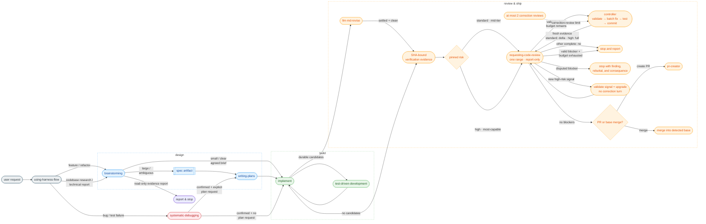

# harness-flow

## Overview

> A cross-harness plugin that provides the same workflow in Claude Code and Codex. Feature work flows through design → planning → TDD → risk-based review → integration, while bug fixes flow through root-cause investigation → regression test → minimal correction.

### Problems it solves

- Coding starts before the spec is agreed on, piling up code that's hard to redirect
- Mixing pre-existing user changes with task changes makes rollback and review difficult
- Code review and cleanup get skipped or vary from person to person

### How it solves them

- Agrees the approach through dialogue before coding — a spec (then a plan) only when the work is large enough, with no forced spec gate
- Stops before implementation when the checkout is dirty, then confirms an immutable `BASE_SHA`, the base branch, and the baseline test. It does not switch branches or worktrees during implementation or review; the selected base merge is the only exception
- Implements directly in the current session with TDD, supplies SHA-bound verification evidence to a report-only reviewer, validates findings before changing code, and selects the reviewer tier and correction range from pinned risk

### Who it's for

- Users who want the agent in Claude Code or Codex to not skip required steps
- Users who want TDD, current-checkout safety, evidence-backed review, and risk-based correction review in one workflow

### Foundation

After comparing several Claude Code harnesses ([`design/2026-05-05-comparison.md`](design/2026-05-05-comparison.md)), this project adopted the simplicity-first [superpowers](https://github.com/obra/superpowers) as its foundation. On top of that foundation, it adds a unified `implement` controller that operates in the current checkout and a fresh-context review flow.

- [Archon](design/reference/archon.md)
- [everything-claude-code](design/reference/everything-claude-code.md)
- [get-shit-done](design/reference/get-shit-done.md)
- [gstack](design/reference/gstack.md)
- [oh-my-claudecode](design/reference/oh-my-claudecode.md)
- [superpowers](design/reference/superpowers.md)
- [matt-pocock-skills](design/reference/matt-pocock-skills.md)

---

## Skill chain — the order work flows in

Routing applies the first matching rule. An approved plan or agreed small-change brief goes to `implement`, while an approved spec goes to `writing-plans`. Skill-only creation, editing, or verification takes priority over generic read-only analysis and goes directly to `writing-skills`. A bug, test failure, or unexpected behavior without a confirmed root cause goes to `systematic-debugging` first, even when the user requests an implementation plan; it proceeds to `writing-plans` or `implement` only after the root cause is confirmed. An explicit code review takes priority over generic read-only analysis and goes directly to `requesting-code-review`. Explicit specs go to `brainstorming`, non-bug implementation plans go to `writing-plans`, and other code work or codebase investigations go to `brainstorming`. General-knowledge questions stay outside the chain. Every chain skill is also independently invocable — preconditions are guards, not gates: invoked without its usual input, the skill recovers it (e.g. `writing-plans` asks the 1–2 settling questions first).



1. **using-harness-flow** — injected at session start. Forces the agent to first ask "which skill applies here?"

2. **brainstorming** — agrees the approach through dialogue, then recommends an exit: small/clear → send an agreed brief directly to `implement`; large/ambiguous → save a spec, then write an approved plan before `implement`. For an explicit spec request, it stops after requesting spec review unless the user also requests follow-on work. Both code-changing exits converge on the same controller. Large-exit output: `docs/harness-flow/specs/YYYY-MM-DD-<topic>.md`.

3. **writing-plans** — decomposes an approved spec, an approved inline design, or a confirmed bug-fix brief with an explicit plan request into bite-sized, tracer-bullet TDD tasks (`### Task N` with Delivers / Touches / Blocked by / acceptance), preserving the human-approval gate. The plan header's `Source` contains the actual spec path, agreed decisions, or a durable summary of confirmed bug evidence and its correction; every source requirement maps to a task's `Delivers` or an acceptance criterion. Output: `docs/harness-flow/plans/YYYY-MM-DD-<feature>.md`.

4. **implement** — accepts an agreed brief, approved plan, or confirmed bug-fix brief as one settled input. It implements with TDD in the current checkout after checking for a dirty tree and pinning `BASE_SHA`, the base branch, and the baseline test. Final verification records exact commands, exit statuses, concise results, and clean pre/post checks at `TO_SHA`. Before fixing a blocker, the controller validates it against requirements, the resulting tree, all relevant tests, and acceptance criteria; a disputed blocker stops the workflow with evidence instead of forcing a code change. Standard-risk corrections review `LAST_REVIEWED_SHA..HEAD`, while high-risk corrections re-review the complete `BASE_SHA..HEAD` range with the most-capable model. The loop permits at most two correction reviews. Task isolation and finalization references load only when needed.
   - 4-1. **test-driven-development** — sub-skill each implementer follows. Forces the order Red → confirm fail → Green → confirm pass → Refactor.
   - 4-2. **llm-md-revise** — proposes project-instruction changes only when durable candidates exist. Approved edits are committed before the review range is pinned; a new commit requires fresh full-suite verification evidence at the new `TO_SHA`.
   - 4-3. **requesting-code-review** — dispatches one fresh-context, report-only reviewer over the exact `FROM_SHA..TO_SHA` range per invocation. The package includes inline requirements, SHA-bound `VERIFICATION_EVIDENCE`, pinned `RISK_LEVEL` and `RISK_BASIS`, and bounded prior reports. Standard risk uses a mid-tier reviewer; high risk uses the most-capable reviewer and full-range correction reviews. A new high-risk signal blocks approval until validated and escalated. The only decision fields are `Review complete` and `Blocking findings`. The reviewer proves per-file `N/N` coverage, and bounded before/after snapshots detect repository changes when native read-only control is unavailable.

5. **Integration choice** — loads the finalization reference only after review passes. It rechecks a clean checkout and `HEAD == APPROVED_SHA`, then asks whether to create a PR or merge into the detected base branch. The PR path passes the same SHA to `pr-creator`. Neither path automatically deletes a branch or worktree.

> **Mechanical work is not a routing exception.** Keep `brainstorming` proportional
> — a behavior-preserving move or rename normally needs only a short agreed brief —
> then continue through `implement`. Use verification-only instead of Red→Green
> only after explicit user approval under TDD's ask-first exception.

### Output locations

Skills create artifacts inside the current checkout on demand:

```
docs/harness-flow/specs/YYYY-MM-DD-<topic>.md   # brainstorming large-exit output
docs/harness-flow/plans/YYYY-MM-DD-<feature>.md   # writing-plans output
```

---

## Parallel track — bug fixing

**systematic-debugging** — separate entry point for bugs, test failures, or unexpected behavior. Diagnosis stays non-mutating and confirms root cause before Phase 4 sends a bug-fix brief to `writing-plans` when the user explicitly requested a plan, otherwise to `implement`. Implementation owns TDD, review, revision, and integration. Failed attempts are reverted before their evidence returns to root-cause analysis.

---

## Hooks

Provides four Node.js hooks (Node 18+, no npm dependencies). Claude Code and Codex use the same `hooks/hooks.json`.

- **`session-start-harness.js`** — injects `using-harness-flow` on new session, resume, clear, and compaction.
- **`session-start-caveman.js`** — pre-activates `caveman` mode (token-efficient terse responses) on every session boundary. Disable mid-session with "stop caveman" / "normal mode".
- **`pre-bash-commands.js`** — PreToolUse(Bash) destructive-action and cloud-CLI guard. Blocks: `--no-verify`, `rm -rf` of `/`/`~`/`$HOME`/`.`, pipe-to-shell (`curl|wget|fetch ... | sh|bash|...`), and `gcloud`/`aws` CLI calls (user authorization required).
- **`pre-secrets.js`** — blocks access to secret paths from Read/Edit/Write/MultiEdit/Bash and Codex `apply_patch`.

A blocking hook emits `permissionDecision: "deny"` JSON to stdout and exits 0. This way both Codex and Claude Code interpret the deny result, and the protected command is not run by mistake.

Disable all hooks for a session with `HARNESS_FLOW_HOOKS_OFF=1`.

---

## Installation

Install separately for each harness you use.

### Codex

```bash
codex plugin marketplace add wonjinsin/harness-flow
```

After installing, review and trust the command hooks under `/hooks`. Enabling the plugin alone does not auto-trust the command hooks, and you must review them again whenever the hook contents change.

### Claude Code A) Git marketplace (recommended)

This repo exposes itself as a single-plugin marketplace via `.claude-plugin/marketplace.json`.

```
/plugin marketplace add wonjinsin/harness-flow
/plugin install harness-flow@harness-flow
```

Once installed, `hooks/hooks.json` is loaded automatically — all four hook scripts activate.

### B) Copy-paste mode — drop the repo into `.claude/`

Place the repo directly under `.claude/` instead of going through the plugin system.

In copy-paste mode, `$CLAUDE_PLUGIN_ROOT` is unset, so the bundled `hooks/hooks.json` is ignored. You have to register hooks in `settings.json` yourself. The session-start scripts derive the plugin root from their own location, so you don't need to set the environment variable.

**(B-1) Global — clone into `~/.claude/harness-flow/` (recommended)**

```bash
git clone https://github.com/wonjinsin/harness-flow.git ~/.claude/harness-flow
```

**(B-2) Project-local — `<project>/.claude/harness-flow/`**

```bash
git clone https://github.com/wonjinsin/harness-flow.git <project>/.claude/harness-flow
```

#### Required: register the hook in `settings.json`

Global (`~/.claude/settings.json`):

```json
{
  "hooks": {
    "SessionStart": [
      {
        "matcher": "startup|resume|clear|compact",
        "hooks": [
          { "type": "command", "command": "$HOME/.claude/harness-flow/hooks/session-start-harness.js" },
          { "type": "command", "command": "$HOME/.claude/harness-flow/hooks/session-start-caveman.js" }
        ]
      }
    ],
    "PreToolUse": [
      {
        "matcher": "Bash",
        "hooks": [
          { "type": "command", "command": "$HOME/.claude/harness-flow/hooks/pre-bash-commands.js" }
        ]
      },
      {
        "matcher": "Read|Edit|Write|MultiEdit|Bash|apply_patch",
        "hooks": [
          { "type": "command", "command": "$HOME/.claude/harness-flow/hooks/pre-secrets.js" }
        ]
      }
    ]
  }
}
```

Project-local (`<project>/.claude/settings.json`) — use `$CLAUDE_PROJECT_DIR`, the project-root variable Claude Code injects into hook commands:

```json
{
  "hooks": {
    "SessionStart": [
      {
        "matcher": "startup|resume|clear|compact",
        "hooks": [
          { "type": "command", "command": "$CLAUDE_PROJECT_DIR/.claude/harness-flow/hooks/session-start-harness.js" },
          { "type": "command", "command": "$CLAUDE_PROJECT_DIR/.claude/harness-flow/hooks/session-start-caveman.js" }
        ]
      }
    ],
    "PreToolUse": [
      {
        "matcher": "Bash",
        "hooks": [
          { "type": "command", "command": "$CLAUDE_PROJECT_DIR/.claude/harness-flow/hooks/pre-bash-commands.js" }
        ]
      },
      {
        "matcher": "Read|Edit|Write|MultiEdit|Bash|apply_patch",
        "hooks": [
          { "type": "command", "command": "$CLAUDE_PROJECT_DIR/.claude/harness-flow/hooks/pre-secrets.js" }
        ]
      }
    ]
  }
}
```

---

## Included skills

**Development process**

- **brainstorming** — Socratic design refinement, spec document generation
- **writing-plans** — task-level implementation plan generation
- **implement** — single code-change controller: inline TDD, SHA-bound verification evidence, validated blocker handling, risk-based review, and PR/base-merge handoff
- **pr-creator** — GitHub pull request creation after the user selects the PR path

**Quality assurance**

- **test-driven-development** — enforces the Red-Green-Refactor cycle (includes testing-anti-patterns reference)
- **requesting-code-review** — report-only review contract for one exact commit range with risk-based model selection

**Debugging**

- **systematic-debugging** — root-cause-first bug investigation (4 phases, supporting techniques: root-cause-tracing, defense-in-depth, condition-based-waiting)

**Meta**

- **using-harness-flow** — entry point for the skill system, injected at session start
- **writing-skills** — create, edit, and verify skills before deployment
- **llm-md-revise** — organizes session learnings into candidates for the platform-specific project instruction (`AGENTS.md` / `CLAUDE.md`)
- **caveman** — ultra-compressed "caveman" response mode for token efficiency (pre-activated via `session-start-caveman.js`)

---

## Credits & Third-Party Licenses

Several skills in this repository are derived from MIT-licensed prior work. The original
copyright notices and the full license text are consolidated in
[`design/reference/THIRD-PARTY-LICENSES.md`](design/reference/THIRD-PARTY-LICENSES.md) (per-skill `NOTICE` files have been merged into this file).

- [obra/superpowers](https://github.com/obra/superpowers) (MIT, © 2025 Jesse Vincent) — base for `brainstorming`, `requesting-code-review`, `implement`, `systematic-debugging`, `test-driven-development`, `using-harness-flow`, `writing-plans`.
- [mattpocock/skills](https://github.com/mattpocock/skills) (MIT, © 2026 Matt Pocock) — `brainstorming` incorporates ideas from `grill-me`, and `writing-plans` from `to-tickets`.
- [JuliusBrussee/caveman](https://github.com/JuliusBrussee/caveman) (MIT, © 2026 Julius Brussee) — base for `caveman`.

The `llm-md-revise` skill is original to this repository and is not derived from any upstream work.

---

## See Also

- `design/2026-05-05-comparison.md` — 7-harness comparative analysis (Archon / ECC / GSD / gstack / OMC / superpowers / matt-pocock-skills). Explains why this plugin sits at "Layer C: in-harness skills" and the tradeoffs that implies.
- `design/reference/*.md` — per-harness deep dives + `THIRD-PARTY-LICENSES.md`
