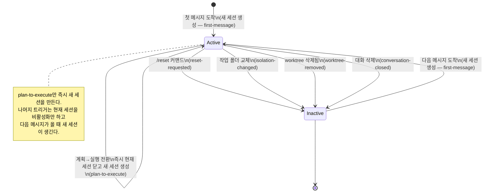
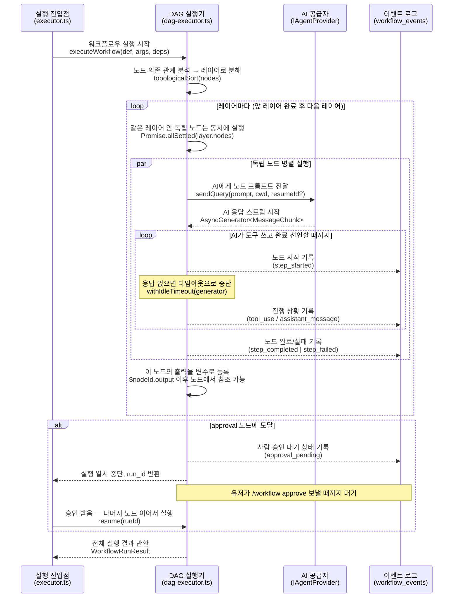

# Harness Analysis: `Archon`

## 0. Metadata

- **이름**: Archon (Remote Agentic Coding Platform)
- **종류**: External wrapper — SDK를 백엔드에서 감싸는 하네스
- **저장소**: 로컬 (`/Users/WonjinSin/Documents/project/Archon`)
- **분석 커밋/버전**: `33d31c44` (`dev` 브랜치, 2026-04-15)
- **분석 일시**: 2026-04-15
- **주 언어/런타임**: TypeScript / Bun
- **주 LLM 공급자**: Anthropic Claude + OpenAI Codex (`IAgentProvider` 공용 인터페이스)

## TL;DR

Archon은 Slack·Telegram·GitHub·Discord·Web·CLI 같은 채팅 플랫폼에서 Claude Code·Codex를 원격으로 부리는 단일 개발자용 하네스다. 개발자가 출근길에 Slack으로 "이 이슈 좀 봐줘"라고 던지면 AI가 git worktree를 떠서 작업하고 채팅으로 결과를 돌려주는 경험을 목표로 한다. 설계의 핵심 세 가지 — 격리는 Docker가 아니라 git worktree, 세션은 불변 링크드 체인, 라우팅은 결정론 화이트리스트 + AI 토큰 감지 하이브리드 — 를 이해하면 나머지 모든 결정이 따라온다.

---

# Part 1: The Story

## 1-1. Main Flow (유저 메시지 한 건의 여정)

```
┌────────────────────────────────────────────────────────────┐
│  메시지 수신 — 플랫폼 어댑터가 이벤트를 감지한다              │
│  Slack(SDK polling) / GitHub(webhook) / Web(HTTP) 등        │
│  각 어댑터가 인증 체크 후 미인가 유저는 여기서 조용히 차단     │
│  adapter.onMessage()  ·  adapters/src/chat/*/adapter.ts    │
└────────────────────────┬───────────────────────────────────┘
                         │
                         ▼
┌────────────────────────────────────────────────────────────┐
│  순서 보장 — 같은 대화는 한 번에 하나씩만 처리한다            │
│  (동시에 두 메시지가 오면 세션 상태가 꼬이기 때문)            │
│  전체 동시 대화는 max 10개 — 나머지는 큐에서 대기            │
│  ConversationLockManager.acquireLock()                      │
│  conversation-lock.ts:59  ·  webhook에는 200 즉시 반환      │
└────────────────────────┬───────────────────────────────────┘
                         │
                         ▼
┌────────────────────────────────────────────────────────────┐
│  오케스트레이터 진입 — 이 메시지를 어떻게 처리할지 결정한다   │
│  handleMessage()  ·  orchestrator-agent.ts:498             │
└──────┬──────────────────────────┬──────────────────────────┘
       │                          │                          │
       ▼                          ▼                          ▼
┌────────────────┐   ┌──────────────────────┐   ┌──────────────────┐
│ 슬래시 커맨드?  │   │ 승인 대기 워크플로우?  │   │ 일반 채팅 메시지  │
│ /help /reset   │   │ approval 노드에서     │   │ (아래로 계속)     │
│ /workflow 등   │   │ 멈춰있는 게 있나?     │   └────────┬─────────┘
│ :649           │   │ :535                 │            │
└───────┬────────┘   └──────────┬───────────┘            │
        ▼                       ▼                         │
┌──────────────────┐  ┌──────────────────────┐            │
│ AI 없이 즉시 처리 │  │ 이 메시지를 승인/거부  │            │
│ CommandHandler   │  │ 응답으로 해석해서      │            │
│ DB 업데이트 후   │  │ 워크플로우 재개        │            │
│ 응답 반환        │  └──────────────────────┘            │
└──────────────────┘                                      │
                                                          ▼
┌────────────────────────────────────────────────────────────┐
│  컨텍스트 조립 — AI에게 넘기기 전에 필요한 정보를 모두 모은다  │
│  ① 대화 정보 (DB에서)                                      │
│  ② 세션 (활성 세션 가져오거나, 없으면 새로 만들기)           │
│  ③ 코드베이스 + 작업 폴더 (worktree resolver 6단계)         │
│  ④ 사용 가능한 워크플로우 목록 (bundled + 글로벌 + 프로젝트)  │
│  ⑤ 설정값 + 프로젝트 환경변수                               │
│  ⑥ 이전 대화 이력 + 첨부파일                               │
│  orchestrator-agent.ts:704-790                             │
└────────────────────────┬───────────────────────────────────┘
                         │
                         ▼
┌────────────────────────────────────────────────────────────┐
│  프롬프트 완성 — 시스템 지시문부터 유저 메시지까지 하나로 꿴다 │
│  [시스템: 역할 + 워크플로우 목록] + [이전 대화] +            │
│  [유저 메시지] + [첨부파일/GitHub 컨텍스트]                 │
│  buildFullPrompt()  ·  orchestrator-agent.ts:447-488       │
└────────────────────────┬───────────────────────────────────┘
                         │
                         ▼
┌────────────────────────────────────────────────────────────┐
│  AI 호출 — 설정된 공급자에게 프롬프트를 보낸다               │
│  Claude → @anthropic-ai/claude-agent-sdk                   │
│  Codex  → @openai/codex-sdk                                │
│  aiClient.sendQuery()  ·  @archon/providers                │
└────────────────────────┬───────────────────────────────────┘
                         │
                         ▼
┌────────────────────────────────────────────────────────────┐
│  AI 실행-평가 루프 — AI가 "완료"를 선언할 때까지 반복        │
│  orchestrator-agent.ts:846-938                             │
│                                                            │
│  ┌─────────────────────────────────────────────────────┐  │
│  │  실행: AI가 행동을 제안하고 도구를 사용한다             │  │
│  │  (파일 읽기 / 코드 작성 / bash 실행 / 테스트 돌리기)   │  │
│  └─────────────────────┬───────────────────────────────┘  │
│                        │ 도구 결과를 AI에게 돌려줌          │
│                        ▼                                   │
│  ┌─────────────────────────────────────────────────────┐  │
│  │  평가: AI가 결과를 보고 다음을 결정한다               │  │
│  │  성공? → 완료 선언 후 루프 탈출                       │  │
│  │  실패? → 원인 분석 후 다시 실행 (루프)                │  │
│  └─────────────────────┬───────────────────────────────┘  │
│          ↑ 반복         │ 완료 선언 시                      │
│          └─────────────┘                                   │
│                                                            │
│  텍스트 답변은 플랫폼에 실시간 전달하면서 버퍼에도 누적        │
│  [버퍼 감시] /invoke-workflow 발견 → 루프 중단 후 전환       │
└──────────────────────────┬─────────────────────────────────┘
                           │
           ┌───────────────┴───────────────┐
           │ /invoke-workflow 감지됨         │ 일반 응답 완료
           ▼                               ▼
┌──────────────────────┐      ┌────────────────────────────┐
│ 이미 보낸 텍스트 취소  │      │ 답변 전송 완료              │
│ → 워크플로우로 넘김    │      │ Web/Telegram: 청크 실시간  │
│ emitRetract()        │      │ Slack/Discord: 완성 후 1회 │
│ dispatchWorkflow()   │      │ platform.sendMessage()     │
│ @archon/workflows    │      └────────────────────────────┘
└──────────────────────┘
```

### Narration

유저 메시지가 들어오면 가장 먼저 일어나는 일은 **순서 보장**이다. 같은 대화에 두 메시지가 거의 동시에 들어오면 활성 세션이나 resume ID 같은 상태가 꼬일 수 있기 때문에, Archon은 대화별 FIFO 락으로 직렬화한다(`conversation-lock.ts:59`). 락을 얻자마자 플랫폼 webhook에는 200을 즉시 돌려주는 fire-and-forget 패턴이라, Slack처럼 3초 안에 응답해야 하는 플랫폼도 자연스럽게 지원된다.

그 다음이 **결정 분기**다. 오케스트레이터는 먼저 슬래시 커맨드 화이트리스트를 훑는다(`orchestrator-agent.ts:649`). `/help`, `/status`, `/workflow` 같은 열 개 남짓한 커맨드는 AI를 거치지 않고 `CommandHandler`로 직행한다. 그 다음으로 이미 approval 게이트에서 대기 중인 워크플로우가 있는지 체크하고(`:535`), 있으면 그 메시지를 승인/거부 응답으로 해석해 워크플로우를 재개한다. 두 가지에 모두 해당하지 않으면 일반 채팅 경로로 내려간다.

일반 채팅 경로에서는 **컨텍스트 조립**(`:704-790`)이 한 함수 안에서 순서대로 진행된다. 여섯 항목이 계단식으로 쌓이는데 — 대화, 세션, 코드베이스·isolation, 워크플로우 목록, 설정·env, 스레드 이력·첨부 — 앞 단계 결과가 뒤 단계 입력이 되기 때문에 재배열이 어렵다. 조립이 끝나면 `buildFullPrompt`가 시스템 프롬프트(오케스트레이터 역할 + 워크플로우 목록)부터 유저 메시지까지 꿰매고, `aiClient.sendQuery()`로 넘긴다.

**AI 작업 루프**는 에이전트 동작의 핵심이다. AI는 한 번에 전체 답을 내놓지 않는다 — 텍스트를 쓰다가, 파일을 읽어보고, 코드를 실행해보고, **결과를 보고 스스로 평가한 뒤** 다시 행동한다. 이 실행-평가-재시도 사이클이 SDK 레벨에서 자동으로 일어나기 때문에, Archon이 별도의 "재시도 로직"을 짤 필요가 없다. "테스트를 돌렸더니 실패 → 오류 메시지 읽고 원인 파악 → 코드 수정 → 다시 테스트" 같은 흐름이 AI가 스스로 판단하며 루프를 돈다. Archon은 이 루프를 멈추거나 방향을 바꾸는 역할만 한다 — idle timeout으로 무한 루프 방지(`withIdleTimeout`), `/invoke-workflow` 감지로 워크플로우 전환.

그 루프 안에서 Archon이 추가로 하는 일이 하나 있다. 텍스트를 유저에게 실시간으로 흘려보내는 동시에 내부 버퍼에도 누적해서 감시한다. AI가 답변을 쓰다가 "이건 워크플로우로 처리해야겠다"고 판단해서 `/invoke-workflow`를 뱉는 순간, 이미 유저에게 보낸 텍스트를 `platform.emitRetract()`로 취소하고 워크플로우 실행으로 갈아탄다. 별도 classifier 모델 없이 하나의 LLM 호출로 '라우팅 판단'과 '일반 답변'을 동시에 커버하는 방식이라, 스트림 취소라는 UX 복잡도가 따라붙는 트레이드오프가 있다.

---

## 1-2. Alternate Paths

### (a) 슬래시 커맨드로 워크플로우 직접 실행

```
유저: "/workflow run plan-feature '인증 기능 추가해줘'"
        │
        ▼
┌──────────────────────────────────────────────────────┐
│ 슬래시 커맨드 감지 — AI 라우터를 완전히 건너뜀          │
│ CommandHandler.handleWorkflowRunCommand()            │
│ command-handler.ts                                   │
└───────────────────────┬──────────────────────────────┘
                        │
                        ▼
┌──────────────────────────────────────────────────────┐
│ 작업 폴더 확보 — 이 대화에 이미 쓰던 worktree가 있으면  │
│ 그걸 재사용, 없으면 새 브랜치로 worktree 생성           │
│ IsolationResolver.resolve()                          │
│ isolation/src/resolver.ts                            │
└───────────────────────┬──────────────────────────────┘
                        │
                        ▼
┌──────────────────────────────────────────────────────┐
│ 워크플로우 실행 시작 — YAML 정의를 읽고 DAG 구성       │
│ executeWorkflow(name, args, deps)                    │
│ workflows/src/executor.ts                            │
└───────────────────────┬──────────────────────────────┘
                        │
                        ▼
┌──────────────────────────────────────────────────────┐
│ DAG 실행 — 노드를 의존 순서대로 실행, 독립 노드는 병렬  │
│   prompt/command 노드 → AI 호출 (노드별 개별 LLM 호출) │
│   bash/script 노드   → AI 없이 쉘/런타임 직접 실행     │
│   loop 노드          → 완료 신호 나올 때까지 반복      │
│   approval 노드      → DB에 pending 저장 후 유저 대기  │
│ dag-executor.ts:405  ·  Promise.allSettled(레이어)    │
└──────────────────────────────────────────────────────┘
```

### Narration

슬래시 커맨드 `/workflow run`이 들어오면 AI 라우터를 완전히 건너뛰고 `CommandHandler`로 직행한다. 커맨드 핸들러는 먼저 작업 폴더를 확보한다 — 이미 이 대화에서 쓰던 worktree가 있으면 그걸 재사용하고, 없으면 새 worktree를 만든다. 이후 `executeWorkflow()`로 넘어가면서 AI 호출은 전역 오케스트레이터가 아니라 각 노드 레벨에서 개별적으로 일어난다. `bash:`, `script:` 노드는 AI 없이 쉘/런타임을 직접 실행하고, `approval:` 노드는 DB에 pending 상태로 저장해 유저의 응답을 기다린다.

---

### (b) 일반 채팅 입력이 워크플로우로 전환되는 경로

```
유저: "이 이슈에서 버그 찾아줘"  (프리폼 입력)
        │
        ▼
┌─────────────────────────────────────────────────────┐
│ Main Flow 진행 — 컨텍스트 조립 후 AI 호출             │
│ 시스템 프롬프트에 사용 가능한 워크플로우 목록 주입됨    │
│ (AI가 워크플로우로 라우팅할지 직접 답변할지 스스로 판단) │
└──────────────────────┬──────────────────────────────┘
                       │
                       ▼
┌─────────────────────────────────────────────────────┐
│ AI 작업 루프 진행 중...                               │
│ "이 문제는 먼저 계획을 세우는 게 좋겠습니다—"           │
│ (텍스트 실시간 전송 + 버퍼 동시 누적)                  │
└──────────────────────┬──────────────────────────────┘
                       │  [버퍼에서 /invoke-workflow plan-feature 감지]
                       ▼
┌─────────────────────────────────────────────────────┐
│ 이미 보낸 텍스트를 UI에서 취소                         │
│ emitRetract()  ·  orchestrator-agent.ts             │
└──────────────────────┬──────────────────────────────┘
                       │
                       ▼
┌─────────────────────────────────────────────────────┐
│ 워크플로우로 넘김 — 이 지점부터 (a) 경로와 동일        │
│ dispatchBackgroundWorkflow("plan-feature", args)    │
└─────────────────────────────────────────────────────┘
```

### Narration

프리폼 입력이 Main Flow를 타다가 모델이 `/invoke-workflow` 토큰을 뱉는 순간 경로가 바뀐다. 이때 이미 유저에게 스트리밍된 텍스트가 있을 수 있는데, `emitRetract()`가 UI에 "방금 텍스트 취소" 신호를 보내고 워크플로우 디스패치로 전환한다. 이 지점부터는 (a) 경로와 완전히 동일한 실행 흐름이 된다. "언제 워크플로우로 가야 할지"는 모델이 판단하기 때문에, Claude 라우팅 호출 시에는 `tools: []`로 도구 사용을 API 레벨에서 막아 라우팅 판단에만 집중하게 만든다.

---

### (c) loop 노드 — 성공할 때까지 반복 실행

```
워크플로우 YAML:
  nodes:
    - id: implement
      type: loop
      prompt: "테스트를 통과하는 코드를 작성해줘. 완료되면 <done/>을 출력해."
                    │
                    ▼
┌────────────────────────────────────────────────────────────┐
│  반복 1회 시작 — AI에게 프롬프트 + 이전 결과 컨텍스트 전달    │
│  sendQuery(loopPrompt + previousOutput)                    │
│  dag-executor.ts (loop 처리 구간)                           │
└───────────────────────────┬────────────────────────────────┘
                            │
                            ▼
┌────────────────────────────────────────────────────────────┐
│  AI 작업 — 도구를 쓰며 실행-평가 사이클을 스스로 반복        │
│  파일 수정 → 테스트 실행 → 결과 확인 → 또 수정...            │
│  (이 안에서도 실행-평가 루프가 돌아감)                       │
└───────────────────────────┬────────────────────────────────┘
                            │
                            ▼
                    출력에 완료 신호가 있나?
                    detectCompletionSignal(output)
                    executor-shared.ts
                      /          \
                 있음              없음
                  │                  │
                  ▼                  ▼
        ┌───────────────┐   최대 반복 횟수 도달했나?
        │ 루프 종료      │      /           \
        │ $nodeId.output│   아니오            예
        │ 다음 노드로    │     │                │
        └───────────────┘     │                ▼
                               │    ┌──────────────────┐
                               │    │ 루프 강제 종료     │
                               │    │ (실패로 분류)      │
                               │    └──────────────────┘
                               ▼
                    반복 2회 시작
                    (이전 출력을 컨텍스트에 누적해서 전달)
```

### Narration

`loop:` 노드는 Archon이 제공하는 가장 명시적인 실행-평가-재시도 구조다. 워크플로우 작성자가 "이 작업은 한 번에 안 끝날 수 있다"고 판단하면 `loop:` 타입을 선택하고, AI가 완료를 선언할 때 출력할 신호(`<done/>` 같은 태그)를 프롬프트에 명시한다. 이후는 Archon이 자동으로 반복을 관리한다.

재미있는 점은 이 루프 안에서 **또 다른 루프**가 돌아간다는 것이다. 한 회차(iteration)가 실행될 때 AI는 도구를 쓰고 결과를 평가하는 SDK 레벨의 실행-평가 사이클을 내부적으로 진행한다. 즉 "loop 노드의 반복" 안에 "AI 도구 사용 반복"이 중첩된 구조다. 각 회차가 끝나면 그 출력이 다음 회차의 컨텍스트에 누적되기 때문에, AI는 이전에 뭘 시도했고 어떻게 됐는지를 기억한 채로 다음 시도를 한다.

루프 종료 조건은 셋이다 — 완료 신호 감지, 최대 반복 횟수 초과, SDK 레벨 result 메시지 수신(`executor-shared.ts`의 `detectCompletionSignal()`). 이 중 하나라도 충족되면 루프가 끝나고 해당 회차의 출력이 `$nodeId.output`으로 다음 노드에 전달된다.

---

### (d) 사람이 승인해야 다음 단계로 넘어가는 경로

```
워크플로우 실행 중:
  [계획 작성 노드] → [테스트 실행 노드] → [사람 검토 노드] ← 여기서 멈춤
                                                  │
                                        DB에 pending 상태 기록
                                        (workflow_events: approval_pending)
                                                  │
                                        사용자 알림 전송
                                                  │
  유저: "/workflow approve <id> 좋아 보여, 계속 진행해줘"
        │
        ▼
┌─────────────────────────────────────────────────────┐
│ 새 메시지 감지 — 대기 중인 워크플로우가 있음을 확인   │
│ handleMessage()  ·  orchestrator-agent.ts:535        │
└──────────────────────┬──────────────────────────────┘
                       │
                       ▼
┌─────────────────────────────────────────────────────┐
│ 승인 기록 — 이벤트 로그에 저장                        │
│ workflow_events에 approval_received 기록             │
│ 유저의 코멘트 = "좋아 보여, 계속 진행해줘"             │
└──────────────────────┬──────────────────────────────┘
                       │
                       ▼
┌─────────────────────────────────────────────────────┐
│ 나머지 노드 이어서 실행                               │
│ executeWorkflow() 재개                               │
│ (capture_response: true 이면 유저 코멘트가           │
│  $nodeId.output 으로 뒷 노드에서 참조 가능)           │
└─────────────────────────────────────────────────────┘
```

### Narration

`approval:` 노드는 워크플로우를 DB에 pending으로 저장하고 실행을 멈춘다. 이후 유저가 같은 대화에 어떤 메시지를 보내든 오케스트레이터가 먼저 "대기 중인 워크플로우가 있는가?"를 체크한다(`orchestrator-agent.ts:535`). 있다면 그 메시지를 일반 채팅 입력이 아니라 승인/거부 응답으로 해석해 워크플로우를 재개한다. `capture_response: true`로 설정된 노드라면 유저가 남긴 코멘트가 `$nodeId.output`으로 캡처되어 뒷 노드에서 참조할 수 있다.

---

## 1-3. 세션 상태 전환



### Narration

Archon의 세션 모델에서 가장 특이한 점은 **세션이 불변**이라는 것이다. 상태를 변경하지 않고, 전환이 일어날 때마다 새 세션 row를 만들고 `parent_session_id`로 이전 세션을 가리킨다. 이 링크드 체인 덕분에 한 대화의 세션 이력이 그대로 감사 로그가 된다 — "언제 reset이 눌렸는지", "plan에서 execute로 언제 넘어갔는지" 같은 질문에 코드 없이도 DB 쿼리로 답할 수 있다.

여섯 개의 전환 트리거 중 `plan-to-execute`만 특별하게 동작한다. 다른 트리거는 현재 세션을 비활성화만 하고 다음 메시지에서 새 세션이 생기게 하지만, `plan-to-execute`는 즉시 새 세션을 만든다. 계획에서 실행으로 넘어가는 순간은 유저가 명시적으로 '승인'한 분기라서, 세션 전환을 지연시키면 안 된다는 판단이 담겨 있다. 이 설계가 race condition도 막아준다 — 두 개의 메시지가 동시에 도착해도 세션 row를 수정하는 게 아니라 새 row를 삽입하기 때문에 충돌이 없다.

재개(resume)는 기존 세션의 `sdk_session_id`를 `sendQuery()`의 `resumeSessionId`로 전달하는 방식이다. SDK가 그 위에 이어서 append한다. `forkSession: true`를 주면 복사 후 새 세션이 되어, 원본을 건드리지 않고 재시도가 안전해진다.

---

## 1-4. 작업 폴더(Isolation) 결정 트리

```
질문: 이 대화/워크플로우를 어느 폴더에서 실행할까?
resolver.ts:41-100
                    │
                    ▼
        ┌───────────────────────────────────┐
        │ ① 이미 쓰던 폴더가 있나?           │
        │   같은 대화가 이전에 만든 worktree  │
        └──────────────┬────────────────────┘
                  있음 │ 없음
                       ▼
        ┌───────────────────────────────────┐
        │ ② 같은 워크플로우가 만든 폴더가 있나? │
        │   동일한 workflowId + codebase     │
        └──────────────┬────────────────────┘
                  있음 │ 없음
                       ▼
        ┌───────────────────────────────────┐
        │ ③ 같은 GitHub 이슈를 다루는        │
        │   다른 대화의 폴더가 있나?          │
        │   (cross-conversation 공유)        │
        └──────────────┬────────────────────┘
                  있음 │ 없음
                       ▼
        ┌───────────────────────────────────┐
        │ ④ 연결된 PR 브랜치가 있나?          │
        │   그 브랜치를 그대로 체크아웃        │
        └──────────────┬────────────────────┘
                  있음 │ 없음
                       ▼
        ┌───────────────────────────────────┐
        │ ⑤ 새 worktree 생성                 │
        │   새 브랜치 만들고 체크아웃          │
        └──────────────┬────────────────────┘
                  성공 │ 실패 (디스크 부족, 권한 오류 등)
                       ▼
        ┌───────────────────────────────────┐
        │ ⑥ 오래된 폴더 정리 후 재시도        │
        │   stale worktree 제거 → ⑤ 재시도  │
        └──────────────┬────────────────────┘
                  성공 │ 여전히 실패
                       ▼
                IsolationBlockedError
                → classifyIsolationError()
                → "git 저장소가 아닙니다" 등
                  사람이 읽을 수 있는 메시지로 변환
```

### Narration

Isolation Resolver의 여섯 단계는 "기존 맥락을 최대한 살려라"라는 단일 원칙으로 읽힌다. 새 worktree를 만드는 건 언제나 마지막 수단이고, 가능하면 같은 이슈·같은 워크플로우가 이미 쓰던 환경을 이어받는다. 특히 3단계의 '이슈 공유'는 cross-conversation reuse인데, 같은 GitHub issue를 두 대화가 각자 worktree를 만들어 충돌하는 상황을 막아준다.

실패가 나면 조용히 넘어가지 않는다. `IsolationBlockedError`가 던져지고, `classifyIsolationError()` 함수가 raw git 에러(`fatal: not a git repository`, `No space left on device` 등)를 사용자 친화 메시지로 변환해 플랫폼으로 보낸다. Archon의 Fail Fast 철학이 격리 레이어에서도 그대로 유지되는 지점이다.

포트 할당도 이 resolver 흐름과 연결된다. worktree 경로 해시 기반으로 3190-4089 범위 내 포트가 결정론적으로 배정되어, 같은 worktree에서 개발 서버를 띄우면 항상 같은 포트를 받는다. 덕분에 북마크나 curl 명령이 재사용 가능하다.

---

## 1-5. 워크플로우 DAG 실행 시퀀스



### Narration

워크플로우 실행은 **DAG + 위상정렬 + 레이어 병렬** 구조다. 노드들이 `depends_on`으로 연결된 방향 그래프로 정의되고, 실행기는 이를 레이어로 분해해 같은 레이어 안의 독립 노드들은 `Promise.allSettled`로 동시에 실행한다. 레이어 내 병렬 실행이 끝나야 다음 레이어로 넘어가는, 타이트한 동기화 모델이다.

각 노드 실행은 `withIdleTimeout` 래퍼로 감싸인다. SDK 스트림이 일정 시간 이상 청크를 안 내면 `AbortController`로 호출을 끊는다. 이 타임아웃은 무한정 붙잡히는 것을 막는 안전망이면서, abort 신호가 SDK 레벨까지 올바르게 전파되는지 확인하는 테스트 지점이기도 하다.

`approval:` 노드는 시퀀스에서 보이듯 특별한 흐름을 탄다. 노드에 도달하면 DB에 pending 이벤트를 기록하고 실행을 반환한다 — 워크플로우가 "중단"되는 게 아니라, 유저 응답을 받아 `executeWorkflow`를 재호출하면 나머지 노드들이 이어서 실행되는 구조다. `capture_response: true`면 유저의 코멘트가 `$nodeId.output`으로 뒷 노드에 넘어간다.

---

# Part 2: Reference Details

## 2-1. Entry Points

채팅 어댑터 5개(Web/Slack/Telegram/GitHub/Discord) + CLI + HTTP API + GitHub webhook. 모두 공통 `handleMessage()`로 수렴한다(`orchestrator-agent.ts`). Conversation ID: Slack=`thread_ts`, Telegram=`chat_id`, GitHub=`owner/repo#number`, Web=유저 지정 문자열, Discord=채널 ID. 인증은 어댑터 내부에서 처리 — 오케스트레이터는 인증을 모른다.

## 2-2. Concurrency

Global max 10 동시 대화 + per-conversation FIFO (`conversation-lock.ts:59`). 초과 시 큐 대기(즉시 거절 없음). 노드 레벨에는 `withIdleTimeout` + `AbortController` 추가. 워크플로우 run은 글로벌 잠금과 별개로 per-worktree-path mutex가 붙는다(`lock-workflow-runs`).

## 2-3. Routing

결정론 화이트리스트(10개 커맨드) → AI 라우터(`/invoke-workflow` 토큰 감지) → fallback(`archon-assist`). AI 라우팅 프롬프트는 `buildFullPrompt()` 안에서 워크플로우 목록을 시스템 프롬프트에 주입하는 방식. Claude는 `tools: []`로 도구 사용 차단, Codex는 tool bypass 감지 시 fallback. 스트림 중 번복 가능(emitRetract).

## 2-4. Context Assembly

단일 조립 지점(`orchestrator-agent.ts:704-790`). 순서: Conversation → Session → Codebase+Isolation → Workflows → Config+env → Thread+attachments. 변수 치환(`$ARGUMENTS`, `$1`, `$ARTIFACTS_DIR`, `$WORKFLOW_ID`, `$BASE_BRANCH`, `$DOCS_DIR`, `$LOOP_USER_INPUT`, `$REJECTION_REASON`)은 워크플로우 노드 프롬프트에서만 적용 — 일반 채팅에는 치환 없음.

## 2-5. Provider Abstraction

`IAgentProvider` 인터페이스(`packages/providers/src/types.ts:201`). `@archon/providers/types` subpath는 SDK import 금지 — 엔진·코어가 이 경로에서만 import해 SDK 업데이트가 빌드를 직접 깨지 않게 격리. Claude/Codex 각각 `providers/src/*/provider.ts` 구현. 새 공급자 추가는 구현 파일 + `registry.ts`에 한 줄 등록.

## 2-6. Worker / Execution

실행 단위: 일반 대화는 유저 메시지 1건 = LLM 호출 1번, 워크플로우는 노드 1개 = LLM 호출 1번. 별도 워커 클래스 없음 — 오케스트레이터 루프가 그 역할 겸임. 옵션 전달: YAML → executor → provider → SDK 번역. Abort: `nodeAbortController.signal`이 `SendQueryOptions.abortSignal`로 SDK까지 전파.

## 2-7. Message Loop

`for await` 스트림 처리(`orchestrator-agent.ts:846`). 플랫폼 전송과 내부 버퍼 누적이 동시에 진행. Web/Telegram은 stream 모드(청크 즉시 송신), Slack/GitHub/Discord는 batch 모드(누적 후 1회). `/invoke-workflow` 감지 시 `commandDetected=true`로 전송 중단 → 소진 후 retract+dispatch.

## 2-8. Session / State

불변 링크드 체인 — 전환 시 새 row 삽입 + `parent_session_id` 포인터. 트리거 6종: `first-message`, `plan-to-execute`(즉시 CREATE), `reset-requested`, `isolation-changed`, `worktree-removed`, `conversation-closed`. 만료: `/workflow cleanup` 기본 7일, isolation cleanup 별도. `remote_agent_sessions` 테이블.

## 2-9. Isolation

Git worktree — Docker/VM 없음. 경로: `~/.archon/workspaces/<owner>/<repo>/worktrees/<branch>`. 네트워크·OS 격리 없음(싱글 유저 전제). Resolver 6단계(`packages/isolation/src/resolver.ts:41-100`). 포트: 경로 해시 기반 3190-4089 결정론 배정. 실패 분류: `classifyIsolationError()` → 유저 친화 메시지.

## 2-10. Tool / Capability

Claude Agent SDK 내장 도구 기본 세트(Read/Write/Edit/Bash/Glob/Grep 등). 노드별 `allowed_tools`/`denied_tools`, `mcp`, `hooks`, `skills` 재정의 가능. MCP·hooks·skills는 Claude 전용 — Codex는 무시. YAML 옵션은 엔진을 그대로 통과하고 공급자 내부에서만 번역(`claude/provider.ts:354-398`).

## 2-11. Workflow Engine

DAG + 위상정렬 + 레이어 병렬(`dag-executor.ts:405`). 노드 타입: `prompt`, `command`, `bash`, `script`, `loop`, `approval`. YAML 정의, `.archon/workflows/` 발견. 조건: `when:` + `trigger_rule`. 변수: `$nodeId.output` 참조. 루프 종료: SDK result | 완료 태그 | max iteration 중 먼저. 런타임 reload: `/workflow reload` 가능.

## 2-12. Configuration

계층: bundled < 글로벌(`~/.archon/config.yaml`) < 프로젝트(`.archon/config.yaml`) < 워크플로우 노드. Shallow per-field override — deep merge 없음. 워크플로우는 로드 타임에 Zod 검증 + provider/model 호환성 체크. 하나가 깨져도 나머지 워크플로우는 정상 동작(`/workflow list`에 에러 노출).

## 2-13. Error Handling

Fail Fast 철학 — 빈 catch 거의 없음, 0 row matched는 throw. Raw 에러는 구조화 로그(`log.error({err, ...}, 'domain.action_failed')`), 유저에게는 분류 함수 거친 친화 메시지. 재시도는 전역 장치 없음 — 워크플로우 노드 YAML의 `retry:` 필드로만 선언적으로 지정.

## 2-14. Observability

Pino 구조화 로그(`packages/paths/src/logger.ts`). 워크플로우 이벤트 버스(`packages/workflows/src/event-emitter.ts`) → Web SSE로 실시간 중계. 이벤트 네이밍: `{domain}.{action}_{state}`. 저장: stdout + JSONL(`~/.archon/workspaces/.../logs/`) + DB(`remote_agent_workflow_events`). CLI `--verbose` = debug + tool-level 이벤트, `--quiet` = 에러만.

## 2-15. Platform Adapters

`IWorkflowPlatform` 인터페이스(`packages/workflows/src/deps.ts:56-66`): `sendMessage`, `getStreamingMode`, `getPlatformType` 필수 + `sendStructuredEvent`, `emitRetract` optional. 스트리밍 모드: Web/Telegram = stream, Slack/GitHub/Discord = batch. 인증 어댑터 내부 처리 — silent reject.

## 2-16. Persistence

SQLite 기본(`~/.archon/archon.db` 자동 초기화), `DATABASE_URL`로 PostgreSQL 전환. `IDatabase` 인터페이스로 추상화. 테이블 8개(`remote_agent_` 접두어): `codebases`, `conversations`, `sessions`, `isolation_environments`, `workflow_runs`, `workflow_events`, `messages`, `codebase_env_vars`. `codebase_env_vars`는 평문 저장(로컬 싱글 유저 전제, OS 파일 권한 위임).

## 2-17. Security Model

신뢰 모델: '로컬 유저 ≒ 루트' — 멀티테넌트 배제. 외부 경계 방어만: 어댑터 whitelist env + GitHub webhook HMAC SHA-256 서명 검증. 시크릿: `.env`(API 키) + `codebase_env_vars` DB(평문). 프롬프트 인젝션 방어 명시적 없음 — 유저 본인이 컨텍스트 통제 전제. 로그 마스킹: `token.slice(0,8) + '...'`.

## 2-18. Key Design Decisions & Tradeoffs

Archon의 아키텍처를 이해하려면 세 전제가 중요하다 — 멀티 테넌트 없음, 로컬 개발 중심, git을 도구로 적극 활용. 나머지 결정 대부분이 여기서 따라온다.

| 결정          | 선택                                       | 대안                 | 근거                           | 트레이드오프                 |
| ------------- | ------------------------------------------ | -------------------- | ------------------------------ | ---------------------------- |
| Provider 격리 | `@archon/providers/types` contract subpath | SDK 직접 import      | 엔진 순수성, SDK 버전 독립     | HARD RULE을 사람이 지켜야 함 |
| 격리 수단     | Git worktree                               | Docker container     | 가벼움, 브랜치 연계 자연스러움 | 네트워크/OS 격리 없음        |
| 세션 모델     | Immutable linked chain                     | Mutable + version    | 감사 이력 명확, race 없음      | DB row 수 많아짐             |
| AI 라우팅     | `/invoke-workflow` 토큰 + emitRetract      | 전용 classifier 모델 | LLM 한 번으로 라우팅+답변 동시 | 스트림 취소 UX 복잡도        |
| 동시성        | Global 10 + per-conv FIFO                  | Unlimited async      | 리소스 제어 + 순서 보장        | 고부하 시 큐 대기            |
| DB 선택       | SQLite 기본, PG 선택                       | PG only              | Zero-setup UX                  | 두 어댑터 유지 비용          |
| 설정 병합     | Shallow per-field                          | Deep merge           | 어느 레벨이 이겼는지 명확      | 깊은 구조 부분 수정 불가     |

## 2-19. Open Questions

- `withIdleTimeout` 기본 idle timeout 값 출처 — `dag-executor.ts:588` 주변 또는 노드 스키마에서 확인
- Codex가 MCP·hooks·skills를 무시할 때 유저에게 알림이 가는지(로드 타임 경고 vs 조용히 무시) — `codex/provider.ts` 확인
- `emitRetract`가 batch 모드 Slack에서 실제로 호출되는지, Slack API 제약상 효과가 있는지
- SQLite WAL 모드 활성화 여부 + `busy_timeout` 설정값 — DB 초기화 코드에서 확인

---

## Appendix: Quick Reference

| 항목                 | 값                                                                                                      |
| -------------------- | ------------------------------------------------------------------------------------------------------- |
| Type                 | External wrapper (SDK를 백엔드에서 감쌈)                                                                |
| Entry points         | Web(SSE), Slack, Telegram, GitHub, Discord, CLI, HTTP API, webhook                                      |
| Concurrency          | Global 10 + per-conversation FIFO                                                                       |
| Router style         | Hybrid (결정론 whitelist → AI `/invoke-workflow` → emitRetract)                                         |
| Provider abstraction | `IAgentProvider` + contract subpath (SDK import 금지)                                                   |
| Session model        | Immutable linked chain (`parent_session_id` + `transition_reason`)                                      |
| Isolation            | Git worktree (Docker 없음) — 6단계 resolver                                                             |
| Workflow engine      | DAG + 위상정렬 + 레이어 병렬, YAML 정의, 6 노드 타입                                                    |
| Primary language     | TypeScript / Bun                                                                                        |
| Monorepo packages    | 10+ (`paths`, `git`, `providers`, `isolation`, `workflows`, `core`, `adapters`, `server`, `cli`, `web`) |
