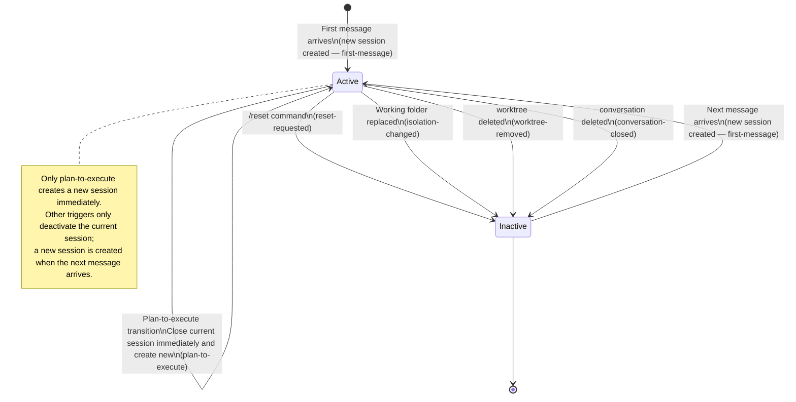
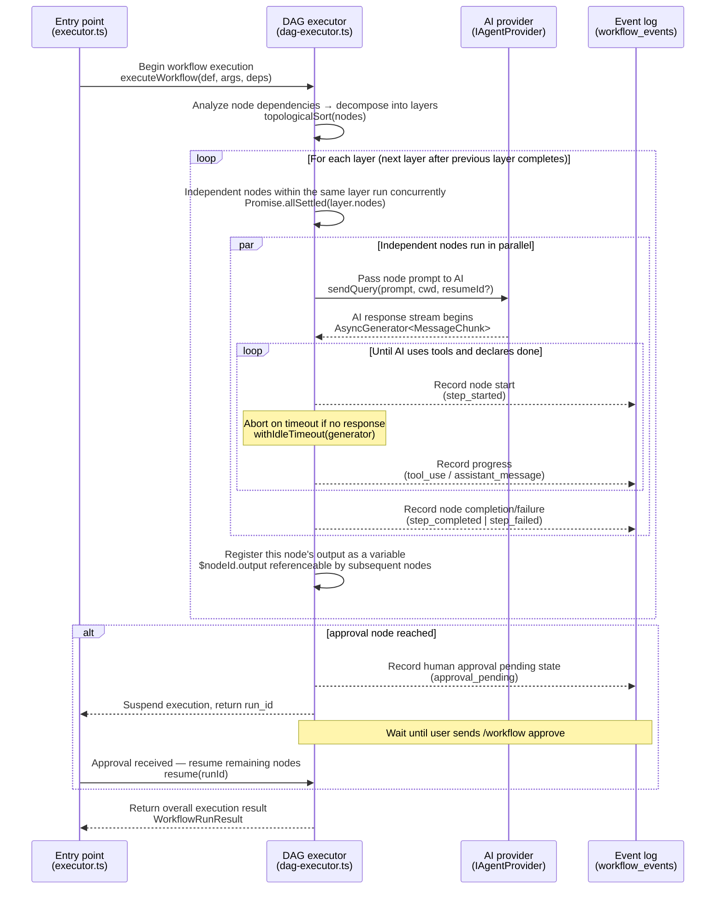

# Harness Analysis: `Archon`

## 0. Metadata

- **Name**: Archon (Remote Agentic Coding Platform)
- **Type**: External wrapper — harness that wraps an SDK on the backend
- **Repository**: Local (`/Users/WonjinSin/Documents/project/Archon`)
- **Analysis commit/version**: `33d31c44` (`dev` branch, 2026-04-15)
- **Analysis date**: 2026-04-15
- **Primary language/runtime**: TypeScript / Bun
- **Primary LLM provider**: Anthropic Claude + OpenAI Codex (`IAgentProvider` shared interface)

## TL;DR

Archon is a single-developer harness that remotely operates Claude Code and Codex from chat platforms such as Slack, Telegram, GitHub, Discord, Web, and CLI. The goal is an experience where a developer can send "take a look at this issue" over Slack on the way to work, the AI spins up a git worktree to work on it, and returns the result via chat. Understanding the three core design decisions — isolation via git worktree rather than Docker, sessions as an immutable linked chain, and routing via a deterministic whitelist + AI token detection hybrid — makes all other decisions follow naturally.

---

# Part 1: The Story

## 1-1. Main Flow (The journey of a single user message)

```
┌────────────────────────────────────────────────────────────┐
│  Message received — platform adapter detects the event     │
│  Slack(SDK polling) / GitHub(webhook) / Web(HTTP) etc.     │
│  Each adapter performs auth check; unauthorized users are  │
│  silently rejected here                                    │
│  adapter.onMessage()  ·  adapters/src/chat/*/adapter.ts   │
└────────────────────────┬───────────────────────────────────┘
                         │
                         ▼
┌────────────────────────────────────────────────────────────┐
│  Serialization — only one message per conversation         │
│  is processed at a time                                    │
│  (two concurrent messages would corrupt session state)     │
│  Global max 10 concurrent conversations — rest waits       │
│  ConversationLockManager.acquireLock()                     │
│  conversation-lock.ts:59  ·  webhooks return 200 immediately│
└────────────────────────┬───────────────────────────────────┘
                         │
                         ▼
┌────────────────────────────────────────────────────────────┐
│  Orchestrator entry — decide how to handle this message    │
│  handleMessage()  ·  orchestrator-agent.ts:498             │
└──────┬──────────────────────────┬──────────────────────────┘
       │                          │                          │
       ▼                          ▼                          ▼
┌────────────────┐   ┌──────────────────────┐   ┌──────────────────┐
│ Slash command? │   │ Approval-pending      │   │ Normal chat      │
│ /help /reset   │   │ workflow?             │   │ message          │
│ /workflow etc. │   │ Is anything waiting   │   │ (continues below)│
│ :649           │   │ at an approval node?  │   └────────┬─────────┘
│                │   │ :535                  │            │
└───────┬────────┘   └──────────┬───────────┘            │
        ▼                       ▼                         │
┌──────────────────┐  ┌──────────────────────┐            │
│ Handle instantly │  │ Interpret this message│            │
│ without AI       │  │ as approve/reject and │            │
│ CommandHandler   │  │ resume workflow       │            │
│ Update DB and    │  └──────────────────────┘            │
│ return response  │                                       │
└──────────────────┘                                      │
                                                          ▼
┌────────────────────────────────────────────────────────────┐
│  Context assembly — gather all necessary information       │
│  before passing to AI                                      │
│  ① conversation info (from DB)                             │
│  ② session (fetch active session, or create new if none)   │
│  ③ codebase + working folder (worktree resolver, 6 steps)  │
│  ④ list of available workflows (bundled + global + project)│
│  ⑤ config values + project env vars                        │
│  ⑥ previous conversation history + attachments            │
│  orchestrator-agent.ts:704-790                             │
└────────────────────────┬───────────────────────────────────┘
                         │
                         ▼
┌────────────────────────────────────────────────────────────┐
│  Prompt assembly — thread everything from system directive │
│  to user message into one                                  │
│  [System: role + workflow list] + [previous conversation] +│
│  [user message] + [attachments/GitHub context]             │
│  buildFullPrompt()  ·  orchestrator-agent.ts:447-488       │
└────────────────────────┬───────────────────────────────────┘
                         │
                         ▼
┌────────────────────────────────────────────────────────────┐
│  AI invocation — send prompt to configured provider        │
│  Claude → @anthropic-ai/claude-agent-sdk                   │
│  Codex  → @openai/codex-sdk                                │
│  aiClient.sendQuery()  ·  @archon/providers                │
└────────────────────────┬───────────────────────────────────┘
                         │
                         ▼
┌────────────────────────────────────────────────────────────┐
│  AI execute-evaluate loop — repeats until AI declares done │
│  orchestrator-agent.ts:846-938                             │
│                                                            │
│  ┌─────────────────────────────────────────────────────┐  │
│  │  Execute: AI proposes actions and uses tools         │  │
│  │  (read files / write code / run bash / run tests)   │  │
│  └─────────────────────┬───────────────────────────────┘  │
│                        │ tool results returned to AI       │
│                        ▼                                   │
│  ┌─────────────────────────────────────────────────────┐  │
│  │  Evaluate: AI reviews results and decides next step  │  │
│  │  Success? → declare done and exit loop               │  │
│  │  Failure? → analyze cause and execute again (loop)   │  │
│  └─────────────────────┬───────────────────────────────┘  │
│          ↑ repeat       │ on completion declaration         │
│          └─────────────┘                                   │
│                                                            │
│  Text response is streamed to platform in real time        │
│  while also accumulated in a buffer                        │
│  [Buffer watch] /invoke-workflow detected → break loop     │
└──────────────────────────┬─────────────────────────────────┘
                           │
           ┌───────────────┴───────────────┐
           │ /invoke-workflow detected      │ Normal response complete
           ▼                               ▼
┌──────────────────────┐      ┌────────────────────────────┐
│ Retract already-sent │      │ Response sent successfully  │
│ text → hand off to   │      │ Web/Telegram: chunks in    │
│ workflow             │      │ real time                  │
│ emitRetract()        │      │ Slack/Discord: once after  │
│ dispatchWorkflow()   │      │ completion                 │
│ @archon/workflows    │      │ platform.sendMessage()     │
└──────────────────────┘      └────────────────────────────┘
```

### Narration

When a user message arrives, the very first thing that happens is **serialization**. Because two messages arriving nearly simultaneously for the same conversation could corrupt state such as the active session or resume ID, Archon serializes per-conversation with a FIFO lock (`conversation-lock.ts:59`). As soon as the lock is acquired, the platform webhook receives 200 immediately in a fire-and-forget pattern, which naturally supports platforms like Slack that require a response within 3 seconds.

Next comes the **routing branch**. The orchestrator first scans the slash command whitelist (`orchestrator-agent.ts:649`). About ten commands — `/help`, `/status`, `/workflow`, and similar — bypass AI entirely and go straight to `CommandHandler`. Next it checks whether there is a workflow already waiting at an approval gate (`:535`); if so, it interprets the incoming message as an approve/reject response and resumes the workflow. If neither applies, the message follows the normal chat path.

On the normal chat path, **context assembly** (`:704-790`) proceeds sequentially within a single function. Six items stack up in cascade — conversation, session, codebase and isolation, workflow list, config and env, thread history and attachments — where each step's output feeds the next, making reordering difficult. Once assembly is complete, `buildFullPrompt` threads everything from the system prompt (orchestrator role + workflow list) to the user message, then hands it off to `aiClient.sendQuery()`.

The **AI work loop** is the heart of agent behavior. The AI does not produce the entire answer at once — it writes text, reads files, runs code, **evaluates the results on its own**, then acts again. Because this execute-evaluate-retry cycle happens automatically at the SDK level, Archon does not need to write separate "retry logic." Flows like "ran tests, they failed → read the error message and identify the cause → fix the code → run tests again" proceed with the AI making its own judgments in a loop. Archon's role is only to stop or redirect this loop — preventing infinite loops with an idle timeout (`withIdleTimeout`), and switching to workflow dispatch when `/invoke-workflow` is detected.

There is one additional thing Archon does inside that loop. It streams text to the user in real time while simultaneously accumulating it in an internal buffer for monitoring. The moment the AI decides "this should be handled by a workflow" and emits `/invoke-workflow`, Archon cancels the text already sent to the user via `platform.emitRetract()` and switches to workflow execution. This approach covers both 'routing decision' and 'normal response' with a single LLM call rather than a separate classifier model, which comes with the tradeoff of stream-retraction UX complexity.

---

## 1-2. Alternate Paths

### (a) Directly running a workflow via slash command

```
User: "/workflow run plan-feature 'add authentication feature'"
        │
        ▼
┌──────────────────────────────────────────────────────┐
│ Slash command detected — AI router bypassed entirely  │
│ CommandHandler.handleWorkflowRunCommand()             │
│ command-handler.ts                                    │
└───────────────────────┬──────────────────────────────┘
                        │
                        ▼
┌──────────────────────────────────────────────────────┐
│ Acquire working folder — reuse existing worktree for  │
│ this conversation if one exists; otherwise create a  │
│ new worktree on a new branch                         │
│ IsolationResolver.resolve()                          │
│ isolation/src/resolver.ts                            │
└───────────────────────┬──────────────────────────────┘
                        │
                        ▼
┌──────────────────────────────────────────────────────┐
│ Begin workflow execution — read YAML definition and  │
│ construct DAG                                        │
│ executeWorkflow(name, args, deps)                    │
│ workflows/src/executor.ts                            │
└───────────────────────┬──────────────────────────────┘
                        │
                        ▼
┌──────────────────────────────────────────────────────┐
│ DAG execution — run nodes in dependency order,       │
│ independent nodes in parallel                        │
│   prompt/command nodes → AI invocation (per-node LLM)│
│   bash/script nodes   → shell/runtime directly       │
│   loop nodes          → repeat until completion sig. │
│   approval nodes      → store pending in DB, await  │
│ dag-executor.ts:405  ·  Promise.allSettled(layer)    │
└──────────────────────────────────────────────────────┘
```

### Narration

When the slash command `/workflow run` arrives, it bypasses the AI router entirely and goes straight to `CommandHandler`. The command handler first acquires a working folder — if a worktree was already in use for this conversation it reuses it, otherwise it creates a new one. From there it hands off to `executeWorkflow()`, where AI invocations happen individually at the node level rather than through the global orchestrator. `bash:` and `script:` nodes execute the shell/runtime directly without AI, and `approval:` nodes are stored as pending in the DB to wait for the user's response.

---

### (b) Path where normal chat input is redirected to a workflow

```
User: "find the bug in this issue"  (freeform input)
        │
        ▼
┌─────────────────────────────────────────────────────┐
│ Main Flow proceeds — context assembled, AI invoked   │
│ Available workflow list injected into system prompt  │
│ (AI decides on its own whether to route to workflow  │
│  or respond directly)                               │
└──────────────────────┬──────────────────────────────┘
                       │
                       ▼
┌─────────────────────────────────────────────────────┐
│ AI work loop in progress...                          │
│ "It would be best to start with a plan for this—"   │
│ (text streamed in real time + buffer accumulating)   │
└──────────────────────┬──────────────────────────────┘
                       │  [/invoke-workflow plan-feature detected in buffer]
                       ▼
┌─────────────────────────────────────────────────────┐
│ Retract already-sent text in UI                      │
│ emitRetract()  ·  orchestrator-agent.ts              │
└──────────────────────┬──────────────────────────────┘
                       │
                       ▼
┌─────────────────────────────────────────────────────┐
│ Hand off to workflow — from this point identical     │
│ to path (a)                                         │
│ dispatchBackgroundWorkflow("plan-feature", args)     │
└─────────────────────────────────────────────────────┘
```

### Narration

When freeform input is following the Main Flow and the model emits a `/invoke-workflow` token, the path switches. At that point there may already be text that was streamed to the user; `emitRetract()` sends a "cancel the just-sent text" signal to the UI and switches to workflow dispatch. From this point on, the execution flow is identical to path (a). Because the model decides "when should this go to a workflow," tool usage is blocked at the API level with `tools: []` during the Claude routing call so it can focus solely on the routing decision.

---

### (c) loop node — repeat execution until success

```
Workflow YAML:
  nodes:
    - id: implement
      type: loop
      prompt: "Write code that passes the tests. Output <done/> when finished."
                    │
                    ▼
┌────────────────────────────────────────────────────────────┐
│  Iteration 1 begins — pass prompt + previous output        │
│  context to AI                                             │
│  sendQuery(loopPrompt + previousOutput)                    │
│  dag-executor.ts (loop handling section)                   │
└───────────────────────┬────────────────────────────────────┘
                        │
                        ▼
┌────────────────────────────────────────────────────────────┐
│  AI work — runs execute-evaluate cycle on its own using    │
│  tools                                                     │
│  Edit file → run test → check result → edit again...       │
│  (execute-evaluate loop also runs internally here)         │
└───────────────────────┬────────────────────────────────────┘
                        │
                        ▼
                Does output contain a completion signal?
                detectCompletionSignal(output)
                executor-shared.ts
                      /          \
                 yes               no
                  │                  │
                  ▼                  ▼
        ┌───────────────┐   Has max iteration count been reached?
        │ Exit loop     │      /           \
        │ $nodeId.output│   no              yes
        │ pass to next  │     │                │
        └───────────────┘     │                ▼
                               │    ┌──────────────────┐
                               │    │ Force exit loop   │
                               │    │ (classified as    │
                               │    │ failure)          │
                               │    └──────────────────┘
                               ▼
                    Iteration 2 begins
                    (previous output accumulated in context)
```

### Narration

The `loop:` node is the most explicit execute-evaluate-retry structure Archon provides. When a workflow author determines that "this task may not finish in one shot," they choose the `loop:` type and specify in the prompt the signal the AI should emit when declaring completion (a tag like `<done/>`). From there, Archon manages the repetition automatically.

What is interesting is that **another loop** runs inside this loop. When one iteration executes, the AI internally runs an execute-evaluate cycle at the SDK level using tools. In other words, "loop node repetitions" nest "AI tool-use repetitions." At the end of each iteration, that iteration's output is accumulated into the next iteration's context, so the AI retains memory of what it tried and what happened before attempting the next try.

There are three termination conditions — completion signal detected, maximum iteration count exceeded, SDK-level result message received (`detectCompletionSignal()` in `executor-shared.ts`). When any one of these is met, the loop ends and that iteration's output is passed to the next node as `$nodeId.output`.

---

### (d) Path that requires human approval before proceeding to the next step

```
During workflow execution:
  [Plan writing node] → [Test execution node] → [Human review node] ← stops here
                                                        │
                                              Record pending state in DB
                                              (workflow_events: approval_pending)
                                                        │
                                              Send user notification
                                                        │
  User: "/workflow approve <id> looks good, keep going"
        │
        ▼
┌─────────────────────────────────────────────────────┐
│ New message detected — confirm pending workflow      │
│ handleMessage()  ·  orchestrator-agent.ts:535        │
└──────────────────────┬──────────────────────────────┘
                       │
                       ▼
┌─────────────────────────────────────────────────────┐
│ Record approval — save to event log                  │
│ Record approval_received in workflow_events          │
│ User's comment = "looks good, keep going"            │
└──────────────────────┬──────────────────────────────┘
                       │
                       ▼
┌─────────────────────────────────────────────────────┐
│ Resume remaining nodes                               │
│ Resume executeWorkflow()                             │
│ (if capture_response: true, user comment is          │
│  available to subsequent nodes as $nodeId.output)    │
└─────────────────────────────────────────────────────┘
```

### Narration

The `approval:` node saves the workflow as pending in the DB and halts execution. From that point, whatever message the user sends to the same conversation, the orchestrator first checks "is there a waiting workflow?" (`orchestrator-agent.ts:535`). If there is, it interprets that message not as normal chat input but as an approve/reject response and resumes the workflow. For nodes configured with `capture_response: true`, the user's comment is captured as `$nodeId.output` and can be referenced by subsequent nodes.

---

## 1-3. Session State Transitions



### Narration

The most distinctive aspect of Archon's session model is that **sessions are immutable**. State is never modified; instead, whenever a transition occurs a new session row is created and the previous session is referenced via `parent_session_id`. Thanks to this linked chain, the session history of a conversation becomes an audit log in its own right — questions like "when was reset pressed" or "when did we move from plan to execute" can be answered with a DB query rather than code.

Among the six transition triggers, `plan-to-execute` behaves specially. Other triggers only deactivate the current session and let a new session be created on the next message, but `plan-to-execute` creates a new session immediately. The moment of moving from planning to execution is a branch the user has explicitly 'approved', so deferring the session transition is judged to be wrong. This design also prevents race conditions — even if two messages arrive simultaneously, there is no conflict because a new row is inserted rather than modifying an existing one.

Resumption works by passing an existing session's `sdk_session_id` as the `resumeSessionId` to `sendQuery()`. The SDK appends on top of it. Passing `forkSession: true` copies the session into a new one, making retries safe without touching the original.

---

## 1-4. Working Folder (Isolation) Decision Tree

```
Question: which folder should this conversation/workflow execute in?
resolver.ts:41-100
                    │
                    ▼
        ┌───────────────────────────────────┐
        │ ① Is there already a folder in    │
        │   use? A worktree created by the  │
        │   same conversation previously    │
        └──────────────┬────────────────────┘
                  yes  │ no
                       ▼
        ┌───────────────────────────────────┐
        │ ② Is there a folder created by    │
        │   the same workflow?              │
        │   Same workflowId + codebase      │
        └──────────────┬────────────────────┘
                  yes  │ no
                       ▼
        ┌───────────────────────────────────┐
        │ ③ Is there a folder from another  │
        │   conversation handling the same  │
        │   GitHub issue?                   │
        │   (cross-conversation sharing)    │
        └──────────────┬────────────────────┘
                  yes  │ no
                       ▼
        ┌───────────────────────────────────┐
        │ ④ Is there a linked PR branch?    │
        │   Check out that branch as-is     │
        └──────────────┬────────────────────┘
                  yes  │ no
                       ▼
        ┌───────────────────────────────────┐
        │ ⑤ Create new worktree             │
        │   Create new branch and check out │
        └──────────────┬────────────────────┘
                success│ failure (disk full, permission error, etc.)
                       ▼
        ┌───────────────────────────────────┐
        │ ⑥ Clean up stale folders and      │
        │   retry                           │
        │   Remove stale worktrees → retry ⑤│
        └──────────────┬────────────────────┘
                success│ still failing
                       ▼
                IsolationBlockedError
                → classifyIsolationError()
                → "not a git repository" etc.
                  converted to human-readable message
```

### Narration

The six steps of the Isolation Resolver can be read as a single principle: "preserve existing context as much as possible." Creating a new worktree is always the last resort; when possible, the same environment already used by the same issue or same workflow is inherited. In particular, step 3's 'issue sharing' is cross-conversation reuse — it prevents the situation where two conversations handling the same GitHub issue each create their own worktree and collide.

Failures are not passed over silently. `IsolationBlockedError` is thrown, and the `classifyIsolationError()` function converts raw git errors (`fatal: not a git repository`, `No space left on device`, etc.) into user-friendly messages that are sent to the platform. Archon's Fail Fast philosophy is maintained at the isolation layer as well.

Port assignment is also tied to this resolver flow. Ports in the 3190–4089 range are deterministically assigned based on a hash of the worktree path, so spinning up a dev server from the same worktree always gets the same port. This makes bookmarks and curl commands reusable.

---

## 1-5. Workflow DAG Execution Sequence



### Narration

Workflow execution uses a **DAG + topological sort + layer parallelism** structure. Nodes are defined as a directed graph connected by `depends_on`, and the executor decomposes this into layers, executing independent nodes within the same layer concurrently with `Promise.allSettled`. Execution only advances to the next layer after all parallel executions within the current layer finish — a tight synchronization model.

Each node execution is wrapped with a `withIdleTimeout` wrapper. If the SDK stream produces no chunks for a given duration, the call is terminated with an `AbortController`. This timeout is a safety net against being held indefinitely, and it is also a test point for verifying that the abort signal is correctly propagated to the SDK level.

The `approval:` node follows a special flow, as visible in the sequence. When the node is reached, it records a pending event in the DB and returns from execution — the workflow is not "paused," but rather calling `executeWorkflow` again after receiving the user's response resumes the remaining nodes. If `capture_response: true`, the user's comment is passed to subsequent nodes as `$nodeId.output`.

---

# Part 2: Reference Details

## 2-1. Entry Points

5 chat adapters (Web/Slack/Telegram/GitHub/Discord) + CLI + HTTP API + GitHub webhook. All converge on the common `handleMessage()` (`orchestrator-agent.ts`). Conversation ID: Slack=`thread_ts`, Telegram=`chat_id`, GitHub=`owner/repo#number`, Web=user-specified string, Discord=channel ID. Authentication is handled inside each adapter — the orchestrator is unaware of authentication.

## 2-2. Concurrency

Global max 10 concurrent conversations + per-conversation FIFO (`conversation-lock.ts:59`). Excess messages wait in queue (no immediate rejection). Node level adds `withIdleTimeout` + `AbortController`. Workflow runs have a per-worktree-path mutex attached separately from the global lock (`lock-workflow-runs`).

## 2-3. Routing

Deterministic whitelist (10 commands) → AI router (`/invoke-workflow` token detection) → fallback (`archon-assist`). AI routing prompt injects the workflow list into the system prompt inside `buildFullPrompt()`. Claude has tool usage blocked with `tools: []`; Codex falls back when tool bypass is detected. Reversible mid-stream (emitRetract).

## 2-4. Context Assembly

Single assembly point (`orchestrator-agent.ts:704-790`). Order: Conversation → Session → Codebase+Isolation → Workflows → Config+env → Thread+attachments. Variable substitution (`$ARGUMENTS`, `$1`, `$ARTIFACTS_DIR`, `$WORKFLOW_ID`, `$BASE_BRANCH`, `$DOCS_DIR`, `$LOOP_USER_INPUT`, `$REJECTION_REASON`) applies only to workflow node prompts — no substitution in normal chat.

## 2-5. Provider Abstraction

`IAgentProvider` interface (`packages/providers/src/types.ts:201`). The `@archon/providers/types` subpath forbids SDK imports — the engine and core import only from this path so SDK updates do not break the build directly. Claude and Codex each have a `providers/src/*/provider.ts` implementation. Adding a new provider requires an implementation file + one line registration in `registry.ts`.

## 2-6. Worker / Execution

Execution unit: normal conversation = 1 user message = 1 LLM call; workflow = 1 node = 1 LLM call. No separate worker class — the orchestrator loop doubles as that role. Option passing: YAML → executor → provider → SDK translation. Abort: `nodeAbortController.signal` propagates to SDK via `SendQueryOptions.abortSignal`.

## 2-7. Message Loop

`for await` stream processing (`orchestrator-agent.ts:846`). Platform sending and internal buffer accumulation proceed simultaneously. Web/Telegram use stream mode (chunks sent immediately); Slack/GitHub/Discord use batch mode (accumulated then sent once). On `/invoke-workflow` detection, `commandDetected=true` halts sending → drain then retract+dispatch.

## 2-8. Session / State

Immutable linked chain — insert new row on transition + `parent_session_id` pointer. 6 trigger types: `first-message`, `plan-to-execute` (immediate CREATE), `reset-requested`, `isolation-changed`, `worktree-removed`, `conversation-closed`. Expiry: `/workflow cleanup` default 7 days, isolation cleanup separate. `remote_agent_sessions` table.

## 2-9. Isolation

Git worktree — no Docker/VM. Path: `~/.archon/workspaces/<owner>/<repo>/worktrees/<branch>`. No network or OS isolation (single-user assumption). Resolver 6 steps (`packages/isolation/src/resolver.ts:41-100`). Port: deterministic assignment in 3190–4089 range based on path hash. Failure classification: `classifyIsolationError()` → user-friendly message.

## 2-10. Tool / Capability

Claude Agent SDK built-in default tool set (Read/Write/Edit/Bash/Glob/Grep etc.). Per-node `allowed_tools`/`denied_tools`, `mcp`, `hooks`, `skills` can be overridden. MCP, hooks, and skills are Claude-only — ignored by Codex. YAML options pass through the engine unchanged and are translated only inside the provider (`claude/provider.ts:354-398`).

## 2-11. Workflow Engine

DAG + topological sort + layer parallelism (`dag-executor.ts:405`). Node types: `prompt`, `command`, `bash`, `script`, `loop`, `approval`. YAML definitions discovered under `.archon/workflows/`. Conditions: `when:` + `trigger_rule`. Variables: `$nodeId.output` references. Loop termination: whichever comes first among SDK result | completion tag | max iteration. Runtime reload: `/workflow reload` available.

## 2-12. Configuration

Hierarchy: bundled < global (`~/.archon/config.yaml`) < project (`.archon/config.yaml`) < workflow node. Shallow per-field override — no deep merge. Workflows validated with Zod at load time + provider/model compatibility check. One broken workflow does not affect others (`/workflow list` exposes the error).

## 2-13. Error Handling

Fail Fast philosophy — almost no empty catches; 0 rows matched throws. Raw errors are structured-logged (`log.error({err, ...}, 'domain.action_failed')`); users receive a friendly message through a classification function. No global retry mechanism — retries are specified declaratively only via the `retry:` field in workflow node YAML.

## 2-14. Observability

Pino structured logging (`packages/paths/src/logger.ts`). Workflow event bus (`packages/workflows/src/event-emitter.ts`) → relayed in real time via Web SSE. Event naming: `{domain}.{action}_{state}`. Storage: stdout + JSONL (`~/.archon/workspaces/.../logs/`) + DB (`remote_agent_workflow_events`). CLI `--verbose` = debug + tool-level events; `--quiet` = errors only.

## 2-15. Platform Adapters

`IWorkflowPlatform` interface (`packages/workflows/src/deps.ts:56-66`): `sendMessage`, `getStreamingMode`, `getPlatformType` required + `sendStructuredEvent`, `emitRetract` optional. Streaming mode: Web/Telegram = stream; Slack/GitHub/Discord = batch. Authentication handled inside each adapter — silent reject.

## 2-16. Persistence

SQLite by default (`~/.archon/archon.db` auto-initialized); switch to PostgreSQL via `DATABASE_URL`. Abstracted by `IDatabase` interface. 8 tables (prefixed `remote_agent_`): `codebases`, `conversations`, `sessions`, `isolation_environments`, `workflow_runs`, `workflow_events`, `messages`, `codebase_env_vars`. `codebase_env_vars` stored in plaintext (local single-user assumption, OS file permissions delegated).

## 2-17. Security Model

Trust model: 'local user ≈ root' — multi-tenancy excluded. Only external perimeter defense: adapter whitelist env + GitHub webhook HMAC SHA-256 signature verification. Secrets: `.env` (API keys) + `codebase_env_vars` DB (plaintext). No explicit prompt injection defense — assumes user controls their own context. Log masking: `token.slice(0,8) + '...'`.

## 2-18. Key Design Decisions & Tradeoffs

Understanding Archon's architecture requires three premises — no multi-tenancy, local-development focus, git used actively as a tool. Most other decisions follow from these.

| Decision              | Choice                                     | Alternative          | Rationale                                 | Tradeoffs                                    |
| --------------------- | ------------------------------------------ | -------------------- | ----------------------------------------- | -------------------------------------------- |
| Provider isolation    | `@archon/providers/types` contract subpath | Direct SDK import    | Engine purity, SDK version independence   | HARD RULE must be enforced by humans         |
| Isolation mechanism   | Git worktree                               | Docker container     | Lightweight, natural branch integration   | No network/OS isolation                      |
| Session model         | Immutable linked chain                     | Mutable + version    | Clear audit history, no race conditions   | More DB rows                                 |
| AI routing            | `/invoke-workflow` token + emitRetract     | Dedicated classifier | Routing + response in one LLM call        | Stream retraction UX complexity              |
| Concurrency           | Global 10 + per-conv FIFO                  | Unlimited async      | Resource control + serialization          | Queue wait under high load                   |
| DB choice             | SQLite default, PG optional                | PG only              | Zero-setup UX                             | Cost of maintaining two adapters             |
| Config merge          | Shallow per-field                          | Deep merge           | Clear visibility of which level "won"     | Cannot partially override deep structures    |

## 2-19. Open Questions

- Source of `withIdleTimeout` default idle timeout value — check around `dag-executor.ts:588` or in the node schema
- Whether users are notified when Codex ignores MCP, hooks, and skills (load-time warning vs. silent ignore) — check `codex/provider.ts`
- Whether `emitRetract` is actually called in batch-mode Slack, and whether it has any effect given Slack API constraints
- Whether SQLite WAL mode is enabled and the `busy_timeout` setting value — check DB initialization code

---

## Appendix: Quick Reference

| Item                 | Value                                                                                                   |
| -------------------- | ------------------------------------------------------------------------------------------------------- |
| Type                 | External wrapper (wraps SDK on the backend)                                                             |
| Entry points         | Web(SSE), Slack, Telegram, GitHub, Discord, CLI, HTTP API, webhook                                      |
| Concurrency          | Global 10 + per-conversation FIFO                                                                       |
| Router style         | Hybrid (deterministic whitelist → AI `/invoke-workflow` → emitRetract)                                  |
| Provider abstraction | `IAgentProvider` + contract subpath (SDK import forbidden)                                              |
| Session model        | Immutable linked chain (`parent_session_id` + `transition_reason`)                                      |
| Isolation            | Git worktree (no Docker) — 6-step resolver                                                              |
| Workflow engine      | DAG + topological sort + layer parallelism, YAML definitions, 6 node types                              |
| Primary language     | TypeScript / Bun                                                                                        |
| Monorepo packages    | 10+ (`paths`, `git`, `providers`, `isolation`, `workflows`, `core`, `adapters`, `server`, `cli`, `web`) |
