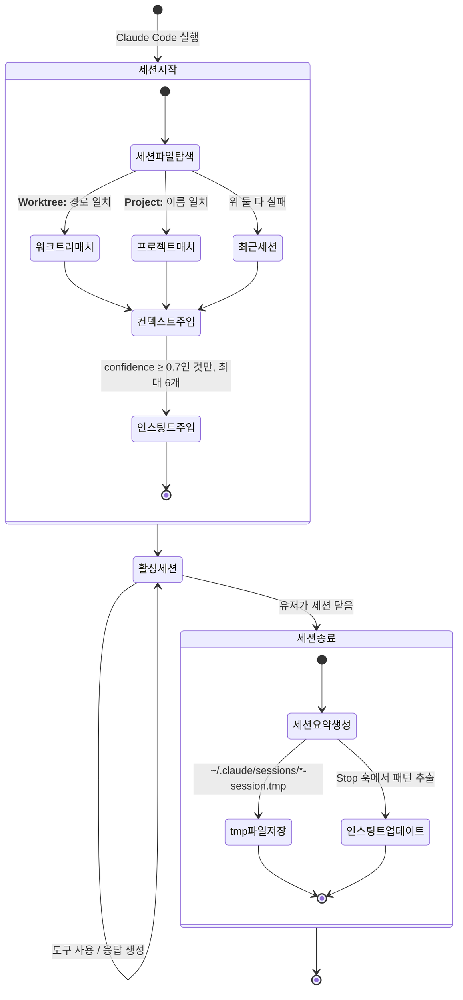

# Harness Analysis: `everything-claude-code`

## 0. Metadata

- **이름**: everything-claude-code (ecc)
- **종류**: in-harness skill system (Claude Code 내부에서 플러그인으로 동작)
- **저장소**: 로컬 경로 `/Users/WonjinSin/Documents/project/everything-claude-code`
- **분석 커밋/버전**: v1.10.0 (7eb7c59)
- **분석 일시**: 2026-04-15
- **주 언어/런타임**: Markdown (에이전트/스킬/커맨드) + Node.js ≥18 (훅 스크립트)
- **주 LLM 공급자**: Claude (Anthropic) — Opus 4.6 preferred, Sonnet 4.6 fallback

## TL;DR — 한 문단 요약

everything-claude-code(ECC)는 Claude Code의 동작을 강화하는 **in-harness 플러그인**이다. 코드를 실행하는 런타임이 아니라, Claude Code가 읽는 **Markdown 파일 컬렉션과 Node.js 훅 스크립트 모음**이다. 설치하면 `~/.claude/` 아래에 143개 스킬, 50개 에이전트, 78개 슬래시 커맨드, 30여 개 훅 스크립트가 배치된다. 유저가 `/tdd`를 치거나 새 세션을 열면, Claude Code가 해당 Markdown 파일을 읽어 LLM의 프롬프트 컨텍스트로 주입하고, Node.js 훅이 도구 실행 전후에 개입해 품질 검사·자동 포맷팅·세션 기억 저장을 수행한다. 핵심 설계 원칙은 **"LLM을 바꾸는 것이 아니라 LLM이 읽는 것을 바꾼다"**는 것이다.

---

# Part 1: The Story

## 1-1. Main Flow — 세션 시작부터 응답까지

```
┌──────────────────────────────────────────────────────────────┐
│  유저가 Claude Code 세션을 연다                                │
│  (새 터미널, IDE 사이드패널, claude.ai/code)                   │
└────────────────────┬─────────────────────────────────────────┘
                     │ SessionStart 이벤트
                     ▼
┌──────────────────────────────────────────────────────────────┐
│  이전 세션 컨텍스트 + 학습된 인스팅트 주입                      │
│  (최대 30일 이내 *-session.tmp 파일, 최대 6개 인스팅트)          │
│  session-start.js · scripts/hooks/session-start.js:350       │
└────────────────────┬─────────────────────────────────────────┘
                     │ stdout → Claude Code의 additionalContext
                     ▼
┌──────────────────────────────────────────────────────────────┐
│  유저 메시지 수신                                               │
│  (자연어 요청 or /슬래시커맨드)                                  │
└────────┬───────────────────────────┬─────────────────────────┘
         │ /커맨드 감지               │ 일반 메시지
         ▼                           ▼
┌─────────────────┐         ┌──────────────────────────────────┐
│  커맨드 파일 로드 │         │  현재 프로젝트 컨텍스트로 응답     │
│  commands/*.md  │         │  (CLAUDE.md + active skills 적용) │
│  commands/:1-3  │         └──────────────────────────────────┘
└────────┬────────┘
         │ 스킬 또는 에이전트 위임
         ▼
┌──────────────────────────────────────────────────────────────┐
│  스킬 또는 에이전트 파일 로드 → LLM 컨텍스트로 주입              │
│  skills/<name>/SKILL.md  또는  agents/<name>.md              │
│  예: skills/tdd-workflow/SKILL.md, agents/planner.md         │
└────────────────────┬─────────────────────────────────────────┘
                     │ LLM이 계획 수립 후 도구 호출 시작
                     ▼
┌──────────────────────────────────────────────────────────────┐
│  PreToolUse 훅 인터셉트 (도구 실행 직전)                        │
│  · Bash: block-no-verify, commit-quality, auto-tmux-dev       │
│  · Write/Edit: gateguard-fact-force, doc-file-warning         │
│  hooks/hooks.json PreToolUse 섹션                             │
└────────────────────┬─────────────────────────────────────────┘
                     │ exit 0 → 허용 / exit 2 → 차단
                     ▼
┌──────────────────────────────────────────────────────────────┐
│  Claude Code 도구 실행                                         │
│  (Bash, Read, Edit, Write, Grep, Glob 등)                     │
└────────────────────┬─────────────────────────────────────────┘
                     │ 실행 완료
                     ▼
┌──────────────────────────────────────────────────────────────┐
│  PostToolUse 훅 실행 (도구 실행 직후)                           │
│  · Edit/Write 후: Prettier 포맷팅, TypeScript 타입 체크         │
│  · Bash 후: PR URL 감지, 빌드 결과 분석                         │
│  hooks/hooks.json PostToolUse 섹션                            │
└────────────────────┬─────────────────────────────────────────┘
                     │ 응답 완성
                     ▼
┌──────────────────────────────────────────────────────────────┐
│  Stop 훅 실행 (Claude가 응답을 마칠 때)                         │
│  · console.log/debugger 잔재 감시                              │
│  · 패턴 추출 및 인스팅트 후보 생성                               │
└────────────────────┬─────────────────────────────────────────┘
                     │ 세션 종료 시
                     ▼
┌──────────────────────────────────────────────────────────────┐
│  SessionEnd 훅 — 세션 요약을 *-session.tmp 파일로 저장          │
│  다음 세션 시작 시 session-start.js가 이 파일을 불러온다         │
│  scripts/hooks/session-end.js                                │
└──────────────────────────────────────────────────────────────┘
```

### Narration

이 다이어그램은 ECC가 설치된 Claude Code 환경에서 유저가 세션을 열고 응답을 받을 때까지의 **전체 주 경로**다. 겉으로는 평범한 Claude Code 세션처럼 보이지만, 세 군데에서 ECC가 조용히 개입한다: 세션 시작 시 컨텍스트 주입, 도구 실행 전후 훅 가드레일, 세션 종료 시 기억 저장.

유저가 세션을 열면 가장 먼저 일어나는 일은 `session-start.js`(`scripts/hooks/session-start.js:350`)가 실행되는 것이다. 이 스크립트는 `~/.claude/sessions/` 아래의 `*-session.tmp` 파일들을 훑어 **현재 프로젝트와 가장 잘 맞는 이전 세션 요약**을 찾는다. 매칭 우선순위는 "정확한 worktree 경로 일치 → 프로젝트 이름 일치 → 가장 최근"이다. 찾은 요약은 `hookSpecificOutput.additionalContext`로 stdout에 쓰이고, Claude Code가 이것을 초기 컨텍스트로 주입한다. 이 덕분에 유저는 "지난번에 어디까지 했더라"를 굳이 설명하지 않아도 된다.

유저가 `/tdd` 같은 슬래시 커맨드를 입력하면, Claude Code는 `commands/tdd.md`를 로드한다. 이 파일의 본문에는 "Apply the `tdd-workflow` skill"이라고만 적혀 있다(`commands/tdd.md:20`). 그러면 Claude Code는 `skills/tdd-workflow/SKILL.md`를 로드해 LLM의 시스템 컨텍스트에 주입한다. LLM이 이제 TDD 워크플로우를 "알게" 되는 것이다 — 코드가 실행되는 것이 아니라 **읽히는 것**이다.

LLM이 계획을 세우고 도구를 호출하기 시작하면, `hooks.json`에 정의된 PreToolUse 훅들이 인터셉트한다. Bash 명령에는 `block-no-verify.js`가 먼저 검사한다 — `--no-verify` 플래그가 있으면 exit code 2를 돌려 차단한다. git commit이면 `pre-bash-commit-quality.js`가 staged 파일을 린팅하고 `console.log`/시크릿 패턴을 검사한다. 파일 편집이 끝나면 PostToolUse로 Prettier와 TypeScript 타입체커가 돌아간다.

---

## 1-2. Alternate Paths

### (a) 슬래시 커맨드 — 스킬 위임 vs 에이전트 위임

커맨드는 두 가지 방식으로 동작을 위임한다. 어느 쪽인지에 따라 Claude의 컨텍스트 구성이 달라진다.

```
유저: /tdd                       유저: /plan
       │                                │
       ▼                                ▼
commands/tdd.md                  commands/plan.md
"Apply tdd-workflow skill"       "invokes planner agent"
       │                                │
       ▼                                ▼
skills/tdd-workflow/SKILL.md     agents/planner.md
(워크플로우 지침 주입)             (name, description, tools, model 로드)
                                        │
                                        ▼
                                  model: claude-opus-4-6
                                  tools: [Read, Grep, Glob]
                                  (서브에이전트로 spawned)
```

**스킬 위임** (예: `/tdd` → `tdd-workflow`)은 현재 Claude 세션의 컨텍스트에 스킬 파일을 추가하는 방식이다. 모델은 바뀌지 않고, 도구 집합도 그대로다. 단순히 LLM이 읽는 지침 문서가 늘어난다.

**에이전트 위임** (예: `/plan` → `planner`)은 frontmatter의 `model`과 `tools`를 읽어 별도 서브에이전트를 spawn한다. `planner.md`는 `model: opus`를 지정하므로 플래너는 항상 Opus로 실행된다. 에이전트 파일이 지정한 tools만 갖는 제한된 환경에서 돌아간다.

### Narration

두 경로의 차이는 **LLM 인스턴스 경계**에 있다. 스킬은 현재 세션 LLM에게 "이런 방식으로 해라"고 가르치는 것이고, 에이전트는 "이 일은 저 전문가 LLM에게 맡겨라"는 것이다. 같은 `/tdd` 커맨드도 `commands/tdd.md`는 스킬 위임이지만 에이전트 섹션의 "Related Agents"에 `tdd-guide.md`를 명시하고 있어(`commands/tdd.md:225`), 특정 상황에서는 에이전트로도 escalation된다.

### (b) 훅 활성화 경로 — 플러그인 루트 해석 + 프로필 게이팅

모든 훅 커맨드는 동일한 인라인 스크립트로 시작한다. 이 스크립트가 ECC가 어디에 설치됐는지 런타임에 찾아낸다.

```
hooks.json에 정의된 훅 커맨드
[node, "-e", "<인라인 resolver>", "node",
 "scripts/hooks/run-with-flags.js",
 "pre:bash:block-no-verify",
 "scripts/hooks/block-no-verify.js",
 "minimal,standard,strict"]
         │
         ▼
┌─────────────────────────────────────────────────────────┐
│  CLAUDE_PLUGIN_ROOT 환경변수가 있으면 → 바로 사용           │
│  없으면 → 가능한 설치 경로 7곳을 순서대로 탐색              │
│  · ~/.claude/                                           │
│  · ~/.claude/plugins/ecc/                               │
│  · ~/.claude/plugins/everything-claude-code/            │
│  · ~/.claude/plugins/cache/<org>/<version>/             │
│  (scripts/lib/utils.js 경로 존재 여부로 확인)              │
│  hooks/hooks.json:13 (인라인 resolver)                   │
└────────────────────┬────────────────────────────────────┘
                     │ plugin root 확정
                     ▼
┌─────────────────────────────────────────────────────────┐
│  run-with-flags.js — 프로필 게이팅 검사                   │
│  ECC_HOOK_PROFILE: minimal / standard / strict           │
│  ECC_DISABLED_HOOKS: "hook-id1,hook-id2" 개별 비활성화   │
│  허용된 프로필이 아니면 → 조용히 exit 0 (차단 없이 통과)   │
│  scripts/hooks/run-with-flags.js:14                      │
└────────────────────┬────────────────────────────────────┘
                     │ 프로필 통과
                     ▼
┌─────────────────────────────────────────────────────────┐
│  실제 훅 스크립트 실행                                    │
│  (block-no-verify.js, commit-quality.js 등)              │
│  exit 0 → 허용, exit 2 → 도구 실행 차단                   │
└─────────────────────────────────────────────────────────┘
```

### Narration

ECC가 설치될 수 있는 경로는 최소 7가지다 (`~/.claude/` 직접, plugins 아래 여러 이름, cache 안 버전별 디렉토리). 그래서 모든 훅 커맨드의 첫 번째 인수는 이 경로를 런타임에 찾아내는 미니 스크립트다(`hooks/hooks.json:13`). 이 설계 덕에 ECC는 설치 위치에 관계없이 동작한다 — 하지만 훅 하나에 수십 줄의 인라인 코드가 들어가는 결과를 낳았다.

`run-with-flags.js`는 모든 훅의 공통 게이트키퍼다(`scripts/hooks/run-with-flags.js:14`). `ECC_HOOK_PROFILE` 환경 변수와 훅의 허용 프로필 목록을 비교해, 현재 프로필이 허용 목록에 없으면 훅을 실행하지 않고 조용히 exit 0한다. `ECC_DISABLED_HOOKS`로 개별 훅을 끌 수도 있다. "차단이 아니라 통과"가 기본 — 훅이 실패하더라도 Claude Code의 도구 실행을 막지 않도록 모든 오류 경로는 exit 0으로 끝난다.

---

## 1-3. 세션 기억 시스템 — 인스팅트 주입과 세션 연속성

ECC의 가장 독특한 특징 중 하나는 **세션을 넘나드는 기억 시스템**이다. 세션이 끝날 때 요약이 저장되고, 다음 세션 시작 시 불러와 컨텍스트로 주입한다. 여기에 더해 "인스팅트"라는 학습된 행동 패턴이 추가로 주입된다.



### Narration

이 상태 다이어그램은 ECC의 **세션 연속성 시스템**을 보여준다. 보통의 AI 도구는 세션이 끝나면 모든 맥락이 사라진다. ECC는 SessionEnd 훅(`scripts/hooks/session-end.js`)이 세션 요약을 `*-session.tmp` 파일로 저장해 이 문제를 부분적으로 해결한다.

흥미로운 점은 **세션 매칭 전략**이다(`session-start.js:155`). 단순히 가장 최근 세션을 가져오지 않는다. 세션 파일 안의 `**Worktree:**` 필드와 현재 working directory를 비교해 **정확히 같은 프로젝트의 세션**을 우선한다. 여러 프로젝트를 오가며 작업하는 유저에게 각 프로젝트마다 맥락이 제대로 복원된다는 의미다.

**인스팅트 시스템**은 한 단계 더 나아간다. Stop 훅이 세션 패턴을 분석해 `~/.claude/homunculus/instincts/` 아래에 신뢰도(confidence)와 함께 저장한다. 다음 세션 시작 시, `confidence ≥ 0.7`인 인스팅트만 최대 6개 주입된다(`session-start.js:31-32`). 프로젝트 범위 인스팅트가 전역보다 우선하며, 같은 id의 인스팅트는 중복 제거된다. "전 세션에서 배운 것"이 조용히 행동을 보정하는 구조다.

---

## 1-4. 설치 흐름 — 매니페스트 기반 모듈 배포

ECC는 단일 바이너리가 아니다. **설치란 곧 파일들을 올바른 위치에 복사하는 것**이다.

```
install.sh (진입점)
│
├── npm install --no-audit --no-fund  (의존성 설치)
│
└── node scripts/install-apply.js [target] [profile]
              │
              ▼
    ┌─────────────────────────────────────────────────────┐
    │  설치 대상 결정                                      │
    │  target: claude | cursor | antigravity | codex |    │
    │          codebuddy | gemini | opencode               │
    │  profile: core | developer | security |              │
    │           research | full                            │
    └────────────────────┬────────────────────────────────┘
                         │
                         ▼
    ┌─────────────────────────────────────────────────────┐
    │  manifests/install-profiles.json 로드               │
    │  프로필 → 모듈 목록 (예: full = 20개 모듈)           │
    │  manifests/install-modules.json 로드                │
    │  모듈 → 복사할 파일/디렉토리 목록                    │
    └────────────────────┬────────────────────────────────┘
                         │
              ┌──────────┼──────────┐
              ▼          ▼          ▼
    rules/         agents/      commands/
    → ~/.claude/   → 대상별      → 대상별
       rules/         위치          위치
              │          │          │
              └──────────┼──────────┘
                         ▼
    ┌─────────────────────────────────────────────────────┐
    │  hooks/hooks.json → ~/.claude/settings.json에 병합  │
    │  scripts/ → ~/.claude/scripts/ (Node.js 런타임)     │
    │  mcp-configs/ → MCP 카탈로그 등록                   │
    └────────────────────┬────────────────────────────────┘
                         │
                         ▼
    ┌─────────────────────────────────────────────────────┐
    │  ecc-install.json에 설치 상태 저장                   │
    │  (어떤 프로필/모듈이 설치됐는지 기록)                 │
    └─────────────────────────────────────────────────────┘
```

### Narration

ECC의 설치는 `install.sh`가 Node.js 의존성을 설치하고, 실제 작업을 `scripts/install-apply.js`에 위임하는 구조다. "클로드 코드에 설치"는 결국 `~/.claude/` 안에 Markdown 파일들을 올바른 위치에 두는 것이고, "Cursor에 설치"는 Cursor의 규칙 디렉토리에 두는 것이다. 이 "어디에 두는가"가 `manifests/install-modules.json`에 대상별로 기술되어 있다.

5가지 설치 프로필 중 `full`이 20개 모듈 전체를 설치하고, `core`는 rules, agents, commands, hooks의 최소 기본만 설치한다. 프로필은 `manifests/install-profiles.json`에 정의되며, 각 프로필이 어떤 모듈을 포함하는지 선언적으로 기술된다. 이 매니페스트 기반 접근 덕에 언어별(typescript, go, python, kotlin…), 프레임워크별(Django, Spring, Laravel…) 컴포넌트를 선택적으로 설치할 수 있다.

흥미로운 지점은 `hooks/hooks.json`이 설치 시 `~/.claude/settings.json`에 **병합**된다는 점이다. ECC를 제거해도 이 훅 설정이 settings.json에 남을 수 있다는 트레이드오프가 있다. 훅 스크립트(`scripts/`)는 `~/.claude/` 아래에 Node.js 런타임으로 배치되며, 훅 커맨드의 인라인 resolver가 이 경로를 런타임에 탐색한다.

---

# Part 2: Reference Details

## 2-1. Entry Points

Claude Code의 두 가지 진입점이 ECC를 활성화한다: **SessionStart 이벤트** (세션 열림)와 **슬래시 커맨드** (`/tdd`, `/plan` 등). 자연어 메시지는 CLAUDE.md와 active rules가 항상 컨텍스트에 있으므로 별도 진입점 없이 ECC 규칙이 적용된다. 인증 방식 없음 — 로컬 전용이라 신뢰 모델이 "같은 머신의 유저".

## 2-2. Concurrency

해당 없음 — ECC 자체는 동시성을 관리하지 않는다. Claude Code의 도구 실행 직렬화에 의존. 훅 스크립트는 `spawnSync`를 사용해 동기 실행되며, 블로킹 훅(`PreToolUse`)은 200ms 이내로 설계됐다(`hooks/README.md`에 명시).

## 2-3. Routing

결정론적 라우팅만 존재 — 슬래시 커맨드 이름이 파일 이름으로 직접 매핑된다. `commands/tdd.md`는 `skills/tdd-workflow/SKILL.md`로, `commands/plan.md`는 `agents/planner.md`로. AI 라우팅 없음. 스킬 vs 에이전트 위임은 커맨드 파일 본문에 **정적으로** 기술되어 있다.

## 2-4. Context Assembly

스킬/에이전트/커맨드 파일이 **각각 독립적으로 Claude Code 컨텍스트에 주입**된다. 한 커맨드가 실행될 때의 컨텍스트 구성: ① CLAUDE.md (항상), ② 적용 rules/*.md (항상), ③ SessionStart additionalContext (이전 세션 요약 + 인스팅트), ④ 커맨드 파일 내용, ⑤ 위임된 스킬 또는 에이전트 파일 내용. `$ARGUMENTS` 변수 치환이 커맨드 파일에서 사용됨(`commands/tdd.md:17`).

## 2-5. Provider Abstraction

해당 없음 — ECC는 LLM을 직접 호출하지 않는다. `agent.yaml`에서 `model: claude-opus-4-6`을 선언하고 Claude Code가 이를 해석해 호출한다. 에이전트별 모델 오버라이드만 가능 (`agents/planner.md`: opus, `agents/tdd-guide.md`: sonnet).

## 2-6. Worker / Execution

실행 단위는 훅 스크립트(Node.js 프로세스). 각 훅은 `spawnSync`로 독립 프로세스로 실행된다. abort 신호 없음 — exit 2로 도구 차단, exit 0으로 통과. 타임아웃: async 훅 ≤30초, blocking PreToolUse 훅 권장 <200ms.

## 2-7. Message Loop

해당 없음 — ECC는 LLM 스트림에 직접 접근하지 않는다. Claude Code의 도구 이벤트(`PreToolUse`, `PostToolUse`)에만 개입한다.

## 2-8. Session / State

세션 상태는 **파일 기반 불변 모델** — 세션 요약을 `*-session.tmp` 파일로 저장한다(`~/.claude/sessions/`). 전환 트리거: SessionStart(세션 열림), SessionEnd(세션 닫힘), Stop(응답 완성). 만료 정책: 기본 30일, `ECC_SESSION_RETENTION_DAYS` 환경변수로 변경 가능(`session-start.js:82-87`).

## 2-9. Isolation

해당 없음 — ECC는 격리 환경을 관리하지 않는다. Worktree, Docker 없음. 다만 `superpowers:using-git-worktrees` 스킬이 git worktree 사용 가이드를 제공한다 — 이는 실행이 아닌 **지침**이다.

## 2-10. Tool / Capability

훅이 인터셉트하는 도구: `Bash`, `Write`, `Edit`, `Read`. 내장 도구: 없음 (Claude Code 도구 사용). 확장점: 훅 시스템, MCP 서버 25개(`mcp-configs/mcp-servers.json`). Per-에이전트 tools 오버라이드 가능 (agents/*.md frontmatter의 `tools:` 필드).

## 2-11. Workflow Engine

없음 — 순차 실행 지침만 있다. `commands/tdd.md`의 RED→GREEN→REFACTOR는 **LLM에게 전달되는 지침 텍스트**이지, 상태 머신이나 DAG가 아니다. 실제 단계 실행은 LLM이 판단한다.

## 2-12. Configuration

설정 계층 (낮은 번호가 높은 우선순위):
1. 환경변수 (`ECC_HOOK_PROFILE`, `ECC_DISABLED_HOOKS`, `ECC_SESSION_RETENTION_DAYS`, `CLAUDE_PLUGIN_ROOT`)
2. `~/.claude/settings.json` (훅 설정 병합됨)
3. 프로젝트 `CLAUDE.md` + `.claude/rules/`
4. ECC 기본값

런타임 재로드: 환경변수는 세션 단위 재로드, 파일 변경은 세션 재시작 필요.

## 2-13. Error Handling

모든 훅 스크립트는 `catch` 블록에서 exit 0으로 종료 — Claude Code 도구 실행을 절대 막지 않는다는 원칙(`session-start.js:489-492`). 의도적 차단만 exit 2 사용 (`block-no-verify.js`). stderr로 `[HookName] Warning:` 형식 로그 출력.

## 2-14. Observability

`log()` 함수(`scripts/lib/utils.js`)가 stderr에 `[HookName]` 프리픽스로 출력. 별도 구조화 로깅 없음. 외부 통합(OpenTelemetry 등) 없음. 세션 요약 파일이 사실상 유일한 영속 관측 데이터.

## 2-15. Platform Adapters

설치 대상 7개: claude, cursor, antigravity, codex, codebuddy, gemini, opencode. 각 대상마다 파일 복사 위치가 다르다(`manifests/install-modules.json`). Claude Code는 hooks + MCP 모두 지원, Cursor는 rules 중심, 나머지는 지원 수준이 다름.

## 2-16. Persistence

DB 없음 — 파일 시스템만 사용. 주요 저장 경로:
- `~/.claude/sessions/*.tmp` — 세션 요약
- `~/.claude/homunculus/instincts/` — 학습된 인스팅트
- `~/.claude/skills/` — 사용자 생성 스킬
- `ecc-install.json` — 설치 상태

민감정보: 없음 (로컬 파일만, 시크릿 없음).

## 2-17. Security Model

신뢰 모델: 로컬 머신의 현재 유저를 완전 신뢰. 인증 없음. `block-no-verify.js`가 `--no-verify` 차단으로 git 훅 우회를 방지 — 의도적인 보안 가드레일. `pre-bash-commit-quality.js`가 staged 파일에서 패스워드/API 키 패턴을 감지.

## 2-18. Key Design Decisions & Tradeoffs

ECC의 핵심 선택은 "코드 실행이 아닌 문서 주입"이다. 이 하나의 결정이 모든 트레이드오프를 만들어낸다.

| 결정 | 선택 | 대안 | 근거 | 트레이드오프 |
|------|------|------|------|-------------|
| 스킬 구현 방식 | Markdown 문서 주입 | 코드 실행 | LLM이 이미 코드를 실행할 수 있음 — 지침만 주면 된다 | LLM이 지침을 무시하거나 잘못 해석할 수 있다 |
| 훅 스크립트 언어 | Node.js (CommonJS) | Python, Bash | 크로스플랫폼 + Claude Code와 동일 런타임 | 의존성이 생김 (npm install 필요) |
| 훅 실패 시 동작 | exit 0 (통과) | exit 2 (차단) | 훅 버그가 Claude Code 사용을 방해하면 안 된다 | 훅이 조용히 실패해도 유저가 모를 수 있다 |
| 플러그인 루트 해석 | 인라인 resolver 스크립트 | 환경변수 강제 | 다양한 설치 경로를 자동 감지 | 훅 커맨드마다 수십 줄 인라인 코드 반복 |
| 세션 기억 | 파일 기반 | DB / 외부 메모리 | 의존성 없이 로컬만으로 동작 | 파일 탐색 비용, 만료 정책 필요 |
| 설치 프로필 | 5가지 프로필 + 20 모듈 | 단일 설치 | 언어/프레임워크별 선택 설치 | 관리 복잡도 증가 |

## 2-19. Open Questions

- `session-end.js`가 생성하는 세션 요약의 실제 포맷과 어떤 정보를 포함하는지 — `scripts/hooks/session-end.js` 전체 읽기로 확인 가능
- Stop 훅의 인스팅트 추출 로직 — `scripts/hooks/` 중 Stop 이벤트를 처리하는 파일 확인 필요
- `contexts/dev.md`, `contexts/review.md`, `contexts/research.md`를 유저가 어떻게 활성화하는지 — 별도 커맨드가 있는지 `commands/` 탐색
- `agent.yaml`의 `spec_version: "0.1.0"`이 무엇을 의미하는지 — ECC 자체 포맷인지 Claude Code 표준인지

---

## Appendix: Quick Reference Table

| 항목 | 값 |
|------|-----|
| Type | in-harness skill system |
| Entry points | SessionStart hook, /slash commands, CLAUDE.md rules |
| Concurrency | 없음 (Claude Code에 위임) |
| Router style | 결정론적 (커맨드 파일명 → 스킬/에이전트 1:1 매핑) |
| Provider abstraction | 없음 (agent.yaml model 선언만) |
| Session model | 파일 기반 불변 (*.tmp 요약 + instincts 파일) |
| Isolation | 없음 |
| Workflow engine | 없음 (지침 텍스트만) |
| Primary language | Markdown + Node.js (CommonJS) |
| Skills | 143개 |
| Commands | 78개 |
| Agents | 50개 |
| Hooks | ~30개 스크립트, hooks.json 652줄 |
| Install profiles | 5 (core / developer / security / research / full) |
| Install modules | 20+ |
| Install targets | claude, cursor, antigravity, codex, codebuddy, gemini, opencode |
| MCP servers | 25개 (mcp-configs/mcp-servers.json) |
