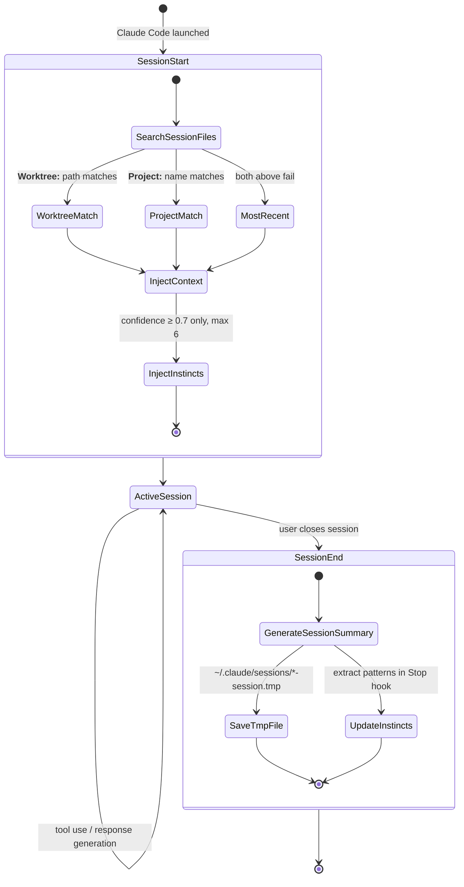

# Harness Analysis: `everything-claude-code`

## 0. Metadata

- **Name**: everything-claude-code (ecc)
- **Type**: in-harness skill system (operates as a plugin inside Claude Code)
- **Repository**: local path `/Users/WonjinSin/Documents/project/everything-claude-code`
- **Analysis commit/version**: v1.10.0 (7eb7c59)
- **Analysis date**: 2026-04-15
- **Primary language/runtime**: Markdown (agent/skill/command) + Node.js ≥18 (hook scripts)
- **Primary LLM provider**: Claude (Anthropic) — Opus 4.6 preferred, Sonnet 4.6 fallback

## TL;DR — One-paragraph summary

everything-claude-code (ECC) is an **in-harness plugin** that enhances Claude Code's behavior. It is not a runtime that executes code — it is a **collection of Markdown files and Node.js hook scripts** that Claude Code reads. Once installed, 143 skills, 50 agents, 78 slash commands, and ~30 hook scripts are placed under `~/.claude/`. When the user types `/tdd` or opens a new session, Claude Code reads the relevant Markdown files and injects them into the LLM's prompt context, while Node.js hooks intervene before and after tool execution to perform quality checks, auto-formatting, and session memory storage. The core design principle is: **"Don't change the LLM — change what the LLM reads."**

---

# Part 1: The Story

## 1-1. Main Flow — From session start to response

```
┌──────────────────────────────────────────────────────────────┐
│  User opens a Claude Code session                            │
│  (new terminal, IDE side panel, claude.ai/code)              │
└────────────────────┬─────────────────────────────────────────┘
                     │ SessionStart event
                     ▼
┌──────────────────────────────────────────────────────────────┐
│  Previous session context + learned instincts injected       │
│  (up to 6 instincts, *-session.tmp files within last 30 days)│
│  session-start.js · scripts/hooks/session-start.js:350       │
└────────────────────┬─────────────────────────────────────────┘
                     │ stdout → Claude Code's additionalContext
                     ▼
┌──────────────────────────────────────────────────────────────┐
│  User message received                                       │
│  (natural language request or /slash command)                │
└────────┬───────────────────────────┬─────────────────────────┘
         │ /command detected          │ regular message
         ▼                           ▼
┌─────────────────┐         ┌──────────────────────────────────┐
│  Load command   │         │  Respond with current project    │
│  commands/*.md  │         │  context (CLAUDE.md + active     │
│  commands/:1-3  │         │  skills applied)                 │
└────────┬────────┘         └──────────────────────────────────┘
         │ skill or agent delegation
         ▼
┌──────────────────────────────────────────────────────────────┐
│  Load skill or agent file → inject into LLM context          │
│  skills/<name>/SKILL.md  or  agents/<name>.md               │
│  e.g.: skills/tdd-workflow/SKILL.md, agents/planner.md       │
└────────────────────┬─────────────────────────────────────────┘
                     │ LLM forms a plan and begins tool calls
                     ▼
┌──────────────────────────────────────────────────────────────┐
│  PreToolUse hook intercept (immediately before tool runs)    │
│  · Bash: block-no-verify, commit-quality, auto-tmux-dev      │
│  · Write/Edit: gateguard-fact-force, doc-file-warning        │
│  hooks/hooks.json PreToolUse section                         │
└────────────────────┬─────────────────────────────────────────┘
                     │ exit 0 → allow / exit 2 → block
                     ▼
┌──────────────────────────────────────────────────────────────┐
│  Claude Code tool execution                                  │
│  (Bash, Read, Edit, Write, Grep, Glob, etc.)                 │
└────────────────────┬─────────────────────────────────────────┘
                     │ execution complete
                     ▼
┌──────────────────────────────────────────────────────────────┐
│  PostToolUse hook runs (immediately after tool runs)         │
│  · After Edit/Write: Prettier formatting, TypeScript check   │
│  · After Bash: PR URL detection, build result analysis       │
│  hooks/hooks.json PostToolUse section                        │
└────────────────────┬─────────────────────────────────────────┘
                     │ response complete
                     ▼
┌──────────────────────────────────────────────────────────────┐
│  Stop hook runs (when Claude finishes its response)          │
│  · Watch for leftover console.log/debugger statements        │
│  · Extract patterns and generate instinct candidates         │
└────────────────────┬─────────────────────────────────────────┘
                     │ on session end
                     ▼
┌──────────────────────────────────────────────────────────────┐
│  SessionEnd hook — saves session summary to *-session.tmp    │
│  session-start.js loads this file at the next session start  │
│  scripts/hooks/session-end.js                                │
└──────────────────────────────────────────────────────────────┘
```

### Narration

This diagram shows the **entire main path** from when a user opens a session in an ECC-installed Claude Code environment to when they receive a response. On the surface it looks like an ordinary Claude Code session, but ECC intervenes silently at three points: context injection at session start, hook guardrails before and after tool execution, and memory storage at session end.

The first thing that happens when the user opens a session is that `session-start.js` (`scripts/hooks/session-start.js:350`) runs. This script scans `*-session.tmp` files under `~/.claude/sessions/` to find the **previous session summary that best matches the current project**. The matching priority is: "exact worktree path match → project name match → most recent." The matched summary is written to stdout as `hookSpecificOutput.additionalContext`, and Claude Code injects it as the initial context. This means the user doesn't have to explain "where we left off last time."

When the user enters a slash command like `/tdd`, Claude Code loads `commands/tdd.md`. The body of this file simply says "Apply the `tdd-workflow` skill" (`commands/tdd.md:20`). Claude Code then loads `skills/tdd-workflow/SKILL.md` and injects it into the LLM's system context. The LLM now "knows" the TDD workflow — not because code ran, but because it was **read**.

Once the LLM forms its plan and starts calling tools, the PreToolUse hooks defined in `hooks.json` intercept. For Bash commands, `block-no-verify.js` checks first — if the `--no-verify` flag is present it returns exit code 2 to block. For git commits, `pre-bash-commit-quality.js` lints staged files and checks for `console.log`/secret patterns. After file edits, PostToolUse runs Prettier and the TypeScript type checker.

---

## 1-2. Alternate Paths

### (a) Slash commands — skill delegation vs agent delegation

Commands delegate behavior in two ways. Which path is taken determines how Claude's context is assembled.

```
User: /tdd                       User: /plan
       │                                │
       ▼                                ▼
commands/tdd.md                  commands/plan.md
"Apply tdd-workflow skill"       "invokes planner agent"
       │                                │
       ▼                                ▼
skills/tdd-workflow/SKILL.md     agents/planner.md
(workflow instructions injected) (name, description, tools, model loaded)
                                        │
                                        ▼
                                  model: claude-opus-4-6
                                  tools: [Read, Grep, Glob]
                                  (spawned as subagent)
```

**Skill delegation** (e.g. `/tdd` → `tdd-workflow`) adds the skill file to the current Claude session's context. The model does not change, nor does the tool set. The LLM simply has more instruction documents to read.

**Agent delegation** (e.g. `/plan` → `planner`) reads the `model` and `tools` from the frontmatter and spawns a separate subagent. `planner.md` specifies `model: opus`, so the planner always runs on Opus. It operates in a restricted environment with only the tools specified in the agent file.

### Narration

The difference between the two paths lies in the **LLM instance boundary**. A skill teaches the current session's LLM "do it this way," while an agent says "hand this task off to a specialist LLM." Even the same `/tdd` command — `commands/tdd.md` is skill delegation, but it lists `tdd-guide.md` under "Related Agents" (`commands/tdd.md:225`), so in certain situations it can escalate to an agent as well.

### (b) Hook activation path — plugin root resolution + profile gating

Every hook command starts with the same inline script. This script discovers at runtime where ECC is installed.

```
Hook command defined in hooks.json
[node, "-e", "<inline resolver>", "node",
 "scripts/hooks/run-with-flags.js",
 "pre:bash:block-no-verify",
 "scripts/hooks/block-no-verify.js",
 "minimal,standard,strict"]
         │
         ▼
┌─────────────────────────────────────────────────────────┐
│  If CLAUDE_PLUGIN_ROOT env var is set → use it directly  │
│  Otherwise → search 7 possible install paths in order   │
│  · ~/.claude/                                           │
│  · ~/.claude/plugins/ecc/                               │
│  · ~/.claude/plugins/everything-claude-code/            │
│  · ~/.claude/plugins/cache/<org>/<version>/             │
│  (confirmed by checking if scripts/lib/utils.js exists)  │
│  hooks/hooks.json:13 (inline resolver)                  │
└────────────────────┬────────────────────────────────────┘
                     │ plugin root determined
                     ▼
┌─────────────────────────────────────────────────────────┐
│  run-with-flags.js — hook profile gating check          │
│  ECC_HOOK_PROFILE: minimal / standard / strict           │
│  ECC_DISABLED_HOOKS: "hook-id1,hook-id2" individual off │
│  If current profile is not in allowed list → quietly    │
│  exit 0 (pass through without blocking)                 │
│  scripts/hooks/run-with-flags.js:14                     │
└────────────────────┬────────────────────────────────────┘
                     │ profile passed
                     ▼
┌─────────────────────────────────────────────────────────┐
│  Actual hook script executes                            │
│  (block-no-verify.js, commit-quality.js, etc.)          │
│  exit 0 → allow, exit 2 → block tool execution          │
└─────────────────────────────────────────────────────────┘
```

### Narration

There are at least 7 paths where ECC can be installed (`~/.claude/` directly, various names under plugins, versioned directories inside cache). So the first argument of every hook command is a mini-script that discovers this path at runtime (`hooks/hooks.json:13`). This design lets ECC work regardless of where it is installed — but it results in dozens of lines of inline code repeated in every hook command.

`run-with-flags.js` is the common gatekeeper for all hooks (`scripts/hooks/run-with-flags.js:14`). It compares the `ECC_HOOK_PROFILE` environment variable against the hook's allowed profile list; if the current profile is not in the allowed list, it exits silently with exit 0 without running the hook. Individual hooks can also be disabled via `ECC_DISABLED_HOOKS`. "Pass through rather than block" is the default — all error paths end with exit 0 so that hook failures never prevent Claude Code's tool execution.

---

## 1-3. Session memory system — Instinct injection and session continuity

One of ECC's most distinctive features is its **cross-session memory system**. At session end a summary is saved, and at the next session start it is loaded and injected as context. On top of this, "instincts" — learned behavioral patterns — are additionally injected.



### Narration

This state diagram shows ECC's **session continuity system**. Ordinary AI tools lose all context when a session ends. ECC partially solves this problem with the SessionEnd hook (`scripts/hooks/session-end.js`), which saves a session summary as a `*-session.tmp` file.

What is interesting is the **session matching strategy** (`session-start.js:155`). It does not simply retrieve the most recent session. It compares the `**Worktree:**` field inside session files against the current working directory to prioritize **sessions from the exact same project**. For users who work across multiple projects, this means context is properly restored per project.

The **instinct system** goes one step further. The Stop hook analyzes session patterns and saves them with a confidence score under `~/.claude/homunculus/instincts/`. At the next session start, only instincts with `confidence ≥ 0.7` are injected, up to a maximum of 6 (`session-start.js:31-32`). Project-scoped instincts take priority over global ones, and instincts with the same id are deduplicated. It is a structure where "things learned in the previous session" quietly calibrate behavior.

---

## 1-4. Installation flow — Manifest-based module deployment

ECC is not a single binary. **Installation means copying files to the correct locations.**

```
install.sh (entry point)
│
├── npm install --no-audit --no-fund  (install dependencies)
│
└── node scripts/install-apply.js [target] [profile]
              │
              ▼
    ┌─────────────────────────────────────────────────────┐
    │  Determine install target                           │
    │  target: claude | cursor | antigravity | codex |   │
    │          codebuddy | gemini | opencode              │
    │  profile: core | developer | security |             │
    │           research | full                           │
    └────────────────────┬────────────────────────────────┘
                         │
                         ▼
    ┌─────────────────────────────────────────────────────┐
    │  Load manifests/install-profiles.json               │
    │  profile → module list (e.g. full = 20 modules)     │
    │  Load manifests/install-modules.json                │
    │  module → list of files/directories to copy         │
    └────────────────────┬────────────────────────────────┘
                         │
              ┌──────────┼──────────┐
              ▼          ▼          ▼
    rules/         agents/      commands/
    → ~/.claude/   → target-     → target-
       rules/         specific      specific
                       location      location
              │          │          │
              └──────────┼──────────┘
                         ▼
    ┌─────────────────────────────────────────────────────┐
    │  hooks/hooks.json → merged into ~/.claude/settings.json│
    │  scripts/ → ~/.claude/scripts/ (Node.js runtime)   │
    │  mcp-configs/ → MCP catalog registered             │
    └────────────────────┬────────────────────────────────┘
                         │
                         ▼
    ┌─────────────────────────────────────────────────────┐
    │  Save install state to ecc-install.json             │
    │  (records which profile/modules were installed)     │
    └─────────────────────────────────────────────────────┘
```

### Narration

ECC's installation has `install.sh` installing Node.js dependencies and delegating the actual work to `scripts/install-apply.js`. "Installing into Claude Code" ultimately means placing Markdown files in the correct locations under `~/.claude/`, while "installing into Cursor" means placing them in Cursor's rules directory. "Where to place them" is described per target in `manifests/install-modules.json`.

Of the 5 install profiles, `full` installs all 20 modules, while `core` installs only the minimal base of rules, agents, commands, and hooks. Profiles are defined in `manifests/install-profiles.json`, which declaratively lists which modules each profile includes. This manifest-based approach allows selective installation of language-specific (typescript, go, python, kotlin…) and framework-specific (Django, Spring, Laravel…) components.

An interesting point is that `hooks/hooks.json` is **merged** into `~/.claude/settings.json` at install time. The tradeoff is that these hook settings may remain in settings.json even after ECC is removed. Hook scripts (`scripts/`) are placed as Node.js runtime files under `~/.claude/`, and the inline resolver in each hook command searches for this path at runtime.

---

# Part 2: Reference Details

## 2-1. Entry Points

Two Claude Code entry points activate ECC: the **SessionStart event** (session opens) and **slash commands** (`/tdd`, `/plan`, etc.). For natural language messages, ECC rules apply without a separate entry point since CLAUDE.md and active rules are always in context. No authentication — local-only, so the trust model is "the user on the same machine."

## 2-2. Concurrency

Not applicable — ECC itself does not manage concurrency. It relies on Claude Code's tool execution serialization. Hook scripts run synchronously via `spawnSync`, and blocking hooks (`PreToolUse`) are designed to complete within 200ms (stated in `hooks/README.md`).

## 2-3. Routing

Only deterministic routing exists — slash command names map directly to file names. `commands/tdd.md` routes to `skills/tdd-workflow/SKILL.md`, and `commands/plan.md` routes to `agents/planner.md`. No AI routing. Skill vs agent delegation is described **statically** in the command file body.

## 2-4. Context Assembly

Skill/agent/command files are **each independently injected into the Claude Code context**. Context composition when a command runs: ① CLAUDE.md (always), ② applicable rules/*.md (always), ③ SessionStart additionalContext (previous session summary + instincts), ④ command file content, ⑤ delegated skill or agent file content. `$ARGUMENTS` variable substitution is used in command files (`commands/tdd.md:17`).

## 2-5. Provider Abstraction

Not applicable — ECC does not call the LLM directly. It declares `model: claude-opus-4-6` in `agent.yaml` and Claude Code interprets and calls it. Only per-agent model overrides are possible (`agents/planner.md`: opus, `agents/tdd-guide.md`: sonnet).

## 2-6. Worker / Execution

The execution unit is a hook script (Node.js process). Each hook runs as an independent process via `spawnSync`. No abort signal — exit 2 blocks the tool, exit 0 passes through. Timeouts: async hooks ≤30 seconds, blocking PreToolUse hooks recommended <200ms.

## 2-7. Message Loop

Not applicable — ECC does not have direct access to the LLM stream. It only intervenes on Claude Code's tool events (`PreToolUse`, `PostToolUse`).

## 2-8. Session / State

Session state follows a **file-based immutable model** — session summaries are saved as `*-session.tmp` files (`~/.claude/sessions/`). Transition triggers: SessionStart (session opens), SessionEnd (session closes), Stop (response complete). Expiry policy: default 30 days, configurable via the `ECC_SESSION_RETENTION_DAYS` environment variable (`session-start.js:82-87`).

## 2-9. Isolation

Not applicable — ECC does not manage isolated environments. No worktree, no Docker. However, the `superpowers:using-git-worktrees` skill provides a guide to using git worktrees — this is **instruction**, not execution.

## 2-10. Tool / Capability

Tools intercepted by hooks: `Bash`, `Write`, `Edit`, `Read`. Built-in tools: none (uses Claude Code tools). Extension points: hook system, 25 MCP servers (`mcp-configs/mcp-servers.json`). Per-agent tools override possible (`tools:` field in agents/*.md frontmatter).

## 2-11. Workflow Engine

None — only sequential execution instructions exist. The RED→GREEN→REFACTOR in `commands/tdd.md` is **instruction text passed to the LLM**, not a state machine or DAG. Actual step execution is determined by the LLM.

## 2-12. Configuration

Configuration hierarchy (lower number = higher priority):
1. Environment variables (`ECC_HOOK_PROFILE`, `ECC_DISABLED_HOOKS`, `ECC_SESSION_RETENTION_DAYS`, `CLAUDE_PLUGIN_ROOT`)
2. `~/.claude/settings.json` (hook config merged in)
3. Project `CLAUDE.md` + `.claude/rules/`
4. ECC defaults

Runtime reload: environment variables reload per session, file changes require session restart.

## 2-13. Error Handling

All hook scripts exit 0 in `catch` blocks — the principle of never blocking Claude Code tool execution (`session-start.js:489-492`). Only intentional blocking uses exit 2 (`block-no-verify.js`). Logs output to stderr in the format `[HookName] Warning:`.

## 2-14. Observability

The `log()` function (`scripts/lib/utils.js`) outputs to stderr with a `[HookName]` prefix. No separate structured logging. No external integrations (OpenTelemetry, etc.). Session summary files are effectively the only persistent observability data.

## 2-15. Platform Adapters

7 install targets: claude, cursor, antigravity, codex, codebuddy, gemini, opencode. File copy destinations differ per target (`manifests/install-modules.json`). Claude Code supports hooks + MCP fully, Cursor is rules-centric, others have varying levels of support.

## 2-16. Persistence

No DB — filesystem only. Primary storage paths:
- `~/.claude/sessions/*.tmp` — session summaries
- `~/.claude/homunculus/instincts/` — learned instincts
- `~/.claude/skills/` — user-created skills
- `ecc-install.json` — install state

Sensitive data: none (local files only, no secrets).

## 2-17. Security Model

Trust model: fully trusts the current user on the local machine. No authentication. `block-no-verify.js` prevents git hook bypass by blocking `--no-verify` — an intentional security guardrail. `pre-bash-commit-quality.js` detects password/API key patterns in staged files.

## 2-18. Key Design Decisions & Tradeoffs

ECC's core choice is "document injection rather than code execution." This single decision creates all the tradeoffs.

| Decision | Choice | Alternative | Rationale | Tradeoff |
|----------|--------|-------------|-----------|----------|
| Skill implementation | Markdown document injection | Code execution | The LLM can already execute code — just give it instructions | The LLM may ignore or misinterpret instructions |
| Hook script language | Node.js (CommonJS) | Python, Bash | Cross-platform + same runtime as Claude Code | Creates a dependency (npm install required) |
| Hook failure behavior | exit 0 (pass through) | exit 2 (block) | Hook bugs should not interfere with Claude Code usage | Hook failures may be silent and invisible to the user |
| Plugin root resolution | Inline resolver script | Forced env var | Auto-detects various install paths | Dozens of lines of inline code repeated in every hook command |
| Session memory | File-based | DB / external memory | Works locally with no dependencies | File scanning cost, expiry policy needed |
| Install profiles | 5 profiles + 20 modules | Single install | Selective install by language/framework | Increased management complexity |

## 2-19. Open Questions

- The actual format of session summaries generated by `session-end.js` and what information they contain — can be confirmed by reading all of `scripts/hooks/session-end.js`
- The instinct extraction logic in the Stop hook — need to identify which file under `scripts/hooks/` handles the Stop event
- How users activate `contexts/dev.md`, `contexts/review.md`, `contexts/research.md` — whether there are separate commands, search `commands/`
- What `spec_version: "0.1.0"` in `agent.yaml` means — whether it is ECC's own format or a Claude Code standard

---

## Appendix: Quick Reference Table

| Item | Value |
|------|-------|
| Type | in-harness skill system |
| Entry points | SessionStart hook, /slash commands, CLAUDE.md rules |
| Concurrency | None (delegated to Claude Code) |
| Router style | Deterministic (command filename → skill/agent 1:1 mapping) |
| Provider abstraction | None (agent.yaml model declaration only) |
| Session model | File-based immutable (*.tmp summaries + instincts files) |
| Isolation | None |
| Workflow engine | None (instruction text only) |
| Primary language | Markdown + Node.js (CommonJS) |
| Skills | 143 |
| Commands | 78 |
| Agents | 50 |
| Hooks | ~30 scripts, hooks.json 652 lines |
| Install profiles | 5 (core / developer / security / research / full) |
| Install modules | 20+ |
| Install targets | claude, cursor, antigravity, codex, codebuddy, gemini, opencode |
| MCP servers | 25 (mcp-configs/mcp-servers.json) |
