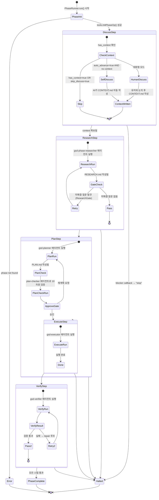

# Harness Analysis: `get-shit-done (GSD)`

## 0. Metadata

- **이름**: get-shit-done (GSD)
- **종류**: in-harness skill system (Claude Code 내부에서 동작하는 워크플로우 오케스트레이터)
- **저장소**: `/Users/WonjinSin/Documents/project/get-shit-done`
- **분석 커밋/버전**: c051e71 (main)
- **분석 일시**: 2026-04-15
- **주 언어/런타임**: TypeScript (Node.js 20+)
- **주 LLM 공급자**: Anthropic Claude (via `@anthropic-ai/claude-agent-sdk`)

## TL;DR — 한 문단 요약

GSD는 Claude Code 내부에서 작동하는 **스펙 주도 개발 워크플로우 오케스트레이터**다. 자연어 목표를 받아 Discuss → Research → Plan → Execute → Verify 다섯 단계의 Phase로 자동 분해하고, 각 Phase마다 전용 LLM 에이전트 세션을 독립적으로 실행한다. Claude Code의 슬래시 커맨드(`/gsd:*`)로 대화형으로 호출하거나, `gsd-sdk` CLI로 완전 자동화 파이프라인으로 돌릴 수 있다. 핵심 설계 선택은 **상태를 파일시스템(`.planning/`)에 저장**하고 LLM이 이 파일을 직접 읽고 쓰게 함으로써, 세션이 끊겨도 언제든 재개가 가능하다는 점이다.

---

# Part 1: The Story

## 1-1. Main Flow — SDK CLI 경로 (필수)

```
┌─────────────────────────────────────────────────────────────────────────┐
│  CLI 진입점 — `gsd-sdk run "<목표>"` 실행                                │
│  main()  ·  sdk/src/cli.ts:196,511                                      │
└──────────────────────────────┬──────────────────────────────────────────┘
                               │ parseCliArgs()
                               ▼
┌─────────────────────────────────────────────────────────────────────────┐
│  마일스톤 오케스트레이터 — 로드맵에서 미완료 Phase 목록 조회              │
│  tools.roadmapAnalyze() 로 불완료 Phase 식별 → 순서대로 실행 스케줄링    │
│  GSD.run()  ·  sdk/src/index.ts:168                                     │
└──────────────────────────────┬──────────────────────────────────────────┘
                               │ for each incomplete phase
                               ▼
┌─────────────────────────────────────────────────────────────────────────┐
│  Phase 라이프사이클 진입 — 단일 Phase의 6개 스텝 순차 실행              │
│  PhaseRunner.run()  ·  sdk/src/phase-runner.ts:90                       │
└──────────┬──────────────┬──────────┬──────────┬──────────┬─────────────┘
           │              │          │          │          │
       [Discuss]    [Research]    [Plan]    [Execute]  [Verify]
           │              │          │          │          │
           └──────────────┴──────────┴──────────┴──────────┘
                               │ 각 스텝마다 runStep() 호출
                               ▼
┌─────────────────────────────────────────────────────────────────────────┐
│  컨텍스트 조립 — Phase 타입별로 .planning/ 파일 선택 & 읽기             │
│  (Execute=2개, Research=4개, Plan=5개, Verify=4개)                      │
│  ContextEngine.resolveContextFiles()  ·  sdk/src/context-engine.ts:100  │
└──────────────────────────────┬──────────────────────────────────────────┘
                               │ contextFiles
                               ▼
┌─────────────────────────────────────────────────────────────────────────┐
│  프롬프트 조립 — 에이전트 롤 + 워크플로우 지시 + 프로젝트 컨텍스트 파일  │
│  (안정적 프리픽스 / 가변 서픽스 구조로 캐싱 최적화)                      │
│  PromptFactory.buildPrompt()  ·  sdk/src/phase-prompt.ts:95             │
└──────────────────────────────┬──────────────────────────────────────────┘
                               │ systemPrompt + prompt
                               ▼
┌─────────────────────────────────────────────────────────────────────────┐
│  LLM 세션 실행 — Anthropic Agent SDK query() 호출                       │
│  settingSources: ['project'], allowedTools: phase별 제한                │
│  query()  ·  sdk/src/session-runner.ts:279                              │
└──────────────────────────────┬──────────────────────────────────────────┘
                               │ AsyncIterable<SDKMessage>
                               ▼
┌─────────────────────────────────────────────────────────────────────────┐
│  메시지 스트림 처리 — 각 청크를 GSDEvent로 매핑하여 이벤트 버스에 발행   │
│  for await → mapAndEmit() → emitEvent()                                 │
│  processQueryStream()  ·  sdk/src/session-runner.ts:167                 │
└──────────────────────────────┬──────────────────────────────────────────┘
                               │ GSDEvent
                               ▼
┌─────────────────────────────────────────────────────────────────────────┐
│  출력 렌더링 — CLI Transport가 이벤트를 받아 stdout으로 포맷 출력        │
│  CLITransport.onEvent()  ·  sdk/src/cli-transport.ts:56                 │
└─────────────────────────────────────────────────────────────────────────┘
```

### Narration

이 다이어그램은 `gsd-sdk run "<목표>"` 명령 한 줄이 최종 출력으로 이어지는 전체 경로다. 아키텍처적으로 흥미로운 점은 **여섯 계층이 명확하게 분리**되어 있다는 것이다 — CLI 파싱, 마일스톤 오케스트레이션, Phase 라이프사이클, 컨텍스트 조립, LLM 호출, 그리고 이벤트 렌더링. 각 계층은 독립적으로 교체할 수 있고, 실제로 `CLITransport`를 `WebSocketTransport`로 바꾸는 것만으로 동일한 파이프라인이 웹 UI에 연결된다.

흐름은 `main()`(`cli.ts:511`)에서 시작해 `gsd.run()`(`index.ts:168`)으로 넘어간다. 여기서 `tools.roadmapAnalyze()`를 호출해 `.planning/ROADMAP.md`에서 완료되지 않은 Phase 목록을 조회한다. 이 단계가 재개(resume) 로직의 전부다 — 중간에 프로세스가 죽어도, 다음에 `gsd-sdk run`을 실행하면 ROADMAP.md의 상태를 읽어 남은 Phase부터 이어 달린다.

각 Phase는 `PhaseRunner.run()`(`phase-runner.ts:90`)에서 독립적으로 처리된다. 내부에서 `runStep()`을 Discuss, Research, Plan, Execute, Verify 순으로 호출하는데, 각 스텝은 **자체 LLM 세션**을 가진다. 공유 대화 히스토리는 없다 — 스텝 간 정보 전달은 `.planning/` 파일시스템을 통해 이루어진다. Discuss 단계가 작성한 `CONTEXT.md`를 Research 에이전트가 읽고, Research가 작성한 `RESEARCH.md`를 Planner가 읽는 방식이다.

LLM 호출 직전에 `ContextEngine.resolveContextFiles()`가 Phase 타입에 따라 읽어야 할 파일 목록을 결정하고(`context-engine.ts:42`), `PromptFactory.buildPrompt()`가 에이전트 롤 + 워크플로우 지시 + 실제 파일 내용을 조합해 최종 프롬프트를 완성한다. 이 프롬프트가 `query()`(`session-runner.ts:279`)에 전달되어 Anthropic Agent SDK를 통해 LLM을 호출한다.

---

## 1-2. Main Flow — 슬래시 커맨드 경로 (Claude Code 대화 인터페이스)

```
┌─────────────────────────────────────────────────────────────────────────┐
│  유저가 Claude Code에 슬래시 커맨드 입력                                 │
│  예: /gsd:do "사용자 인증 기능 만들어줘"                                 │
│  Claude Code 내부 커맨드 라우터 (GSD 외부)                              │
└──────────────────────────────┬──────────────────────────────────────────┘
                               │ 커맨드 파일 로드
                               ▼
┌─────────────────────────────────────────────────────────────────────────┐
│  커맨드 마크다운 파일 로드 — YAML 프론트매터로 정의된 커맨드             │
│  allowed-tools, description, argument-hint 등 명시                      │
│  commands/gsd/do.md  (75개 커맨드 중 하나)                              │
└──────────────────────────────┬──────────────────────────────────────────┘
                               │ @workflow 참조 해석
                               ▼
┌─────────────────────────────────────────────────────────────────────────┐
│  워크플로우 로드 — 상세 실행 지시사항 포함 마크다운                      │
│  (커맨드 파일의 <execution_context>가 @경로로 워크플로우 참조)           │
│  get-shit-done/workflows/do.md                                           │
└──────────────────────────────┬──────────────────────────────────────────┘
                               │ 워크플로우 지시 + 에이전트 컨텍스트
                               ▼
┌─────────────────────────────────────────────────────────────────────────┐
│  Claude Code가 워크플로우 지시에 따라 실행                               │
│  - /gsd:do: 적절한 하위 커맨드로 자동 라우팅 (AI 결정)                  │
│  - /gsd:plan-phase: 상세 계획 수립                                       │
│  - /gsd:execute-phase: 계획 실행                                         │
│  Claude Code 자체 Tool 실행 엔진 (GSD 외부)                             │
└──────────────────────────────┬──────────────────────────────────────────┘
                               │ gsd-sdk query 명령으로 상태 읽기/쓰기
                               ▼
┌─────────────────────────────────────────────────────────────────────────┐
│  네이티브 쿼리 엔진 — .planning/ 상태 파일 읽기/변경                    │
│  50+ 핸들러: state.load, phase.add, frontmatter.set ...                 │
│  QueryRegistry.dispatch()  ·  sdk/src/query/registry.ts:118             │
└─────────────────────────────────────────────────────────────────────────┘
```

### Narration

슬래시 커맨드 경로는 SDK CLI 경로와 완전히 다른 실행 모델이다. 여기서 오케스트레이터는 GSD SDK가 아니라 **Claude Code 자체**다. 유저가 `/gsd:do "인증 기능 만들어줘"`를 입력하면, Claude Code가 `commands/gsd/do.md`를 읽고, 거기서 `@get-shit-done/workflows/do.md`를 불러와 그 워크플로우 지시에 따라 행동한다.

핵심적인 설계는 커맨드 파일이 **실행 로직을 담지 않는다**는 점이다. 커맨드 파일은 메타데이터(어떤 도구를 허용하는지, 인자 힌트는 무엇인지)와 워크플로우 파일에 대한 포인터만 담는다. 실제 "이 커맨드가 무엇을 하는가"는 `get-shit-done/workflows/` 디렉토리의 마크다운에 자연어로 서술되어 있고, Claude Code가 그것을 읽고 판단해서 실행한다. 이 간접성이 GSD의 가장 독특한 구조다 — 코드가 아니라 문서가 로직이다.

가장 특이한 커맨드는 `/gsd:do`다. 이 커맨드는 "이 자연어 요청이 어떤 GSD 커맨드에 해당하는지 AI가 판단해서 라우팅하라"는 메타-라우터다. 유저가 워크플로우 명칭을 몰라도 자연어로 원하는 것을 말하면, Claude가 75개의 커맨드 중 적절한 것으로 디스패치한다. Claude Code 훅 시스템(`hooks/gsd-workflow-guard.js`)은 이 과정에서 사이드 이펙트를 제어한다 — `.planning/` 외부 파일 편집은 경고를 내거나 차단한다.

---

## 1-3. Phase 라이프사이클 상태 전이



### Narration

이 상태 다이어그램은 GSD의 심장부다 — 단일 Phase가 어떻게 탄생하고 어떻게 끝나는지를 보여준다. `PhaseRunner.run()`(`phase-runner.ts:90`)이 시작되면 가장 먼저 `tools.initPhaseOp(phaseNumber)`로 `.planning/` 파일시스템에서 현재 Phase의 상태를 조회한다. 이 조회 결과가 뒤이어 오는 모든 분기의 입력이 된다.

Discuss 스텝에서 특이한 분기가 있다. `auto_advance=true`이고 `has_context=false`인 경우, 즉 **완전 자동화 모드에서 사람 입력 없이 Phase를 시작하는 경우**, 시스템이 직접 `runSelfDiscussStep()`을 호출해 AI가 스스로 컨텍스트를 작성한다(`phase-runner.ts:144`). 이것이 GSD의 "auto 모드" — `gsd-sdk auto` 명령을 쓰면 사람 개입 없이 전체 마일스톤이 돌아간다.

Research 스텝 이후에는 **ResearchGate** 검증이 있다(`sdk/src/research-gate.ts`). `RESEARCH.md`에 미해결 질문이 남아 있으면 리서치 에이전트를 다시 실행한다. 이 retry 루프가 없으면 불완전한 리서치 위에 계획이 세워져 집행 단계에서 실패할 가능성이 높다.

Plan 스텝은 두 번의 LLM 세션을 소비한다. 먼저 `gsd-planner` 에이전트가 `PLAN.md`를 작성하고, 그 다음 `gsd-plan-checker` 에이전트가 10개 차원으로 해당 계획을 검증한다. 검증 실패 시 재계획이 요청된다. 이 설계는 "좋은 계획이 좋은 실행을 만든다"는 전제에서 나온 것이며, Execute에서의 방황을 미리 차단하는 트레이드오프다.

---

## 1-4. 컨텍스트 조립 시퀀스 — Phase별 파일 매니페스트

```
┌─────────────────────────────────────────────────────────────────────────┐
│  Phase 타입에 따른 파일 매니페스트 선택                                  │
│  PHASE_FILE_MANIFEST  ·  sdk/src/context-engine.ts:42                   │
└─────────────────────────────────────────────────────────────────────────┘
                │
    ┌───────────┼───────────────────┬───────────────────┐
    ▼           ▼                   ▼                   ▼
[Discuss]  [Research]            [Plan]              [Execute]
STATE.md   STATE.md              STATE.md            STATE.md
ROADMAP.md ROADMAP.md            ROADMAP.md          config.json
CONTEXT.md CONTEXT.md            CONTEXT.md
           REQUIREMENTS.md       RESEARCH.md
                                 REQUIREMENTS.md

                    [Verify]
                    STATE.md
                    ROADMAP.md
                    REQUIREMENTS.md
                    PLAN.md
                    SUMMARY.md

각 파일마다:
  ① 파일 존재 확인 (required이면 경고)
  ② ROADMAP.md → 현재 마일스톤으로 축소 (extractCurrentMilestone)
  ③ 큰 파일 → 헤딩+첫문단만 보존하여 잘라내기 (truncateMarkdown)

결과: ContextFiles { state, roadmap, context, research, plan, ... }
                                    │
                                    ▼
            PromptFactory.buildPrompt()  ·  phase-prompt.ts:95
            ┌──────────────────────────────────────────────────────┐
            │  [캐시 가능 프리픽스]                                  │
            │  ① 에이전트 롤 정의 (고정)                            │
            │  ② 워크플로우 목적 (고정)                             │
            │  ③ Phase 특화 지시 (Phase 타입별 고정)               │
            ├──────────────────────────────────────────────────────┤
            │  [가변 서픽스]                                        │
            │  ④ 실제 .planning/ 파일 내용 (프로젝트마다 다름)      │
            └──────────────────────────────────────────────────────┘
```

### Narration

이 다이어그램은 GSD의 컨텍스트 경제학이 어떻게 돌아가는지를 보여준다. 핵심 아이디어는 **Phase 타입에 따라 LLM에 보여주는 파일이 다르다**는 것이다. Execute 단계는 `STATE.md`와 `config.json` 두 개만 본다 — 이미 계획이 완성된 상태이므로 긴 ROADMAP이나 CONTEXT는 노이즈다. 반대로 Plan 단계는 5개 파일 모두를 본다. 이 선택적 컨텍스트 제공이 토큰 낭비를 줄이고 프롬프트 캐시 히트율을 높인다.

`ContextEngine.resolveContextFiles()`(`context-engine.ts:100`)는 매니페스트를 순회하며 실제 파일을 읽는다. 이 과정에서 두 가지 축소가 일어난다. 첫째, `ROADMAP.md`는 `extractCurrentMilestone()`으로 현재 진행 중인 마일스톤 블록만 잘라낸다 — 완료된 과거 마일스톤을 LLM에 보여줄 필요가 없기 때문이다. 둘째, 용량이 큰 파일은 `truncateMarkdown()`으로 헤딩과 첫 문단만 남기고 잘라낸다(`context-truncation.ts`).

조립된 파일들은 `PromptFactory.buildPrompt()`(`phase-prompt.ts:95`)에서 최종 프롬프트로 합성된다. 구조적으로 중요한 점은 **캐시 가능 프리픽스와 가변 서픽스를 분리**한다는 것이다. 에이전트 롤, 워크플로우 목적, Phase별 지시사항은 모든 프로젝트에서 동일하므로 Anthropic의 프롬프트 캐시에 남는다. 프로젝트별 파일 내용만 가변 서픽스에 들어간다. 대규모 자동화에서 캐시 히트가 발생하면 비용과 지연이 모두 줄어든다.

---

## 1-5. 훅 시스템 — Claude Code 이벤트 인터셉터

```
Claude Code 이벤트 발생
        │
        │ SessionStart
        ├────────────────► gsd-check-update.js   : 버전 업데이트 확인 (비동기)
        │                  gsd-session-state.sh  : 세션 상태 파일 기록
        │
        │ PreToolUse (Write/Edit 도구 호출 전)
        ├────────────────► gsd-workflow-guard.js
        │                  ┌──────────────────────────────────────────┐
        │                  │  서브에이전트/Task 세션이면?              │
        │                  │  → 통과 (exit 0) ─────────────────────► │
        │                  │                                          │
        │                  │  편집 대상이 .planning/ 안이면?          │
        │                  │  → 통과 ─────────────────────────────► │
        │                  │                                          │
        │                  │  .planning/ 외부 편집이면?               │
        │                  │  → 경고 메시지 출력 후 통과              │
        │                  └──────────────────────────────────────────┘
        │
        │ PreToolUse (Read 도구)
        ├────────────────► gsd-read-guard.js     : 읽기 권한 검증
        │
        │ PreToolUse (Bash 도구)
        ├────────────────► gsd-prompt-guard.js   : 프롬프트 인젝션 방어
        │
        │ PreGitCommit
        ├────────────────► gsd-validate-commit.sh : 커밋 메시지 형식 검증
        │
        │ StatusLine
        └────────────────► gsd-statusline.js     : 상태바에 현재 Phase 표시
```

### Narration

GSD의 훅 시스템은 Claude Code 이벤트 파이프라인에 끼어들어 **워크플로우 외부 동작을 제어하는 가드레일 계층**이다. 훅 파일들은 `hooks/` 디렉토리에 있고, `bin/install.js`가 Claude Code의 `.claude/settings.json`에 이들을 등록한다.

가장 중심적인 훅은 `gsd-workflow-guard.js`다. 이 훅은 `PreToolUse` 이벤트 — 즉 Claude Code가 파일을 쓰거나 편집하기 직전 — 에 발동한다. 핵심 로직은 단순하다: **편집 대상이 `.planning/` 안에 있으면 통과, 밖에 있으면 경고**. GSD는 "LLM은 `.planning/` 디렉토리를 통해서만 상태를 기록해야 한다"는 원칙을 갖고 있고, 이 훅이 그 원칙의 집행자다. 단, 차단이 아니라 경고 수준으로 — 유저가 의도적으로 외부 파일을 편집하는 것은 허용한다.

서브에이전트나 Task 세션에서는 이 검사를 건너뛴다(`gsd-workflow-guard.js:35`). `gsd-executor`가 Sub-agent를 생성해 코드를 작성할 때 `.planning/` 외부 파일을 수정하는 건 정당한 행위이기 때문이다. 훅이 여기서도 막으면 실제 코드를 쓸 수 없다 — 이 예외 처리가 없으면 시스템 전체가 작동하지 않는다.

---

# Part 2: Reference Details

## 2-1. Entry Points

두 가지 독립적인 진입점이 있다. **SDK CLI**: `gsd-sdk run "<prompt>"` → `cli.ts:511 main()`. **슬래시 커맨드**: Claude Code 내에서 `/gsd:do`, `/gsd:plan-phase` 등 75개 커맨드. 두 경로는 다른 오케스트레이터를 쓴다 — SDK CLI는 `GSD.run()`이, 슬래시 커맨드는 Claude Code 자체가 실행 엔진이다.

## 2-2. Concurrency

Phase별로 직렬 실행된다. `GSD.run()`의 마일스톤 루프(`index.ts:194`)는 Phase를 순차적으로 처리하며 병렬 실행은 없다. 멀티 워크스트림(`workstream-utils.ts`)은 지원되지만, 이는 프로젝트 내 독립적 기능 라인을 격리하는 논리적 분리이지 병렬 실행이 아니다.

## 2-3. Routing

슬래시 커맨드 레이어에서 두 수준의 라우팅이 있다. 첫째, Claude Code가 커맨드 이름(`/gsd:*`)으로 결정론적으로 파일을 찾는다. 둘째, `/gsd:do`는 자연어 입력을 75개 커맨드 중 하나로 AI가 결정한다(`commands/gsd/do.md`). SDK 경로에서는 라우팅 없음 — Phase 순서는 ROADMAP.md 순서가 결정한다.

## 2-4. Context Assembly

Phase 타입별 파일 매니페스트(`context-engine.ts:42`): Execute=2파일(STATE, config), Research=4파일, Plan=5파일, Verify=4파일. 조립 지점은 `PromptFactory.buildPrompt()`로 단일화. 캐시 최적화를 위해 안정적 프리픽스(에이전트 롤+워크플로우 지시)와 가변 서픽스(파일 내용) 분리(`phase-prompt.ts:95`). ROADMAP.md는 현재 마일스톤으로 축소, 큰 파일은 헤딩+첫문단만 보존(`context-truncation.ts`).

## 2-5. Provider Abstraction

`@anthropic-ai/claude-agent-sdk`의 `query()` 함수를 직접 호출(`session-runner.ts:279`). 별도 추상화 인터페이스 없음 — Anthropic SDK에 직접 의존한다. `systemPrompt.type='preset'`으로 `claude_code` 프리셋을 사용하고 Phase별 지시를 append한다.

## 2-6. Worker / Execution

실행 단위는 **Phase Step 세션** — 각 스텝(Discuss/Research/Plan/Execute/Verify)이 독립적 `query()` 세션이다. `maxTurns=50`, `maxBudgetUsd=5.0`이 기본값이며 옵션으로 오버라이드 가능(`phase-runner.ts:129`). permissionMode는 `bypassPermissions`로 설정되어 도구 호출에 사용자 승인이 필요 없다.

## 2-7. Message Loop

`query()` 반환값이 `AsyncIterable<SDKMessage>`이며 `for await` 루프로 처리(`session-runner.ts:175`). 각 메시지는 `mapAndEmit()`으로 `GSDEvent`로 변환되어 이벤트 버스에 발행된다. `isResultMessage()`로 최종 결과 메시지를 판별하여 `PlanResult`를 추출한다.

## 2-8. Session / State

세션은 불변 — 재개 시 새 `query()` 세션을 시작하고 `.planning/` 파일에서 상태를 읽어온다. Phase 간 대화 히스토리 공유 없음. 전환 트리거: `initPhaseOp()` 조회 결과(phase_found, has_context, has_research 등). 만료 정책 없음 — `.planning/` 파일이 존재하는 한 Phase는 유효하다.

## 2-9. Isolation

격리 없음 — `permissionMode: 'bypassPermissions'`로 실행되며 별도 worktree나 컨테이너를 사용하지 않는다. `settingSources: ['project']`로 프로젝트 레벨 권한 설정을 로드한다. 실질적 경계는 훅(`gsd-workflow-guard.js`)이 `.planning/` 외부 편집에 경고를 내는 소프트 가드레일이다.

## 2-10. Tool / Capability

Phase별 도구 스코핑(`tool-scoping.ts`): Research는 Read/Grep/Glob/WebSearch 허용, Execute는 Read/Write/Edit/Bash/Grep/Glob/mcp__context7 허용. 33개 에이전트 정의(`agents/*.md`)가 YAML 프론트매터로 각자 도구 목록을 선언한다. MCP 통합은 `mcp__context7__*` 도구로 context7 문서 조회에 사용.

## 2-11. Workflow Engine

워크플로우 엔진은 두 레이어다. **마크다운 기반**: 슬래시 커맨드가 `get-shit-done/workflows/*.md` 파일을 참조하고 Claude Code가 자연어 지시를 해석한다. **프로그래매틱**: `PhaseRunner`가 코드로 Discuss→Research→Plan→Execute→Verify 순서를 강제한다. 노드 타입은 PhaseStepType enum: Discuss, Research, Plan, PlanCheck, Execute, Verify, Repair. 조건 분기는 `has_context`, `skip_discuss`, `auto_advance` 플래그로 제어(`phase-runner.ts:139`).

## 2-12. Configuration

`config.json` 파일이 프로젝트별 설정 담당. `loadConfig(projectDir, workstream)`으로 로드(`index.ts:80`). 주요 플래그: `workflow.skip_discuss`, `workflow.auto_advance`, `workflow.skip_verify`. 환경변수는 `GSD_MODEL`, `GSD_MAX_BUDGET_USD` 등으로 CLI 기본값 오버라이드. 런타임 재로드 없음.

## 2-13. Error Handling

`GSDError`(`errors.ts`)가 기본 에러 타입이며 `ErrorClassification` enum(Validation, Network, Filesystem 등)으로 분류. `PhaseRunnerError`는 Phase/스텝 정보를 포함. `retryOnce()` 헬퍼(`phase-runner.ts`)로 Research/Plan 스텝은 1회 재시도. 복구 불가 에러는 `PhaseRunnerResult.halted=true`로 표시하고 중단.

## 2-14. Observability

`GSDEventStream`이 모든 이벤트의 허브. 이벤트 타입: MilestoneStart/Complete, PhaseStart/Complete, PhaseStepStart/Complete, PlanResult 등. Transport 패턴 — `CLITransport`(stdout), `WebSocketTransport`(ws-transport.ts) 중 선택. 외부 통합(OpenTelemetry 등) 없음. 로그는 `logger.ts`의 GSDLogger를 통해 stderr로.

## 2-15. Platform Adapters

슬래시 커맨드 경로는 Claude Code가 플랫폼 — CLI 인터랙션은 Claude Code가 전담한다. SDK 경로는 단독 CLI(`gsd-sdk`)로 직접 사용 가능. WebSocket Transport(`ws-transport.ts`)로 웹 UI 연결 지원. 외부 플랫폼 어댑터(Slack, GitHub 등)는 없다 — 단일 사용자 개발 도구.

## 2-16. Persistence

파일시스템 기반. `.planning/` 디렉토리가 모든 상태의 단일 소스:
- `ROADMAP.md` — 마일스톤/Phase 목록과 완료 상태
- `STATE.md` — 현재 Phase 진행 상황
- `phases/<N>-<name>/CONTEXT.md` — Discuss 결과
- `phases/<N>-<name>/RESEARCH.md` — Research 결과
- `phases/<N>-<name>/PLAN.md` — Plan 결과
- `phases/<N>-<name>/SUMMARY.md` — Verify 결과

DB 없음. 민감 정보는 환경변수로만 관리하며 파일에 기록되지 않는다.

## 2-17. Security Model

신뢰 모델: 로컬 단일 사용자. 인증 없음. API 키는 환경변수로 주입(Anthropic SDK 표준 방식). `permissionMode: 'bypassPermissions'`로 도구 호출 승인을 스킵한다 — 인간이 확인하는 게이트가 없으므로 자동화에 적합하지만 신뢰 수준이 높은 환경에서만 사용 가능.

## 2-18. Key Design Decisions & Tradeoffs

GSD의 가장 결정적인 설계 선택은 "파일시스템을 데이터베이스로" — Phase 간 모든 통신을 `.planning/` 마크다운 파일로 한다는 것이다. 이것이 재개 가능성, 가시성, 단순성을 동시에 달성하는 핵심 트레이드오프다.

| 결정 | 선택 | 대안 | 근거 | 트레이드오프 |
|------|------|------|------|-------------|
| Phase 간 상태 저장 | 파일시스템(`.planning/`) | DB, 메모리, API | 재개 가능 + 인간이 읽고 편집 가능 | 동시성 제어 없음, 파일 충돌 가능 |
| LLM 세션 공유 | Phase별 독립 세션 | 단일 긴 대화 | 컨텍스트 오염 방지, 에이전트 전문화 | Phase 간 암묵적 지식 전달 불가 |
| 격리 방식 | 없음 (bypassPermissions) | worktree, Docker | 단순성, 로컬 개발 최적화 | 실수로 프로젝트 외 파일 수정 가능 |
| 커맨드 정의 방식 | 마크다운 + 자연어 | 코드 기반 | AI가 해석하므로 유연성 극대화 | 동작이 LLM 해석에 의존, 재현성 약함 |
| Plan 검증 | 별도 plan-checker 에이전트 | 실행 후 수정 | Execute 실패 사전 방지 | LLM 세션 2회 소비, 속도 감소 |
| 컨텍스트 캐싱 | 안정적 프리픽스 분리 | 매번 전체 조립 | 프롬프트 캐시 히트율 향상 | 구조 복잡도 증가 |

## 2-19. Open Questions

- `retryOnce()` 최대 재시도 횟수가 1회로 하드코딩된 이유 — `phase-runner.ts`의 retry 구현 확인
- `ResearchGate`의 미해결 질문 감지 기준 — `research-gate.ts`의 파싱 로직 상세 확인 필요
- `gsd-sdk auto` 명령의 사람 개입 게이트 완전 제거 여부 — `callbacks` 파라미터 처리 로직 확인
- WebSocket Transport의 실제 클라이언트 존재 여부 — `ws-transport.ts` 외부 소비자 코드 확인

---

## Appendix: Quick Reference Table

| 항목 | 값 |
|------|-----|
| Type | in-harness skill system (Claude Code 플러그인) |
| Entry points | `gsd-sdk run/auto/init` CLI, 75개 `/gsd:*` 슬래시 커맨드 |
| Concurrency | Phase 직렬 실행, 워크스트림 논리적 격리 |
| Router style | 슬래시 커맨드=결정론, `/gsd:do`=AI 라우팅 |
| Provider abstraction | `@anthropic-ai/claude-agent-sdk` query() 직접 호출 |
| Session model | Phase Step별 독립 세션, 상태는 파일시스템 |
| Isolation | 없음 (bypassPermissions + 훅 소프트 가드) |
| Workflow engine | Phase 상태머신(코드) + 마크다운 워크플로우(자연어) 이중 구조 |
| Primary language | TypeScript (Node.js) |
| LoC (approx) | SDK ~6,000줄, 에이전트 33개, 커맨드 75개, 워크플로우 40+개 |
