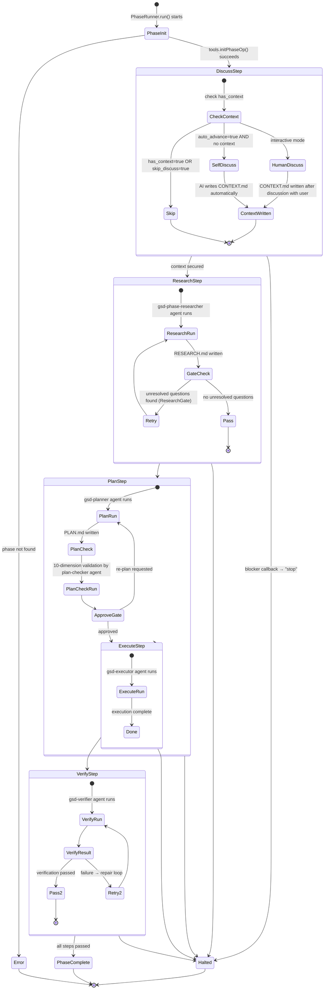

# Harness Analysis: `get-shit-done (GSD)`

## 0. Metadata

- **Name**: get-shit-done (GSD)
- **Type**: in-harness skill system (workflow orchestrator operating inside Claude Code)
- **Repository**: `/Users/WonjinSin/Documents/project/get-shit-done`
- **Analysis commit/version**: c051e71 (main)
- **Analysis date**: 2026-04-15
- **Primary language/runtime**: TypeScript (Node.js 20+)
- **Primary LLM provider**: Anthropic Claude (via `@anthropic-ai/claude-agent-sdk`)

## TL;DR — One-paragraph summary

GSD is a **spec-driven development workflow orchestrator** that operates inside Claude Code. It accepts a natural-language goal and automatically decomposes it into five phases — Discuss → Research → Plan → Execute → Verify — running a dedicated LLM agent session independently for each phase. It can be invoked interactively via Claude Code slash commands (`/gsd:*`), or run as a fully automated pipeline using the `gsd-sdk` CLI. The core design choice is **storing state in the filesystem (`.planning/`)** and letting the LLM read and write these files directly, so execution can be resumed at any time even if a session is interrupted.

---

# Part 1: The Story

## 1-1. Main Flow — SDK CLI path (primary)

```
┌─────────────────────────────────────────────────────────────────────────┐
│  CLI entry point — `gsd-sdk run "<goal>"` is executed                   │
│  main()  ·  sdk/src/cli.ts:196,511                                      │
└──────────────────────────────┬──────────────────────────────────────────┘
                               │ parseCliArgs()
                               ▼
┌─────────────────────────────────────────────────────────────────────────┐
│  Milestone orchestrator — retrieves list of incomplete phases from      │
│  roadmap; tools.roadmapAnalyze() identifies incomplete phases →         │
│  schedules them for sequential execution                                │
│  GSD.run()  ·  sdk/src/index.ts:168                                     │
└──────────────────────────────┬──────────────────────────────────────────┘
                               │ for each incomplete phase
                               ▼
┌─────────────────────────────────────────────────────────────────────────┐
│  Phase lifecycle entry — sequentially executes 6 steps of a single     │
│  phase                                                                  │
│  PhaseRunner.run()  ·  sdk/src/phase-runner.ts:90                       │
└──────────┬──────────────┬──────────┬──────────┬──────────┬─────────────┘
           │              │          │          │          │
       [Discuss]    [Research]    [Plan]    [Execute]  [Verify]
           │              │          │          │          │
           └──────────────┴──────────┴──────────┴──────────┘
                               │ runStep() called for each step
                               ▼
┌─────────────────────────────────────────────────────────────────────────┐
│  Context assembly — selects & reads .planning/ files by phase type      │
│  (Execute=2 files, Research=4 files, Plan=5 files, Verify=4 files)      │
│  ContextEngine.resolveContextFiles()  ·  sdk/src/context-engine.ts:100  │
└──────────────────────────────┬──────────────────────────────────────────┘
                               │ contextFiles
                               ▼
┌─────────────────────────────────────────────────────────────────────────┐
│  Prompt assembly — agent role + workflow instructions + project          │
│  context files                                                           │
│  (stable prefix / variable suffix structure for cache optimization)     │
│  PromptFactory.buildPrompt()  ·  sdk/src/phase-prompt.ts:95             │
└──────────────────────────────┬──────────────────────────────────────────┘
                               │ systemPrompt + prompt
                               ▼
┌─────────────────────────────────────────────────────────────────────────┐
│  LLM session execution — calls Anthropic Agent SDK query()              │
│  settingSources: ['project'], allowedTools: restricted per phase        │
│  query()  ·  sdk/src/session-runner.ts:279                              │
└──────────────────────────────┬──────────────────────────────────────────┘
                               │ AsyncIterable<SDKMessage>
                               ▼
┌─────────────────────────────────────────────────────────────────────────┐
│  Message stream processing — maps each chunk to GSDEvent and            │
│  publishes to the event bus                                             │
│  for await → mapAndEmit() → emitEvent()                                 │
│  processQueryStream()  ·  sdk/src/session-runner.ts:167                 │
└──────────────────────────────┬──────────────────────────────────────────┘
                               │ GSDEvent
                               ▼
┌─────────────────────────────────────────────────────────────────────────┐
│  Output rendering — CLI Transport receives events and formats them to   │
│  stdout                                                                 │
│  CLITransport.onEvent()  ·  sdk/src/cli-transport.ts:56                 │
└─────────────────────────────────────────────────────────────────────────┘
```

### Narration

This diagram shows the complete path from a single `gsd-sdk run "<goal>"` command to the final output. What is architecturally interesting is the **clear separation of six layers** — CLI parsing, milestone orchestration, phase lifecycle, context assembly, LLM invocation, and event rendering. Each layer can be swapped out independently; in fact, replacing `CLITransport` with `WebSocketTransport` is all it takes to connect the same pipeline to a web UI.

The flow starts at `main()` (`cli.ts:511`) and passes to `gsd.run()` (`index.ts:168`). Here, `tools.roadmapAnalyze()` is called to retrieve the list of incomplete phases from `.planning/ROADMAP.md`. This step is the entirety of the resume logic — even if the process dies mid-run, the next `gsd-sdk run` reads the state from ROADMAP.md and continues from the remaining phases.

Each phase is handled independently in `PhaseRunner.run()` (`phase-runner.ts:90`). Internally it calls `runStep()` in the order Discuss, Research, Plan, Execute, Verify, and each step has **its own LLM session**. There is no shared conversation history — information between steps is passed through the `.planning/` filesystem. The Research agent reads `CONTEXT.md` written by the Discuss step, and the Planner reads `RESEARCH.md` written by Research.

Just before the LLM call, `ContextEngine.resolveContextFiles()` determines the list of files to read based on phase type (`context-engine.ts:42`), and `PromptFactory.buildPrompt()` assembles the agent role + workflow instructions + actual file contents into the final prompt. This prompt is passed to `query()` (`session-runner.ts:279`) to call the LLM via the Anthropic Agent SDK.

---

## 1-2. Main Flow — Slash command path (Claude Code conversational interface)

```
┌─────────────────────────────────────────────────────────────────────────┐
│  User enters a slash command in Claude Code                              │
│  e.g. /gsd:do "create user authentication feature"                      │
│  Claude Code internal command router (external to GSD)                  │
└──────────────────────────────┬──────────────────────────────────────────┘
                               │ load command file
                               ▼
┌─────────────────────────────────────────────────────────────────────────┐
│  Command markdown file loaded — command defined via YAML frontmatter    │
│  allowed-tools, description, argument-hint, etc. specified              │
│  commands/gsd/do.md  (one of 75 commands)                               │
└──────────────────────────────┬──────────────────────────────────────────┘
                               │ resolve @workflow reference
                               ▼
┌─────────────────────────────────────────────────────────────────────────┐
│  Workflow loaded — markdown containing detailed execution instructions   │
│  (the <execution_context> in the command file references the            │
│  workflow via @ path)                                                    │
│  get-shit-done/workflows/do.md                                           │
└──────────────────────────────┬──────────────────────────────────────────┘
                               │ workflow instructions + agent context
                               ▼
┌─────────────────────────────────────────────────────────────────────────┐
│  Claude Code executes according to workflow instructions                 │
│  - /gsd:do: auto-routes to the appropriate subcommand (AI decision)     │
│  - /gsd:plan-phase: creates a detailed plan                             │
│  - /gsd:execute-phase: executes the plan                                │
│  Claude Code's own tool execution engine (external to GSD)              │
└──────────────────────────────┬──────────────────────────────────────────┘
                               │ reads/writes state via gsd-sdk query command
                               ▼
┌─────────────────────────────────────────────────────────────────────────┐
│  Native query engine — reads/modifies .planning/ state files            │
│  50+ handlers: state.load, phase.add, frontmatter.set ...               │
│  QueryRegistry.dispatch()  ·  sdk/src/query/registry.ts:118             │
└─────────────────────────────────────────────────────────────────────────┘
```

### Narration

The slash command path is a completely different execution model from the SDK CLI path. Here the orchestrator is not the GSD SDK but **Claude Code itself**. When the user types `/gsd:do "create authentication feature"`, Claude Code reads `commands/gsd/do.md`, loads `@get-shit-done/workflows/do.md` from there, and acts according to those workflow instructions.

The key design insight is that **command files contain no execution logic**. Command files only hold metadata (which tools are allowed, what the argument hints are) and a pointer to the workflow file. What "this command actually does" is described in natural language in the markdown under `get-shit-done/workflows/`, and Claude Code reads it, makes a judgment, and executes it. This indirection is GSD's most distinctive structure — the document is the logic, not the code.

The most unusual command is `/gsd:do`. This command is a meta-router that says "let the AI determine which GSD command this natural language request corresponds to and route it accordingly." Even if the user doesn't know the workflow name, they can say what they want in natural language and Claude dispatches to the appropriate one among 75 commands. The Claude Code hook system (`hooks/gsd-workflow-guard.js`) controls side effects during this process — edits to files outside `.planning/` are warned about or blocked.

---

## 1-3. Phase lifecycle state transitions



### Narration

This state diagram is the heart of GSD — it shows how a single phase is born and how it ends. When `PhaseRunner.run()` (`phase-runner.ts:90`) starts, it first calls `tools.initPhaseOp(phaseNumber)` to query the current phase's state from the `.planning/` filesystem. The result of this query becomes the input for all branching that follows.

There is an unusual branch in the Discuss step. When `auto_advance=true` and `has_context=false` — i.e., **starting a phase without human input in fully automated mode** — the system directly calls `runSelfDiscussStep()`, having the AI write its own context (`phase-runner.ts:144`). This is GSD's "auto mode" — using the `gsd-sdk auto` command runs the entire milestone without human intervention.

After the Research step there is a **ResearchGate** validation (`sdk/src/research-gate.ts`). If unresolved questions remain in `RESEARCH.md`, the research agent is re-run. Without this retry loop, a plan built on incomplete research is likely to fail during execution.

The Plan step consumes two LLM sessions. First the `gsd-planner` agent writes `PLAN.md`, then the `gsd-plan-checker` agent validates that plan across 10 dimensions. If validation fails, re-planning is requested. This design stems from the premise that "a good plan makes for good execution," and is a tradeoff that preemptively blocks flailing during Execute.

---

## 1-4. Context assembly sequence — Per-phase file manifest

```
┌─────────────────────────────────────────────────────────────────────────┐
│  Select file manifest based on phase type                               │
│  PHASE_FILE_MANIFEST  ·  sdk/src/context-engine.ts:42                   │
└─────────────────────────────────────────────────────────────────────────┘
                │
    ┌───────────┼───────────────────┬───────────────────┐
    ▼           ▼                   ▼                   ▼
[Discuss]  [Research]            [Plan]              [Execute]
STATE.md   STATE.md              STATE.md            STATE.md
ROADMAP.md ROADMAP.md            ROADMAP.md          config.json
CONTEXT.md CONTEXT.md            CONTEXT.md
           REQUIREMENTS.md       RESEARCH.md
                                 REQUIREMENTS.md

                    [Verify]
                    STATE.md
                    ROADMAP.md
                    REQUIREMENTS.md
                    PLAN.md
                    SUMMARY.md

For each file:
  ① Check file existence (warn if required)
  ② ROADMAP.md → trimmed to current milestone (extractCurrentMilestone)
  ③ Large files → truncated to heading + first paragraph only (truncateMarkdown)

Result: ContextFiles { state, roadmap, context, research, plan, ... }
                                    │
                                    ▼
            PromptFactory.buildPrompt()  ·  phase-prompt.ts:95
            ┌──────────────────────────────────────────────────────┐
            │  [Cacheable prefix]                                   │
            │  ① Agent role definition (fixed)                     │
            │  ② Workflow purpose (fixed)                          │
            │  ③ Phase-specific instructions (fixed per phase type)│
            ├──────────────────────────────────────────────────────┤
            │  [Variable suffix]                                    │
            │  ④ Actual .planning/ file contents (varies per       │
            │     project)                                          │
            └──────────────────────────────────────────────────────┘
```

### Narration

This diagram shows how GSD's context economics work. The core idea is that **the files shown to the LLM differ based on phase type**. The Execute phase sees only two files — `STATE.md` and `config.json` — because the plan is already complete, so the long ROADMAP or CONTEXT would be noise. Conversely, the Plan phase sees all five files. This selective context provision reduces token waste and improves prompt cache hit rates.

`ContextEngine.resolveContextFiles()` (`context-engine.ts:100`) iterates through the manifest and reads the actual files. During this process, two kinds of trimming occur. First, `ROADMAP.md` is cut down by `extractCurrentMilestone()` to only the block of the currently active milestone — there is no need to show the LLM completed past milestones. Second, large files are trimmed by `truncateMarkdown()` to preserve only the heading and first paragraph (`context-truncation.ts`).

The assembled files are synthesized into the final prompt by `PromptFactory.buildPrompt()` (`phase-prompt.ts:95`). What is structurally important is the **separation of cacheable prefix from variable suffix**. The agent role, workflow purpose, and phase-specific instructions are the same across all projects, so they remain in Anthropic's prompt cache. Only the per-project file contents go into the variable suffix. In large-scale automation, cache hits reduce both cost and latency.

---

## 1-5. Hook system — Claude Code event interceptor

```
Claude Code event fires
        │
        │ SessionStart
        ├────────────────► gsd-check-update.js   : check for version updates (async)
        │                  gsd-session-state.sh  : write session state file
        │
        │ PreToolUse (before Write/Edit tool calls)
        ├────────────────► gsd-workflow-guard.js
        │                  ┌──────────────────────────────────────────┐
        │                  │  Is this a subagent/Task session?         │
        │                  │  → pass (exit 0) ──────────────────────► │
        │                  │                                          │
        │                  │  Is the edit target inside .planning/?   │
        │                  │  → pass ───────────────────────────────► │
        │                  │                                          │
        │                  │  Is this an edit outside .planning/?     │
        │                  │  → print warning message then pass       │
        │                  └──────────────────────────────────────────┘
        │
        │ PreToolUse (Read tool)
        ├────────────────► gsd-read-guard.js     : validate read permissions
        │
        │ PreToolUse (Bash tool)
        ├────────────────► gsd-prompt-guard.js   : defend against prompt injection
        │
        │ PreGitCommit
        ├────────────────► gsd-validate-commit.sh : validate commit message format
        │
        │ StatusLine
        └────────────────► gsd-statusline.js     : display current phase in status bar
```

### Narration

GSD's hook system is a **guardrail layer that hooks into Claude Code's event pipeline to control behavior outside the workflow**. The hook files live in `hooks/`, and `bin/install.js` registers them in Claude Code's `.claude/settings.json`.

The most central hook is `gsd-workflow-guard.js`. This hook fires on the `PreToolUse` event — that is, just before Claude Code writes or edits a file. The core logic is simple: **if the edit target is inside `.planning/`, pass; if outside, warn**. GSD holds the principle that "the LLM should only record state through the `.planning/` directory," and this hook is the enforcer of that principle. However, it operates at warning level rather than blocking — intentional edits to external files by the user are allowed.

For subagent or Task sessions, this check is skipped (`gsd-workflow-guard.js:35`). When `gsd-executor` spawns a Sub-agent to write code, modifying files outside `.planning/` is a legitimate action. If the hook blocked this too, actual code could never be written — without this exception, the entire system would not work.

---

# Part 2: Reference Details

## 2-1. Entry Points

There are two independent entry points. **SDK CLI**: `gsd-sdk run "<prompt>"` → `cli.ts:511 main()`. **Slash commands**: 75 commands such as `/gsd:do`, `/gsd:plan-phase` inside Claude Code. The two paths use different orchestrators — the SDK CLI uses `GSD.run()`, while slash commands use Claude Code itself as the execution engine.

## 2-2. Concurrency

Executed serially per phase. The milestone loop in `GSD.run()` (`index.ts:194`) processes phases sequentially with no parallel execution. Multi-workstream (`workstream-utils.ts`) is supported, but this is a logical separation isolating independent feature lines within a project, not parallel execution.

## 2-3. Routing

There are two levels of routing at the slash command layer. First, Claude Code deterministically finds the file by command name (`/gsd:*`). Second, `/gsd:do` has the AI decide which of the 75 commands a natural-language input maps to (`commands/gsd/do.md`). On the SDK path there is no routing — the ROADMAP.md order determines phase order.

## 2-4. Context Assembly

Per-phase file manifest (`context-engine.ts:42`): Execute=2 files (STATE, config), Research=4 files, Plan=5 files, Verify=4 files. Assembly is centralized at `PromptFactory.buildPrompt()`. For cache optimization, stable prefix (agent role + workflow instructions) and variable suffix (file contents) are separated (`phase-prompt.ts:95`). ROADMAP.md is trimmed to the current milestone; large files are preserved as heading + first paragraph only (`context-truncation.ts`).

## 2-5. Provider Abstraction

Calls the `query()` function of `@anthropic-ai/claude-agent-sdk` directly (`session-runner.ts:279`). No separate abstraction interface — directly depends on the Anthropic SDK. Uses the `claude_code` preset with `systemPrompt.type='preset'` and appends phase-specific instructions.

## 2-6. Worker / Execution

The unit of execution is a **Phase Step session** — each step (Discuss/Research/Plan/Execute/Verify) is an independent `query()` session. `maxTurns=50`, `maxBudgetUsd=5.0` are the defaults and can be overridden as options (`phase-runner.ts:129`). permissionMode is set to `bypassPermissions` so tool calls require no user approval.

## 2-7. Message Loop

The return value of `query()` is `AsyncIterable<SDKMessage>` and is processed with a `for await` loop (`session-runner.ts:175`). Each message is converted to a `GSDEvent` via `mapAndEmit()` and published to the event bus. `isResultMessage()` identifies the final result message to extract `PlanResult`.

## 2-8. Session / State

Sessions are immutable — on resume, a new `query()` session is started and state is read from `.planning/` files. No conversation history sharing between phases. Transition triggers: result of `initPhaseOp()` query (phase_found, has_context, has_research, etc.). No expiration policy — a phase is valid as long as its `.planning/` files exist.

## 2-9. Isolation

No isolation — runs with `permissionMode: 'bypassPermissions'` and does not use a separate worktree or container. Loads project-level permission settings with `settingSources: ['project']`. The practical boundary is a soft guardrail where the hook (`gsd-workflow-guard.js`) warns on edits outside `.planning/`.

## 2-10. Tool / Capability

Per-phase tool scoping (`tool-scoping.ts`): Research allows Read/Grep/Glob/WebSearch, Execute allows Read/Write/Edit/Bash/Grep/Glob/mcp__context7. 33 agent definitions (`agents/*.md`) each declare their own tool list via YAML frontmatter. MCP integration uses `mcp__context7__*` tools for context7 documentation queries.

## 2-11. Workflow Engine

The workflow engine has two layers. **Markdown-based**: slash commands reference `get-shit-done/workflows/*.md` files and Claude Code interprets the natural-language instructions. **Programmatic**: `PhaseRunner` enforces the Discuss→Research→Plan→Execute→Verify order in code. Node types are the PhaseStepType enum: Discuss, Research, Plan, PlanCheck, Execute, Verify, Repair. Conditional branching is controlled by `has_context`, `skip_discuss`, `auto_advance` flags (`phase-runner.ts:139`).

## 2-12. Configuration

`config.json` file handles per-project configuration. Loaded with `loadConfig(projectDir, workstream)` (`index.ts:80`). Key flags: `workflow.skip_discuss`, `workflow.auto_advance`, `workflow.skip_verify`. Environment variables such as `GSD_MODEL`, `GSD_MAX_BUDGET_USD` override CLI defaults. No runtime reload.

## 2-13. Error Handling

`GSDError` (`errors.ts`) is the base error type, classified by `ErrorClassification` enum (Validation, Network, Filesystem, etc.). `PhaseRunnerError` includes phase/step information. Research and Plan steps retry once using the `retryOnce()` helper (`phase-runner.ts`). Unrecoverable errors are marked with `PhaseRunnerResult.halted=true` and execution stops.

## 2-14. Observability

`GSDEventStream` is the hub for all events. Event types: MilestoneStart/Complete, PhaseStart/Complete, PhaseStepStart/Complete, PlanResult, etc. Transport pattern — choose between `CLITransport` (stdout) and `WebSocketTransport` (ws-transport.ts). No external integrations (OpenTelemetry, etc.). Logs go to stderr via GSDLogger in `logger.ts`.

## 2-15. Platform Adapters

The slash command path uses Claude Code as the platform — CLI interaction is handled entirely by Claude Code. The SDK path can be used directly as a standalone CLI (`gsd-sdk`). Web UI connection is supported via WebSocket Transport (`ws-transport.ts`). No external platform adapters (Slack, GitHub, etc.) — a single-user development tool.

## 2-16. Persistence

Filesystem-based. The `.planning/` directory is the single source of truth for all state:
- `ROADMAP.md` — milestone/phase list and completion status
- `STATE.md` — current phase progress
- `phases/<N>-<name>/CONTEXT.md` — Discuss output
- `phases/<N>-<name>/RESEARCH.md` — Research output
- `phases/<N>-<name>/PLAN.md` — Plan output
- `phases/<N>-<name>/SUMMARY.md` — Verify output

No DB. Sensitive information is managed through environment variables only and is never written to files.

## 2-17. Security Model

Trust model: local single user. No authentication. API keys are injected via environment variables (standard Anthropic SDK approach). `permissionMode: 'bypassPermissions'` skips tool call approval — there is no human confirmation gate, making it suitable for automation but only usable in high-trust environments.

## 2-18. Key Design Decisions & Tradeoffs

GSD's most decisive design choice is "filesystem as database" — all communication between phases is done through `.planning/` markdown files. This is the core tradeoff that achieves resumability, visibility, and simplicity simultaneously.

| Decision | Choice | Alternative | Rationale | Tradeoff |
|------|------|------|------|-------------|
| State storage between phases | Filesystem (`.planning/`) | DB, memory, API | Resumable + human-readable and editable | No concurrency control, file conflicts possible |
| LLM session sharing | Independent session per phase | Single long conversation | Prevent context pollution, agent specialization | Implicit knowledge cannot be passed between phases |
| Isolation method | None (bypassPermissions) | worktree, Docker | Simplicity, optimized for local development | Accidental modification of files outside project is possible |
| Command definition method | Markdown + natural language | Code-based | Maximizes flexibility since AI interprets it | Behavior depends on LLM interpretation, weak reproducibility |
| Plan validation | Separate plan-checker agent | Fix after execution | Preemptively prevents Execute failures | Consumes 2 LLM sessions, reduces speed |
| Context caching | Separate stable prefix | Assemble in full each time | Improves prompt cache hit rate | Increases structural complexity |

## 2-19. Open Questions

- Reason why `retryOnce()` max retry count is hardcoded to 1 — check retry implementation in `phase-runner.ts`
- Criteria for detecting unresolved questions in `ResearchGate` — detailed check of parsing logic in `research-gate.ts` needed
- Whether `gsd-sdk auto` command fully removes human intervention gates — check `callbacks` parameter handling logic
- Whether an actual client for WebSocket Transport exists — check external consumer code of `ws-transport.ts`

---

## Appendix: Quick Reference Table

| Item | Value |
|------|-----|
| Type | in-harness skill system (Claude Code plugin) |
| Entry points | `gsd-sdk run/auto/init` CLI, 75 `/gsd:*` slash commands |
| Concurrency | Phase serial execution, workstream logical isolation |
| Router style | slash commands=deterministic, `/gsd:do`=AI routing |
| Provider abstraction | `@anthropic-ai/claude-agent-sdk` query() called directly |
| Session model | Independent session per Phase Step, state in filesystem |
| Isolation | None (bypassPermissions + hook soft guard) |
| Workflow engine | Phase state machine (code) + markdown workflow (natural language) dual structure |
| Primary language | TypeScript (Node.js) |
| LoC (approx) | SDK ~6,000 lines, 33 agents, 75 commands, 40+ workflows |
