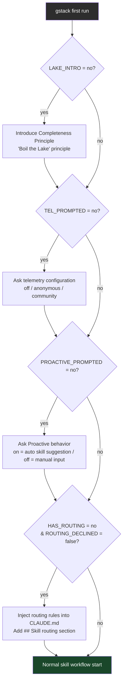

# Harness Analysis: `gstack`

## 0. Metadata

- **Name**: gstack
- **Type**: in-harness skill system (Claude Code internal plugin)
- **Repository**: `/Users/WonjinSin/Documents/project/gstack`
- **Analysis commit/version**: v0.17.0.0 (commit `23000672`)
- **Analysis date**: 2026-04-15
- **Primary language/runtime**: Bash (skill SKILL.md), TypeScript/Bun (build pipeline + binary)
- **Primary LLM provider**: Claude Code (host) — gstack itself does not call the LLM directly; it operates on top of the Claude Code LLM

## TL;DR — One-paragraph summary

gstack is a **skill plugin system** installed in Claude Code (Claude's CLI). When the user enters a slash command such as `/ship`, `/qa`, or `/investigate`, or when a pattern is detected in the user's message, Claude Code automatically loads the corresponding skill. Each skill begins with a Bash preamble (environment detection, learnings load, telemetry) and then executes a structured multi-step workflow. Claude Code itself handles the LLM calls; gstack is the prompt layer that commands "what to do and in what order." It supports 8 hosts (Claude, Codex, Kiro, OpenClaw, etc.), and the core structure is a build pipeline that auto-generates host-specific `SKILL.md` files from `.tmpl` source files.

---

# Part 1: The Story

## 1-1. Main Flow (primary)

```
  User input
  (Claude Code chat)
        │
        ▼
┌─────────────────────────────────────────────────────────┐
│  gstack SKILL.md load (preamble-tier: 1)                │
│  Session start · update check · configuration read      │
│  SKILL.md:1-93  ·  preamble.ts:generatePreambleBash()  │
└────────────────────────┬────────────────────────────────┘
                         │
                         ▼
┌─────────────────────────────────────────────────────────┐
│  Routing decision: slash command vs. natural language    │
│  "Direct connection for slash command, otherwise rule   │
│   matching for routing"                                 │
│  SKILL.md.tmpl:28-49  (routing rules prose)             │
└────┬─────────────────────────────────────┬──────────────┘
     │ /qa, /ship, etc. explicit            │ "there's a bug", "deploy this", etc. natural language
     │                                     │ → rule matching → skill decision
     ▼                                     ▼
┌─────────────────────────────────────────────────────────┐
│  Skill tool call → subskill SKILL.md load               │
│  (Claude Code built-in skill loading mechanism)         │
│  ~/.claude/skills/gstack/<skill>/SKILL.md               │
└────────────────────┬────────────────────────────────────┘
                     │
                     ▼
┌─────────────────────────────────────────────────────────┐
│  Subskill Preamble execution (Bash block)               │
│  - Update check (gstack-update-check)                   │
│  - Session file touch (~/.gstack/sessions/$PPID)        │
│  - Configuration read (gstack-config: proactive,        │
│    telemetry, etc.)                                     │
│  - repo-mode detection (gstack-repo-mode)               │
│  - Learnings data load (gstack-learnings-search)        │
│  - Telemetry JSONL append                               │
│  preamble.ts:generatePreambleBash()                     │
└────────────────────┬────────────────────────────────────┘
                     │
                     ▼
┌─────────────────────────────────────────────────────────┐
│  Skill workflow execution                               │
│  Structured steps (Step 1→N) + Claude Code tool usage   │
│  (Bash, Read, Write, Edit, Grep, AskUserQuestion, etc.) │
│  Each skill SKILL.md body                               │
└────────────────────┬────────────────────────────────────┘
                     │
                     ▼
┌─────────────────────────────────────────────────────────┐
│  Completion report + learnings record                   │
│  STATUS: DONE / DONE_WITH_CONCERNS / BLOCKED            │
│  gstack-learnings-log (project learnings JSONL append)  │
│  gstack-timeline-log (session event record)             │
│  SKILL.md:290-310  ·  bin/gstack-learnings-log          │
└─────────────────────────────────────────────────────────┘
```

### Narration

This diagram shows the full path from when the user types "deploy this" to when the gstack `/ship` skill executes. The interesting thing about gstack is that **it does not call the LLM directly**. The LLM is already provided by Claude Code; gstack only handles the judgment of "this skill should be used now" and the workflow command of "do this in this order."

The first entry point is gstack's root `SKILL.md` (the `preamble-tier: 1` frontmatter field instructs Claude Code to "always load this first in the session"). This SKILL.md contains more than 25 routing rules — rules like "if the user mentions a bug, use `/investigate`" and "if they mention deployment, use `/ship`." Claude reads the user's message, applies one of these rules, and calls the `Skill tool`. If the user types explicitly like `/ship`, the routing step is skipped and it goes directly to the Skill tool.

Once the Skill tool is called, Claude Code reads `~/.claude/skills/gstack/ship/SKILL.md` and injects it into the LLM context. The first instruction of any skill is always "execute the Preamble first." This Bash block creates the session file (`~/.gstack/sessions/$PPID`), checks for updates, and loads project learnings recorded from previous sessions. If there are 5 or more learnings, it searches for the 3 most relevant ones and puts them in context. Only then do Step 1, Step 2, … of the skill body begin.

When the workflow ends, gstack does three things: reports completion status (`DONE/DONE_WITH_CONCERNS/BLOCKED`), saves any project-specific quirks discovered in this session as learnings, and records timeline events. These three things are the foundation of "doing better next time."

---

## 1-2. Alternate Paths

### (a) Direct slash command execution

```
User: /ship
      │
      ▼
┌────────────────────────────────────────────────────┐
│  Claude Code: Skill tool called directly           │
│  Routing rule matching step skipped                │
│  skill: "ship"                                     │
└────────────────────────┬───────────────────────────┘
                         │
                         ▼
               [Same as Main Flow Step 3 onward]
```

### (b) Session spawned from OpenClaw orchestrator

```
OpenClaw orchestrator
        │
        │ OPENCLAW_SESSION=1 environment variable set
        ▼
┌────────────────────────────────────────────────────┐
│  Preamble execution                                │
│  SPAWNED_SESSION=true detected                     │
│  SKILL.md:251-256                                  │
└────────────────────────┬───────────────────────────┘
                         │
                         ▼
┌────────────────────────────────────────────────────┐
│  Spawned mode: all interactive prompts suppressed  │
│  - AskUserQuestion disabled                        │
│  - Upgrade check disabled                          │
│  - Telemetry prompt disabled                       │
│  - Recommended options auto-selected               │
│  SKILL.md:252-256                                  │
└────────────────────────┬───────────────────────────┘
                         │
                         ▼
┌────────────────────────────────────────────────────┐
│  Task execution → return results as completion     │
│  report (prose output, includes structured result) │
└────────────────────────────────────────────────────┘
```

### (c) Chained skill execution (autoplan example)

```
User: /autoplan (or "auto-review this")
        │
        ▼
┌──────────────────────────────────────────────────────────────┐
│  autoplan SKILL.md load                                       │
│  "Read 4 review skills in order and execute sequentially"     │
│  autoplan/SKILL.md                                           │
└────┬───────────────────────────────────────────────────────┘
     │
     │ Each skill's SKILL.md read directly with Read tool (not Skill tool)
     ▼
┌─────────────┐    ┌──────────────────┐    ┌──────────────┐    ┌────────────────┐
│ plan-ceo-   │ →  │ plan-design-     │ →  │ plan-eng-    │ →  │ devex-review   │
│ review      │    │ review           │    │ review       │    │                │
│ read & run  │    │ read & run       │    │ read & run   │    │ read & run     │
└─────────────┘    └──────────────────┘    └──────────────┘    └────────────────┘
                                                                        │
                                                                        ▼
                                                        ┌───────────────────────────┐
                                                        │  Final approval gate       │
                                                        │  AskUserQuestion           │
                                                        │  (only preference          │
                                                        │   decisions to user)       │
                                                        └───────────────────────────┘
```

### Narration

Direct slash command execution is the simplest path. When the user types `/ship`, the Skill tool fires directly without routing rule matching. It is faster than natural language detection and executes the exact skill without error.

The OpenClaw spawn path shows how gstack operates in a multi-AI environment. When the OpenClaw orchestrator sets the `OPENCLAW_SESSION=1` environment variable and starts a Claude Code session, the preamble detects this and turns off all "interactive" behaviors. One-time onboarding such as upgrade notices, telemetry prompts, and completeness principle introductions are all skipped, leaving only task execution and result reporting. This pattern allows gstack skills to be automated as subtasks of an orchestrator.

The chained execution of autoplan is interesting. While other skills chain via the Skill tool, autoplan **directly reads the review skills' SKILL.md files using the Read tool** and injects them into the Claude context before execution. Using the Skill tool would cause each skill to run in an independent context, making it difficult to share state, so autoplan chose the strategy of performing all reviews sequentially within the same context. Thanks to this design, the judgment from a previous review remains alive in the next review.

---

## 1-3. Skill Dependency Network (Skill dependency graph)

The heart of gstack is the reference network between skills. Viewing a graph of which skill calls or reads which other skill reveals the system's "DNA."

```
┌──────────────────────────────────────────────────────────────────────────────┐
│                          gstack skill dependency graph                        │
│                                                                              │
│  [gstack root]  ──routing──►  /office-hours     (idea validation)           │
│      (preamble-tier:1)    ──►  /investigate     (bug analysis)               │
│                           ──►  /qa              (QA + browse binary)         │
│                           ──►  /ship            (deployment)                 │
│                           ──►  /review          (code review)                │
│                           ──►  /design-review   (design audit)               │
│                           ──►  /autoplan        (auto review pipeline)       │
│                           ──►  /retro           (retrospective)              │
│                           ──►  /codex           (Codex 2nd opinion)          │
│                                                                              │
│  /autoplan  ──Read──►  /plan-ceo-review                                     │
│             ──Read──►  /plan-design-review                                   │
│             ──Read──►  /plan-eng-review                                      │
│             ──Read──►  /devex-review                                         │
│                                                                              │
│  /land-and-deploy  ──Skill──►  /review                                      │
│                    ──Skill──►  /ship                                         │
│                    ──Skill──►  /canary                                       │
│                                                                              │
│  /ship  ──(optional)Skill──►  /review  (diff review)                        │
│                                                                              │
│  /qa  ──Bash──►  browse binary  (Playwright headless Chromium)               │
│                  ~/.claude/skills/gstack/browse/dist/browse                  │
│                                                                              │
│  /gstack-upgrade  ──(online)──►  git fetch + ./setup                        │
│                                                                              │
│  Learnings system:  all skills  ──gstack-learnings-log──►  ~/.gstack/projects/  │
│                                  (per-project SLUG JSONL)                    │
└──────────────────────────────────────────────────────────────────────────────┘
```

### Narration

gstack's skills run independently but fall into a few patterns. **Orchestrator type** — `autoplan` and `land-and-deploy` are pipelines that call other skills in sequence. **Standalone type** — `investigate`, `office-hours`, and `retro` are self-contained. **Tool-using type** — `qa` directly executes the Playwright binary bundled with gstack.

The learnings system is a cross-cutting concern that spans all skills. Regardless of which skill runs, at the end of a session, learnings can be written to a per-project-slug JSONL via `gstack-learnings-log`. The preamble of the next session reads this file to put "what was learned in this project last time" into context. This is how session-spanning memory is implemented in a structure where there is no shared state between skills.

The browse binary is a special dependency unique to gstack. A Bun-compiled Playwright wrapper (`browse/dist/browse`) resides and navigates pages with commands like `$B goto`, `$B snapshot`, and `$B screenshot`. The `qa` skill calls this binary directly via Bash — because it is faster and more stable than MCP browser tools.

---

## 1-4. Skill generation pipeline (Template → SKILL.md)

gstack's 30 skills are not hand-written SKILL.md files. They are auto-generated from `.tmpl` files. This pipeline is the core engine that produces skill variants for 8 hosts.

```
  Each skill directory
  (e.g.: ship/, qa/, review/)
          │
          │  SKILL.md.tmpl  (source)
          ▼
┌─────────────────────────────────────────────────────────┐
│  discoverTemplates() scan                               │
│  Discover SKILL.md.tmpl in root + 1-level subdirs      │
│  scripts/discover-skills.ts:17-27                       │
└────────────────────────┬────────────────────────────────┘
                         │
                         ▼
┌─────────────────────────────────────────────────────────┐
│  {{PLACEHOLDER}} substitution pipeline                  │
│  - {{PREAMBLE}}   → preamble.ts:generatePreambleBash()  │
│  - {{BROWSE_SETUP}} → browse.ts                         │
│  - {{DESIGN_METHODOLOGY}} → design.ts                   │
│  - {{REVIEW_ARMY}} → review-army.ts                     │
│  - … (registered in resolvers/index.ts)                 │
│  scripts/gen-skill-docs.ts:RESOLVERS                    │
└────────────────────────┬────────────────────────────────┘
                         │
           HostConfig-based transformation
           (8 hosts × N skills)
                         │
          ┌──────────────┴────────────────┐
          ▼                               ▼
  claude/SKILL.md                  codex/SKILL.md
  (no toolRewrites)                (Bash→shell tool, etc. transform)
          │                               │
  ~/.claude/skills/gstack/        ~/.codex/skills/gstack/
```

### Narration

The reason this pipeline exists is simple — each of the 8 hosts has different tool names, different installation paths, and different prompt constraints. Maintaining 8 separate skills every time would cause maintenance costs to explode. Instead, a single `.tmpl` file is kept as the source of truth, and `gen-skill-docs.ts` applies transformations based on `HostConfig` to produce a SKILL.md for each host.

`{{PREAMBLE}}` is the most important placeholder. The `generatePreambleBash()` function in `preamble.ts` looks at the HostConfig and fills in the correct binary path (`~/.claude/skills/gstack/bin/` vs. environment-variable-based paths). This is managed in one place because the gstack installation path convention differs per host.

Environment-variable-based hosts like Codex have the `usesEnvVars: true` flag set, so a block that first sets variables like `$GSTACK_ROOT` is prepended during preamble generation (`preamble.ts:18-25`). Fixed-path hosts like Claude Code omit this block and use the hardcoded `~/.claude/skills/gstack/` path.

---

## 1-5. Configuration flow and first-run onboarding

The path for a new user running gstack for the first time differs from existing users. The preamble checks state files and sequentially executes one-time onboarding steps.



### Narration

gstack's onboarding is "run-once in pieces." Rather than asking all configuration questions at once, it checks a state file (`~/.gstack/.completeness-intro-seen`, `~/.gstack/.telemetry-prompted`, `~/.gstack/.proactive-prompted`) at each step and only asks for what has not yet been done.

The most strategic step is the final `HAS_ROUTING` check. If the project's `CLAUDE.md` does not have a `## Skill routing` section, it automatically adds a 15-line routing rule and commits it with user consent. Once this rule is in place, Claude will naturally call `/ship` even when it hears "deploy this" — without the user needing to memorize slash commands. This is the key mechanism by which gstack creates the network effect of "the more you install it, the better it gets."

In a spawned session (`OPENCLAW_SESSION=1`), this entire onboarding is skipped. This is because sending AskUserQuestion in an orchestrator environment would halt the session.

---

# Part 2: Reference Details

## 2-1. Entry Points

Two entry points: slash commands (`/qa`, `/ship`, etc.) and natural language routing. The root SKILL.md (preamble-tier:1) is automatically loaded at Claude Code session start. The common dispatcher is the Claude Code built-in Skill tool; gstack does not route requests directly — instead, Claude reads the routing rules and calls the Skill tool.

## 2-2. Concurrency

Not applicable — gstack is a prompt layer running on top of Claude Code. Concurrency management is handled by Claude Code. Skills execute sequentially, and even when chaining multiple skills as in `autoplan`, they are executed one at a time in order.

## 2-3. Routing

Two layers. ① Deterministic — if the user types an explicit slash command like `/ship`, the Claude Code Skill tool connects directly (`SKILL.md.tmpl:28`). ② AI routing — Claude reads the 25 natural language matching rules inside the gstack root SKILL.md and decides whether to call the Skill tool. No mid-stream reversal — rule matching only happens at session start.

## 2-4. Context Assembly

Context is assembled as each skill's Preamble executes: ① the full skill SKILL.md (recommended to stay under 2000–4000 lines), ② preamble bash output (BRANCH, PROACTIVE, REPO_MODE, LEARNINGS, etc.), ③ `gstack-learnings-search --limit 3` results (when there are 5 or more learnings). The assembly point is each skill's individual preamble; there is no central single point.

## 2-5. Provider Abstraction

No Provider Abstraction, as the LLM is not called directly. Instead, a **Host Abstraction** exists — the `HostConfig` interface (`scripts/host-config.ts`) abstracts the differences between each AI agent environment (Claude, Codex, Kiro, etc.), and `scripts/gen-skill-docs.ts` generates host-specific SKILL.md files based on this.

## 2-6. Worker / Execution

The execution unit is an individual skill (SKILL.md). Claude Code itself is the worker. Abort/timeout within a skill is delegated to Claude Code's session management. gstack does not have a separate timeout mechanism.

## 2-7. Message Loop

Not applicable — gstack does not manage a streaming message loop. Claude Code processes the stream, and gstack skills execute as results of that.

## 2-8. Session / State

Sessions are tracked by the existence of a `~/.gstack/sessions/$PPID` file. Automatically expires after 120 minutes (`preamble.ts:33-36`). There is no shared state between sessions; only project learnings (`~/.gstack/projects/{slug}/learnings.jsonl`) are persistent state that survives sessions. The session model is **Append-only**, not Mutable — new learnings are only added, never overwritten.

## 2-9. Isolation

No isolation — gstack runs as-is in the current working directory. However, `lib/worktree.ts` exists, and some skills (especially ship, review) can use git worktree to create a safe workspace. Resolver priority: skill's own specification → user choice → current directory if none.

## 2-10. Tool / Capability

Claude Code tools are declared in the skill frontmatter's `allowed-tools`. Default tools: `Bash`, `Read`, `Write`, `Edit`, `Grep`, `Glob`, `AskUserQuestion`, `Agent`, `WebSearch`. Extension points: ① browse binary (`browse/dist/browse` — Playwright wrapper), ② design binary (`design/dist/design` — GPT Image API wrapper), ③ 30 bin utilities (`gstack-config`, `gstack-learnings-search`, etc.). Per-skill tool restriction is possible — `learn/SKILL.md` declares only the minimum tools needed to operate without `Agent`.

## 2-11. Workflow Engine

No separate YAML/JSON workflow engine. Workflows are defined as **prose** in "Step 1 → Step 2 → …" format inside SKILL.md markdown. Claude reads this prose and follows the order. Conditional branching is also expressed in natural language form: "if X then Y, otherwise Z."

## 2-12. Configuration

| Layer | File/Source | Priority |
|-------|-------------|----------|
| Runtime environment variables | `GSTACK_STATE_DIR`, `OPENCLAW_SESSION` | Highest |
| User configuration | `~/.gstack/config.yaml` | Middle |
| Code defaults | preamble bash `|| echo "true"` fallback | Lowest |

Configuration keys: `proactive`, `routing_declined`, `telemetry`, `auto_upgrade`, `update_check`, `skill_prefix`. Runtime reloadable — the preamble re-reads on each skill execution.

## 2-13. Error Handling

**Fail Fast but Graceful** philosophy. On skill workflow failure, reports `STATUS: BLOCKED` or `STATUS: DONE_WITH_CONCERNS` (`SKILL.md:269-278`). After 3 failed attempts, STOP + escalation required. All bin utilities are wrapped with `2>/dev/null || true` pattern so that a failure does not kill the entire preamble — an intentional choice to protect core functionality.

## 2-14. Observability

Two channels: ① local JSONL (`~/.gstack/analytics/skill-usage.jsonl`) — always recorded even with telemetry off, ② remote telemetry (`gstack-telemetry-log`) — only sent in `community` mode. Timeline log (`~/.gstack/analytics/timeline.jsonl` assumed) is a separate channel. Event naming: `{"skill":"ship","ts":"...","repo":"..."}` pattern. No external integration (OpenTelemetry not used).

## 2-15. Platform Adapters

8 hosts: `claude`, `codex`, `factory`, `kiro`, `opencode`, `slate`, `cursor`, `openclaw`. Each host implements the `HostConfig` interface (`hosts/index.ts:19`). Key fields: `globalRoot` (installation path), `toolRewrites` (tool name translation), `frontmatter.mode` (allowlist/denylist), `usesEnvVars` (path strategy). Skill installation: the `setup` script creates a symlink or real-dir in each host directory.

## 2-16. Persistence

| Store | Path | Contents |
|-------|------|----------|
| Configuration | `~/.gstack/config.yaml` | User configuration |
| Session | `~/.gstack/sessions/` | $PPID file (120-min TTL) |
| Learnings | `~/.gstack/projects/{slug}/learnings.jsonl` | Per-project experience |
| Analytics | `~/.gstack/analytics/skill-usage.jsonl` | Skill usage log |
| Timeline | `~/.gstack/analytics/` | Session events |
| State flags | `~/.gstack/.*.seen`, `~/.gstack/.*.prompted` | One-time onboarding checks |

No DB. All file-based (JSONL/YAML/touch file). No sensitive information — only repo names are recorded; code and file paths are not transmitted.

## 2-17. Security Model

Trust model: local user trust (single-user tool, multi-user environments not supported). `umask 077` creates installation directories as owner-only (`setup:5`). Secrets: handled via environment variables only (`TEST_EMAIL`, `TEST_PASSWORD`, etc.) — no secrets in skill files. `ANTHROPIC_API_KEY` is only used during eval execution and is not required for skill execution (managed by Claude Code).

## 2-18. Key Design Decisions & Tradeoffs

gstack's defining choices stem from the premise of "using Claude Code as the harness."

| Decision | Choice | Alternative | Rationale | Tradeoff |
|----------|--------|-------------|-----------|----------|
| Direct LLM call | Not done — delegated to Claude Code | Own API call | Simplified installation, no API key required | Portability limited when host changes |
| Workflow definition | Markdown prose | YAML/JSON schema | Readability, LLM reads and follows directly | Not parseable, version validation difficult |
| State management | File-based JSONL | DB | Zero dependencies, user can view directly | No concurrency, O(n) search |
| Skill document generation | .tmpl → gen-skill-docs pipeline | Manual maintenance | Reduces maintenance cost for 8 hosts × N skills | Additional build step, tmpl error debugging difficult |
| Host abstraction | HostConfig + toolRewrites | Separate repo per host | Support all hosts from one source | New host addition requires understanding HostConfig |
| Session isolation | No isolation (CWD as-is) | Docker/worktree enforced | Simplified installation | Risk of accidentally modifying production directory |

## 2-19. Open Questions

- Whether the `preamble-tier` number (1, 2, 3, 4) actually affects Claude Code loading priority — needs verification in Claude Code internal Skill loader behavior documentation.
- Which skills actually call `lib/worktree.ts` — verify with `Grep "worktree"` on all SKILL.md files.
- The exact endpoint that the `gstack-telemetry-sync` binary transmits to remotely — verify in `bin/gstack-telemetry-sync` source.

---

## Appendix: Quick Reference Table

| Item | Value |
|------|-------|
| Type | in-harness skill system |
| Entry points | slash command + natural language routing |
| Concurrency | N/A (delegated to Claude Code) |
| Router style | Deterministic (slash) + AI rule matching (natural language) |
| Provider abstraction | HostConfig (8 hosts) |
| Session model | File-touch based, 120-min TTL |
| Isolation | None (CWD as-is) |
| Workflow engine | Markdown prose (natural language Step definition) |
| Primary language | Bash (skill execution) / TypeScript/Bun (build) |
| LoC (approx) | SKILL.md ~50K lines + scripts ~3K lines + browse ~15K lines |
