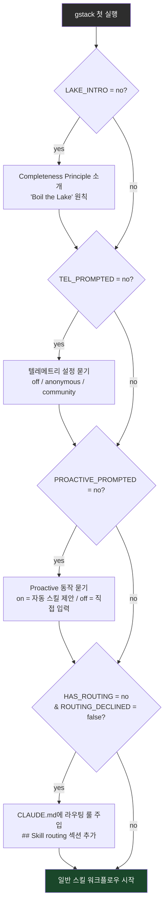

# Harness Analysis: `gstack`

## 0. Metadata

- **이름**: gstack
- **종류**: in-harness skill system (Claude Code 내부 플러그인)
- **저장소**: `/Users/WonjinSin/Documents/project/gstack`
- **분석 커밋/버전**: v0.17.0.0 (commit `23000672`)
- **분석 일시**: 2026-04-15
- **주 언어/런타임**: Bash (스킬 SKILL.md), TypeScript/Bun (빌드 파이프라인 + 바이너리)
- **주 LLM 공급자**: Claude Code (호스트) — gstack 자체는 LLM을 직접 호출하지 않고, Claude Code LLM 위에서 동작한다

## TL;DR — 한 문단 요약

gstack은 Claude Code(Claude의 CLI)에 설치되는 **skill 플러그인 시스템**이다. 유저가 `/ship`, `/qa`, `/investigate` 같은 슬래시 커맨드를 입력하거나, 유저 메시지에서 패턴을 감지하면 Claude Code가 해당 Skill을 자동 로드한다. 각 스킬은 Bash 프리앰블(환경 감지·학습 로드·텔레메트리)로 시작해 구조화된 멀티스텝 워크플로우를 실행한다. LLM 호출 자체는 Claude Code가 담당하고 gstack은 "어떤 순서로 무엇을 할지"를 명령하는 프롬프트 레이어다. 8개 호스트(Claude, Codex, Kiro, OpenClaw 등)를 지원하고, `.tmpl` 파일에서 각 호스트별 `SKILL.md`를 자동 생성하는 빌드 파이프라인이 핵심 구조다.

---

# Part 1: The Story

## 1-1. Main Flow (필수)

```
  유저 입력
  (Claude Code 채팅창)
        │
        ▼
┌─────────────────────────────────────────────────────────┐
│  gstack SKILL.md 로드 (preamble-tier: 1)                │
│  세션 시작·업데이트 체크·설정 읽기                         │
│  SKILL.md:1-93  ·  preamble.ts:generatePreambleBash()  │
└────────────────────────┬────────────────────────────────┘
                         │
                         ▼
┌─────────────────────────────────────────────────────────┐
│  라우팅 결정: 슬래시 커맨드 vs 자연어                       │
│  "슬래시 커맨드면 직결, 아니면 라우팅 룰 매칭"               │
│  SKILL.md.tmpl:28-49  (routing rules prose)             │
└────┬─────────────────────────────────────┬──────────────┘
     │ /qa, /ship 등 명시적                 │ "버그다", "배포해" 등 자연어
     │                                     │ → 룰 매칭 → 스킬 결정
     ▼                                     ▼
┌─────────────────────────────────────────────────────────┐
│  Skill tool 호출 → 서브스킬 SKILL.md 로드                 │
│  (Claude Code 내장 Skill 로딩 메커니즘)                   │
│  ~/.claude/skills/gstack/<skill>/SKILL.md               │
└────────────────────┬────────────────────────────────────┘
                     │
                     ▼
┌─────────────────────────────────────────────────────────┐
│  서브스킬 Preamble 실행 (Bash 블록)                        │
│  - 업데이트 체크 (gstack-update-check)                   │
│  - 세션 파일 터치 (~/.gstack/sessions/$PPID)              │
│  - 설정 읽기 (gstack-config: proactive, telemetry 등)    │
│  - repo-mode 감지 (gstack-repo-mode)                    │
│  - 학습 데이터 로드 (gstack-learnings-search)             │
│  - 텔레메트리 JSONL append                               │
│  preamble.ts:generatePreambleBash()                     │
└────────────────────┬────────────────────────────────────┘
                     │
                     ▼
┌─────────────────────────────────────────────────────────┐
│  스킬 워크플로우 실행                                      │
│  구조화된 단계(Step 1→N) + Claude Code 도구 사용           │
│  (Bash, Read, Write, Edit, Grep, AskUserQuestion 등)    │
│  각 스킬 SKILL.md 본문                                   │
└────────────────────┬────────────────────────────────────┘
                     │
                     ▼
┌─────────────────────────────────────────────────────────┐
│  완료 보고 + 학습 기록                                     │
│  STATUS: DONE / DONE_WITH_CONCERNS / BLOCKED             │
│  gstack-learnings-log (프로젝트 학습 JSONL 추가)           │
│  gstack-timeline-log (세션 이벤트 기록)                   │
│  SKILL.md:290-310  ·  bin/gstack-learnings-log          │
└─────────────────────────────────────────────────────────┘
```

### Narration

이 다이어그램은 유저가 "배포해줘"라고 입력했을 때 gstack `/ship` 스킬이 실행되기까지의 전체 경로다. gstack이 흥미로운 지점은 **LLM을 직접 호출하지 않는다는 것**이다. LLM은 Claude Code가 이미 제공하고 있고, gstack은 "이 스킬을 지금 써야 한다"는 판단과 "이 순서로 이 일을 해라"는 워크플로우 명령만 담당한다.

첫 진입은 gstack의 루트 `SKILL.md`다(`preamble-tier: 1`이라는 frontmatter 필드가 Claude Code에 "이 세션에서 항상 먼저 로드하라"고 지시한다). 이 SKILL.md는 25개가 넘는 라우팅 룰을 포함한다 — "유저가 버그를 말하면 `/investigate`", "배포를 말하면 `/ship`" 같은 규칙들. Claude는 유저 메시지를 보고 이 룰 중 하나를 적용해 `Skill tool`을 호출한다. 유저가 `/ship`처럼 명시적으로 입력하면 라우팅 단계를 건너뛰고 바로 Skill tool로 간다.

Skill tool 호출이 일어나면 Claude Code가 `~/.claude/skills/gstack/ship/SKILL.md`를 읽어 LLM 컨텍스트에 주입한다. 스킬의 첫 번째 지시는 항상 "Preamble을 먼저 실행하라"다. 이 Bash 블록이 세션 파일을 만들고(`~/.gstack/sessions/$PPID`), 업데이트를 확인하고, 이전 세션에서 기록된 프로젝트 학습을 로드한다. 학습이 5개 이상이면 가장 관련 있는 3개를 검색해 컨텍스트에 올린다. 그 다음에야 스킬 본문의 Step 1, Step 2, … 가 시작된다.

워크플로우가 끝나면 gstack은 세 가지를 한다: 완료 상태 보고(`DONE/DONE_WITH_CONCERNS/BLOCKED`), 이번 세션에서 발견한 프로젝트별 quirk를 학습으로 저장, 타임라인 이벤트 기록. 이 세 가지가 "다음 번에 더 잘 한다"의 기반이다.

---

## 1-2. Alternate Paths

### (a) 슬래시 커맨드 직접 실행

```
유저: /ship
      │
      ▼
┌────────────────────────────────────────────────────┐
│  Claude Code: Skill tool 직접 호출                  │
│  라우팅 룰 매칭 단계 생략                            │
│  skill: "ship"                                     │
└────────────────────────┬───────────────────────────┘
                         │
                         ▼
               [Main Flow Step 3 이후 동일]
```

### (b) OpenClaw 오케스트레이터에서 스폰된 세션

```
OpenClaw 오케스트레이터
        │
        │ OPENCLAW_SESSION=1 환경변수 설정
        ▼
┌────────────────────────────────────────────────────┐
│  Preamble 실행                                     │
│  SPAWNED_SESSION=true 감지                         │
│  SKILL.md:251-256                                  │
└────────────────────────┬───────────────────────────┘
                         │
                         ▼
┌────────────────────────────────────────────────────┐
│  Spawned 모드: 모든 대화형 프롬프트 억제             │
│  - AskUserQuestion 금지                            │
│  - 업그레이드 체크 금지                             │
│  - 텔레메트리 프롬프트 금지                          │
│  - 추천 옵션 자동 선택                              │
│  SKILL.md:252-256                                  │
└────────────────────────┬───────────────────────────┘
                         │
                         ▼
┌────────────────────────────────────────────────────┐
│  태스크 실행 → 완료 보고서로 결과 반환               │
│  (prose output, 구조화된 결과 포함)                 │
└────────────────────────────────────────────────────┘
```

### (c) 체인 스킬 실행 (autoplan 예시)

```
유저: /autoplan (or "자동 리뷰해줘")
        │
        ▼
┌──────────────────────────────────────────────────────────────┐
│  autoplan SKILL.md 로드                                       │
│  "순서대로 4개 리뷰 스킬을 읽어서 순차 실행하라"                  │
│  autoplan/SKILL.md                                           │
└────┬───────────────────────────────────────────────────────┘
     │
     │ 각 스킬의 SKILL.md를 Read tool로 직접 읽음 (Skill tool 아님)
     ▼
┌─────────────┐    ┌──────────────────┐    ┌──────────────┐    ┌────────────────┐
│ plan-ceo-   │ →  │ plan-design-     │ →  │ plan-eng-    │ →  │ devex-review   │
│ review      │    │ review           │    │ review       │    │                │
│ 읽고 실행   │    │ 읽고 실행         │    │ 읽고 실행    │    │ 읽고 실행      │
└─────────────┘    └──────────────────┘    └──────────────┘    └────────────────┘
                                                                        │
                                                                        ▼
                                                        ┌───────────────────────────┐
                                                        │  최종 승인 게이트           │
                                                        │  AskUserQuestion           │
                                                        │  (취향 결정만 유저에게)     │
                                                        └───────────────────────────┘
```

### Narration

슬래시 커맨드 직접 실행은 가장 단순한 경로다. 유저가 `/ship`을 입력하면 라우팅 룰 매칭 없이 바로 Skill tool이 발동된다. 자연어 감지보다 빠르고 오류 없이 정확한 스킬이 실행된다.

OpenClaw 스폰 경로는 gstack이 멀티-AI 환경에서 어떻게 동작하는지 보여준다. OpenClaw 오케스트레이터가 `OPENCLAW_SESSION=1` 환경변수를 세팅하고 Claude Code 세션을 시작하면, preamble이 이를 감지하고 "대화형" 동작을 모두 끈다. 업그레이드 안내, 텔레메트리 묻기, 완성 원칙 소개 같은 일회성 온보딩은 모두 생략되고, 태스크 실행과 결과 보고만 남는다. 이 패턴 덕분에 gstack 스킬을 오케스트레이터의 서브태스크로 자동화할 수 있다.

autoplan의 체인 실행은 흥미롭다. 다른 스킬들이 Skill tool을 통해 체인되는 반면, autoplan은 **리뷰 스킬들의 SKILL.md를 Read tool로 직접 읽고** Claude 컨텍스트에 주입한 뒤 실행한다. Skill tool을 쓰면 각 스킬이 독립 컨텍스트로 실행되어 상태를 공유하기 어렵기 때문에, autoplan은 모든 리뷰를 같은 컨텍스트 안에서 순차적으로 수행하는 전략을 선택했다. 이 설계 덕분에 이전 리뷰의 판단이 다음 리뷰에서도 살아있다.

---

## 1-3. Skill Dependency Network (스킬 의존 그래프)

gstack의 본체는 스킬 간 참조 네트워크다. 어떤 스킬이 어떤 스킬을 부르거나 읽는지 그래프로 보면 시스템의 "DNA"가 보인다.

```
┌──────────────────────────────────────────────────────────────────────────────┐
│                          gstack 스킬 의존 그래프                               │
│                                                                              │
│  [gstack root]  ──라우팅──►  /office-hours     (아이디어 검증)                │
│      (preamble-tier:1)   ──►  /investigate     (버그 분석)                   │
│                          ──►  /qa              (QA + browse 바이너리)         │
│                          ──►  /ship            (배포)                        │
│                          ──►  /review          (코드 리뷰)                    │
│                          ──►  /design-review   (디자인 감사)                  │
│                          ──►  /autoplan        (자동 리뷰 파이프라인)           │
│                          ──►  /retro           (회고)                        │
│                          ──►  /codex           (Codex 2nd opinion)           │
│                                                                              │
│  /autoplan  ──Read──►  /plan-ceo-review                                     │
│             ──Read──►  /plan-design-review                                   │
│             ──Read──►  /plan-eng-review                                      │
│             ──Read──►  /devex-review                                         │
│                                                                              │
│  /land-and-deploy  ──Skill──►  /review                                      │
│                    ──Skill──►  /ship                                         │
│                    ──Skill──►  /canary                                       │
│                                                                              │
│  /ship  ──(선택적)Skill──►  /review  (diff 리뷰)                             │
│                                                                              │
│  /qa  ──Bash──►  browse binary  (Playwright headless Chromium)               │
│                  ~/.claude/skills/gstack/browse/dist/browse                  │
│                                                                              │
│  /gstack-upgrade  ──(온라인)──►  git fetch + ./setup                         │
│                                                                              │
│  학습 시스템:  모든 스킬  ──gstack-learnings-log──►  ~/.gstack/projects/      │
│                            (프로젝트 SLUG별 JSONL)                            │
└──────────────────────────────────────────────────────────────────────────────┘
```

### Narration

gstack의 스킬들은 독립적으로 실행되지만 몇 가지 패턴으로 묶인다. **오케스트레이터형** — `autoplan`과 `land-and-deploy`는 다른 스킬들을 순서대로 호출하는 파이프라인이다. **독립 실행형** — `investigate`, `office-hours`, `retro`는 홀로 완결된다. **도구 사용형** — `qa`는 gstack에 번들된 Playwright 바이너리를 직접 실행한다.

학습 시스템은 모든 스킬을 가로지르는 횡단 관심사다. 어떤 스킬이 실행되든, 세션 끝에 `gstack-learnings-log`를 통해 프로젝트 slug별 JSONL에 학습을 남길 수 있다. 다음 세션의 preamble이 이 파일을 읽어 "이 프로젝트에서 지난번에 뭘 배웠는지"를 컨텍스트로 올린다. 스킬 간에 공유 상태가 없는 구조에서 세션 간 기억을 구현하는 방식이다.

browse 바이너리는 gstack만이 가진 특별한 의존성이다. Bun으로 컴파일된 Playwright 래퍼(`browse/dist/browse`)가 상주하며, `$B goto`, `$B snapshot`, `$B screenshot` 같은 명령으로 페이지를 탐색한다. `qa` 스킬은 이 바이너리를 직접 Bash로 호출한다 — MCP 브라우저 도구보다 빠르고 안정적이기 때문이다.

---

## 1-4. 스킬 생성 파이프라인 (Template → SKILL.md)

gstack의 30개 스킬은 손으로 직접 쓴 SKILL.md가 아니다. `.tmpl` 파일에서 자동으로 생성된다. 이 파이프라인이 8개 호스트를 위한 스킬 변형을 만들어내는 핵심 엔진이다.

```
  각 스킬 디렉토리
  (예: ship/, qa/, review/)
          │
          │  SKILL.md.tmpl  (원본)
          ▼
┌─────────────────────────────────────────────────────────┐
│  discoverTemplates() 스캔                               │
│  루트 + 1단계 서브디렉토리에서 SKILL.md.tmpl 탐색         │
│  scripts/discover-skills.ts:17-27                       │
└────────────────────────┬────────────────────────────────┘
                         │
                         ▼
┌─────────────────────────────────────────────────────────┐
│  {{PLACEHOLDER}} 치환 파이프라인                          │
│  - {{PREAMBLE}}   → preamble.ts:generatePreambleBash()  │
│  - {{BROWSE_SETUP}} → browse.ts                         │
│  - {{DESIGN_METHODOLOGY}} → design.ts                   │
│  - {{REVIEW_ARMY}} → review-army.ts                     │
│  - … (resolvers/index.ts에 등록)                         │
│  scripts/gen-skill-docs.ts:RESOLVERS                    │
└────────────────────────┬────────────────────────────────┘
                         │
           HostConfig 기반 변환
           (8개 호스트 × N개 스킬)
                         │
          ┌──────────────┴────────────────┐
          ▼                               ▼
  claude/SKILL.md                  codex/SKILL.md
  (toolRewrites 없음)              (Bash→shell tool 등 변환)
          │                               │
  ~/.claude/skills/gstack/        ~/.codex/skills/gstack/
```

### Narration

이 파이프라인이 존재하는 이유는 단순하다 — 8개 호스트마다 도구 이름이 다르고, 설치 경로가 다르고, 프롬프트 제약이 다르다. 매번 8개 스킬을 따로 유지하면 관리 비용이 폭발한다. 대신 하나의 `.tmpl` 파일을 소스 오브 트루스로 두고, `gen-skill-docs.ts`가 `HostConfig`에 따라 변환을 적용해 각 호스트용 SKILL.md를 뱉는다.

`{{PREAMBLE}}`은 가장 중요한 placeholder다. `preamble.ts`의 `generatePreambleBash()` 함수가 HostConfig를 보고 올바른 바이너리 경로(`~/.claude/skills/gstack/bin/` vs 환경변수 기반 경로)로 채운다. 호스트마다 gstack 설치 경로 규칙이 다르기 때문에 이 한 곳에서 관리한다.

Codex 같은 환경-변수 기반 호스트는 `usesEnvVars: true` 플래그가 설정되어 있어, preamble 생성 시 `$GSTACK_ROOT` 같은 변수를 먼저 설정하는 블록이 앞에 삽입된다(`preamble.ts:18-25`). Claude Code 같은 고정 경로 호스트는 이 블록 없이 하드코딩된 `~/.claude/skills/gstack/` 경로를 쓴다.

---

## 1-5. 설정 흐름과 첫 실행 온보딩

신규 유저가 처음 gstack을 실행하는 경로는 기존 유저와 다르다. preamble이 상태 파일들을 체크해 one-time 온보딩 단계를 순차 실행한다.



### Narration

gstack의 온보딩은 "조각조각 나뉜 한 번만 실행"이다. 한 번에 모든 설정을 묻지 않고, 각 단계마다 상태 파일(`~/.gstack/.completeness-intro-seen`, `~/.gstack/.telemetry-prompted`, `~/.gstack/.proactive-prompted`)을 체크해 아직 안 한 것만 묻는다.

가장 전략적인 단계는 마지막 `HAS_ROUTING` 체크다. 프로젝트의 `CLAUDE.md`에 `## Skill routing` 섹션이 없으면, 유저 동의 하에 15줄짜리 라우팅 룰을 자동으로 추가하고 커밋한다. 이 룰이 한 번 들어가면 그 이후 Claude는 "배포해줘"라고 들어도 자연스럽게 `/ship`을 호출한다 — 유저가 슬래시 커맨드를 외울 필요 없이. gstack이 "설치하면 계속 더 잘 쓴다"는 네트워크 효과를 만드는 핵심 메커니즘이다.

Spawned session(`OPENCLAW_SESSION=1`)에서는 이 온보딩 전체가 스킵된다. 오케스트레이터 환경에서 AskUserQuestion을 보내면 세션이 멈추기 때문이다.

---

# Part 2: Reference Details

## 2-1. Entry Points

슬래시 커맨드(`/qa`, `/ship` 등)와 자연어 라우팅 두 가지 진입점. 루트 SKILL.md(preamble-tier:1)가 Claude Code 세션 시작 시 자동 로드된다. 공통 디스패처는 Claude Code 내장 Skill tool이며, gstack이 직접 요청을 라우팅하는 게 아니라 Claude가 라우팅 룰을 보고 Skill tool을 호출하는 구조다.

## 2-2. Concurrency

해당 없음 — gstack은 Claude Code 위에서 돌아가는 프롬프트 레이어다. 동시성 관리는 Claude Code가 처리한다. 스킬은 순차 실행이며, `autoplan`처럼 여러 스킬을 체인할 때도 하나씩 순서대로 실행된다.

## 2-3. Routing

두 계층. ① 결정론적 — 유저가 `/ship` 같이 명시적 슬래시 커맨드를 입력하면 Claude Code Skill tool이 직결(`SKILL.md.tmpl:28`). ② AI 라우팅 — gstack 루트 SKILL.md 안의 25개 자연어 매칭 룰을 Claude가 보고 Skill tool 호출 여부를 판단. 스트림 중 번복은 없다 — 룰 매칭은 세션 시작에만 일어난다.

## 2-4. Context Assembly

각 스킬 Preamble이 실행되면서 컨텍스트가 조립된다: ① 스킬 SKILL.md 전체(2000-4000줄 이하로 유지 권고), ② preamble bash 출력(BRANCH, PROACTIVE, REPO_MODE, LEARNINGS 등), ③ `gstack-learnings-search --limit 3` 결과(5개 이상 학습이 있을 때). 조립 지점은 스킬마다 개별 preamble이며 중앙 단일 지점이 아니다.

## 2-5. Provider Abstraction

직접 LLM을 호출하지 않으므로 Provider Abstraction 없음. 대신 **Host Abstraction**이 존재한다 — `HostConfig` 인터페이스(`scripts/host-config.ts`)가 각 AI 에이전트 환경(Claude, Codex, Kiro 등)의 차이를 추상화하고, `scripts/gen-skill-docs.ts`가 이를 기반으로 호스트별 SKILL.md를 생성한다.

## 2-6. Worker / Execution

실행 단위는 개별 스킬(SKILL.md). Claude Code 자체가 worker다. 스킬 내 abort/timeout은 Claude Code의 세션 관리에 위임된다. gstack은 별도 timeout 메커니즘을 두지 않는다.

## 2-7. Message Loop

해당 없음 — gstack은 스트리밍 메시지 루프를 관리하지 않는다. Claude Code가 스트림을 처리하고, gstack 스킬은 그 결과로서 실행된다.

## 2-8. Session / State

세션은 `~/.gstack/sessions/$PPID` 파일 존재 여부로 추적된다. 120분 후 자동 만료(`preamble.ts:33-36`). 세션 간 상태 공유는 없고, 프로젝트 학습(`~/.gstack/projects/{slug}/learnings.jsonl`)만이 세션을 넘는 영속 상태다. 세션 모델은 Mutable이 아닌 **Append-only** — 새 학습은 추가만 되고, 덮어쓰지 않는다.

## 2-9. Isolation

격리 없음 — gstack은 현재 작업 디렉토리에서 그대로 실행된다. 단, `lib/worktree.ts`가 존재하고 일부 스킬(특히 ship, review)에서 git worktree를 사용해 안전한 작업 공간을 만들 수 있다. Resolver 우선순위: 스킬 자체 명세 → 사용자 선택 → 없으면 현재 디렉토리.

## 2-10. Tool / Capability

Claude Code 도구를 스킬 frontmatter의 `allowed-tools`로 선언한다. 기본 도구: `Bash`, `Read`, `Write`, `Edit`, `Grep`, `Glob`, `AskUserQuestion`, `Agent`, `WebSearch`. 확장점: ① browse 바이너리(`browse/dist/browse` — Playwright 래퍼), ② design 바이너리(`design/dist/design` — GPT Image API 래퍼), ③ 30개 bin 유틸리티(`gstack-config`, `gstack-learnings-search` 등). Per-skill 도구 제한이 가능하다 — `learn/SKILL.md`는 `Agent` 없이도 동작하도록 최소한의 도구만 선언.

## 2-11. Workflow Engine

별도 YAML/JSON 워크플로우 엔진 없음. 워크플로우는 SKILL.md 마크다운 안에 "Step 1 → Step 2 → …" 형식의 **프로즈**로 정의된다. Claude가 이 프로즈를 읽고 순서를 따른다. 조건 분기도 "if X then Y, otherwise Z" 형태의 자연어로 표현된다.

## 2-12. Configuration

| 계층 | 파일/소스 | 우선순위 |
|------|-----------|---------|
| 런타임 환경변수 | `GSTACK_STATE_DIR`, `OPENCLAW_SESSION` | 최고 |
| 유저 설정 | `~/.gstack/config.yaml` | 중간 |
| 코드 기본값 | preamble bash `|| echo "true"` fallback | 최저 |

설정 키: `proactive`, `routing_declined`, `telemetry`, `auto_upgrade`, `update_check`, `skill_prefix`. 런타임 재로드 가능 — 각 스킬 실행 시 preamble이 새로 읽는다.

## 2-13. Error Handling

**Fail Fast but Graceful** 철학. 스킬 워크플로우 실패 시 `STATUS: BLOCKED` 또는 `STATUS: DONE_WITH_CONCERNS`로 보고(`SKILL.md:269-278`). 3번 시도 후 실패하면 STOP + 에스컬레이션 필수. bin 유틸리티들은 모두 `2>/dev/null || true` 패턴으로 감싸여 있어 실패해도 preamble 전체가 죽지 않는다 — 핵심 기능 보호를 위한 의도적 선택.

## 2-14. Observability

두 가지 채널: ① 로컬 JSONL(`~/.gstack/analytics/skill-usage.jsonl`) — 텔레메트리 off여도 항상 기록, ② 원격 텔레메트리(`gstack-telemetry-log`) — `community` 모드에서만 전송. 타임라인 로그(`~/.gstack/analytics/timeline.jsonl` 추정)는 별도 채널. 이벤트 네이밍: `{"skill":"ship","ts":"...","repo":"..."}` 패턴. 외부 연동 없음(OpenTelemetry 미사용).

## 2-15. Platform Adapters

8개 호스트: `claude`, `codex`, `factory`, `kiro`, `opencode`, `slate`, `cursor`, `openclaw`. 각 호스트는 `HostConfig` 인터페이스를 구현(`hosts/index.ts:19`). 주요 필드: `globalRoot`(설치 경로), `toolRewrites`(도구 이름 변환), `frontmatter.mode`(allowlist/denylist), `usesEnvVars`(경로 전략). 스킬 설치는 `setup` 스크립트가 각 호스트 디렉토리에 symlink 또는 real-dir을 생성한다.

## 2-16. Persistence

| 저장소 | 경로 | 내용 |
|--------|------|------|
| 설정 | `~/.gstack/config.yaml` | 유저 설정 |
| 세션 | `~/.gstack/sessions/` | $PPID 파일 (120분 TTL) |
| 학습 | `~/.gstack/projects/{slug}/learnings.jsonl` | 프로젝트별 경험 |
| 분석 | `~/.gstack/analytics/skill-usage.jsonl` | 스킬 사용 로그 |
| 타임라인 | `~/.gstack/analytics/` | 세션 이벤트 |
| 상태 플래그 | `~/.gstack/.*.seen`, `~/.gstack/.*.prompted` | One-time 온보딩 체크 |

DB 없음. 모두 파일 기반(JSONL/YAML/touch file). 민감 정보 없음 — repo 이름만 기록되며 코드·파일 경로 미전송.

## 2-17. Security Model

신뢰 모델: 로컬 유저 신뢰(싱글 유저 도구, 멀티 유저 환경 미지원). `umask 077`로 설치 디렉토리를 owner-only로 생성(`setup:5`). 시크릿: 환경변수로만 처리(`TEST_EMAIL`, `TEST_PASSWORD` 등) — 스킬 파일에 시크릿 없음. `ANTHROPIC_API_KEY`는 eval 실행 시에만 사용하며 스킬 실행에는 불필요(Claude Code가 관리).

## 2-18. Key Design Decisions & Tradeoffs

gstack의 결정적 선택들은 "Claude Code를 하네스로 쓴다"는 전제에서 나온다.

| 결정 | 선택 | 대안 | 근거 | 트레이드오프 |
|------|------|------|------|------------|
| LLM 직접 호출 | 하지 않음 — Claude Code에 위임 | 자체 API 호출 | 설치 간소화, API 키 불필요 | 호스트 변경 시 이식성 제한 |
| 워크플로우 정의 | 마크다운 프로즈 | YAML/JSON 스키마 | 가독성, LLM이 직접 읽고 따름 | 파싱 불가, 버전 검증 어려움 |
| 상태 관리 | 파일 기반 JSONL | DB | 의존성 제로, 유저가 직접 열람 가능 | 동시성 없음, 검색 O(n) |
| 스킬 문서 생성 | .tmpl → gen-skill-docs 파이프라인 | 수동 유지 | 8개 호스트 × N 스킬 유지비 절감 | 빌드 단계 추가, tmpl 오류 디버깅 어려움 |
| 호스트 추상화 | HostConfig + toolRewrites | 호스트별 별도 레포 | 한 소스에서 전 호스트 지원 | 새 호스트 추가 시 HostConfig 숙지 필요 |
| 세션 격리 | 격리 없음 (CWD 그대로) | Docker/worktree 강제 | 설치 간소화 | 실수로 프로덕션 디렉토리 수정 가능 |

## 2-19. Open Questions

- `preamble-tier` 숫자(1, 2, 3, 4)가 실제로 Claude Code 로딩 우선순위에 영향을 주는지 — Claude Code 내부 Skill loader 동작 문서에서 확인 필요.
- `lib/worktree.ts`가 어떤 스킬에서 실제로 호출되는지 — `Grep "worktree"` on all SKILL.md files로 확인.
- `gstack-telemetry-sync` 바이너리가 원격 전송하는 정확한 엔드포인트 — `bin/gstack-telemetry-sync` 소스 확인.

---

## Appendix: Quick Reference Table

| 항목 | 값 |
|------|-----|
| Type | in-harness skill system |
| Entry points | slash command + natural language routing |
| Concurrency | N/A (Claude Code 위임) |
| Router style | 결정론적(slash) + AI 룰 매칭(자연어) |
| Provider abstraction | HostConfig (8개 호스트) |
| Session model | File-touch 기반, 120분 TTL |
| Isolation | 없음 (CWD 그대로) |
| Workflow engine | Markdown prose (자연어 Step 정의) |
| Primary language | Bash (스킬 실행) / TypeScript/Bun (빌드) |
| LoC (approx) | SKILL.md ~50K줄 + scripts ~3K줄 + browse ~15K줄 |
