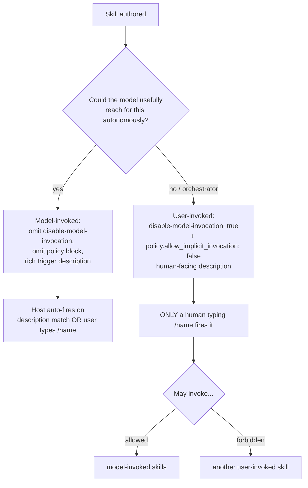
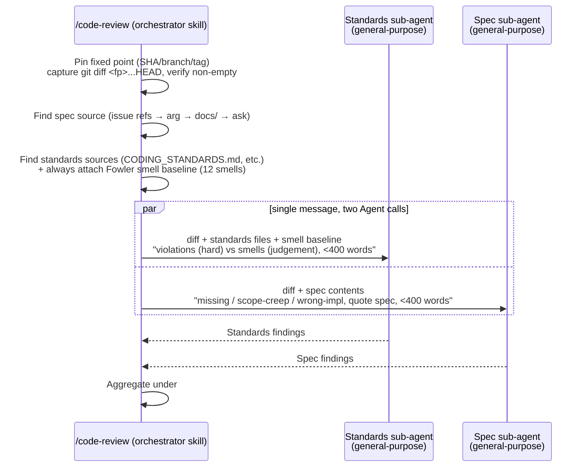

# Harness Analysis: `matt-pocock-skills`

## 0. Metadata

- **Name**: matt-pocock-skills ("Skills For Real Engineers")
- **Type**: in-harness skill system (Claude Code plugin + skills.sh-installable skill set)
- **Repository**: https://github.com/mattpocock/skills (local: `/Users/WonjinSin/Documents/project/skills`)
- **Analysis commit/version**: local checkout, git HEAD `9603c1c` (package.json `1.1.0` / plugin.json `1.2.0` — the two version fields are out of sync in this checkout)
- **Analysis date**: 2026-07-22
- **Primary language/runtime**: Markdown (skill definitions) + a little Bash (two dev-only scripts). Zero runtime dependencies — the only npm deps are `@changesets/*` devDependencies for release tooling.
- **Primary LLM provider**: Host-dependent (Claude Code → Claude; Codex → whatever Codex runs; any Agent-Skills-standard harness → its own model). The skills never call an LLM directly.

## TL;DR — One-paragraph summary

matt-pocock-skills is an **in-harness skill system** deliberately built as the *opposite* of a process-owning framework — its README explicitly positions it against GSD, BMAD, and Spec-Kit for "taking away your control." It ships ~23 promoted skills (across `engineering/` and `productivity/`) as pure markdown, installable two ways: `npx skills add mattpocock/skills` (skills.sh copies editable files into your repo, works on Claude Code + Codex + any Agent-Skills-standard harness) or as a native Claude Code plugin (read-only, versioned bundle). The single most important structural fact — and the sharpest contrast with superpowers — is that **there is no SessionStart hook and no injected master rulebook**: the plugin ships no hooks at all. Routing is left entirely to the host's *native* skill-description matching. Skills split on one axis, **who can invoke them**: *user-invoked* skills (`disable-model-invocation: true`, reached only when a human types `/grill-me`) orchestrate flows; *model-invoked* skills (auto-reachable when their `description` matches) hold reusable discipline like `/tdd` and `/code-review`. The through-line of the whole set is human alignment before code: the "grilling" interview primitive, a curated `CONTEXT.md` domain glossary + ADRs as durable shared-language memory, and a per-repo issue tracker (GitHub / GitLab / Linear / local `.scratch/`) as the multi-session state backbone. Enforcement is essentially nil — no `<HARD-GATE>`, no blocking hook — placing it at the extreme high-trust / low-enforcement end of the spectrum, even further right than superpowers.

---

# Part 1: The Story

## 1-1. Main Flow (primary)

Unlike superpowers, there is **no automatic session-start injection**. Nothing is pushed into context before the user speaks. The agent relies on the host harness's own skill-discovery machinery reading each skill's `description` frontmatter.

```
┌────────────────────────────────────────────────────────────┐
│  New session start                                         │
│  NO plugin hook fires. NO master rulebook injected.        │
│  (Plugin ships zero hooks — verified: only hook reference  │
│   is git-guardrails-claude-code, an UNPROMOTED misc/ skill │
│   that helps the USER install their own hook.)             │
└───────────────────────────┬────────────────────────────────┘
                            │
                            ▼
┌────────────────────────────────────────────────────────────┐
│  (One-time, per repo) /setup-matt-pocock-skills            │
│  Human-run, user-invoked. Configures:                      │
│   · issue tracker  (GitHub / GitLab / Linear / local)      │
│   · triage label vocabulary (5 canonical roles)            │
│   · domain doc layout (CONTEXT.md + docs/adr/)             │
│  Writes docs/agents/{issue-tracker,domain,triage-labels}.md │
│  + an "## Agent skills" block into CLAUDE.md / AGENTS.md   │
└───────────────────────────┬────────────────────────────────┘
                            │
                            ▼
              ┌─────────────┴──────────────┐
              │  User message received      │
              │  "Build X" / "/grill-me"    │
              └─────────────┬──────────────┘
                            │
              ┌─────────────┴──────────────────────────┐
              │  How was a skill reached?               │
              └──┬───────────────────────────────┬──────┘
       user types /name                 description auto-matches
       (user-invoked OR                 (model-invoked only;
        model-invoked)                   user-invoked ones are
                 │                        walled off via
                 │                        disable-model-invocation)
                 ▼                                │
    ┌────────────────────────┐                    ▼
    │ Host loads SKILL.md    │        ┌────────────────────────────┐
    │ (native Skill tool)    │        │ Host auto-loads SKILL.md   │
    └──────────┬─────────────┘        └──────────┬─────────────────┘
               └───────────────┬─────────────────┘
                               ▼
┌────────────────────────────────────────────────────────────┐
│  Skill markdown loaded; agent acts on its instructions.    │
│  Skills reach OTHER skills by /skill-style prose           │
│  invocation ("Run /grilling", "use /tdd", "close with      │
│  /code-review") — NOT by ../other-skill/FILE.md paths.     │
│  Durable side-effects land in the issue tracker,           │
│  CONTEXT.md, and ADRs — not in any plugin-owned state.     │
└────────────────────────────────────────────────────────────┘
```

### Narration

The story here is defined by an **absence**. Where superpowers' entire first phase is a `SessionStart` hook that JSON-injects `using-superpowers/SKILL.md` so the agent boots already knowing "invoke a skill for any 1% applicability," matt-pocock-skills injects **nothing**. A grep across the repo for `SessionStart|UserPromptSubmit|PreToolUse` returns exactly one hit — `skills/misc/git-guardrails-claude-code/SKILL.md` — and that is a *skill that helps a user set up their own PreToolUse hook*, living in the unpromoted `misc/` bucket, absent from `plugin.json`'s `skills` array. The plugin distributes no hooks of its own. Routing is therefore delegated wholesale to the host's native skill-description matcher.

That design has a direct consequence: the system has **two invocation classes** rather than one uniform "check for a skill" rule (`.agents/invocation.md`). *User-invoked* skills carry `disable-model-invocation: true` (Claude Code) plus `policy.allow_implicit_invocation: false` in a sibling `agents/openai.yaml` (Codex), and can be fired **only by a human typing the name** — these are the orchestrators (`grill-me`, `to-spec`, `to-tickets`, `implement`, `triage`, `wayfinder`, `ask-matt`, `setup-matt-pocock-skills`). *Model-invoked* skills omit those flags and keep rich trigger phrasing in their `description` so the host auto-fires them — these are the reusable disciplines (`tdd`, `code-review`, `grilling`, `research`, `prototype`, `domain-modeling`, `codebase-design`, `diagnosing-bugs`). The rule "a user-invoked skill may invoke model-invoked skills, but never another user-invoked one" is what keeps orchestration one layer deep.

The second structural pillar is the **per-repo setup step**. `/setup-matt-pocock-skills` is a precondition, not part of any feature flow: it explores the repo, then writes `docs/agents/issue-tracker.md`, `docs/agents/domain.md`, and (if `triage` is installed) `docs/agents/triage-labels.md`, plus an `## Agent skills` block into whichever of `CLAUDE.md`/`AGENTS.md` already exists. From then on, the feature skills read those files to know *where issues live* and *what the domain vocabulary is*. This makes the issue tracker and `CONTEXT.md` the system's real backbone, in place of the injected rulebook other systems use.

Core design tradeoff (mirroring superpowers but taken further): all behaviour depends on the LLM voluntarily reaching for the right skill via native description matching, with no injected reminder and no enforcement gate. The upside is zero coupling to any one harness's hook format and maximum "hack it, make it yours" adaptability; the downside is that a cold agent may simply never reach for a skill.

---

## 1-2. Skill flow network (the `ask-matt` map)

There is no auto-injected dependency graph. Instead, one **user-invoked router skill, `ask-matt`, is the map** — but you have to type `/ask-matt` to see it. Its own words: "You don't remember every skill, so ask." The flow it documents:

```
                    ┌─────────────────────────┐
                    │   /setup-matt-pocock-    │  ← precondition, run once/repo
                    │        skills            │    (issue tracker, labels, docs)
                    └───────────┬─────────────┘
                                │
        ON-RAMPS                ▼         MAIN FLOW: idea → ship
   ┌───────────────┐   ┌──────────────────────────────────┐
   │ /triage       │   │ 1. /grill-with-docs  (have code)  │
   │ (issues piling│──▶│    or /grill-me      (no code)    │
   │  up → agent-  │   │    — both run /grilling primitive │
   │  ready issues)│   └───────────────┬──────────────────┘
   ├───────────────┤                   │
   │ /diagnosing-  │        branch: settle every question?
   │  bugs         │        │ needs runnable answer           │ multi-session?
   │ (something    │        ▼                                 ▼
   │  broken)      │   /handoff → /prototype → /handoff   yes → /to-spec
   ├───────────────┤   (throwaway code answers it)              → /to-tickets
   │ /wayfinder    │                                            (tracer bullets,
   │ (too big for  │───────────────────────────────────────▶    blocking edges)
   │  one session; │        no → /implement here                     │
   │  decision     │                   │                             │
   │  tickets)     │                   ▼                    per ticket, fresh ctx
   └───────────────┘            /implement ──drives──▶ /tdd (red-green slices)
                                     │      ──closes──▶ /code-review (2-axis)
                                     ▼
                                commit to current branch

   VOCABULARY UNDERNEATH (model-invoked, pulled in by the above):
     /domain-modeling  → sharpens CONTEXT.md glossary + ADRs
     /codebase-design  → deep-module vocabulary (interface, seam, depth)

   STANDALONE: /research (background agent, primary sources),
               /teach, /writing-great-skills
```

### Narration

`ask-matt` frames the set as **one main flow (idea → ship) plus two on-ramps that merge onto it**. The main flow is a grilling → spec → tickets → implement pipeline, and its most repeated instruction is *context hygiene*: keep grilling, spec, and tickets in "one unbroken context window" (bounded by the ~120k-token "smart zone"), then start each `/implement` fresh from a ticket. That is the system's answer to context contamination — analogous to superpowers dispatching a clean implementer subagent per task, but achieved by *human-driven session boundaries and the issue tracker* rather than by an orchestrator curating subagent prompts.

The on-ramps are `/triage` (raw incoming issues → agent-ready briefs), `/diagnosing-bugs` (a disciplined reproduce→minimise→hypothesise→fix→regression-test loop for hard bugs), and `/wayfinder` (the heaviest flow — charts a huge, foggy effort as a map of *decision tickets* on the tracker and resolves them one at a time, producing "decisions, not deliverables"). All of them feed back into the main flow at `/to-spec` or `/implement`.

Skills reach one another by **prose `/skill` invocation**, never by `../other-skill/FILE.md` cross-references (`.agents/invocation.md`). `/implement` says "Use /tdd where possible… Once done, use /code-review" — it does not read tdd's files. This keeps every skill independently movable and is the composability the README sells.

---

## 1-3. Alternate Paths

### (a) Direct skill invocation — the default, not the exception

Because there is no injected rulebook nudging the agent toward skills, **explicitly typing `/grill-me` or `/to-spec` is the ordinary way in**, not a special case. The user-invoked orchestrators are *only* reachable this way — the model cannot auto-fire them.

### (b) Model-invoked auto-reach

A model-invoked skill fires when its `description` matches the task, with no user keystroke. `/tdd` ("Use when the user wants to build features or fix bugs test-first, mentions red-green-refactor"), `/code-review`, `/prototype`, and `/diagnosing-bugs` are written this way. This is the *only* automatic routing in the system, and it is entirely the host's native mechanism — matt-pocock-skills adds nothing to it.

### (c) The grilling primitive — the alignment engine

```
User: "/grill-me"  or  "/grill-with-docs"  (have a codebase)
        │
        ▼
┌────────────────────────────────────────────────────────┐
│  /grilling (model-invoked primitive) runs:             │
│   · interview one question at a time, wait for answer  │
│   · give a recommended answer for each question        │
│   · FACTS → look them up (filesystem/tools)            │
│   · DECISIONS → put to the human, never self-answer    │
│   · CONFIRMATION GATE: do not act until the human      │
│     confirms shared understanding is reached           │
└───────────────────────────┬────────────────────────────┘
                            │  grill-with-docs only:
                            ▼
        also updates CONTEXT.md glossary + writes ADRs
        (delegates to /domain-modeling)
```

The facts-vs-decisions split (added in v1.1.0, per CHANGELOG) exists specifically so that when *another* skill runs grilling inside a "resolve the ticket" frame, the agent doesn't race ahead and answer its own decisions. The confirmation gate ("Do not act on it until I confirm") is the closest thing in the whole system to an enforcement mechanism — and it is a soft, in-prose stop, not a code gate.

---

## 1-4. Two invocation classes (Decision Tree)



### Narration

This tree is the system's actual "routing engine," and it lives per-skill in frontmatter, not in a central file. Two harness-specific mechanisms enforce the wall around user-invoked skills — Claude Code's `disable-model-invocation: true` and Codex's `policy.allow_implicit_invocation: false` in `agents/openai.yaml` — and `.agents/invocation.md` requires them kept in sync ("user-invoked in both harnesses or neither"). The test an author applies is explicitly *reuse-independent*: "could the model usefully reach for this autonomously?" — reuse is the reason to *extract* a skill, not the reason to make it model-invoked.

---

## 1-5. code-review two-axis parallel review



### Narration

`/code-review` is the clearest example of subagent use in the set. It fans the review into **two parallel `general-purpose` sub-agents** so the axes "don't pollute each other's context," then presents them side by side and deliberately refuses to pick a single cross-axis winner — the separation exists precisely to stop one axis masking the other (code that follows every standard but implements the wrong thing, or vice versa). The Standards axis always carries an inlined **Fowler "Bad Smells in Code" baseline** (~12 smells) that applies even in a repo that documents no standards, with two binding safeties: a documented repo standard overrides the baseline, and every smell is reported as a judgement call, never a hard violation. This is the same "spec compliance vs. code quality" two-gate idea superpowers uses, but run in *parallel* rather than sequentially and with no re-review loop mandated.

---

# Part 2: Reference

## 2-1. 18-Dimension values

| # | Dimension | matt-pocock-skills |
|---|-----------|--------------------|
| 1 | Type | in-harness skill system (Claude Code plugin + skills.sh skill set) |
| 2 | Direct LLM call | No — host owns every LLM call |
| 3 | Entry point | User types `/skill` (user-invoked) OR host auto-fires on `description` match (model-invoked). **No SessionStart hook.** `/setup-matt-pocock-skills` is a one-time per-repo precondition |
| 4 | Routing | Host-native skill-description matching + explicit slash commands; `ask-matt` is an opt-in router skill you invoke, not an injected rule. No enforced priority |
| 5 | Isolation | None shipped in the promoted set — `/implement` just "commit to the current branch." No worktree skill. Context isolation is human-driven (fresh session per ticket) |
| 6 | Concurrency | No control mechanism. Parallelism is *enabled* by tracer-bullet **blocking edges** (a dependency DAG on a real tracker lets several agents grab unblocked tickets) — but no lock/queue/FIFO |
| 7 | Session model | Stateless plugin. Multi-session continuity carried by the **issue tracker** + `/handoff` documents (written to the OS temp dir) |
| 8 | State store | Issue tracker (GitHub / GitLab / Linear / local `.scratch/`) + `CONTEXT.md` + `docs/adr/` + `docs/agents/*.md` config. No DB, no plugin-owned state files |
| 9 | Context assembly | None automatic. Skills read `docs/agents/issue-tracker.md`, `CONTEXT.md`, and ADRs on demand as instructed by their own prose |
| 10 | Workflow engine | None. Flows are markdown checklists + `/skill` prose invocation; `ask-matt` is the human-readable map |
| 11 | Enforcement | Essentially none — no `<HARD-GATE>`, no blocking hook. Only a soft in-prose "confirmation gate" in `/grilling` ("don't act until I confirm") |
| 12 | Platform support | Claude Code (native plugin **and** skills.sh) + Codex + any Agent-Skills-standard harness (via skills.sh copy). Native Codex plugin deferred (ADR 0002) |
| 13 | Learning/memory | **Human-curated shared language**: `CONTEXT.md` domain glossary + ADRs (built/sharpened by `/grill-with-docs` + `/domain-modeling`), plus `.out-of-scope/` KB in triage. Not a confidence-scored or JSONL log |
| 14 | Model selection | Host-dependent; no tier routing. Sub-agents (`code-review`, `research`) use the host's `general-purpose` agent |
| 15 | Guardrails | None shipped. The one hook mechanism, `git-guardrails-claude-code`, is an **unpromoted `misc/` skill** that helps the user install their own PreToolUse block into their own settings |
| 16 | Extensibility | Add a `SKILL.md` under a bucket; hack the copied files (skills.sh path) or subscribe read-only (plugin path). Two invocation classes to choose from |
| 17 | Dependencies | Zero runtime deps (only `@changesets/*` devDeps for releases) |
| 18 | Primary language | Markdown (skills) + minimal Bash (two dev-only scripts) |

## 2-2. Strengths / Weaknesses / Best-for

### Strengths

- **Human-alignment-first**: the grilling primitive (`/grill-me`, `/grill-with-docs`) plus a facts-vs-decisions split and a confirmation gate directly attack the #1 failure mode ("the agent didn't do what I want") before any code is written.
- **Shared-language memory no other analysed harness has**: a curated `CONTEXT.md` domain glossary + ADRs, actively built and sharpened (`/domain-modeling`), used by tdd/to-tickets/code-review for consistent naming — human-authored knowledge, not a scored instinct or append-only log.
- **Deliberately un-opinionated / composable**: pure-markdown skills, prose-only cross-references, two clean invocation classes, "hack it and make it yours." Explicitly refuses to own the process the way GSD/BMAD/Spec-Kit do.
- **Two install philosophies**: skills.sh copies editable files (fork-and-own, multi-harness) *or* a native Claude plugin subscribes to a read-only versioned bundle. Users pick control vs. maintenance-free.
- **Tracker-native task model**: tracer-bullet tickets with blocking edges become real dependency links on GitHub/GitLab/Linear, so unblocked tickets can be worked in parallel by several agents.

### Weaknesses / Tradeoffs

- **No enforcement whatsoever** — no injected rulebook, no `<HARD-GATE>`, no blocking hook. A cold agent can simply never reach for a skill; the whole system leans on host-native description matching + the human typing the right command.
- **No isolation in the shipped set** — `/implement` commits to the current branch; there is no worktree skill, so accidental work on the wrong branch is unguarded.
- **No concurrency control** — parallelism is enabled by the ticket DAG but nothing locks or queues; two agents on overlapping tickets can collide.
- **Setup burden + external coupling** — `/setup-matt-pocock-skills` must run per repo, and the richest flows assume a configured issue tracker (`gh`/`glab`/Linear) and maintained `CONTEXT.md`/ADRs; skip that upkeep and the value erodes.
- **Version drift observed** — `package.json` (1.1.0) and `plugin.json` (1.2.0) disagree in this checkout, despite the CLAUDE.md rule to keep them in sync.

### Best-for

Individual engineers and small teams who **want discipline offered, not imposed** — who value getting relentlessly interviewed into alignment, building a durable shared vocabulary for their codebase, and slicing work into tracer-bullet tickets, while keeping full control to adapt or ignore any skill. A strong fit for those who move between Claude Code and Codex and want the same editable skill set in both. A poor fit for anyone who needs *guaranteed* gates (TDD-or-block, review-or-block), sandboxed isolation, or automated long-running loops — matt-pocock-skills intentionally provides none of those.

---

## Appendix: Quick Reference Table

| Item | Value |
|------|-------|
| Type | in-harness skill system (plugin + skills.sh) |
| Entry points | `/skill` typed (user-invoked) · description auto-match (model-invoked) · one-time `/setup-matt-pocock-skills`. **No SessionStart hook** |
| Concurrency | None (tracer-bullet blocking edges *enable* parallel tickets; no lock/queue) |
| Router style | Host-native description matching + explicit slash; `ask-matt` is an opt-in map skill |
| Provider abstraction | None (delegated to host) |
| Session model | Stateless plugin; continuity via issue tracker + `/handoff` docs |
| Isolation | None shipped (human-driven fresh session per ticket) |
| Workflow engine | None (markdown checklists + `/skill` prose invocation) |
| Enforcement | None (soft `/grilling` confirmation gate only) |
| Memory | `CONTEXT.md` glossary + ADRs (human-curated shared language) |
| Primary language | Markdown + minimal Bash |
| Promoted skills | ~23 (17 engineering + ~6 productivity) |
| Supported platforms | Claude Code (plugin + skills.sh), Codex + any Agent-Skills-standard harness (skills.sh) |
| Dependencies | zero runtime (changesets devDeps only) |
```
