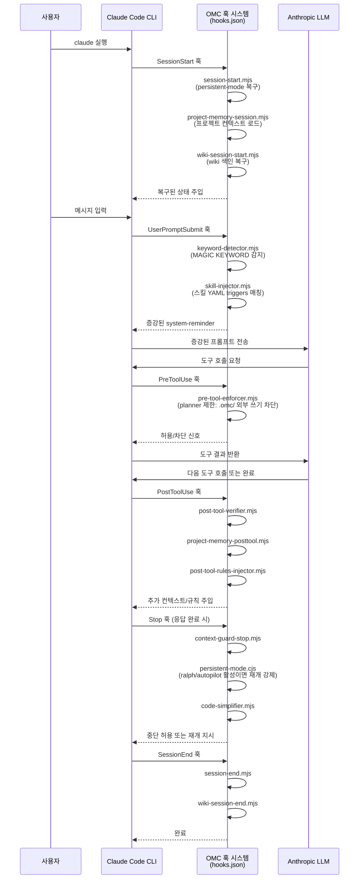

# Harness Analysis: `oh-my-claudecode (OMC)`

## 0. Metadata

- **이름**: oh-my-claudecode (OMC)
- **종류**: in-harness skill system / hybrid (Claude Code 플러그인 + Claude Agent SDK 라이브러리)
- **저장소**: `/Users/WonjinSin/Documents/project/oh-my-claudecode`
- **분석 버전**: v4.11.6 (커밋 `cf06566d`)
- **분석 일시**: 2026-04-15
- **주 언어/런타임**: TypeScript / Node.js 20+
- **주 LLM 공급자**: Anthropic Claude (Opus 4.x / Sonnet 4.x / Haiku 4.x), Codex/Gemini 브리지 포함

## TL;DR — 한 문단 요약

oh-my-claudecode는 Claude Code 위에 얹히는 **다층 오케스트레이션 레이어**다. Claude Code가 받는 사용자 메시지를 훅으로 가로채어 매직 키워드를 증폭시키고, 트리거 패턴으로 알맞은 스킬을 자동 삽입하며, 19개 전문 에이전트를 파견해 병렬로 일을 처리한다. 단독 Claude Code와 달리 `ralph`·`autopilot`·`ultrawork` 같은 실행 모드를 통해 **PRD 기반의 반복 루프**나 **아이디어→코드 전 생명주기 자동화**를 지원하며, LSP·AST·Python REPL을 커스텀 MCP 서버로 노출해 IDE급 코드 인텔리전스까지 제공한다. 두 가지 진입 형태(Claude Code 플러그인, SDK 라이브러리)를 동시에 지원한다는 것이 핵심 특징이다.

---

# Part 1: The Story

## 1-1. Main Flow — 유저 메시지에서 LLM 응답까지

```
사용자 입력
    │
    ▼
┌───────────────────────────────────────────────────────┐
│  Claude Code CLI가 UserPromptSubmit 훅 발화            │
│  (메시지가 LLM으로 가기 전 전처리 시작)                   │
│  hooks.json · hooks/UserPromptSubmit[]                │
└───────────────────────┬───────────────────────────────┘
                        │ stdin으로 메시지 전달
           ┌────────────┼────────────┐
           │                        │
           ▼                        ▼
┌──────────────────┐   ┌────────────────────────────────┐
│  키워드 감지       │   │  스킬 주입                       │
│  ultrawork/ralph │   │  트리거 매칭 → SKILL.md 내용 삽입  │
│  autopilot/ccg.. │   │  (세션당 최대 5개)                │
│  keyword-        │   │  skill-injector.mjs             │
│  detector.mjs    │   └──────────────────┬─────────────┘
└──────────┬───────┘                      │
           │  [MAGIC KEYWORD: ...] 삽입    │  스킬 내용 system-reminder로
           │                              │
           └──────────┬───────────────────┘
                      │ 증강된 프롬프트
                      ▼
┌──────────────────────────────────────────────────────┐
│  Claude Code 오케스트레이터 (OMC 시스템 프롬프트 적용)    │
│  AGENTS.md + continuationEnforcement + contextFiles  │
│  omcSystemPrompt()  ·  src/agents/definitions.ts     │
└──────────────────────┬───────────────────────────────┘
                       │ 에이전트 파견 결정
          ┌────────────┼──────────────────┐
          │            │                  │
          ▼            ▼                  ▼
┌──────────────┐ ┌──────────────┐ ┌──────────────────┐
│  직접 처리    │ │  전문 에이전트 │ │  백그라운드 에이전트│
│  (간단한 작업)│ │  Task 도구    │ │  Task(background)│
│              │ │  19종 파견    │ │  동시 최대 5개     │
└──────┬───────┘ └──────┬───────┘ └────────┬─────────┘
       │                │                   │
       └────────────────┼───────────────────┘
                        │ LLM 호출
                        ▼
┌──────────────────────────────────────────────────────┐
│  Anthropic Claude API                                 │
│  (High=Opus, Medium=Sonnet, Low=Haiku 3-티어 라우팅)  │
│  createOmcSession() → queryOptions                   │
│  src/index.ts:265                                    │
└──────────────────────┬───────────────────────────────┘
                       │ 응답 스트림
                       ▼
┌──────────────────────────────────────────────────────┐
│  Stop 훅 실행 (완료 직전)                               │
│  continuation-enforcer: 미완성 TODO 감지 → 중단 차단   │
│  persistent-mode.cjs: ralph/autopilot 모드 재개       │
│  scripts/persistent-mode.cjs                        │
└──────────────────────┬───────────────────────────────┘
                       │
                       ▼
                  사용자에게 응답
```

### Narration

이 다이어그램은 사용자 메시지 하나가 들어와서 응답이 나갈 때까지 거치는 주 경로를 보여준다. 결정적인 특징은 **LLM 호출 이전에 두 단계의 프롬프트 증강**이 일어난다는 점이다 — 키워드 감지와 스킬 주입. 두 작업 모두 Claude Code의 `UserPromptSubmit` 훅이 병렬로 실행하며, 원본 메시지는 stdin으로 전달되고 훅의 출력이 시스템 리마인더 형태로 LLM 컨텍스트에 추가된다.

`keyword-detector.mjs`가 먼저 실행된다. 프롬프트에서 `ralph`, `autopilot`, `ultrawork`, `ccg`, `tdd` 같은 패턴을 찾으면 `[MAGIC KEYWORD: <skill-name>]` 마커를 출력한다. Claude Code는 이 마커를 보고 해당 스킬을 `Skill` 도구로 로드하라는 지시로 받아들인다. 동시에 `skill-injector.mjs`는 `skills/` 디렉토리를 스캔하여 각 스킬의 YAML frontmatter `triggers` 필드와 프롬프트를 매칭한다. 세션당 최대 5개의 스킬 내용이 `<system-reminder>` 블록으로 삽입되고, 이미 주입된 스킬은 `.omc/state/skill-sessions-fallback.json`에 기록하여 같은 세션에서 중복 삽입을 막는다(`skill-injector.mjs:32`).

이렇게 증강된 프롬프트가 오케스트레이터에 도달하면, OMC 시스템 프롬프트(`AGENTS.md`)에 정의된 위임 규칙에 따라 에이전트를 파견할지 직접 처리할지 결정한다. 에이전트 파견은 Claude Code의 `Task` 도구를 통해 이루어지며, `run_in_background=true`를 쓰면 동시에 최대 5개의 백그라운드 에이전트를 띄울 수 있다. 응답이 완성되어 Claude Code가 `Stop` 이벤트를 발화하는 순간, `persistent-mode.cjs`가 boulder 상태 파일을 읽어 ralph/autopilot 모드가 활성화되어 있으면 **"The boulder never stops"** 메시지를 주입하고 클로드가 다음 이터레이션을 계속하도록 강제한다.

---

## 1-2. Alternate Paths — 분기별 실행 흐름

### (a) SDK 라이브러리 모드 — Claude Agent SDK와 직접 통합

```
개발자 코드 (사용자 애플리케이션)
    │
    ▼
┌──────────────────────────────────────────────────────┐
│  createOmcSession() 호출                              │
│  설정 로드 + 시스템 프롬프트 조립 + 에이전트 정의 반환   │
│  src/index.ts:265                                    │
└──────────────────────┬───────────────────────────────┘
                       │ queryOptions 반환
                       ▼
┌──────────────────────────────────────────────────────┐
│  session.processPrompt(userPrompt) 호출               │
│  magic keyword 변환 (ultrawork→증강 프롬프트)           │
│  src/features/magic-keywords.ts:392                  │
└──────────────────────┬───────────────────────────────┘
                       │ 증강된 프롬프트
                       ▼
┌──────────────────────────────────────────────────────┐
│  Claude Agent SDK query() 직접 호출                   │
│  for await (const msg of query({ prompt,             │
│    ...session.queryOptions.options }))               │
│  (훅 없음, 순수 SDK 경로)                              │
└──────────────────────┬───────────────────────────────┘
                       │ 에이전트 + OMC MCP 도구 사용 가능
                       ▼
                  스트림 응답 처리
```

### Narration

이 경로는 Claude Code CLI 없이 **순수 TypeScript/Node.js 코드에서 OMC를 라이브러리로 쓰는** 경우다. `createOmcSession()`이 반환하는 `queryOptions`에는 19개 에이전트 정의, MCP 서버 설정(context7, exa, OMC 도구), 허용 도구 목록, 시스템 프롬프트가 모두 담겨 있다. 개발자는 이것을 Claude Agent SDK의 `query()` 함수에 직접 넘기면 된다.

플러그인 모드와 결정적으로 다른 점은 **훅이 없다**는 것이다. 키워드 감지와 스킬 주입이 자동으로 일어나지 않는다. 대신 `session.processPrompt()`를 명시적으로 호출하면 TypeScript 레이어의 magic keyword 변환이 적용된다(`magic-keywords.ts:392`). `ultrawork`를 넣으면 `<ultrawork-mode>` XML 블록이 앞에 붙고, `search`가 있으면 `[search-mode]` 지시가 뒤에 붙는다. 훅 기반 keyword-detector와 같은 키워드를 다루되, 로직이 TypeScript 모듈 안에 복사되어 있어 두 경로가 독립적으로 유지된다.

---

### (b) ralph 모드 — PRD 기반 반복 루프

```
사용자: "ralph <task>"
    │
    ▼
┌──────────────────────────────────────────────────────┐
│  keyword-detector가 "ralph" 감지                      │
│  → SKILL.md 로드 지시 주입                             │
│  skills/ralph/SKILL.md                               │
└──────────────────────┬───────────────────────────────┘
                       │
                       ▼
┌──────────────────────────────────────────────────────┐
│  PRD 초기화 (1회만)                                    │
│  .omc/prd.json 없으면 스캐폴드 자동 생성 후 세부 기준 작성│
└──────────────────────┬───────────────────────────────┘
                       │
                       ▼
┌──────────────────────────────────────────────────────┐
│  다음 미완료 스토리 선택                                 │
│  prd.json에서 passes: false인 최고 우선순위 스토리       │
└──────────────────────┬───────────────────────────────┘
                       │
                       ▼
┌──────────────────────────────────────────────────────┐
│  스토리 구현 (executor 에이전트 파견)                    │
│  Haiku(간단) / Sonnet(표준) / Opus(복잡)               │
└──────────────────────┬───────────────────────────────┘
                       │
                       ▼
┌──────────────────────────────────────────────────────┐
│  수용 기준 검증                                         │
│  각 acceptance criteria를 증거와 함께 확인              │
└──────────────────────┬───────────────────────────────┘
                       │
              ┌────────┴────────┐
              │ 실패              │ 통과
              ▼                  ▼
    ┌─────────────────┐  ┌────────────────────────────┐
    │ passes: false   │  │  리뷰어 검증 (architect)     │
    │ 재시도           │  │  passes: true 설정          │
    └────────┬────────┘  └──────────────┬─────────────┘
             │                          │
             └──────────┬───────────────┘
                        │ 미완료 스토리 남음?
              ┌─────────┴─────────┐
              │ 남음               │ 없음
              ▼                   ▼
        다음 스토리 반복    완료 선언 + 탈출
```

### Narration

ralph 모드는 OMC에서 가장 복잡한 실행 경로다. 핵심 아이디어는 "태스크를 PRD로 분해하고, 스토리 하나씩 완료를 증명하며 나아간다"는 것이다. `prd.json`은 ralph 첫 이터레이션 시작 시 자동 생성된다 — 스캐폴드가 나오면 오케스트레이터가 즉시 태스크에 맞는 구체적인 수용 기준으로 덮어쓴다. "Implementation is complete" 같은 모호한 기준은 허용하지 않는다.

각 이터레이션이 `Stop` 이벤트를 발화할 때, `persistent-mode.cjs`가 `.omc/state/ralph-state.json` (또는 boulder 파일)을 확인하여 ralph 모드가 활성 상태인지 본다. 활성이면 **완료 약속 출력 없이 멈추려는 시도를 차단**하고 `[RALPH + ULTRAWORK - ITERATION N/MAX]` 메시지를 주입한다. 이것이 "boulder never stops" 메커니즘의 구현체다 — Stop 훅이 끝나기 전에 다음 이터레이션의 시스템 컨텍스트를 주입하여 클로드가 계속 돌도록 강제한다.

검증 단계에서 `--critic=architect|critic|codex` 플래그로 리뷰어를 선택할 수 있다. 기본값은 architect(Opus)다. 리뷰어가 승인하지 않으면 `passes: true`로 바꿀 수 없고, 루프가 계속된다. 최대 반복 횟수(`MAX`)는 스킬 내 `{{MAX}}` 변수로 치환된다.

---

### (c) autopilot 모드 — 아이디어에서 동작 코드까지

```
사용자: "autopilot <idea>"
    │
    ▼
Phase 0: Expansion
  ├── ralplan/deep-interview 결과 있으면? → Phase 2 점프
  └── 없으면: Analyst(Opus) + Architect(Opus) → spec.md
    │
    ▼
Phase 1: Planning
  ├── ralplan 있으면 Skip
  └── Architect → plan, Critic → validate
    │
    ▼
Phase 2: Execution (ralph + ultrawork)
  │  병렬 executor 파견
    │
    ▼
Phase 3: QA (최대 5회)
  │  build → lint → test → fix 사이클
    │
    ▼
Phase 4: Validation
  │  code-reviewer + security-reviewer 병렬 검토
  └── 거절 시 fix 후 재검토
    │
    ▼
  완료
```

### Narration

autopilot은 ralph가 "실행 루프"라면, autopilot은 "전체 파이프라인"이다. Phase 0부터 Phase 4까지 각 단계가 직렬로 진행되고, 단계 내부에서 독립 작업은 병렬로 처리된다. 흥미로운 최적화는 **이미 ralplan이나 deep-interview 결과가 있으면 초기 단계를 건너뛰는** 것이다 — 이 점프 로직이 ralplan→autopilot 파이프라인을 자연스럽게 연결해준다(`skills/autopilot/SKILL.md` Phase 0 조건 분기).

QA 사이클(Phase 3)은 최대 5회 반복되는데, 같은 오류가 3번 연속 발생하면 루프를 탈출하고 "근본 원인 보고" 모드로 전환한다. 이 제한이 없으면 수정 불가능한 상황에서 무한 루프에 빠질 수 있다. Validation(Phase 4)에서 code-reviewer와 security-reviewer가 병렬로 돌고, 둘 중 하나라도 거절하면 해당 피드백을 반영해 재구현 후 다시 검토를 요청한다.

---

## 1-3. 핵심 구조 다이어그램

### 훅 라이프사이클 — 훅이 어떻게 세션 전반을 지배하는가



### Narration

이 시퀀스 다이어그램은 OMC의 심장이 어디에 있는지 보여준다 — 바로 **11개 이벤트 타입을 커버하는 훅 시스템**이다. Claude Code는 각 이벤트마다 훅 스크립트를 stdin/stdout으로 실행하고, 스크립트의 출력이 LLM 컨텍스트에 주입된다. OMC는 이 파이프를 전략적으로 활용해 LLM이 보기 전에 프롬프트를 수정하고, 도구 사용 직전에 권한을 강제하고, 응답이 완료된 척하려는 순간에 개입한다.

`SessionStart`의 `session-start.mjs`가 하는 일 중 가장 중요한 것은 **이전 세션에서 활성화된 ralph/autopilot 모드를 복구**하는 것이다. `.omc/state/` 아래의 상태 파일이 남아 있으면, 새 세션에서도 모드가 이어진다. `project-memory-session.mjs`는 별도로 프로젝트의 언어/프레임워크/구조 같은 환경 컨텍스트를 감지하여 매 세션 시스템 프롬프트에 prepend한다.

`PreToolUse` 훅의 `pre-tool-enforcer.mjs`는 planner 에이전트가 `.omc/` 외부 파일을 쓰려 할 때 차단한다 — SKILL.md의 "ULTRAWORK PLANNER SECTION"에 명시된 제약을 강제하는 집행자다. 이론(프롬프트 지시)과 실행(훅 차단)이 이중으로 작동하는 보호 레이어다.

---

### 에이전트 티어와 위임 네트워크

```
오케스트레이터 (OMC)
        │
        ├── 탐색/분석 레인 ─────────────────────────────────────
        │   ├── explore        (Haiku)   빠른 파일·패턴 탐색
        │   ├── analyst        (Opus)    깊은 요구사항 분석
        │   ├── tracer         (Sonnet)  증거 기반 추적
        │   └── document-specialist (Sonnet) 공식 문서·외부 레포 조회
        │
        ├── 계획 레인 ───────────────────────────────────────────
        │   ├── planner        (Opus)    작업 분해
        │   └── architect      (Opus)    아키텍처 설계
        │
        ├── 실행 레인 ───────────────────────────────────────────
        │   ├── executor       (Sonnet)  코드 구현 (메인 워커)
        │   ├── designer       (Sonnet)  프론트엔드/UI
        │   └── git-master     (Sonnet)  Git 작업
        │
        ├── 검증 레인 ───────────────────────────────────────────
        │   ├── verifier       (Sonnet)  완료 근거 검증
        │   ├── code-reviewer  (Opus)    코드 품질 리뷰
        │   ├── security-reviewer (Sonnet) 보안 감사
        │   ├── qa-tester      (Sonnet)  테스트 설계
        │   └── debugger       (Sonnet)  버그 진단
        │
        └── 전문가 레인 ─────────────────────────────────────────
            ├── critic         (Opus)    비판적 검토
            ├── scientist      (Sonnet)  실험 설계
            ├── test-engineer  (Sonnet)  테스트 엔지니어링
            ├── writer         (Haiku)   문서 작성
            └── code-simplifier (Opus)  코드 단순화
```

### Narration

19개 에이전트는 비용(Haiku < Sonnet < Opus)과 용도에 따라 3-티어로 나뉜다. 각 에이전트의 프롬프트는 `agents/*.md` 파일에서 런타임에 로드된다(`loadAgentPrompt()` · `src/agents/utils.ts`). 하드코딩된 프롬프트가 없기 때문에 파일만 수정하면 에이전트 행동이 즉시 바뀐다.

위임 결정은 오케스트레이터의 시스템 프롬프트(AGENTS.md의 `<delegation_rules>`)에 명시되어 있다: "간단한 조회는 Haiku, 표준 구현은 Sonnet, 아키텍처·복잡한 분석은 Opus"가 기본 원칙이다. `ultrawork` 모드가 켜지면 이 원칙이 더 공격적으로 적용된다 — 독립적인 탐색/조사 작업은 무조건 백그라운드 에이전트로 파견하고, 계획 에이전트는 항상 별도로 띄운다.

흥미로운 설계는 `executor`가 Sonnet 기본임에도 ralph/autopilot이 작업 복잡도에 따라 Haiku/Sonnet/Opus를 동적으로 선택한다는 점이다. 이 티어 선택 로직은 `docs/shared/agent-tiers.md`에 문서화되어 있고, 스킬 프롬프트에서 "Read docs/shared/agent-tiers.md before first delegation"으로 참조된다.

---

### 커스텀 MCP 도구 계층 — LSP·AST·상태 관리

```
OMC Tools MCP Server (in-process)
src/mcp/omc-tools-server.ts
        │
        ├── LSP 도구 (12개) ─────────────────────────────────────
        │   lsp_hover, lsp_goto_definition, lsp_find_references
        │   lsp_diagnostics, lsp_rename, lsp_document_symbols ...
        │
        ├── AST 도구 (2개)
        │   ast_grep_search, ast_grep_replace
        │
        ├── Python REPL (1개)
        │   python_repl
        │
        ├── 상태 관리 도구
        │   state_read, state_write, state_clear, state_list_active
        │   state_get_status
        │
        ├── 노트패드 도구
        │   notepad_read, notepad_write_priority
        │   notepad_write_working, notepad_write_manual
        │
        ├── 프로젝트 메모리 도구
        │   project_memory_read, project_memory_write
        │   project_memory_add_note, project_memory_add_directive
        │
        ├── 인터롭 도구 (브리지)
        │   codex 실행, gemini 실행 (omc team 기능)
        │
        └── Wiki·Trace·DeepInit·SharedMemory 도구
```

### Narration

OMC의 독특한 점 하나는 **커스텀 도구를 in-process MCP 서버로 제공**한다는 것이다. `createSdkMcpServer()`로 생성된 이 서버는 실제 TCP 연결 없이 프로세스 내에서 동작하고, `queryOptions.mcpServers['t']`로 등록된다(`src/index.ts:358`). 에이전트들은 이 서버를 통해 LSP 호버, 정의 이동, 진단 같은 IDE 수준의 기능을 쓸 수 있다.

상태 관리 도구(`state_read`, `state_write` 등)는 `.omc/state/` 아래 JSON 파일로 세션 간 상태를 영속화한다. ralph가 이터레이션을 넘나들어도 어느 스토리가 완료되었는지 알 수 있는 이유가 여기 있다. 노트패드 도구는 중요도 순위(priority > working > manual)로 구분된 노트를 `.omc/notepad.md`에 저장하고, 에이전트들이 공유 작업 메모리처럼 쓴다.

인터롭 도구는 `omc team` 기능의 기반이다 — Claude가 직접 Codex나 Gemini를 서브태스크로 호출할 수 있어, tri-model 오케스트레이션(ccg 모드)이 가능해진다. 이 도구들은 `src/interop/mcp-bridge.ts`에 구현되어 있고, 별도 MCP 서버 프로세스 없이 인터롭 레이어를 통해 라우팅된다.

---

# Part 2: Reference Details

## 2-1. Entry Points

두 가지 진입 형태가 존재한다. **플러그인 모드**: Claude Code가 `hooks.json`을 로드하면서 `UserPromptSubmit`·`SessionStart` 등을 자동 등록 — 진입점은 `scripts/keyword-detector.mjs`와 `scripts/skill-injector.mjs`다. **SDK 모드**: `createOmcSession()` (`src/index.ts:265`)을 호출해 `queryOptions`를 받아 Claude Agent SDK의 `query()`에 넘긴다. 두 경로 모두 동일한 에이전트 카탈로그와 MCP 도구를 사용하지만, 훅 자동화는 플러그인 모드에서만 동작한다.

## 2-2. Concurrency

백그라운드 에이전트 동시 최대 5개 (`DEFAULT_MAX_BACKGROUND_TASKS = 5` · `src/features/background-tasks.ts:25`). 환경변수나 `config.permissions.maxBackgroundTasks`로 덮어쓸 수 있다. `BackgroundTaskManager`가 실행 중인 태스크 수를 추적하며, 5개 초과 시 `shouldRunInBackground()`가 `background: false`를 반환해 직렬 실행으로 전환(`src/index.ts:370`). Claude Code 자체의 동시성 락은 별도로 존재한다.

## 2-3. Routing

결정론 계층(키워드 매칭)이 먼저고, 에이전트 파견은 LLM이 결정한다. 키워드 기반 라우팅: `keyword-detector.mjs`가 패턴 매칭으로 스킬을 트리거하고, `magic-keywords.ts`가 4종 키워드(ultrawork/search/analyze/ultrathink)를 변환한다. 에이전트 라우팅: AGENTS.md의 위임 규칙을 읽은 오케스트레이터가 `Task` 도구로 파견하며, 스트림 중 번복은 없다.

## 2-4. Context Assembly

`createOmcSession()`이 단일 지점에서 시스템 프롬프트를 조립한다(`src/index.ts:283-299`). 조립 순서: ① OMC 기본 프롬프트 + skininthegamebros 가이던스, ② continuation enforcement 추가, ③ 커스텀 시스템 프롬프트, ④ AGENTS.md/CLAUDE.md 등 컨텍스트 파일 내용. 훅 경로에서는 훅 출력이 `<system-reminder>` 블록으로 각각 추가된다. 변수 치환은 `{{ITERATION}}`, `{{MAX}}`, `{{PROMPT}}` 패턴으로 스킬 SKILL.md 내에서만 사용된다.

## 2-5. Provider Abstraction

모델 티어는 `OMC_MODEL_HIGH` / `OMC_MODEL_MEDIUM` / `OMC_MODEL_LOW` 환경변수로 오버라이드 가능하다(`src/config/models.ts`). 기본값: High=claude-opus-4-x, Medium=claude-sonnet-4-x, Low=claude-haiku-4-x. Codex·Gemini 브리지는 `src/interop/` 하위 별도 레이어로 격리되어 있어 메인 Anthropic SDK 경로와 분리된다. 새 공급자를 추가하려면 `interop/`에 어댑터를 추가하고 `omc-tools-server.ts`에 도구를 등록해야 한다.

## 2-6. Worker / Execution

실행 단위는 에이전트 파견(`Task` 도구 호출)이다. 각 에이전트는 독립적인 `subagent_type` 이름으로 구별된다. 옵션 전달: `createOmcSession()` → `queryOptions.options.agents`에 에이전트별 모델·프롬프트가 담긴다. `run_in_background: true`로 파견된 에이전트는 별도 프로세스로 돌고 `TaskOutput`으로 결과를 회수한다. abort/timeout은 Claude Code의 태스크 타임아웃 메커니즘에 위임된다.

## 2-7. Message Loop

스트림 방식. SDK 모드에서는 `for await (const message of query(...))` 패턴. 플러그인 모드에서는 Claude Code 내부 스트림 처리가 담당하고 훅이 특정 이벤트에서 개입한다. 청크 타입은 Anthropic SDK 표준(`text_delta`, `tool_use`, `tool_result` 등). 라우팅 토큰 감지는 훅 레이어에서 `[MAGIC KEYWORD: ...]` 패턴으로 처리하며, 스트림 중 번복은 없다.

## 2-8. Session / State

세션 상태는 **파일 기반 가변 모델**이다. `.omc/state/` 아래 JSON 파일들: `ralph-state.json` (ralph 이터레이션), `skill-sessions-fallback.json` (스킬 주입 dedup). `.omc/prd.json` (ralph PRD), `.omc/plans/` (autopilot 플랜). 만료 정책: `skill-sessions-fallback.json`의 세션 TTL은 1시간 (`FALLBACK_SESSION_TTL_MS = 3600000` · `skill-injector.mjs:32`). boulder 상태가 남아 있으면 세션이 끝나도 다음 SessionStart에서 ralph/autopilot이 복구된다.

## 2-9. Isolation

별도 격리 기술 없음 — Claude Code의 프로세스 내에서 동작한다. planner 에이전트 제한으로 `.omc/` 외부 쓰기를 `pre-tool-enforcer.mjs`가 차단하는 것이 소프트 권한 경계다. worktree 격리는 `superpowers:using-git-worktrees` 스킬로 수동으로 선택하는 옵션이다.

## 2-10. Tool / Capability

내장 도구: Read, Glob, Grep, WebSearch, WebFetch, Task, TodoWrite, Bash, Edit, Write (설정으로 개별 on/off 가능). OMC 커스텀 MCP 도구: LSP 12개, AST 2개, Python REPL, 상태·노트패드·메모리·인터롭·Wiki·Trace·DeepInit 도구. 외부 MCP: context7, exa (각각 `enabled` 설정으로 제어). 도구 비활성화: `OMC_DISABLE_TOOLS` 환경변수에 그룹명 콤마 구분으로 지정.

## 2-11. Workflow Engine

공식 워크플로우 엔진 없음. 대신 **스킬 프롬프트가 워크플로우 스크립트 역할**을 한다: ralph/autopilot/ralplan 각각의 SKILL.md가 단계·반복 조건·완료 기준을 자연어로 기술하고, LLM이 이를 따른다. persistent-mode.cjs가 Stop 훅에서 루프 상태를 검사하여 반복을 강제하는 것이 프로세스 레벨 루프 제어다.

## 2-12. Configuration

계층 우선순위 (낮음→높음): 기본값(`buildDefaultConfig()`) → 사용자 설정(`~/.config/claude-omc/config.jsonc`) → 프로젝트 설정(`.claude/omc.jsonc`) → 환경변수(`OMC_MODEL_HIGH` 등). 병합 전략: `deepMerge` (중첩 객체 딥 머지, 배열은 덮어쓰기). 런타임 재로드 불가 — `createOmcSession()` 호출 시점에 한 번 로드된다.

## 2-13. Error Handling

훅 스크립트: try/catch로 오류를 잡고 빈 출력 반환 (fail-open). 스크립트 타임아웃은 훅 정의에서 3-60초로 설정되어 있고, 초과 시 Claude Code가 훅을 건너뛴다. 에이전트 오류: `executor`가 반환한 에러는 ralph 루프에서 "스토리 실패"로 기록되고 재시도된다. QA 사이클에서 같은 오류 3회 반복 시 루프 탈출 후 보고 모드 전환 (autopilot SKILL.md Phase 3).

## 2-14. Observability

별도 구조화 로거 없음. 훅 스크립트의 stderr가 Claude Code 내부 로그에 기록된다. `progress.txt` (ralph 이터레이션 기록), `.omc/notepad.md` (에이전트 공유 메모) 가 실질적인 감사 추적이다. `src/features/` 아래 `search-session-history.ts`로 이전 세션 기록을 검색할 수 있다.

## 2-15. Platform Adapters

Claude Code CLI 단일 플랫폼 타깃. SDK 모드에서는 어댑터 개념 없이 표준 Anthropic SDK를 직접 사용한다. 멀티 플랫폼(Slack, GitHub 등) 어댑터는 존재하지 않는다.

## 2-16. Persistence

파일시스템 기반. DB 없음. 주요 경로: `.omc/state/*.json` (실행 상태), `.omc/plans/*.md` (계획 파일), `.omc/prd.json` (PRD), `.omc/notepad.md` (노트패드), `.omc/project-memory.json` (프로젝트 메모리). 민감 정보: API 키는 환경변수 `ANTHROPIC_API_KEY`로만 전달하고 파일에 저장하지 않는다.

## 2-17. Security Model

신뢰 모델: Claude Code를 실행하는 로컬 사용자를 신뢰한다. 인증 없음 — 로컬 전용 도구. 시크릿: `ANTHROPIC_API_KEY` 등 API 키는 환경변수로 전달. planner 에이전트의 파일 쓰기 범위 제한(`pre-tool-enforcer.mjs`)이 유일한 접근 제어다.

## 2-18. Key Design Decisions & Tradeoffs

OMC의 핵심 결정들은 "어떻게 하면 Claude Code 위에서 최소 침습적으로 오케스트레이션 레이어를 얹을 수 있는가"라는 질문에서 나왔다. LLM이 훅 인프라를 직접 볼 수 없다는 제약 안에서, 훅의 stdout이 사실상 유일한 제어 채널이다.

| 결정 | 선택 | 대안 | 근거 (추론) | 트레이드오프 |
|------|------|------|-------------|-------------|
| 워크플로우 엔진 | 자연어 스킬 프롬프트 | YAML/JSON 워크플로우 정의 | 유연성, LLM이 직접 실행 조건 판단 | 결정론적 실행 불가, 디버깅 어려움 |
| 루프 강제 | Stop 훅 인터셉션 | 별도 감독 프로세스 | Claude Code 플러그인 API만 사용 | 응답 완료 직전 비용 발생 |
| 상태 저장 | 파일시스템 JSON | DB, 메모리 | 외부 의존성 없음, 크래시 복구 용이 | 동시성 충돌 가능, 파일 증가 |
| 에이전트 프롬프트 | 런타임 파일 로드 | 하드코딩 | 재빌드 없이 프롬프트 수정 가능 | 파일 누락 시 빈 프롬프트로 폴백 |
| 두 진입점 | SDK + 플러그인 병행 | 하나만 지원 | 유연한 통합 시나리오 | 두 경로의 magic keyword 로직이 중복 |
| 모델 티어 | 3단계 Haiku/Sonnet/Opus | 단일 모델 | 비용 최적화 | 에이전트 선택 오류 시 과소/과비용 |

## 2-19. Open Questions

- `src/features/continuation-enforcement.ts`의 `createContinuationHook()`은 TODO 상태를 "실제 구현 시 연결"이라고 명시하고 있다 — 현재 continuation 강제가 `persistent-mode.cjs`와 어떻게 분리/통합되는지 명확하지 않다. `src/hooks/` 디렉토리에서 실제 사용 여부 확인 필요.
- `SubagentStart`/`SubagentStop` 훅의 `subagent-tracker.mjs`와 `verify-deliverables.mjs`가 ralph 루프와 어떻게 상호작용하는지 불명확 — `scripts/subagent-tracker.mjs` 전체 읽기로 확인 가능.
- `/team` 슬래시 커맨드와 `omc team` MCP 브리지의 경계가 코드에서 명확하지 않음 — `src/team/` 디렉토리와 `src/mcp/team-server.ts` 탐색 필요.

---

## Appendix: Quick Reference Table

| 항목 | 값 |
|------|-----|
| Type | in-harness skill system + hybrid |
| Entry points | Claude Code plugin (hooks.json) + SDK (createOmcSession) |
| Concurrency | 최대 5개 백그라운드 에이전트 동시 실행 |
| Router style | 결정론(키워드 매칭) + LLM 위임 결정 |
| Provider abstraction | 3-tier (Haiku/Sonnet/Opus), env var 오버라이드 |
| Session model | 파일 기반 가변 (`.omc/state/*.json`) |
| Isolation | 없음 (soft limit: planner `.omc/` 외부 쓰기 차단) |
| Workflow engine | 없음 (스킬 프롬프트 + Stop 훅 루프 강제) |
| Primary language | TypeScript / Node.js |
| Agents | 19개 (Haiku×2, Sonnet×11, Opus×6) |
| Skills | 38개 (skills/ 디렉토리) |
| Hook events | 11종 (SessionStart, UserPromptSubmit, PreToolUse, PostToolUse, PostToolUseFailure, PermissionRequest, SubagentStart, SubagentStop, PreCompact, Stop, SessionEnd) |
| Custom MCP tools | LSP×12 + AST×2 + Python×1 + 상태/노트패드/메모리/인터롭/Wiki 외 |
