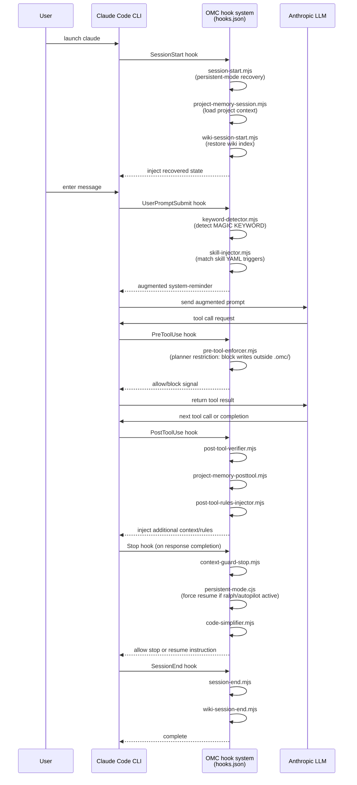

# Harness Analysis: `oh-my-claudecode (OMC)`

## 0. Metadata

- **Name**: oh-my-claudecode (OMC)
- **Type**: in-harness skill system / hybrid (Claude Code plugin + Claude Agent SDK library)
- **Repository**: `/Users/WonjinSin/Documents/project/oh-my-claudecode`
- **Analysis version**: v4.11.6 (commit `cf06566d`)
- **Analysis date**: 2026-04-15
- **Primary language/runtime**: TypeScript / Node.js 20+
- **Primary LLM provider**: Anthropic Claude (Opus 4.x / Sonnet 4.x / Haiku 4.x), includes Codex/Gemini bridge

## TL;DR — One-paragraph summary

oh-my-claudecode is a **multi-layer orchestration layer** built on top of Claude Code. It intercepts user messages arriving at Claude Code via hooks to amplify magic keywords, automatically injects the appropriate skill by matching trigger patterns, and dispatches 19 specialized agents to work in parallel. Unlike standalone Claude Code, it supports **PRD-based iteration loops** and **idea-to-code full lifecycle automation** through execution modes such as `ralph`, `autopilot`, and `ultrawork`. It also exposes LSP, AST, and Python REPL as custom MCP servers to provide IDE-level code intelligence. A defining characteristic is that it simultaneously supports two entry forms: Claude Code plugin and SDK library mode.

---

# Part 1: The Story

## 1-1. Main Flow — From user message to LLM response

```
User input
    │
    ▼
┌───────────────────────────────────────────────────────┐
│  Claude Code CLI fires UserPromptSubmit hook           │
│  (preprocessing begins before message reaches LLM)    │
│  hooks.json · hooks/UserPromptSubmit[]                │
└───────────────────────┬───────────────────────────────┘
                        │ message delivered via stdin
           ┌────────────┼────────────┐
           │                        │
           ▼                        ▼
┌──────────────────┐   ┌────────────────────────────────┐
│  keyword detection│   │  skill injection                │
│  ultrawork/ralph │   │  trigger matching → insert      │
│  autopilot/ccg.. │   │  SKILL.md content               │
│  keyword-        │   │  (max 5 per session)            │
│  detector.mjs    │   │  skill-injector.mjs             │
└──────────┬───────┘   └──────────────────┬─────────────┘
           │  [MAGIC KEYWORD: ...] inserted│  skill content as system-reminder
           │                              │
           └──────────┬───────────────────┘
                      │ augmented prompt
                      ▼
┌──────────────────────────────────────────────────────┐
│  Claude Code orchestrator (OMC system prompt applied) │
│  AGENTS.md + continuationEnforcement + contextFiles  │
│  omcSystemPrompt()  ·  src/agents/definitions.ts     │
└──────────────────────┬───────────────────────────────┘
                       │ agent dispatch decision
          ┌────────────┼──────────────────┐
          │            │                  │
          ▼            ▼                  ▼
┌──────────────┐ ┌──────────────┐ ┌──────────────────┐
│  direct      │ │  specialized │ │  background      │
│  handling    │ │  agents      │ │  agents          │
│  (simple     │ │  Task tool   │ │  Task(background)│
│  tasks)      │ │  19 types    │ │  max 5 concurrent│
└──────┬───────┘ └──────┬───────┘ └────────┬─────────┘
       │                │                   │
       └────────────────┼───────────────────┘
                        │ LLM call
                        ▼
┌──────────────────────────────────────────────────────┐
│  Anthropic Claude API                                 │
│  (High=Opus, Medium=Sonnet, Low=Haiku 3-tier routing)│
│  createOmcSession() → queryOptions                   │
│  src/index.ts:265                                    │
└──────────────────────┬───────────────────────────────┘
                       │ response stream
                       ▼
┌──────────────────────────────────────────────────────┐
│  Stop hook execution (just before completion)         │
│  continuation-enforcer: detects incomplete TODOs →   │
│    blocks premature stopping                         │
│  persistent-mode.cjs: resumes ralph/autopilot mode  │
│  scripts/persistent-mode.cjs                        │
└──────────────────────┬───────────────────────────────┘
                       │
                       ▼
                  Response delivered to user
```

### Narration

This diagram shows the main path a single user message travels from arrival to response. The decisive characteristic is that **two stages of prompt augmentation occur before the LLM call** — keyword detection and skill injection. Both operations run in parallel via Claude Code's `UserPromptSubmit` hook; the original message is passed via stdin, and the hook's output is added to the LLM context as a system reminder.

`keyword-detector.mjs` runs first. When it finds patterns such as `ralph`, `autopilot`, `ultrawork`, `ccg`, or `tdd` in the prompt, it outputs a `[MAGIC KEYWORD: <skill-name>]` marker. Claude Code interprets this marker as an instruction to load the corresponding skill via the `Skill` tool. Simultaneously, `skill-injector.mjs` scans the `skills/` directory and matches the prompt against the `triggers` field in each skill's YAML frontmatter. Up to 5 skill contents per session are inserted as `<system-reminder>` blocks, and already-injected skills are recorded in `.omc/state/skill-sessions-fallback.json` to prevent duplicate injection within the same session (`skill-injector.mjs:32`).

When the augmented prompt reaches the orchestrator, it decides whether to dispatch an agent or handle it directly according to the delegation rules defined in the OMC system prompt (`AGENTS.md`). Agent dispatch happens via Claude Code's `Task` tool; using `run_in_background=true` allows up to 5 background agents to run concurrently. The moment a response is complete and Claude Code fires the `Stop` event, `persistent-mode.cjs` reads the boulder state file and, if ralph/autopilot mode is active, injects the **"The boulder never stops"** message to force Claude to continue into the next iteration.

---

## 1-2. Alternate Paths — Branch-specific execution flows

### (a) SDK library mode — Direct integration with Claude Agent SDK

```
Developer code (user application)
    │
    ▼
┌──────────────────────────────────────────────────────┐
│  createOmcSession() call                              │
│  load config + assemble system prompt +              │
│  return agent definitions                            │
│  src/index.ts:265                                    │
└──────────────────────┬───────────────────────────────┘
                       │ returns queryOptions
                       ▼
┌──────────────────────────────────────────────────────┐
│  session.processPrompt(userPrompt) call               │
│  magic keyword transformation                        │
│  (ultrawork → augmented prompt)                      │
│  src/features/magic-keywords.ts:392                  │
└──────────────────────┬───────────────────────────────┘
                       │ augmented prompt
                       ▼
┌──────────────────────────────────────────────────────┐
│  Claude Agent SDK query() direct call                 │
│  for await (const msg of query({ prompt,             │
│    ...session.queryOptions.options }))               │
│  (no hooks, pure SDK path)                           │
└──────────────────────┬───────────────────────────────┘
                       │ agents + OMC MCP tools available
                       ▼
                  stream response processing
```

### Narration

This path is for **using OMC as a library from pure TypeScript/Node.js code** without the Claude Code CLI. The `queryOptions` returned by `createOmcSession()` contains all 19 agent definitions, MCP server configuration (context7, exa, OMC tools), the allowed tool list, and the system prompt. Developers simply pass this directly to Claude Agent SDK's `query()` function.

The decisive difference from plugin mode is that **there are no hooks**. Keyword detection and skill injection do not happen automatically. Instead, explicitly calling `session.processPrompt()` applies the TypeScript-layer magic keyword transformation (`magic-keywords.ts:392`). Including `ultrawork` prepends an `<ultrawork-mode>` XML block, and `search` appends a `[search-mode]` directive. The same keywords as the hook-based keyword-detector are handled, but the logic is copied into a TypeScript module, keeping the two paths independent.

---

### (b) ralph mode — PRD-based iteration loop

```
User: "ralph <task>"
    │
    ▼
┌──────────────────────────────────────────────────────┐
│  keyword-detector detects "ralph"                     │
│  → injects SKILL.md load instruction                 │
│  skills/ralph/SKILL.md                               │
└──────────────────────┬───────────────────────────────┘
                       │
                       ▼
┌──────────────────────────────────────────────────────┐
│  PRD initialization (once only)                       │
│  if .omc/prd.json absent: auto-generate scaffold     │
│  then write detailed acceptance criteria             │
└──────────────────────┬───────────────────────────────┘
                       │
                       ▼
┌──────────────────────────────────────────────────────┐
│  Select next incomplete story                         │
│  highest-priority story with passes: false in        │
│  prd.json                                            │
└──────────────────────┬───────────────────────────────┘
                       │
                       ▼
┌──────────────────────────────────────────────────────┐
│  Story implementation (dispatch executor agent)       │
│  Haiku(simple) / Sonnet(standard) / Opus(complex)    │
└──────────────────────┬───────────────────────────────┘
                       │
                       ▼
┌──────────────────────────────────────────────────────┐
│  Acceptance criteria verification                     │
│  confirm each acceptance criterion with evidence     │
└──────────────────────┬───────────────────────────────┘
                       │
              ┌────────┴────────┐
              │ fail             │ pass
              ▼                  ▼
    ┌─────────────────┐  ┌────────────────────────────┐
    │ passes: false   │  │  reviewer verification      │
    │ retry           │  │  (architect)                │
    └────────┬────────┘  │  set passes: true           │
             │           └──────────────┬─────────────┘
             │                          │
             └──────────┬───────────────┘
                        │ incomplete stories remaining?
              ┌─────────┴─────────┐
              │ yes               │ no
              ▼                   ▼
        iterate next story  declare done + exit
```

### Narration

ralph mode is the most complex execution path in OMC. The core idea is: "decompose a task into a PRD, and advance by proving one story complete at a time." `prd.json` is auto-generated at the start of the first ralph iteration — once the scaffold appears, the orchestrator immediately overwrites it with concrete acceptance criteria matching the task. Vague criteria such as "Implementation is complete" are not permitted.

Each time an iteration fires the `Stop` event, `persistent-mode.cjs` checks `.omc/state/ralph-state.json` (or the boulder file) to see whether ralph mode is active. If active, it **blocks any attempt to stop without outputting a completion promise** and injects a `[RALPH + ULTRAWORK - ITERATION N/MAX]` message. This is the implementation of the "boulder never stops" mechanism — it injects the next iteration's system context before the Stop hook finishes, forcing Claude to keep going.

During the verification phase, the reviewer can be selected with the `--critic=architect|critic|codex` flag. The default is architect (Opus). The reviewer must approve before `passes: true` can be set; otherwise the loop continues. The maximum iteration count (`MAX`) is substituted via the `{{MAX}}` variable inside the skill.

---

### (c) autopilot mode — from idea to working code

```
User: "autopilot <idea>"
    │
    ▼
Phase 0: Expansion
  ├── ralplan/deep-interview result exists? → jump to Phase 2
  └── otherwise: Analyst(Opus) + Architect(Opus) → spec.md
    │
    ▼
Phase 1: Planning
  ├── ralplan exists → Skip
  └── Architect → plan, Critic → validate
    │
    ▼
Phase 2: Execution (ralph + ultrawork)
  │  parallel executor dispatch
    │
    ▼
Phase 3: QA (max 5 rounds)
  │  build → lint → test → fix cycle
    │
    ▼
Phase 4: Validation
  │  code-reviewer + security-reviewer parallel review
  └── on rejection: fix then re-review
    │
    ▼
  done
```

### Narration

If ralph is an "execution loop," autopilot is a "full pipeline." Phases 0 through 4 proceed serially, while independent work within each phase is handled in parallel. An interesting optimization is that **if ralplan or deep-interview results already exist, earlier phases are skipped** — this jump logic naturally connects the ralplan→autopilot pipeline (`skills/autopilot/SKILL.md` Phase 0 conditional branch).

The QA cycle (Phase 3) repeats up to 5 times; if the same error occurs 3 consecutive times, the loop exits and switches to "root-cause report" mode. Without this limit, an unresolvable situation could cause an infinite loop. In Validation (Phase 4), code-reviewer and security-reviewer run in parallel; if either rejects, the feedback is incorporated, the implementation is revised, and re-review is requested.

---

## 1-3. Core architecture diagrams

### Hook lifecycle — how hooks govern the entire session



### Narration

This sequence diagram shows where OMC's heart lies — the **hook system covering 11 event types**. Claude Code executes hook scripts via stdin/stdout for each event, and the script's output is injected into the LLM context. OMC leverages this pipe strategically: modifying the prompt before the LLM sees it, enforcing permissions right before tool use, and intervening at the moment the response tries to pretend it is complete.

The most important task `session-start.mjs` performs during `SessionStart` is **recovering ralph/autopilot modes that were active in a previous session**. If state files remain under `.omc/state/`, the mode carries over into the new session. Separately, `project-memory-session.mjs` detects environmental context such as the project's language, framework, and structure, then prepends it to the system prompt at every session start.

The `pre-tool-enforcer.mjs` in the `PreToolUse` hook blocks the planner agent from writing files outside `.omc/` — it is the enforcer of the constraints specified in the SKILL.md "ULTRAWORK PLANNER SECTION." It is a dual-layer protection where theory (prompt instruction) and execution (hook blocking) both operate.

---

### Agent tiers and delegation network

```
Orchestrator (OMC)
        │
        ├── Exploration/Analysis lane ──────────────────────────────
        │   ├── explore        (Haiku)   fast file/pattern exploration
        │   ├── analyst        (Opus)    deep requirements analysis
        │   ├── tracer         (Sonnet)  evidence-based tracing
        │   └── document-specialist (Sonnet) official docs/external repo lookup
        │
        ├── Planning lane ──────────────────────────────────────────
        │   ├── planner        (Opus)    task decomposition
        │   └── architect      (Opus)    architecture design
        │
        ├── Execution lane ─────────────────────────────────────────
        │   ├── executor       (Sonnet)  code implementation (main worker)
        │   ├── designer       (Sonnet)  frontend/UI
        │   └── git-master     (Sonnet)  Git operations
        │
        ├── Verification lane ──────────────────────────────────────
        │   ├── verifier       (Sonnet)  completion evidence verification
        │   ├── code-reviewer  (Opus)    code quality review
        │   ├── security-reviewer (Sonnet) security audit
        │   ├── qa-tester      (Sonnet)  test design
        │   └── debugger       (Sonnet)  bug diagnosis
        │
        └── Specialist lane ────────────────────────────────────────
            ├── critic         (Opus)    critical review
            ├── scientist      (Sonnet)  experiment design
            ├── test-engineer  (Sonnet)  test engineering
            ├── writer         (Haiku)   documentation
            └── code-simplifier (Opus)  code simplification
```

### Narration

The 19 agents are divided into 3 tiers based on cost (Haiku < Sonnet < Opus) and purpose. Each agent's prompt is loaded at runtime from `agents/*.md` files (`loadAgentPrompt()` · `src/agents/utils.ts`). Because no prompts are hardcoded, modifying a file immediately changes agent behavior.

Delegation decisions are specified in the orchestrator's system prompt (`<delegation_rules>` in AGENTS.md): "simple lookups to Haiku, standard implementation to Sonnet, architecture and complex analysis to Opus" is the baseline principle. When `ultrawork` mode is enabled, this principle is applied more aggressively — independent exploration/investigation tasks are unconditionally dispatched to background agents, and the planning agent is always started separately.

An interesting design choice is that although `executor` defaults to Sonnet, ralph/autopilot dynamically selects Haiku/Sonnet/Opus based on task complexity. This tier selection logic is documented in `docs/shared/agent-tiers.md` and referenced in skill prompts as "Read docs/shared/agent-tiers.md before first delegation."

---

### Custom MCP tools layer — LSP, AST, and state management

```
OMC Tools MCP Server (in-process)
src/mcp/omc-tools-server.ts
        │
        ├── LSP tools (12) ──────────────────────────────────────────
        │   lsp_hover, lsp_goto_definition, lsp_find_references
        │   lsp_diagnostics, lsp_rename, lsp_document_symbols ...
        │
        ├── AST tools (2)
        │   ast_grep_search, ast_grep_replace
        │
        ├── Python REPL (1)
        │   python_repl
        │
        ├── State management tools
        │   state_read, state_write, state_clear, state_list_active
        │   state_get_status
        │
        ├── Notepad tools
        │   notepad_read, notepad_write_priority
        │   notepad_write_working, notepad_write_manual
        │
        ├── Project memory tools
        │   project_memory_read, project_memory_write
        │   project_memory_add_note, project_memory_add_directive
        │
        ├── Interop tools (bridge)
        │   codex execution, gemini execution (omc team feature)
        │
        └── Wiki · Trace · DeepInit · SharedMemory tools
```

### Narration

One distinctive aspect of OMC is that it **provides custom tools as an in-process MCP server**. This server, created via `createSdkMcpServer()`, operates within the process without real TCP connections and is registered as `queryOptions.mcpServers['t']` (`src/index.ts:358`). Agents can use IDE-level features such as LSP hover, go-to-definition, and diagnostics through this server.

State management tools (`state_read`, `state_write`, etc.) persist state across sessions as JSON files under `.omc/state/`. This is why ralph knows which stories are complete even across iterations. Notepad tools save notes in priority order (priority > working > manual) to `.omc/notepad.md`, which agents use like shared working memory.

Interop tools are the foundation of the `omc team` feature — Claude can directly invoke Codex or Gemini as subtasks, enabling tri-model orchestration (ccg mode). These tools are implemented in `src/interop/mcp-bridge.ts` and are routed through the interop layer without a separate MCP server process.

---

# Part 2: Reference Details

## 2-1. Entry Points

Two entry forms exist. **Plugin mode**: Claude Code loads `hooks.json` and automatically registers `UserPromptSubmit`, `SessionStart`, etc. — entry points are `scripts/keyword-detector.mjs` and `scripts/skill-injector.mjs`. **SDK mode**: call `createOmcSession()` (`src/index.ts:265`) to receive `queryOptions` and pass them to Claude Agent SDK's `query()`. Both paths use the same agent catalog and MCP tools, but hook automation only operates in plugin mode.

## 2-2. Concurrency

Maximum 5 concurrent background agents (`DEFAULT_MAX_BACKGROUND_TASKS = 5` · `src/features/background-tasks.ts:25`). Can be overridden via environment variable or `config.permissions.maxBackgroundTasks`. `BackgroundTaskManager` tracks the count of running tasks; when it exceeds 5, `shouldRunInBackground()` returns `background: false` and switches to serial execution (`src/index.ts:370`). Claude Code's own concurrency lock exists separately.

## 2-3. Routing

The deterministic layer (keyword matching) goes first; agent dispatch is decided by the LLM. Keyword-based routing: `keyword-detector.mjs` triggers skills via pattern matching, and `magic-keywords.ts` transforms 4 keywords (ultrawork/search/analyze/ultrathink). Agent routing: the orchestrator, having read the delegation rules in AGENTS.md, dispatches via the `Task` tool; there is no reversal mid-stream.

## 2-4. Context Assembly

`createOmcSession()` assembles the system prompt at a single point (`src/index.ts:283-299`). Assembly order: (1) OMC base prompt + skininthegamebros guidance, (2) add continuation enforcement, (3) custom system prompt, (4) content of context files such as AGENTS.md/CLAUDE.md. In the hook path, hook outputs are each added as `<system-reminder>` blocks. Variable substitution uses the `{{ITERATION}}`, `{{MAX}}`, `{{PROMPT}}` pattern exclusively within skill SKILL.md files.

## 2-5. Provider Abstraction

Model tiers can be overridden with `OMC_MODEL_HIGH` / `OMC_MODEL_MEDIUM` / `OMC_MODEL_LOW` environment variables (`src/config/models.ts`). Defaults: High=claude-opus-4-x, Medium=claude-sonnet-4-x, Low=claude-haiku-4-x. The Codex/Gemini bridge is isolated in a separate layer under `src/interop/`, keeping it separate from the main Anthropic SDK path. To add a new provider, add an adapter in `interop/` and register the tool in `omc-tools-server.ts`.

## 2-6. Worker / Execution

The unit of execution is agent dispatch (a `Task` tool call). Each agent is distinguished by an independent `subagent_type` name. Option passing: `createOmcSession()` → `queryOptions.options.agents` contains per-agent model and prompt. Agents dispatched with `run_in_background: true` run as separate processes and results are retrieved via `TaskOutput`. abort/timeout is delegated to Claude Code's task timeout mechanism.

## 2-7. Message Loop

Streaming mode. In SDK mode, the pattern is `for await (const message of query(...))`. In plugin mode, Claude Code's internal stream processing handles it and hooks intervene at specific events. Chunk types follow Anthropic SDK standard (`text_delta`, `tool_use`, `tool_result`, etc.). Routing token detection is handled in the hook layer via the `[MAGIC KEYWORD: ...]` pattern; there is no reversal mid-stream.

## 2-8. Session / State

Session state follows a **file-based mutable model**. JSON files under `.omc/state/`: `ralph-state.json` (ralph iteration), `skill-sessions-fallback.json` (skill injection deduplication). `.omc/prd.json` (ralph PRD), `.omc/plans/` (autopilot plans). Expiration policy: session TTL for `skill-sessions-fallback.json` is 1 hour (`FALLBACK_SESSION_TTL_MS = 3600000` · `skill-injector.mjs:32`). If boulder state remains, ralph/autopilot is recovered at the next SessionStart even after the session ends.

## 2-9. Isolation

No separate isolation technology — operates within Claude Code's process. The soft permission boundary is `pre-tool-enforcer.mjs` blocking the planner agent from writing outside `.omc/`. Worktree isolation is an option manually selected via the `superpowers:using-git-worktrees` skill.

## 2-10. Tool / Capability

Built-in tools: Read, Glob, Grep, WebSearch, WebFetch, Task, TodoWrite, Bash, Edit, Write (individually configurable on/off). OMC custom MCP tools: LSP×12, AST×2, Python REPL, state/notepad/memory/interop/Wiki tools and others. External MCP: context7, exa (each controlled by `enabled` setting). Tool deactivation: specify group names comma-separated in the `OMC_DISABLE_TOOLS` environment variable.

## 2-11. Workflow Engine

No official workflow engine. Instead, **skill prompts serve as workflow scripts**: each SKILL.md for ralph/autopilot/ralplan describes phases, iteration conditions, and completion criteria in natural language, and the LLM follows them. `persistent-mode.cjs` checking loop state in the Stop hook and forcing iteration is the process-level loop control.

## 2-12. Configuration

Layer priority (low → high): defaults (`buildDefaultConfig()`) → user config (`~/.config/claude-omc/config.jsonc`) → project config (`.claude/omc.jsonc`) → environment variables (`OMC_MODEL_HIGH`, etc.). Merge strategy: `deepMerge` (deep merge for nested objects, arrays are overwritten). No runtime reload — loaded once at `createOmcSession()` call time.

## 2-13. Error Handling

Hook scripts: catch errors with try/catch and return empty output (fail-open). Script timeout is set to 3–60 seconds in the hook definition; if exceeded, Claude Code skips the hook. Agent errors: errors returned by `executor` are recorded as "story failure" in the ralph loop and retried. In the QA cycle, if the same error occurs 3 consecutive times, the loop exits and switches to report mode (autopilot SKILL.md Phase 3).

## 2-14. Observability

No separate structured logger. Hook script stderr is recorded in Claude Code's internal log. `progress.txt` (ralph iteration record) and `.omc/notepad.md` (agent shared memo) serve as the practical audit trail. Previous session records can be searched via `src/features/search-session-history.ts`.

## 2-15. Platform Adapters

Single platform target: Claude Code CLI. In SDK mode, the standard Anthropic SDK is used directly with no adapter concept. Multi-platform adapters (Slack, GitHub, etc.) do not exist.

## 2-16. Persistence

Filesystem-based. No DB. Key paths: `.omc/state/*.json` (execution state), `.omc/plans/*.md` (plan files), `.omc/prd.json` (PRD), `.omc/notepad.md` (notepad), `.omc/project-memory.json` (project memory). Sensitive information: API keys are passed only via environment variable `ANTHROPIC_API_KEY` and are not stored in files.

## 2-17. Security Model

Trust model: trusts the local user running Claude Code. No authentication — local-only tool. Secrets: API keys such as `ANTHROPIC_API_KEY` are passed via environment variables. The file write scope restriction on the planner agent (`pre-tool-enforcer.mjs`) is the sole access control.

## 2-18. Key Design Decisions & Tradeoffs

OMC's core decisions stem from the question: "How can we minimally-invasively add an orchestration layer on top of Claude Code?" Within the constraint that the LLM cannot directly see the hook infrastructure, the hook's stdout is effectively the only control channel.

| Decision | Choice | Alternative | Rationale (inferred) | Tradeoff |
|----------|--------|-------------|----------------------|----------|
| Workflow engine | Natural language skill prompts | YAML/JSON workflow definitions | Flexibility, LLM judges execution conditions directly | Non-deterministic execution, difficult to debug |
| Loop enforcement | Stop hook interception | Separate supervisor process | Uses only Claude Code plugin API | Cost incurred just before response completion |
| State storage | Filesystem JSON | DB, memory | No external dependencies, easy crash recovery | Concurrency conflicts possible, file growth |
| Agent prompts | Runtime file loading | Hardcoded | Prompts editable without rebuild | Falls back to empty prompt if file missing |
| Two entry points | SDK + plugin in parallel | Support only one | Flexible integration scenarios | Magic keyword logic is duplicated across two paths |
| Model tiers | 3-level Haiku/Sonnet/Opus | Single model | Cost optimization | Under/over-cost when agent selection is wrong |

## 2-19. Open Questions

- `createContinuationHook()` in `src/features/continuation-enforcement.ts` explicitly states "connect on actual implementation" as a TODO — it is unclear how the current continuation enforcement is separated from / integrated with `persistent-mode.cjs`. Requires checking actual usage in the `src/hooks/` directory.
- It is unclear how `subagent-tracker.mjs` and `verify-deliverables.mjs` in the `SubagentStart`/`SubagentStop` hooks interact with the ralph loop — can be verified by reading all of `scripts/subagent-tracker.mjs`.
- The boundary between the `/team` slash command and the `omc team` MCP bridge is not clear in the code — requires exploring the `src/team/` directory and `src/mcp/team-server.ts`.

---

## Appendix: Quick Reference Table

| Item | Value |
|------|-------|
| Type | in-harness skill system + hybrid |
| Entry points | Claude Code plugin (hooks.json) + SDK (createOmcSession) |
| Concurrency | max 5 background agents concurrent |
| Router style | deterministic (keyword matching) + LLM delegation decision |
| Provider abstraction | 3-tier (Haiku/Sonnet/Opus), env var override |
| Session model | file-based mutable (`.omc/state/*.json`) |
| Isolation | none (soft limit: planner write outside `.omc/` blocked) |
| Workflow engine | none (skill prompts + Stop hook loop enforcement) |
| Primary language | TypeScript / Node.js |
| Agents | 19 (Haiku×2, Sonnet×11, Opus×6) |
| Skills | 38 (skills/ directory) |
| Hook events | 11 types (SessionStart, UserPromptSubmit, PreToolUse, PostToolUse, PostToolUseFailure, PermissionRequest, SubagentStart, SubagentStop, PreCompact, Stop, SessionEnd) |
| Custom MCP tools | LSP×12 + AST×2 + Python×1 + state/notepad/memory/interop/Wiki and others |
