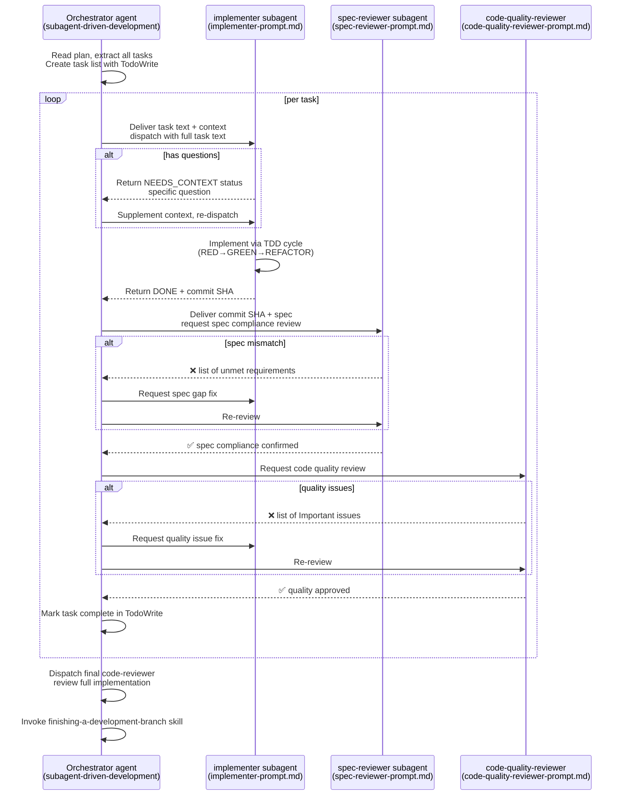

# Harness Analysis: `superpowers`

## 0. Metadata

- **Name**: superpowers
- **Type**: in-harness skill system (Claude Code plugin)
- **Repository**: https://github.com/obra/superpowers (local: `/Users/WonjinSin/Documents/project/superpowers`)
- **Analysis commit/version**: v5.0.7
- **Analysis date**: 2026-04-15
- **Primary language/runtime**: Markdown (skill definition), Bash (hook), JavaScript (OpenCode adapter)
- **Primary LLM provider**: Platform-dependent (Claude Code → Claude, Gemini CLI → Gemini, Copilot CLI → Copilot)

## TL;DR — One-paragraph summary

Superpowers is an **in-harness skill system** that runs on top of multiple AI CLI harnesses such as Claude Code, Cursor, Copilot CLI, and Gemini CLI. Fourteen skills — written entirely in pure markdown without a single line of code — define the agent's behavioral patterns, and a SessionStart hook automatically injects the master rulebook (`using-superpowers`) into the LLM context at session start. The core idea is an enforced workflow: "the agent must invoke the relevant skill before performing any task." This chains TDD, brainstorming, subagent-driven implementation, and code review together to cover the entire development cycle. It is a zero-dependency plugin with no external dependencies whatsoever.

---

# Part 1: The Story

## 1-1. Main Flow (primary)

This is the primary path through which superpowers influences agent behavior when a user message arrives.

```
┌────────────────────────────────────────────────────────────┐
│  New session start — harness executes plugin hook          │
│  SessionStart event fires                                  │
│  hooks/hooks.json  ·  SessionStart matcher                 │
└───────────────────────────┬────────────────────────────────┘
                            │
                            ▼
┌────────────────────────────────────────────────────────────┐
│  Platform detection & reading using-superpowers content    │
│  CLAUDE_PLUGIN_ROOT / CURSOR_PLUGIN_ROOT / COPILOT_CLI     │
│  Detect platform via env vars, read SKILL.md, JSON-escape  │
│  hooks/session-start  ·  line 8-34                         │
└───────────────────────────┬────────────────────────────────┘
                            │
                            ▼
┌────────────────────────────────────────────────────────────┐
│  Output additionalContext in platform-specific JSON format │
│  Claude Code → hookSpecificOutput.additionalContext        │
│  Cursor → additional_context (snake_case)                  │
│  Copilot/others → additionalContext (SDK standard)         │
│  hooks/session-start  ·  line 46-55                        │
└───────────────────────────┬────────────────────────────────┘
                            │
                            ▼
┌────────────────────────────────────────────────────────────┐
│  using-superpowers content injected into LLM context       │
│  Agent knows from session start the rule:                  │
│  "invoke a skill if there is even 1% applicability."       │
│  All subsequent behavior operates on top of this rule      │
│  skills/using-superpowers/SKILL.md  ·  entire file         │
└───────────────────────────┬────────────────────────────────┘
                            │
                            ▼
              ┌─────────────┴──────────────┐
              │  User message received      │
              │  "Build X" / "Fix bug"      │
              └─────────────┬──────────────┘
                            │
                            ▼
┌────────────────────────────────────────────────────────────┐
│  Agent: Is a skill applicable? (1% threshold)              │
│  Apply Skill Priority system from using-superpowers        │
│  skills/using-superpowers/SKILL.md  ·  "The Rule" section  │
└─────────────┬──────────────────────┬──────────────────────┘
              │ Applicable           │ No skill matches
              ▼                      ▼
┌────────────────────────┐  ┌────────────────────────────────┐
│  Invoke the matching   │  │  Respond directly without      │
│  skill via Skill tool  │  │  a skill (rare in practice)    │
│  Skill tool             │  └────────────────────────────────┘
└──────────┬─────────────┘
           │
           ▼
┌────────────────────────────────────────────────────────────┐
│  Skill content loaded & agent acts according to skill      │
│  instructions. Skills are markdown documents — they        │
│  contain specific workflows, checklists, and instructions  │
│  to invoke the next skill                                  │
│  skills/<skill-name>/SKILL.md                              │
└────────────────────────────────────────────────────────────┘
```

### Narration

The story this diagram tells is divided into two phases. The first phase is **automatic injection at session start**. Before the user types the first message, the `hooks/session-start` script runs and pushes the entire content of `using-superpowers/SKILL.md` into the LLM's system context. As a result, the agent already knows the rule: "in this session, operate based on skills." The injection format differs per harness — Claude Code uses nested JSON, Cursor uses snake_case, Copilot uses flat JSON — and the `session-start` script identifies the platform via environment variables and emits the appropriate format (`session-start:46-55`).

The second phase is **skill activation after user message received**. The agent follows the rule defined by `using-superpowers`: "if there is even a 1% chance a skill applies, you must call the `Skill` tool." The reason this rule is critical is that it is not a soft recommendation but a **hard enforcement gate** — the skill file contains a Red Flags table with `<HARD-GATE>` and `<EXTREMELY-IMPORTANT>` tags that explicitly block rationalization attempts by the agent (`using-superpowers/SKILL.md:79-95`). Because skills are markdown documents rather than code, "execution" means the agent reads that markdown and acts according to its instructions — here the LLM plays the role of the "execution engine."

Core design tradeoff: all behavior depends on the LLM's ability to follow instructions. There is no code-based enforcement, so the agent can ignore the rules — but that same flexibility is what allows the system to work across multiple platforms without modification.

---

## 1-2. Skill dependency network (Skill Dependency Graph)

The body of superpowers is a reference network between skills. The structure of the entire system is determined by which skills each skill calls or depends on.

```
                    ┌─────────────────────────┐
                    │  using-superpowers      │
                    │  (session bootstrap     │
                    │   entry point)          │
                    │  defines all skill      │
                    │  invocation rules       │
                    └──────────┬──────────────┘
                               │ auto-injected at session start
                               ▼
               ┌───────────────────────────────┐
               │    User request received       │
               └──┬─────────────┬──────────────┘
                  │             │
          new feature       bug/issue found
                  │             │
                  ▼             ▼
        ┌─────────────┐  ┌──────────────────────┐
        │ brainstorm  │  │ systematic-debugging  │
        │ (design     │  │  (root cause first)   │
        │  first)     │  └──────────┬────────────┘
        └──────┬──────┘             │
               │                    ▼
               ▼             ┌─────────────────────────┐
   ┌──────────────────────┐  │ verification-before-    │
   │ using-git-worktrees  │  │ completion              │
   │ (isolated workspace) │  └─────────────────────────┘
   └──────────────────────┘
               │
               ▼
        ┌─────────────┐
        │writing-plans│
        │(plan        │
        │ documentation)│
        └──────┬──────┘
               │
        ┌──────┴──────────────┐
        │                     │
        ▼                     ▼
┌──────────────────┐  ┌────────────────────┐
│ subagent-driven- │  │  executing-plans   │
│ development      │  │  (parallel session │
│ (same-session    │  │   execution)       │
│  execution)      │  └────────────────────┘
└────────┬─────────┘
         │ per task
         ├─→ [implementer subagent]
         │      ↓ uses
         │   test-driven-development
         │
         ├─→ [spec-reviewer subagent]
         │
         ├─→ [code-quality-reviewer subagent]
         │
         └─→ requesting-code-review
                  │
                  ▼
         receiving-code-review
                  │
                  ▼
         finishing-a-development-branch
```

### Narration

What this graph shows is that superpowers is not a mere collection of skills but a **workflow chain that covers the entire development cycle**. `using-superpowers` is the root, and beneath it are two primary entry points — new features enter via `brainstorming`, and bugs enter via `systematic-debugging`. Each of these skills has a defined terminal point: brainstorming must end with `writing-plans` (`brainstorming/SKILL.md:66`), and debugging must end with `verification-before-completion`.

An interesting design decision is that `subagent-driven-development` is not an implementation skill but an **orchestration skill**. Actual implementation is done by subagents, while the orchestrator only handles task extraction, context curation, and review dispatch (`subagent-driven-development/SKILL.md:11`). Subagents are instructed to follow the `test-driven-development` skill — creating a recursive structure where skills call other skills. The key benefit of this design is **context contamination prevention**: the orchestrator's long conversation history is not passed to the implementer; the implementer starts fresh, receiving only the task text and required context.

`dispatching-parallel-agents` and `using-git-worktrees` are independent utility skills that serve as required prerequisites for certain skills in the network — the integration section of `subagent-driven-development` marks `using-git-worktrees` as REQUIRED (`subagent-driven-development/SKILL.md:268`).

---

## 1-3. Alternate Paths

### (a) Direct skill invocation — when the user explicitly specifies a skill

```
User: "/brainstorming" or "design this using the brainstorming skill"
        │
        ▼
┌────────────────────────────────────────────────────────┐
│  Agent directly loads the skill via Skill tool         │
│  Skips the routing phase in using-superpowers          │
│  Skill tool → load skills/<name>/SKILL.md              │
└───────────────────────────┬────────────────────────────┘
                            │
                            ▼
                    Execute per skill instructions
```

### (b) Full brainstorm → plan → implement cycle

```
User: "I want to build new feature X"
        │
        ▼
┌────────────────────────────┐
│  brainstorming skill fires  │
│  Execute 9-step checklist   │
│  1. Explore project context │
│  2. Suggest visual          │
│     companion?              │
│  3. Clarifying questions    │
│     (one at a time)         │
│  4. Propose 2-3 approaches  │
│  5. Present/approve design  │
│     section by section      │
│  6. Write & commit design   │
│     document                │
│  7. Self-review the spec    │
│  8. Wait for user spec      │
│     review                  │
│  9. Call writing-plans      │
└──────────────┬─────────────┘
               │
               ▼
┌────────────────────────────┐
│  writing-plans skill fires  │
│  Break tasks into 2-5 min   │
│  units. Write plan document │
│  including file paths,      │
│  code, and verification     │
│  steps                      │
│  docs/superpowers/plans/    │
│  YYYY-MM-DD-*.md            │
└──────────────┬─────────────┘
               │
               ▼
┌────────────────────────────────────────────────────────┐
│  Choose: subagent-driven-development (same session)    │
│  OR executing-plans (parallel sessions)                │
│  Decision criterion: "stay in this session?"           │
└──────────────┬─────────────────────────────────────────┘
               │ if subagent-driven-development chosen
               ▼
  ┌────────────────────────────────┐
  │  Repeat per task:              │
  │  1. implementer subagent       │
  │  2. spec-reviewer subagent     │
  │  3. code-quality-reviewer      │
  └──────────────┬─────────────────┘
                 │ all tasks complete
                 ▼
  ┌────────────────────────────────┐
  │  Dispatch final code-reviewer  │
  │  Merge into finishing-a-       │
  │  development-branch skill      │
  └────────────────────────────────┘
```

### Narration

Although called "alternate paths," in practice **the second diagram is the main use case for superpowers** — the full cycle from brainstorming to deployment. The 9-step checklist of the brainstorming skill (`brainstorming/SKILL.md:25-29`) is interesting because each step has a clear completion condition: step 6 requires committing the design document to git, step 7 requires removing all placeholders, and step 8 requires explicitly waiting for user approval. This specificity prevents the agent from "cutting corners."

The branching decision from `writing-plans` to `subagent-driven-development` is purely the agent's judgment — based on "should I stay in the same session or open a separate session" (`subagent-driven-development/SKILL.md:25-38`). However, the fact that both paths converge at `finishing-a-development-branch` demonstrates the consistency of the design.

### (c) Subagent internal flow — SUBAGENT-STOP in using-superpowers

```
Orchestrator agent dispatches subagent
        │
        ▼
┌────────────────────────────────────────────────────────┐
│  Subagent session starts                               │
│  SessionStart hook runs → using-superpowers injected   │
└───────────────────────────┬────────────────────────────┘
                            │
                            ▼
┌────────────────────────────────────────────────────────┐
│  Check for <SUBAGENT-STOP> tag                         │
│  "If dispatched as a subagent, skip this skill"        │
│  Subagent does not follow using-superpowers rules;     │
│  directly executes the task text provided by the       │
│  orchestrator                                          │
│  skills/using-superpowers/SKILL.md  ·  line 6-8       │
└───────────────────────────┬────────────────────────────┘
                            │
                            ▼
                    Execute task directly
                    (TDD, implement, commit)
```

### Narration

Why this path matters: the SessionStart hook also runs in subagent sessions, injecting the `using-superpowers` content. But if a subagent followed those rules as-is, it would perform a "skill check before every action," creating unnecessary overhead. The `<SUBAGENT-STOP>` tag is the mechanism that prevents this (`using-superpowers/SKILL.md:6-8`) — the subagent recognizes that it is a dispatched agent and skips the `using-superpowers` rules. Instead it follows only the specific skills — such as `superpowers:test-driven-development` — explicitly stated by the orchestrator in the prompt. This achieves a clear **separation of roles: the orchestrator adheres to workflow rules, while the subagent focuses on task execution**.

---

## 1-4. SessionStart hook platform branching (Decision Tree)

A decision tree showing how the hook system operates across multiple platforms.


### Narration

This decision tree represents the core logic of `hooks/session-start` (line 46-55). Because all three platforms use different JSON key names for delivering additionalContext, the platform is distinguished via environment variables. Notably, **Cursor is checked first** — Cursor sometimes sets `CLAUDE_PLUGIN_ROOT` as well, so without filtering Cursor first, execution incorrectly falls into the Claude Code branch.

The legacy warning is a quiet migration notification mechanism. In v5, the custom skill path changed from `~/.config/superpowers/skills` to `~/.claude/skills`; if that old directory still exists, a warning is included in the first response (`session-start:13-15`). It is a warning, not an error — it notifies the user that existing skills are not being loaded without interrupting the session.

---

## 1-5. subagent-driven-development task execution cycle



### Narration

The most important characteristic this sequence diagram reveals is the **two-stage review gate**. Code quality review begins only after spec compliance review passes — the order matters because reviewing the quality of code that does not comply with the spec is meaningless (`subagent-driven-development/SKILL.md:247`).

It is also worth noting that the orchestrator does not have subagents read the plan file directly; instead, it **extracts task text and delivers it**. This way, subagents receive only the information they need without file-reading overhead, while the orchestrator has a clear role of curating which context is necessary (`subagent-driven-development/SKILL.md:186-188`).

`BLOCKED` state handling is also sophisticated: rather than retrying with the same model, three options are explicitly defined — re-dispatch with a more powerful model, break the task into smaller pieces, or escalate to a human (`subagent-driven-development/SKILL.md:112-119`). The fact that the system has concrete designs for how agents handle being "stuck" differentiates it from typical skill systems.

---

# Part 2: Reference Details

## 2-1. Entry Points

After plugin installation per platform, the `SessionStart` hook is the only automatic entry point. All subsequent interactions occur via user messages and the agent's `Skill` tool calls. There is no conversation ID identification or separate authentication logic — the harness (Claude Code, etc.) handles that.

## 2-2. Concurrency

Not applicable — superpowers itself does not perform concurrency control. Concurrency is the responsibility of the harness layer (Claude Code, etc.). However, `subagent-driven-development` explicitly states not to run implementation subagents in parallel ("Dispatch multiple implementation subagents in parallel (conflicts)") — to prevent git conflicts between tasks.

## 2-3. Routing

There is no deterministic routing. Instead, the LLM agent itself decides which skill to invoke by following the skill priority rules of `using-superpowers`. "Process skills first (brainstorming, debugging) → Implementation skills second" is the only priority criterion (`using-superpowers/SKILL.md:99-104`). There is no point where AI routing can be overridden — once a skill is loaded, that skill's instructions take highest priority.

## 2-4. Context Assembly

The only automatic context assembly is the `session-start` hook reading the entire `using-superpowers/SKILL.md`, JSON-escaping it, and injecting it as `additionalContext` (`session-start:18-35`). Thereafter, each skill is loaded on-demand via the Skill tool. YAML frontmatter (`name`, `description`) is for skill discovery and is not included in context.

## 2-5. Provider Abstraction

Not applicable — superpowers does not directly access any specific LLM provider. LLM calls are entirely the responsibility of the harness (Claude Code, Copilot CLI, etc.). Skills provide model selection hints like "use a fast, cheap model" (`subagent-driven-development/SKILL.md:88-96`), but the actual model selection is the agent's judgment.

## 2-6. Worker / Execution

The unit of execution is the subagent. The orchestrator dispatches subagents via the `Agent` tool, and subagents execute tasks in an isolated context. Abort/timeout is handled at the harness layer.

## 2-7. Message Loop

Not applicable — there is no stream/batch processing logic. Skills are markdown documents and the LLM is the "execution engine."

## 2-8. Session / State

No session state management. superpowers is stateless — state is tracked only via the harness (Claude Code session), git history, and TodoWrite task lists. No session expiration policy.

## 2-9. Isolation

Recommends **git worktree** as the isolation technique (`using-git-worktrees` skill). Marked as REQUIRED in `subagent-driven-development`. The worktree resolver logic is defined in `using-git-worktrees/SKILL.md`, and new features always start in a separate worktree. No Docker/process isolation.

## 2-10. Tool / Capability

Built-in tools: `Skill` tool (skill loading), `Agent` tool (subagent dispatch), `TodoWrite` (task tracking), `Write`/`Edit`/`Read` (file manipulation). No MCP extensions. One hook: `SessionStart`.

## 2-11. Workflow Engine

No explicit workflow engine. Workflows are defined by markdown checklists and Graphviz dot diagrams in skill documents, and the LLM reads them and executes in order. No DAG node types or conditional branch syntax — all branching logic is expressed in the natural language narrative of skill documents.

## 2-12. Configuration

`~/.claude/settings.json` → `~/.claude/skills/` (Claude Code global settings). Plugin-level configuration is only the metadata in `.claude-plugin/plugin.json`. Runtime reload is possible — modifications to skill files are reflected on the next Skill tool call. Environment variables: `CLAUDE_PLUGIN_ROOT`, `CURSOR_PLUGIN_ROOT`, `COPILOT_CLI`.

## 2-13. Error Handling

If reading `using-superpowers` fails at `session-start:18`, the fallback string `"Error reading using-superpowers skill"` is injected — the error does not abort the session. No error handling at the skill level (since skills are markdown documents). Subagent failure handling is covered by the `BLOCKED` state handling logic in `subagent-driven-development`.

## 2-14. Observability

No logger. The only persistent record is git commit history and documents stored in `docs/superpowers/specs/` and `docs/superpowers/plans/` directories. TodoWrite task lists are used for in-session progress tracking.

## 2-15. Platform Adapters

| Platform | Hook file | JSON key | Environment variable |
|--------|---------|---------|---------|
| Claude Code | hooks/hooks.json | `hookSpecificOutput.additionalContext` | `CLAUDE_PLUGIN_ROOT` |
| Cursor IDE | hooks/hooks-cursor.json | `additional_context` | `CURSOR_PLUGIN_ROOT` |
| Copilot CLI | hooks/hooks.json | `additionalContext` | `COPILOT_CLI=1` |
| OpenCode.ai | .opencode/plugins/superpowers.js | JS systemPrompt hook | - |
| Codex | symlink-based | native skill discovery | - |
| Gemini CLI | gemini-extension.json | native extension | - |

## 2-16. Persistence

No DB. Filesystem only:
- `docs/superpowers/specs/YYYY-MM-DD-*.md` — design documents
- `docs/superpowers/plans/YYYY-MM-DD-*.md` — implementation plans
- git history — change history

## 2-17. Security Model

No security model — superpowers assumes a trusted local development environment. No authentication. No secret handling. The only file the plugin accesses is `using-superpowers/SKILL.md` (`session-start:18`).

## 2-18. Key Design Decisions & Tradeoffs

The core design decisions of superpowers all derive from a single philosophy ("zero-dependency, pure markdown, LLM as execution engine"). The table below summarizes those decisions and their tradeoffs.

| Decision | Choice | Alternative | Rationale | Tradeoff |
|------|------|------|------|-------------|
| Skill format | pure markdown | YAML/JSON structured | Works without modification on any platform | LLM can ignore rules |
| dependency | zero-dependency | SDK/library | Installation simplicity, platform independence | Feature constraints (complex logic not possible) |
| Workflow enforcement | <HARD-GATE>, Red Flags table | soft recommendation | Prevent agent rationalization | Reduced flexibility |
| Subagent isolation | fresh subagent per task | single agent | Prevent context contamination | Increased cost (subagent × n) |
| Two-stage review | spec compliance → code quality | single review | Enforced order prevents over/under-build | Increased iterations |
| Legacy warning | quiet warning message | block with error | Prevent UX degradation during migration | User may miss it |
| Skill loading | on-demand (Skill tool) | all at session start | Preserve context window | Tool call cost per skill |

## 2-19. Open Questions

- How `brainstorming`'s `visual-companion.md` actually launches a browser UI — need to check the full `skills/brainstorming/visual-companion.md`
- How the skill TDD cycle is implemented in `writing-skills`'s `testing-skills-with-subagents.md` — need to check the actual subagent prompt
- The exact agent definition format in `agents/code-reviewer.md` — refer to Claude Code agent system documentation

---

## Appendix: Quick Reference Table

| Item | Value |
|------|-----|
| Type | in-harness skill system |
| Entry points | SessionStart hook (1), Skill tool invocation (on-demand) |
| Concurrency | None (delegated to harness); implementation subagents must be serial |
| Router style | LLM autonomous judgment (based on using-superpowers rules) |
| Provider abstraction | None (delegated to harness) |
| Session model | stateless (git + filesystem) |
| Isolation | git worktree (recommended); subagent context isolation |
| Workflow engine | None (markdown checklist + LLM) |
| Primary language | Markdown, Bash |
| Skills | 14 core skills |
| Supported platforms | Claude Code, Cursor, Copilot CLI, Gemini CLI, OpenCode, Codex |
| LoC (approx) | ~2,000 (skill markdown) + ~60 (bash hook) |
