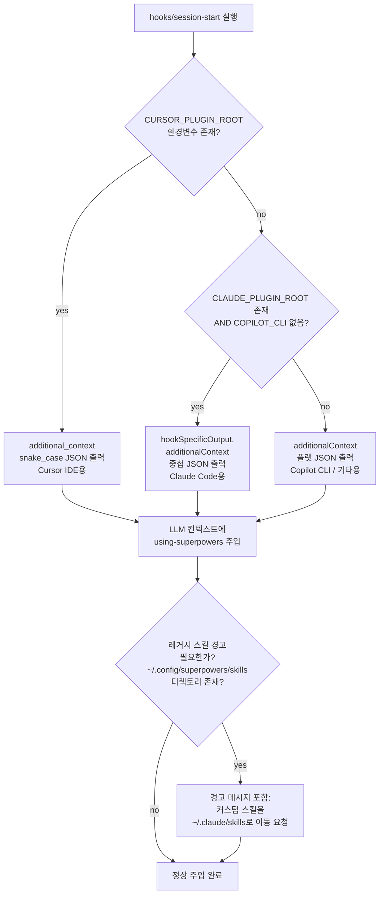
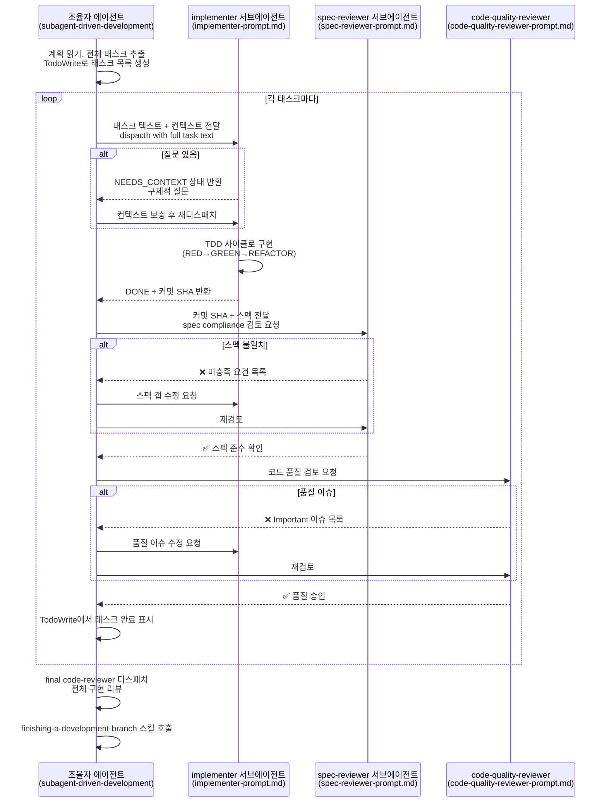

# Harness Analysis: `superpowers`

## 0. Metadata

- **이름**: superpowers
- **종류**: in-harness skill system (Claude Code 플러그인)
- **저장소**: https://github.com/obra/superpowers (로컬: `/Users/WonjinSin/Documents/project/superpowers`)
- **분석 커밋/버전**: v5.0.7
- **분석 일시**: 2026-04-15
- **주 언어/런타임**: Markdown (스킬 정의), Bash (훅), JavaScript (OpenCode 어댑터)
- **주 LLM 공급자**: 플랫폼 종속 (Claude Code → Claude, Gemini CLI → Gemini, Copilot CLI → Copilot)

## TL;DR — 한 문단 요약

Superpowers는 Claude Code, Cursor, Copilot CLI, Gemini CLI 등 여러 AI CLI 하네스 위에서 동작하는 **in-harness skill system**이다. 코드 한 줄 없이 순수 마크다운 문서로 이루어진 스킬 14개가 에이전트의 행동 패턴을 규정하며, SessionStart 훅이 세션 시작 시 마스터 규칙서(`using-superpowers`)를 LLM 컨텍스트에 자동 주입한다. 핵심 아이디어는 "에이전트가 작업 전에 반드시 해당 스킬을 호출해야 한다"는 강제 워크플로우로, TDD·브레인스토밍·서브에이전트 기반 구현·코드 리뷰까지 개발 사이클 전체를 스킬 체인으로 연결한다. 외부 의존성이 전혀 없는 zero-dependency 플러그인이다.

---

# Part 1: The Story

## 1-1. Main Flow (필수)

유저 메시지가 들어왔을 때 superpowers가 에이전트 행동에 영향을 주는 주 경로다.

```
┌────────────────────────────────────────────────────────────┐
│  새 세션 시작 — 하네스가 플러그인 훅 실행                      │
│  SessionStart 이벤트 발화                                   │
│  hooks/hooks.json  ·  SessionStart matcher                 │
└───────────────────────────┬────────────────────────────────┘
                            │
                            ▼
┌────────────────────────────────────────────────────────────┐
│  플랫폼 감지 & using-superpowers 내용 읽기                   │
│  CLAUDE_PLUGIN_ROOT / CURSOR_PLUGIN_ROOT / COPILOT_CLI     │
│  환경변수로 플랫폼 판별, SKILL.md 파일 읽어 JSON 이스케이프    │
│  hooks/session-start  ·  line 8-34                         │
└───────────────────────────┬────────────────────────────────┘
                            │
                            ▼
┌────────────────────────────────────────────────────────────┐
│  플랫폼별 JSON 포맷으로 additionalContext 출력               │
│  Claude Code → hookSpecificOutput.additionalContext        │
│  Cursor → additional_context (snake_case)                  │
│  Copilot/기타 → additionalContext (SDK 표준)               │
│  hooks/session-start  ·  line 46-55                        │
└───────────────────────────┬────────────────────────────────┘
                            │
                            ▼
┌────────────────────────────────────────────────────────────┐
│  LLM 컨텍스트에 using-superpowers 내용 주입됨               │
│  에이전트는 세션 시작부터 "1% 가능성 있으면 스킬 호출" 규칙을    │
│  알고 있음. 이후 모든 행동이 이 규칙 위에서 작동              │
│  skills/using-superpowers/SKILL.md  ·  전체                │
└───────────────────────────┬────────────────────────────────┘
                            │
                            ▼
              ┌─────────────┴──────────────┐
              │ 유저 메시지 수신              │
              │ "X를 만들어줘" / "버그 수정"   │
              └─────────────┬──────────────┘
                            │
                            ▼
┌────────────────────────────────────────────────────────────┐
│  에이전트: 스킬 적용 가능한가? (1% 기준)                      │
│  using-superpowers의 The Rule — Skill Priority 체계 적용   │
│  skills/using-superpowers/SKILL.md  ·  "The Rule" 섹션     │
└─────────────┬──────────────────────┬──────────────────────┘
              │ 적용 가능             │ 아무 스킬도 해당 없음
              ▼                      ▼
┌────────────────────────┐  ┌────────────────────────────────┐
│  Skill 도구로 해당       │  │  스킬 없이 직접 응답            │
│  스킬 호출              │  │  (사실상 드문 경우)             │
│  Skill tool             │  └────────────────────────────────┘
└──────────┬─────────────┘
           │
           ▼
┌────────────────────────────────────────────────────────────┐
│  스킬 내용 로드 & 에이전트가 스킬 지시에 따라 행동             │
│  스킬은 마크다운 문서 — 특정 워크플로우, 체크리스트,           │
│  다음 스킬 호출 지시를 담음                                  │
│  skills/<skill-name>/SKILL.md                              │
└────────────────────────────────────────────────────────────┘
```

### Narration

이 다이어그램이 보여주는 이야기는 크게 두 국면으로 나뉜다. 첫 번째 국면은 **세션 시작 시 자동 주입**이다. 유저가 첫 메시지를 치기도 전에 `hooks/session-start` 스크립트가 실행되어 `using-superpowers/SKILL.md` 전체 내용을 LLM의 시스템 컨텍스트에 밀어 넣는다. 덕분에 에이전트는 "이 세션에서는 스킬 기반으로 움직인다"는 규칙을 이미 알고 있다. 이 주입은 하네스마다 포맷이 다른데 — Claude Code는 중첩 JSON, Cursor는 snake_case, Copilot은 플랫 JSON — `session-start` 스크립트가 환경변수로 플랫폼을 판별해 적합한 포맷을 내보낸다(`session-start:46-55`).

두 번째 국면은 **유저 메시지 수신 후 스킬 발동**이다. 에이전트는 `using-superpowers`가 정의한 "1% 확률이라도 적용 가능한 스킬이 있으면 반드시 `Skill` 도구를 호출하라"는 규칙을 따른다. 이 규칙이 핵심적인 이유는 단순한 권장사항이 아니라 **강제 게이트**이기 때문이다 — 스킬 파일에는 `<HARD-GATE>`, `<EXTREMELY-IMPORTANT>` 태그로 에이전트의 합리화 시도를 명시적으로 차단하는 Red Flags 테이블이 있다(`using-superpowers/SKILL.md:79-95`). 스킬 자체가 코드가 아니라 마크다운이기 때문에 "실행"이란 에이전트가 그 마크다운을 읽고 지시대로 행동하는 것이다 — 여기서 LLM이 "실행 엔진" 역할을 한다.

설계의 핵심 트레이드오프: 모든 동작이 LLM의 지시 준수 능력에 의존한다. 코드 기반 강제가 없으므로 에이전트가 규칙을 무시할 수 있지만, 바로 그 유연성이 여러 플랫폼에서 수정 없이 동작하게 해준다.

---

## 1-2. 스킬 의존 네트워크 (Skill Dependency Graph)

superpowers의 본체는 스킬 간 참조 네트워크다. 각 스킬이 어떤 다른 스킬을 호출/의존하는지가 전체 시스템의 구조를 결정한다.

```
                    ┌─────────────────────────┐
                    │  using-superpowers      │
                    │  (세션 부트스트랩 진입점)  │
                    │  모든 스킬 호출 규칙 정의   │
                    └──────────┬──────────────┘
                               │ 세션 시작 시 자동 주입
                               ▼
               ┌───────────────────────────────┐
               │    유저 요청 수신               │
               └──┬─────────────┬──────────────┘
                  │             │
          새 기능 요청       버그/문제 발견
                  │             │
                  ▼             ▼
        ┌─────────────┐  ┌──────────────────────┐
        │ brainstorm  │  │ systematic-debugging  │
        │ (설계 먼저)  │  │  (원인 먼저)           │
        └──────┬──────┘  └──────────┬────────────┘
               │                    │
               ▼                    ▼
   ┌──────────────────────┐  ┌─────────────────────────┐
   │ using-git-worktrees  │  │ verification-before-    │
   │ (격리 워크스페이스)   │  │ completion (완료 검증)   │
   └──────────────────────┘  └─────────────────────────┘
               │
               ▼
        ┌─────────────┐
        │writing-plans│
        │(계획 문서화)  │
        └──────┬──────┘
               │
        ┌──────┴──────────────┐
        │                     │
        ▼                     ▼
┌──────────────────┐  ┌────────────────────┐
│ subagent-driven- │  │  executing-plans   │
│ development      │  │  (병렬 세션 실행)   │
│ (같은 세션 실행)  │  └────────────────────┘
└────────┬─────────┘
         │ 태스크마다
         ├─→ [implementer subagent]
         │      ↓ uses
         │   test-driven-development
         │
         ├─→ [spec-reviewer subagent]
         │
         ├─→ [code-quality-reviewer subagent]
         │
         └─→ requesting-code-review
                  │
                  ▼
         receiving-code-review
                  │
                  ▼
         finishing-a-development-branch
```

### Narration

이 그래프가 보여주는 것은 superpowers가 단순한 스킬 모음집이 아니라 **개발 사이클 전체를 커버하는 워크플로우 체인**이라는 점이다. `using-superpowers`가 루트이고, 그 아래로 두 개의 주요 진입점이 있다 — 새 기능은 `brainstorming`으로, 버그는 `systematic-debugging`으로 들어간다. 이 두 스킬은 각자의 종료 지점이 정해져 있다: brainstorming은 반드시 `writing-plans`로 끝나고(`brainstorming/SKILL.md:66`), debugging은 반드시 `verification-before-completion`으로 끝나야 한다.

흥미로운 설계 결정은 `subagent-driven-development`가 구현 스킬이 아니라 **조율 스킬**이라는 점이다. 실제 구현은 서브에이전트가 하고, 조율자는 태스크 추출·컨텍스트 큐레이션·리뷰 디스패치만 담당한다(`subagent-driven-development/SKILL.md:11`). 서브에이전트는 `test-driven-development` 스킬을 따르도록 지시받는다 — 이렇게 스킬이 스킬을 부르는 재귀 구조가 만들어진다. 이 설계의 핵심 이점은 **컨텍스트 오염 방지**다: 조율자의 긴 대화 히스토리가 구현자에게 전달되지 않고, 구현자는 태스크 텍스트와 필요한 컨텍스트만 받아 신선한 상태에서 시작한다.

`dispatching-parallel-agents`와 `using-git-worktrees`는 독립 유틸리티 스킬로 네트워크에서 특정 스킬의 필수 선행 조건 역할을 한다 — `subagent-driven-development`의 통합 섹션은 `using-git-worktrees`를 REQUIRED로 표기한다(`subagent-driven-development/SKILL.md:268`).

---

## 1-3. Alternate Paths

### (a) 스킬 직접 호출 — 유저가 특정 스킬을 명시하는 경우

```
유저: "/brainstorming 해줘" 또는 "brainstorming 스킬 써서 설계해줘"
        │
        ▼
┌────────────────────────────────────────────────────────┐
│  에이전트가 Skill 도구로 해당 스킬 직접 로드              │
│  using-superpowers의 라우팅 단계 건너뜀                 │
│  Skill tool → skills/<name>/SKILL.md 로드              │
└───────────────────────────┬────────────────────────────┘
                            │
                            ▼
                    스킬 지시 따라 실행
```

### (b) 브레인스토밍 → 계획 → 구현 전체 사이클

```
유저: "새 기능 X를 만들고 싶어"
        │
        ▼
┌────────────────────────────┐
│  brainstorming 스킬 발동    │
│  9단계 체크리스트 실행        │
│  1. 프로젝트 컨텍스트 탐색   │
│  2. 비주얼 컴패니언 제안?    │
│  3. 명확화 질문 (1개씩)     │
│  4. 2-3가지 접근법 제안     │
│  5. 섹션별 설계 제시/승인    │
│  6. 설계 문서 작성·커밋      │
│  7. 스펙 자기 검토           │
│  8. 유저 스펙 검토 대기      │
│  9. writing-plans 호출      │
└──────────────┬─────────────┘
               │
               ▼
┌────────────────────────────┐
│  writing-plans 스킬 발동   │
│  태스크를 2-5분 단위로 분해  │
│  파일 경로·코드·검증 단계   │
│  포함한 계획 문서 작성       │
│  docs/superpowers/plans/   │
│  YYYY-MM-DD-*.md에 저장    │
└──────────────┬─────────────┘
               │
               ▼
┌────────────────────────────────────────────────────────┐
│  선택: subagent-driven-development (같은 세션)          │
│  OR executing-plans (병렬 세션)                        │
│  결정 기준: "이 세션에 머무를 것인가?"                   │
└──────────────┬─────────────────────────────────────────┘
               │ subagent-driven-development 선택 시
               ▼
  ┌────────────────────────────────┐
  │  태스크마다 반복:               │
  │  1. implementer 서브에이전트   │
  │  2. spec-reviewer 서브에이전트 │
  │  3. code-quality-reviewer     │
  └──────────────┬─────────────────┘
                 │ 모든 태스크 완료
                 ▼
  ┌────────────────────────────────┐
  │  final code-reviewer 디스패치  │
  │  finishing-a-development-      │
  │  branch 스킬로 통합             │
  └────────────────────────────────┘
```

### Narration

"alternate paths"라고 표현했지만 실제로는 **두 번째 다이어그램이 superpowers의 메인 유즈케이스**다 — 브레인스토밍부터 배포까지의 전체 사이클. brainstorming 스킬의 9단계 체크리스트(`brainstorming/SKILL.md:25-29`)가 흥미로운 이유는 각 단계가 완료 조건이 명확한 작업이기 때문이다: 6단계에서 설계 문서를 git commit해야 하고, 7단계에서 placeholder를 모두 제거해야 하고, 8단계에서 유저 승인을 명시적으로 대기해야 한다. 이런 구체성이 에이전트가 "대충 하고 넘어가는" 것을 방지한다.

`writing-plans`에서 `subagent-driven-development`로 넘어가는 분기 결정은 순수하게 에이전트의 판단이다 — "같은 세션에 머물 것인가, 별도 세션을 열 것인가"를 기준으로 한다(`subagent-driven-development/SKILL.md:25-38`). 단, 두 경로 모두 `finishing-a-development-branch`로 수렴한다는 점이 설계의 일관성을 보여준다.

### (c) 서브에이전트 내부 흐름 — using-superpowers의 SUBAGENT-STOP

```
조율자 에이전트가 서브에이전트 디스패치
        │
        ▼
┌────────────────────────────────────────────────────────┐
│  서브에이전트 세션 시작                                   │
│  SessionStart 훅 실행 → using-superpowers 내용 주입     │
└───────────────────────────┬────────────────────────────┘
                            │
                            ▼
┌────────────────────────────────────────────────────────┐
│  <SUBAGENT-STOP> 태그 확인                             │
│  "서브에이전트로 디스패치된 경우 이 스킬을 건너뜀"         │
│  서브에이전트는 using-superpowers 규칙을 따르지 않고     │
│  조율자가 제공한 태스크 텍스트를 직접 실행               │
│  skills/using-superpowers/SKILL.md  ·  line 6-8       │
└───────────────────────────┬────────────────────────────┘
                            │
                            ▼
                    태스크 직접 실행
                    (TDD, 구현, 커밋)
```

### Narration

이 경로가 중요한 이유: SessionStart 훅은 서브에이전트 세션에도 실행되어 `using-superpowers` 내용이 주입된다. 그런데 서브에이전트가 그 규칙을 그대로 따르면 "매 액션 전에 스킬 체크"를 하게 되어 불필요한 오버헤드가 생긴다. `<SUBAGENT-STOP>` 태그는 이를 방지하는 메커니즘이다(`using-superpowers/SKILL.md:6-8`) — 서브에이전트는 자신이 디스패치된 에이전트임을 인식하고 `using-superpowers` 규칙을 건너뛴다. 대신 조율자가 프롬프트에 명시한 `superpowers:test-driven-development` 같은 특정 스킬만 따른다. 이로써 **조율자는 워크플로우 규칙을 준수하고, 서브에이전트는 태스크 실행에 집중한다**는 역할 분리가 달성된다.

---

## 1-4. SessionStart 훅 플랫폼 분기 (결정 트리)

훅 시스템이 어떻게 여러 플랫폼에서 동작하는지를 보여주는 결정 트리다.



### Narration

이 결정 트리는 `hooks/session-start`(line 46-55)의 핵심 로직을 표현한다. 세 플랫폼이 additionalContext를 전달받는 JSON 키 이름이 모두 다르기 때문에 환경변수로 플랫폼을 구분한다. 흥미로운 점은 **Cursor가 먼저 체크된다는 것** — Cursor가 `CLAUDE_PLUGIN_ROOT`도 함께 설정하는 경우가 있어서, Cursor를 먼저 걸러내지 않으면 Claude Code 분기로 잘못 들어간다.

레거시 경고는 조용한 마이그레이션 알림 메커니즘이다. v5에서 커스텀 스킬 경로가 `~/.config/superpowers/skills`에서 `~/.claude/skills`로 바뀌었는데, 그 디렉토리가 아직 있으면 첫 응답에 경고를 포함시킨다(`session-start:13-15`). 에러가 아니라 경고 — 기존 스킬이 로드되지 않는다는 사실을 유저에게 알리되 세션을 중단시키지 않는다.

---

## 1-5. subagent-driven-development 태스크 실행 사이클



### Narration

이 시퀀스 다이어그램이 보여주는 가장 중요한 특징은 **두 단계 리뷰 게이트**다. spec compliance review가 통과된 후에만 code quality review가 시작된다 — 이 순서가 중요한데, 스펙을 지키지 않은 코드의 품질을 검토하는 것은 의미가 없기 때문이다(`subagent-driven-development/SKILL.md:247`). 

조율자가 서브에이전트에게 계획 파일을 직접 읽게 하지 않고 **태스크 텍스트를 추출해서 전달한다**는 점도 주목할 만하다. 이로써 서브에이전트는 파일 읽기 오버헤드 없이 필요한 정보만 받고, 조율자는 어떤 컨텍스트가 필요한지 큐레이션하는 역할을 명확히 갖는다(`subagent-driven-development/SKILL.md:186-188`).

`BLOCKED` 상태 처리도 정교하다: 같은 모델로 재시도하지 않고, 더 강력한 모델로 재디스패치하거나 태스크를 더 작게 쪼개거나 인간에게 에스컬레이션하는 세 가지 옵션이 명시된다(`subagent-driven-development/SKILL.md:112-119`). 에이전트가 "막혔을 때"를 다루는 방식이 구체적으로 설계되어 있다는 점이 일반적인 스킬 시스템과 차별화된다.

---

# Part 2: Reference Details

## 2-1. Entry Points

플랫폼별 플러그인 설치 후 `SessionStart` 훅이 유일한 자동 진입점이다. 이후의 모든 상호작용은 유저 메시지와 에이전트의 `Skill` 도구 호출로 이루어진다. Conversation ID 식별이나 별도 인증 로직은 없음 — 하네스(Claude Code 등)가 처리한다.

## 2-2. Concurrency

해당 없음 — superpowers 자체는 동시성 제어를 하지 않는다. 동시성은 하네스 레이어(Claude Code 등)의 책임이다. 단, `subagent-driven-development`는 구현 서브에이전트를 병렬로 실행하지 말 것을 명시한다("Dispatch multiple implementation subagents in parallel (conflicts)") — 태스크 간 git 충돌 방지를 위해.

## 2-3. Routing

결정론적 라우팅이 없다. 대신 LLM 에이전트 스스로 `using-superpowers`의 스킬 우선순위 규칙을 따라 어떤 스킬을 호출할지 결정한다. "Process skills first (brainstorming, debugging) → Implementation skills second"가 유일한 우선순위 기준(`using-superpowers/SKILL.md:99-104`). AI 라우팅이 번복될 수 있는 지점은 없다 — 일단 스킬이 로드되면 그 스킬의 지시가 최우선.

## 2-4. Context Assembly

`session-start` 훅이 `using-superpowers/SKILL.md` 전체를 읽어 JSON 이스케이프 후 `additionalContext`로 주입하는 것이 유일한 자동 컨텍스트 조립이다(`session-start:18-35`). 이후 각 스킬은 Skill 도구로 on-demand 로드된다. YAML 프론트매터(`name`, `description`)는 스킬 발견용이고 컨텍스트에 포함되지 않는다.

## 2-5. Provider Abstraction

해당 없음 — superpowers는 특정 LLM 공급자에 직접 접근하지 않는다. LLM 호출은 전적으로 하네스(Claude Code, Copilot CLI 등)가 담당한다. 스킬에서 "use a fast, cheap model" 같은 모델 선택 힌트를 제공하지만(`subagent-driven-development/SKILL.md:88-96`), 실제 모델 선택은 에이전트의 판단이다.

## 2-6. Worker / Execution

실행 단위는 서브에이전트다. 조율자가 `Agent` 도구로 서브에이전트를 디스패치하고 서브에이전트는 격리된 컨텍스트에서 태스크를 실행한다. Abort/timeout은 하네스 레이어에서 처리.

## 2-7. Message Loop

해당 없음 — 스트림/배치 처리 로직이 없다. 스킬은 마크다운 문서이고 LLM이 "실행 엔진"이다.

## 2-8. Session / State

세션 상태 관리 없음. superpowers는 stateless — 상태는 하네스(Claude Code 세션)와 git 히스토리, TodoWrite 작업 목록으로만 추적된다. 세션 만료 정책 없음.

## 2-9. Isolation

격리 기술로 **git worktree**를 권장한다(`using-git-worktrees` 스킬). `subagent-driven-development`에서 REQUIRED로 표기. Worktree resolver 로직은 `using-git-worktrees/SKILL.md`에 정의되어 있으며 새 피처는 항상 별도 worktree에서 시작한다. Docker/프로세스 격리 없음.

## 2-10. Tool / Capability

내장 도구: `Skill` 도구 (스킬 로드), `Agent` 도구 (서브에이전트 디스패치), `TodoWrite` (태스크 추적), `Write`/`Edit`/`Read` (파일 조작). MCP 확장 없음. 훅은 `SessionStart` 하나.

## 2-11. Workflow Engine

명시적 워크플로우 엔진 없음. 워크플로우는 스킬 문서의 마크다운 체크리스트와 Graphviz dot 다이어그램으로 정의되고, LLM이 이를 읽어 순서대로 실행한다. DAG 노드 타입이나 조건 분기 구문 없음 — 모든 분기 로직은 스킬 문서의 자연어 서술로 표현된다.

## 2-12. Configuration

`~/.claude/settings.json` → `~/.claude/skills/` (Claude Code 글로벌 설정). 플러그인 수준 설정은 `.claude-plugin/plugin.json`의 메타데이터뿐이다. 런타임 재로드 가능 — 스킬 파일을 수정하면 다음 Skill 도구 호출 시 반영. 환경변수: `CLAUDE_PLUGIN_ROOT`, `CURSOR_PLUGIN_ROOT`, `COPILOT_CLI`.

## 2-13. Error Handling

`session-start:18`에서 `using-superpowers` 읽기 실패 시 `"Error reading using-superpowers skill"` 폴백 문자열을 주입한다 — 에러가 세션을 중단시키지 않는다. 스킬 레벨의 에러 처리는 없음 (마크다운 문서라서). 서브에이전트 실패 처리는 `subagent-driven-development`의 `BLOCKED` 상태 처리 로직으로 커버.

## 2-14. Observability

로거 없음. git 커밋 히스토리와 `docs/superpowers/specs/`, `docs/superpowers/plans/` 디렉토리에 저장되는 문서가 유일한 지속적 기록이다. TodoWrite 작업 목록이 세션 내 진행상황 추적에 사용된다.

## 2-15. Platform Adapters

| 플랫폼 | 훅 파일 | JSON 키 | 환경변수 |
|--------|---------|---------|---------|
| Claude Code | hooks/hooks.json | `hookSpecificOutput.additionalContext` | `CLAUDE_PLUGIN_ROOT` |
| Cursor IDE | hooks/hooks-cursor.json | `additional_context` | `CURSOR_PLUGIN_ROOT` |
| Copilot CLI | hooks/hooks.json | `additionalContext` | `COPILOT_CLI=1` |
| OpenCode.ai | .opencode/plugins/superpowers.js | JS systemPrompt hook | - |
| Codex | symlink 기반 | native skill discovery | - |
| Gemini CLI | gemini-extension.json | native extension | - |

## 2-16. Persistence

DB 없음. 파일시스템만 사용:
- `docs/superpowers/specs/YYYY-MM-DD-*.md` — 설계 문서
- `docs/superpowers/plans/YYYY-MM-DD-*.md` — 구현 계획
- git 히스토리 — 변경 이력

## 2-17. Security Model

보안 모델 없음 — superpowers는 신뢰할 수 있는 로컬 개발 환경을 가정한다. 인증 없음. 시크릿 처리 없음. 플러그인이 접근하는 파일은 `using-superpowers/SKILL.md` 하나다(`session-start:18`).

## 2-18. Key Design Decisions & Tradeoffs

superpowers의 핵심 설계 결정들은 하나의 철학("zero-dependency, pure markdown, LLM as execution engine")에서 파생된다. 아래 표는 그 결정들과 트레이드오프를 정리한다.

| 결정 | 선택 | 대안 | 근거 | 트레이드오프 |
|------|------|------|------|-------------|
| 스킬 형식 | 순수 마크다운 | YAML/JSON 구조화 | 어떤 플랫폼에서도 수정 없이 동작 | LLM이 규칙을 무시할 수 있음 |
| 의존성 | zero-dependency | SDK/라이브러리 | 설치 단순성, 플랫폼 독립성 | 기능 제약 (복잡한 로직 불가) |
| 워크플로우 강제 | <HARD-GATE>, Red Flags 테이블 | 소프트 권장 | 에이전트 합리화 방지 | 유연성 감소 |
| 서브에이전트 격리 | 태스크마다 fresh subagent | 단일 에이전트 | 컨텍스트 오염 방지 | 비용 증가 (서브에이전트 × n) |
| 두 단계 리뷰 | spec compliance → code quality | 단일 리뷰 | 순서 강제로 over/under-build 방지 | 반복 증가 |
| 레거시 경고 | 조용한 경고 메시지 | 에러로 차단 | 마이그레이션 시 UX 저하 방지 | 유저가 놓칠 수 있음 |
| 스킬 로딩 | on-demand (Skill 도구) | 세션 시작 시 전부 | 컨텍스트 윈도우 절약 | 스킬마다 도구 호출 비용 |

## 2-19. Open Questions

- `brainstorming`의 `visual-companion.md`가 실제로 어떻게 브라우저 UI를 띄우는지 — `skills/brainstorming/visual-companion.md` 전체 확인 필요
- `writing-skills`의 `testing-skills-with-subagents.md`에서 스킬 TDD 사이클이 어떻게 구현되는지 — 실제 서브에이전트 프롬프트 확인 필요
- `agents/code-reviewer.md`의 정확한 에이전트 정의 형식 — Claude Code 에이전트 시스템 문서 참고

---

## Appendix: Quick Reference Table

| 항목 | 값 |
|------|-----|
| Type | in-harness skill system |
| Entry points | SessionStart 훅 (1개), Skill 도구 호출 (on-demand) |
| Concurrency | 없음 (하네스 위임); 구현 서브에이전트는 직렬 필수 |
| Router style | LLM 자율 판단 (using-superpowers 규칙 기반) |
| Provider abstraction | 없음 (하네스 위임) |
| Session model | stateless (git + 파일시스템) |
| Isolation | git worktree (권장); 서브에이전트 컨텍스트 격리 |
| Workflow engine | 없음 (마크다운 체크리스트 + LLM) |
| Primary language | Markdown, Bash |
| Skills | 14개 코어 스킬 |
| Supported platforms | Claude Code, Cursor, Copilot CLI, Gemini CLI, OpenCode, Codex |
| LoC (approx) | ~2,000 (스킬 마크다운) + ~60 (bash 훅) |
