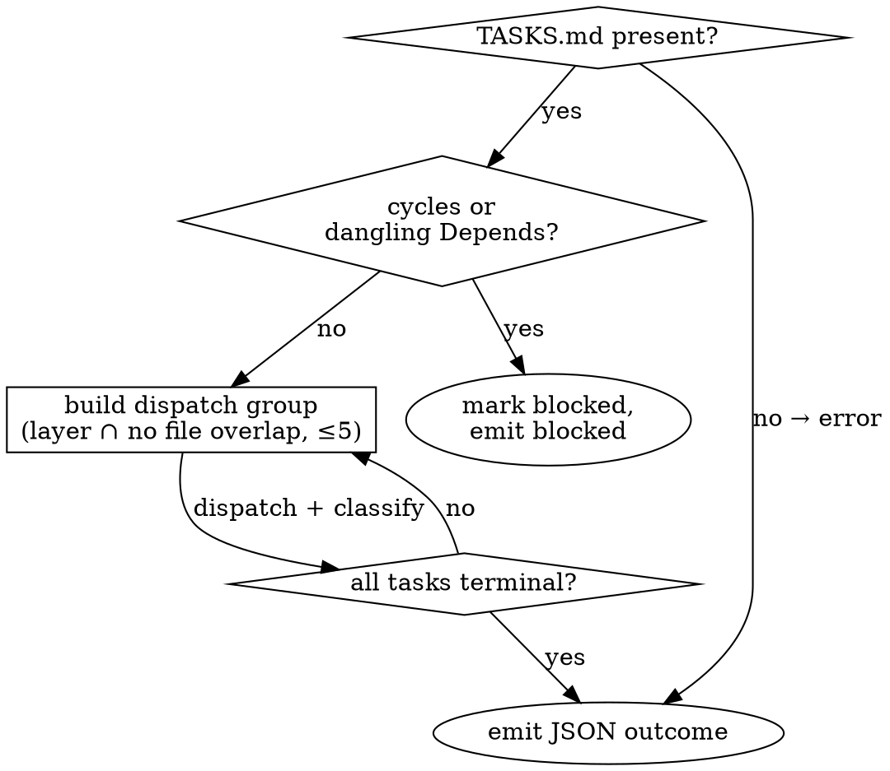

# Parallel Task Executor

## Overview

TASKS.md 의 모든 task 를 terminal 상태까지 실행. 각 task 를 Claude Code `Task` 툴로 fresh subagent 1개씩 dispatch — DAG 레이어 내부는 병렬, `Files:` 가 겹치면 직렬화. `ROADMAP.md` 업데이트와 병렬 리턴 집계가 필요해 **메인 대화 컨텍스트**에 산다.

## When to use

## Inputs / outputs

- `.planning/{session_id}/TASKS.md` 와 `ROADMAP.md` 읽음.
- 단일 JSON 한 개 emit: `done | blocked | failed | error`. `references/output-schemas.md` 참조.

## 실행 모드

Main context — `../../harness-contracts/execution-modes.ko.md` 참조. executor 자체가 subagent Task 호출들을 fan out 하고 리턴을 집계해야 하므로 메인 thread 에서 실행된다.

## Procedure (요약)

1. TASKS.md 로드·검증 (환경, 모양, resume) → `references/procedure.md#step-1--tasksmd-로드검증`
2. DAG 빌드, 파일 겹침 직렬화, 그룹 ≤5 cap → `references/procedure.md#step-2--실행-계획-구성-dag--레이어--파일-겹침-직렬화`
3. 각 그룹을 Task 툴로 한 assistant turn 에 dispatch → `references/procedure.md#step-3--각-그룹을-task-툴로-dispatch`
4. `references/subagent-prompt.md` 로 프롬프트 구성; dispatch 시점에 `{executor-skill-path}` 치환.
5. 각 리턴을 DONE / BLOCKED / FAILED / skipped 로 분류 → `references/procedure.md#step-5--각-subagent-리턴-분류`
6. task 별 `[Result]` 블록 기록 → `references/result-block-format.md`
7. ROADMAP.md 최종화, JSON emit → `references/procedure.md#step-7--roadmapmd-최종화next-해석emit`

## Why this shape

- **DAG + 파일 겹침 직렬화는 subagent 가 못 고치는 git 충돌을 예방.** 같은 파일을 병렬 편집하는 두 subagent 는 둘 다 자기가 주인이라 생각한다.
- **세 실패 클래스 (blocked / failed / error) 는 잘못된 task 에 대한 retry 루프를 막는다.** BLOCKED = task 본문이 틀림, 재시도 무효. FAILED = 시도가 틀림, cap 까지 재시도.
- **5개 dispatch cap.** cap 을 더 높이면 모든 병렬 리턴이 집계되기 전에 부모 assistant turn 이 만료될 위험이 커지고, 일반적인 task-DAG 너비를 넘으면 병렬화 이득도 체감된다.
- **3회 task-local cap 이 유일한 retry.** 세션 레벨 루프 없음. cap 은 TASKS.md `[Result]` 블록을 통해 세션 전체에 걸쳐 — 대화 재시작이 무한 늘리지 못함.
- **Subagent 는 self-contained.** PRD/TRD 나 다른 task 를 읽지 않는다 — task-writer 의 "verbatim, 플레이스홀더 금지" 규칙이 task 본문만으로 충분하게 만든다.

## 필수 다음 스킬

이 스킬이 `outcome: "done"` 을 emit 할 때 (전체 payload 계약: `../../harness-contracts/payload-contract.ko.md` § "parallel-task-executor → evaluator"):

- **필수 하위 스킬:** harness-flow:evaluator 사용
  Payload: `{ session_id, tasks_path: ".planning/{session_id}/TASKS.md", rules_dir?, diff_command? }` — `tasks_path` 는 결정론적; `rules_dir` 와 `diff_command` 는 메인 스레드 설정에서 온다.

`outcome: "blocked"` / `"failed"` / `"error"` 일 때: flow 종료. 실패 디테일을 사용자에게 보고하고 멈춘다. (non-done outcome 에서는 evaluator 가 돌지 않는다 — blocker 해소는 사람의 결정.)

## Boundaries

- 파일 소유권: `../../harness-contracts/file-ownership.ko.md` 참조. Executor 는 `TASKS.md` 에 `[Result]` 블록을 append 하고 (본문은 절대 안 건드림) Step 7 에서 `ROADMAP.md` 를 최종화한다. 소스 코드는 executor 가 dispatch 한 per-task subagent 만 편집 — executor 자체는 코드를 쓰지 않는다.
- 다른 harness 스킬을 직접 호출하지 않는다. 위 'Required next skill' 섹션이 하위 스킬을 dispatch 한다.

## Anti-patterns

- **BLOCKED task 를 재 dispatch 하지 말 것.** 재시도는 같은 리턴. `blocked` outcome 으로 escalate.
- **리턴 리뷰 시 _다른_ task 의 Acceptance 읽지 말 것.** task 간 정합성은 executor 몫이 아닌 evaluator 몫. 단, 현재 task 자신의 Acceptance 는 _읽는다_ — 아래 "Subagent 가 자기 Acceptance 정의하게 두지 말 것" 이 그것에 의존한다. 경계: 이 task 의 Acceptance, yes; 형제 task 의 Acceptance, no.
- **파일 겹침을 조용히 넘기지 말 것.** 감지되면 명시적 직렬화 — 두 subagent 가 공유 라인을 안 건드릴 거라 희망하지 말 것.
- **Subagent 프롬프트에 PRD/TRD 박지 말 것.** task 본문이 이미 PRD/TRD 어휘 verbatim 인용 — 원본 재포함은 재해석 drift 를 부른다.
- **Subagent 가 자기 Acceptance 정의하게 두지 말 것.** `status: done` 인데 evidence 가 task Acceptance bullet 에 매핑 안 되면 그건 BLOCKED.
- **병렬 가능 task 를 turn 나눠서 dispatch 하지 말 것.** 한 그룹의 모든 Task 호출은 **한 assistant turn** — 쪼개면 직렬화된다.

## See also

- `references/procedure.md` — Step 1-7 전체 디테일.
- `references/subagent-prompt.md` — subagent 별 프롬프트 템플릿.
- `references/output-schemas.md` — JSON 변형.
- `references/result-block-format.md` — `[Result]` 블록 + status delta.
- `references/test-driven-development.md` — task 별 적용되는 TDD 규율 (영문 reference 사용; 별도 `.ko` 미러 없음).
