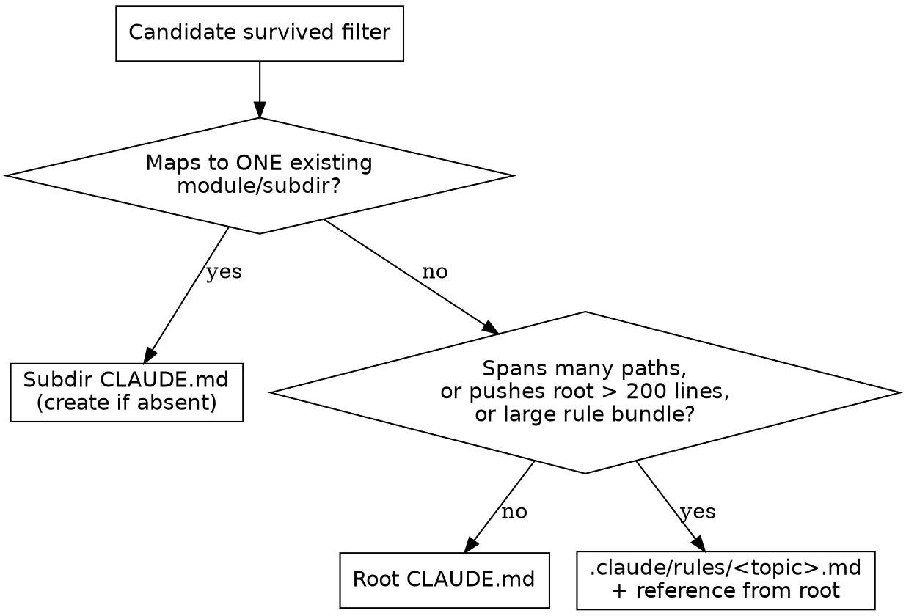

# claude-md-revise

## Overview

Surface session-derived knowledge worth persisting, select the active harness's
durable instruction surface, place it at the **narrowest applicable scope**,
then apply per-candidate diffs the user approves one at a time.

**Core principle:** If a future coding agent could derive it by reading the
code, it does not belong in project instructions. Only persist what project
state cannot tell on its own.

**Announce at start:** "I'm using the claude-md-revise skill to surface project-memory update candidates from this session."

## Platform Detection

- Codex instructions or Codex-native tools present → target `AGENTS.md`.
- Claude Code tools/session present → target `CLAUDE.md` and optional
  `.claude/rules/*.md`.
- If uncertain, inspect existing root instruction files and ask before writing.

Do not create a Claude-only instruction surface in a Codex project, or vice
versa, merely because this skill's compatibility name contains `claude`.

## When to Use

- Implementation or a bug fix just completed (final review passed, or `systematic-debugging` Phase 4 verified) and the session had real corrections, conventions, or external constraints — surface candidates *before* finalizing the branch
- User said "remember this", "add to project memory", "persist this in CLAUDE.md"
- User repeated the same correction 2+ times (signal of a real rule, not a one-off)
- A non-obvious external fact came up (deadline, owner, deprecated path, external system)

**Do NOT use for:**

- Auditing, scoring, or fixing an existing CLAUDE.md as a whole → that is `claude-md-improver`
- Code conventions visible by reading the code (formatting, naming, file layout)
- Anything `git log` / `git blame` would tell
- One-off task state ("the bug we just fixed")
- Personal preferences unrelated to this project (those go to `~/.claude/CLAUDE.md` — propose, don't write)

## The Process

### Step 1: Gather Inputs

1. **Current session context** — primary source.
2. **Transcript fallback** — use only a documented, harness-owned transcript
   pointer exposed to the current session.

   - Codex: prefer current context and ledger files. Raw `~/.codex` transcript
     formats are unstable; do not scan them by guessed path.
   - Claude Code: if context compacted, the original messages may live on disk:

   ```bash
   slug=$(pwd | sed 's|/|-|g')
   ls -t ~/.claude/projects/$slug/*.jsonl | head -1
   ```

   Read the most-recent JSONL. Each line is a JSON object with a `type` field. Many internal types (`attachment`, `system`, `file-history-snapshot`, `permission-mode`, etc.) are interleaved with the conversation — filter to `type == "user"` or `type == "assistant"` before reading content.

3. **Existing project instructions** — read the active platform's files so you
   can skip candidates already covered:
   - **Codex project scope:** every `AGENTS.md` from `pwd` upward to repo root
     and nested `AGENTS.md` files in directories touched this session.
   - **Claude project scope:** every `CLAUDE.md` from `pwd` upward to repo root,
     touched-subdirectory `CLAUDE.md` files, and project `.claude/rules/*.md`.
   - **User scope:** only documented user-level instruction files for the active
     platform are read-only; propose changes but never edit them directly. Do
     not guess a Codex user-level path.

   Anything under `~/.claude/` is user-owned. Read it to avoid restating, but never write to it directly — surface a proposal and let the user apply it themselves.

### Step 2: Identify Candidates

Categorize what came up in the session:

| Category | Example | Qualifies? |
|---|---|---|
| Rule | "we use bun, never npm" | ✓ if confidence ≥ medium |
| Fact | "merge freeze starts 2026-05-15" | ✓ — convert relative dates to absolute |
| Anti-pattern | "don't run hooks that call LLM" | ✓ if user explicitly corrected |
| Reference | "bugs tracked in Linear INGEST" | ✓ |
| Code convention | "we use TypeScript" (visible in package.json) | ✗ — derive don't document |
| Task state | "the auth bug we fixed today" | ✗ — git history owns it |

### Step 3: Filter Against Existing Files

For each candidate, scan all active-platform instruction files gathered in
Step 1. Skip candidates already covered, even with different wording.

### Step 4: Decide Placement (WHERE + HOW)

For each surviving candidate, decide **WHERE** it lives: the narrowest scope
that still loads when needed. On Codex use root or nested `AGENTS.md`; nearer
files apply to their subtree. On Claude Code use the table below and consult
[references/placement-decision.md](references/placement-decision.md) for the
Claude-only rules/import fork.

| Candidate scope | Target file | Why |
|---|---|---|
| Codex: maps to one module/subdir | that subdir's `AGENTS.md` | nearest scoped instructions |
| Codex: project-wide rule/fact | root `AGENTS.md` | always applies in repository |
| Maps to ONE existing module/subdir | that subdir's `CLAUDE.md` (create if absent) | on-demand load — keeps root lean |
| Project-wide rule/fact | root `CLAUDE.md` | parent dirs load eagerly |
| Topic spans multiple paths, **or** adding it pushes root past 200 lines, **or** large rule bundle | `.claude/rules/<topic>.md` + reference from root | loads per frontmatter (no `paths:` = always-on; `paths:` = per-path) |

The following flowchart is Claude Code-only. Codex placement is fully described
by the first two rows above.



**The 200-line split is REACTIVE:** trigger it only when *this session's new additions* push root past 200 lines. Relocate only your own additions into the new rules file — never reformat, reorder, or move pre-existing root content (that is `claude-md-improver`'s job).

### Step 5: Present Diffs One-by-One

For each surviving candidate, present:

```
[N/M] <Category> · confidence <high|medium|low>
Evidence: "<verbatim user quote>"
Target: <file path> · reason: <why this scope + load style, one clause>

Proposed edit:
  - <old text or insertion point>
  + <new text>

Apply? (a)pprove / (e)dit / (r)eject / (d)efer
```

The `reason:` clause is annotation, NOT a second question — placement is decided in Step 4, the user still answers one prompt.

**Forbidden:** Bulk-approving multiple candidates with one prompt. One decision per candidate.

### Step 6: Apply and Suggest Commit

Use the Edit tool per approved candidate (create the target file when it does
not yet exist). After all approved edits applied, summarize what changed and
suggest:

```
Project instructions updated with N entries. Suggested commit:
  git add <files>
  git commit -m "docs: persist session learnings"

Run now, or bundle with other work?
```

Do NOT auto-run the commit.

## Quick Reference

| Signal in session | Action |
|---|---|
| "we only use X" / "always X, never Y" | Strong candidate — Rule |
| Same correction repeated 2+ times | Strong candidate — Rule (high confidence) |
| One-time "let's do it this way" | Defer unless user re-confirms |
| External system mentioned | Candidate — Reference |
| Deadline / freeze date / stakeholder ask | Candidate — Fact (absolute date) |
| Codex module/project rule | Nested/root `AGENTS.md` |
| Rule limited to one module/subdir | Subdir `CLAUDE.md`, not root |
| Root would exceed 200 lines | Spill the new additions to `.claude/rules/<topic>.md` |
| User explained existing code | NOT a candidate |

## Common Mistakes

| Mistake | Fix |
|---|---|
| Bundling multiple candidates into one approval | One candidate = one decision |
| Restating existing CLAUDE.md content | Filter against current files in Step 3 |
| Adding code conventions visible from the code | Skip — derive don't document |
| Modifying any file under `~/.claude/` directly (CLAUDE.md, `rules/*.md`) | Never — propose, let user write themselves |
| Writing without showing the diff first | User must see exact diff before approving |
| Auto-committing | Suggest only — commit decision is the user's |
| Saving relative dates ("Thursday") | Always convert to absolute dates ("2026-05-15") |
| Defaulting a module-scoped rule to root | Place at the narrowest scope — a subdir `CLAUDE.md` loads on-demand and keeps root lean |
| Burying a project-wide rule in a subdir `CLAUDE.md` | Narrowest scope means narrowest that *still loads when needed* — a subdir file only loads when that folder is touched; project-wide rules belong in root or a no-`paths:` rules file |
| Using `@path` import for situational or large material | `@path` is eager (loaded every session, max 4 hops) — use a plain path; reserve `@` for must-always-be-live global rules |
| During a 200-line spill, rewriting or relocating pre-existing root lines | Move only the new additions you are adding this session; existing content is untouchable |

## Red Flags — STOP

- About to write to a file the user did not approve → STOP
- About to modify any file under `~/.claude/` (CLAUDE.md or `rules/*.md`) → STOP, propose to user instead
- About to add 5+ lines of code-derivable info → STOP, the project state already says this
- About to "auto-commit" without asking → STOP
- About to bundle 3 candidates into one approval prompt → STOP, present individually
- About to add a module/subdir-specific rule to root CLAUDE.md → STOP, a narrower scope exists
- About to put a project-wide rule into a subdir CLAUDE.md → STOP, it only loads when that folder is touched; use root or a no-`paths:` rules file
- About to write `@path` for content that is situational or large → STOP, `@` is eager and always-loaded; use a plain path
- A 200-line spill is about to edit, reorder, or move lines already in root → STOP, relocate only your own new additions
