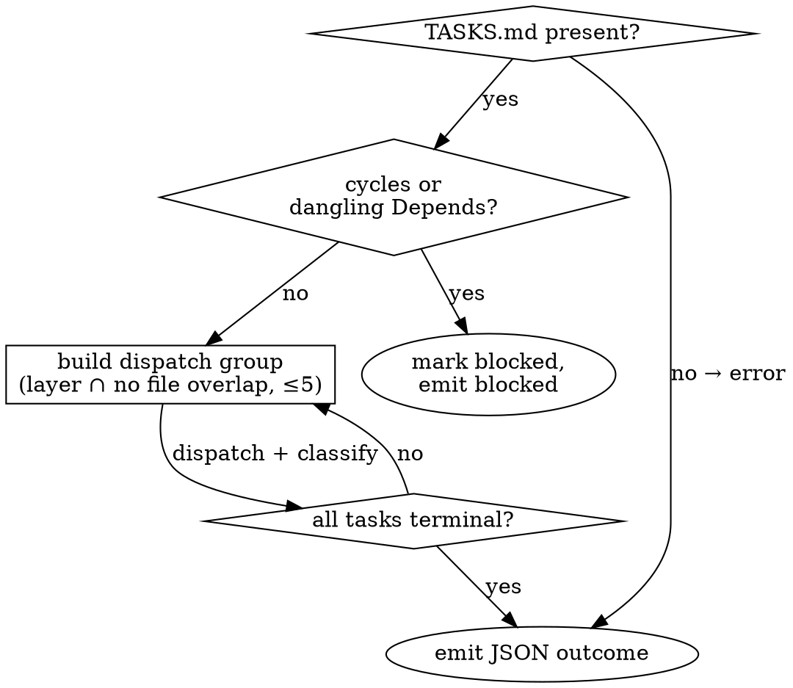

# Parallel Task Executor

## Overview

Run every task in `TASKS.md` to a terminal state. Dispatches one fresh subagent per task via Claude Code's `Task` tool — parallel within DAG layers, serialized when `Files:` overlap. Lives in the **main conversation context** because it must update `ROADMAP.md` and aggregate parallel returns.

## When to use

## Inputs / outputs

- Reads `.planning/{session_id}/TASKS.md` (and `ROADMAP.md`).
- Emits one JSON object: `done | blocked | failed | error`. See `references/output-schemas.md`.

## Execution mode

Main context — see `../../harness-contracts/execution-modes.md`. The executor itself fans out subagent Task calls and aggregates returns, which requires the main thread.

## Procedure (summary)

1. Load + validate TASKS.md (env, shape, resume) → `references/procedure.md#step-1--load-and-validate-tasksmd`
2. Build DAG, serialize file overlaps, cap groups at 5 → `references/procedure.md#step-2--build-the-execution-plan-dag--layers--serialization-by-file-overlap`
3. Dispatch each group via Task tool, all in one assistant turn → `references/procedure.md#step-3--dispatch-each-group-via-the-task-tool`
4. Build prompt from `references/subagent-prompt.md`; substitute `{executor-skill-path}` at dispatch time.
5. Classify each return as DONE / BLOCKED / FAILED / skipped → `references/procedure.md#step-5--classify-each-subagent-return`
6. Write `[Result]` block per task → `references/result-block-format.md`
7. Finalize ROADMAP.md, emit JSON → `references/procedure.md#step-7--finalize-roadmapmd-resolve-next-emit`

## Why this shape

- **DAG + file-overlap serialization prevents git conflicts subagents cannot fix.** Two subagents editing the same file in parallel each think they own it.
- **Three failure classes (blocked / failed / error) prevent retry loops on wrong-task bugs.** BLOCKED = task text is wrong, retry won't help. FAILED = attempt was wrong, retry up to the cap.
- **3-attempt task-local cap is the only retry.** No session-level loop. The cap spans the session via TASKS.md `[Result]` blocks so a conversation restart cannot unbound it.
- **Subagents are self-contained.** They do not read PRD/TRD or other tasks — task-writer's "verbatim, no placeholders" rule makes the task text sufficient.

## Required next skill

When this skill emits `outcome: "done"` (full payload contract: `../../harness-contracts/payload-contract.md` § "parallel-task-executor → evaluator"):

- **REQUIRED SUB-SKILL:** Use harness-flow:evaluator
  Payload: `{ session_id, tasks_path: ".planning/{session_id}/TASKS.md", rules_dir?, diff_command? }` — `tasks_path` is deterministic; `rules_dir` and `diff_command` come from main-thread configuration.

On `outcome: "blocked"` / `"failed"` / `"error"`: flow terminates. Report the failure detail to the user and stop. (Evaluator does not run on a non-done outcome — fixing blockers is a human decision.)

## Boundaries

- File ownership: see `../../harness-contracts/file-ownership.md`. Executor appends `[Result]` blocks to `TASKS.md` (never the body) and finalizes `ROADMAP.md` in Step 7. Source code is edited only by the per-task subagents the executor dispatches — the executor itself does not write code.
- Do not invoke other harness skills directly. The 'Required next skill' section above dispatches downstream.

## Anti-patterns

- **Do not re-dispatch a BLOCKED task.** Retry produces the same return. Escalate via the `blocked` outcome.
- **Do not read other tasks' Acceptance when reviewing a return.** Cross-task coherence is the evaluator's job.
- **Do not silently skip a file overlap.** If detected, serialize explicitly — do not hope two subagents won't touch shared lines.
- **Do not embed PRD/TRD content in the subagent prompt.** The task already quotes PRD/TRD verbatim; re-including invites reinterpretation drift.
- **Do not let the subagent define its own Acceptance.** If `status: done` but evidence doesn't map to the task's Acceptance bullets, that is BLOCKED.
- **Do not dispatch tasks across turns when they could be parallel.** All Task calls for one group go in **one assistant turn** — splitting serializes them.

## See also

- `references/procedure.md` — full Step 1-7 detail.
- `references/subagent-prompt.md` — prompt template per subagent.
- `references/output-schemas.md` — JSON variants.
- `references/result-block-format.md` — `[Result]` block + status deltas.
- `references/test-driven-development.md` — TDD discipline applied per task.
