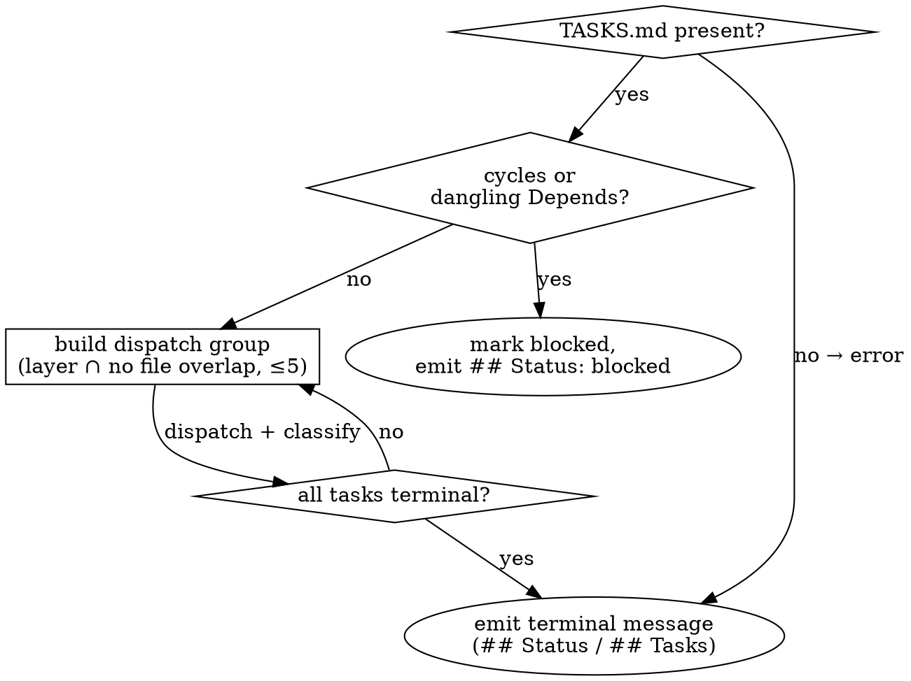

# Parallel Task Executor

## Overview

Run every task in `TASKS.md` to a terminal state. Dispatches one fresh subagent per task via Claude Code's `Task` tool — parallel within DAG layers, serialized when `Files:` overlap. Lives in the **main conversation context** because it must update `ROADMAP.md` and aggregate parallel returns.

## When to use



## Inputs / outputs

- Reads `.planning/{session_id}/TASKS.md` (and `ROADMAP.md`).
- Terminal message uses standard markdown sections — `## Status` (`done | blocked | failed | error`), `## Tasks` (per-task one-liners), and `## Reason` when status is non-`done`. This skill runs in the main context, so the terminal message is the final assistant message in the conversation, not a Task return. See `references/output-schemas.md`.

## Execution mode

Main context — see `../../harness-contracts/execution-modes.md`. The executor itself fans out subagent Task calls and aggregates returns, which requires the main thread.

## Procedure (summary)

1. Load + validate TASKS.md (env, shape, resume) → `references/procedure.md#step-1--load-and-validate-tasksmd`
2. Build DAG, serialize file overlaps, cap groups at 5 → `references/procedure.md#step-2--build-the-execution-plan-dag--layers--serialization-by-file-overlap`
3. Dispatch each group via Task tool, all in one assistant turn → `references/procedure.md#step-3--dispatch-each-group-via-the-task-tool`
4. Build prompt from `references/subagent-prompt.md`; substitute `{executor-skill-path}` at dispatch time.
5. Classify each return as DONE / BLOCKED / FAILED / skipped → `references/procedure.md#step-5--classify-each-subagent-return`
6. Write `[Result]` block per task → `references/result-block-format.md`
7. Finalize ROADMAP.md, emit terminal message → `references/procedure.md#step-7--finalize-roadmapmd-resolve-next-emit`

## Terminal message

The final assistant message uses standard markdown sections. Per-task detail still lives in TASKS.md `[Result]` blocks; this message is the top-level signal the main thread reads to dispatch next.

**Done** (every task reached `done`):

```markdown
## Status
done

## Tasks
- T1: done
- T2: done
- T3: done
```

**Blocked / failed / error**:

```markdown
## Status
{blocked|failed|error}

## Tasks
- T1: done
- T2: failed (3 attempts)
- T3: not started

## Reason
{short cause — typically the first blocker's reason from TASKS.md}
```

The `## Tasks` block lists every task ID with its terminal `Status:` value (or `not started` if dispatch never reached it). `## Reason` is required when `## Status` is non-`done`.

## Why this shape

- **DAG + file-overlap serialization prevents git conflicts subagents cannot fix.** Two subagents editing the same file in parallel each think they own it.
- **Three failure classes (blocked / failed / error) prevent retry loops on wrong-task bugs.** BLOCKED = task text is wrong, retry won't help. FAILED = attempt was wrong, retry up to the cap. Each maps to a `## Status` value in the terminal message.
- **5-task dispatch cap.** A higher cap risks the parent assistant turn aging out before all parallel returns aggregate, and gives diminishing parallelism returns once the typical task-DAG width is exceeded.
- **3-attempt task-local cap is the only retry.** No session-level loop. The cap spans the session via TASKS.md `[Result]` blocks so a conversation restart cannot unbound it.
- **Subagents are self-contained.** They do not read PRD/TRD or other tasks — task-writer's "verbatim, no placeholders" rule makes the task text sufficient.

## Required next skill

When this skill emits `## Status: done` (full handoff contract: `../../harness-contracts/payload-contract.md` § "parallel-task-executor → evaluator"):

- **REQUIRED SUB-SKILL:** Use harness-flow:evaluator
  Dispatch (subagent — Task, not Skill): `Task(evaluator, prompt: "Evaluate session {session_id}. Read .planning/{session_id}/TASKS.md and the diff.")` — the evaluator reads `TASKS.md` deterministically and runs `git diff HEAD` by default; main-thread overrides for `rules_dir` / `diff_command` may be appended to the prompt as plain lines.

On `## Status: blocked | failed | error`: flow terminates. Report the failure detail (the `## Reason` line from the terminal message) to the user and stop. Evaluator does not run on a non-done status — fixing blockers is a human decision.

## Boundaries

- File ownership: see `../../harness-contracts/file-ownership.md`. Executor appends `[Result]` blocks to `TASKS.md` (never the body) and finalizes `ROADMAP.md` in Step 7. Source code is edited only by the per-task subagents the executor dispatches — the executor itself does not write code.
- Do not invoke other harness skills directly. The 'Required next skill' section above dispatches downstream.

## Anti-patterns

- **Do not re-dispatch a BLOCKED task.** Retry produces the same return. Escalate via `## Status: blocked` in the terminal message.
- **Do not read _other_ tasks' Acceptance when reviewing a return.** Cross-task coherence is the evaluator's job, not the executor's. The current task's own Acceptance _is_ read — that is what "Do not let the subagent define its own Acceptance" below depends on. The boundary: this task's Acceptance, yes; sibling tasks' Acceptance, no.
- **Do not silently skip a file overlap.** If detected, serialize explicitly — do not hope two subagents won't touch shared lines.
- **Do not embed PRD/TRD content in the subagent prompt.** The task already quotes PRD/TRD verbatim; re-including invites reinterpretation drift.
- **Do not let the subagent define its own Acceptance.** If `status: done` but evidence doesn't map to the task's own Acceptance bullets, that is BLOCKED.
- **Do not dispatch tasks across turns when they could be parallel.** All Task calls for one group go in **one assistant turn** — splitting serializes them.

## See also

- `references/procedure.md` — full Step 1-7 detail.
- `references/subagent-prompt.md` — prompt template per subagent.
- `references/output-schemas.md` — terminal message variants per status.
- `references/result-block-format.md` — `[Result]` block + status deltas.
- `references/test-driven-development.md` — TDD discipline applied per task.
