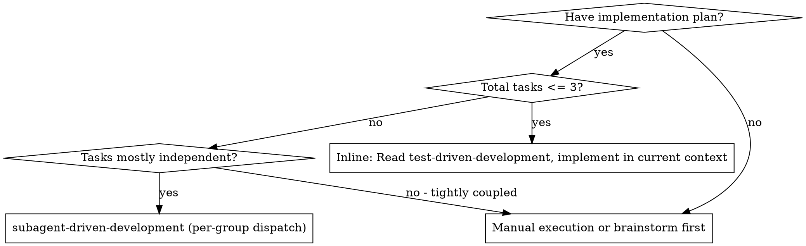
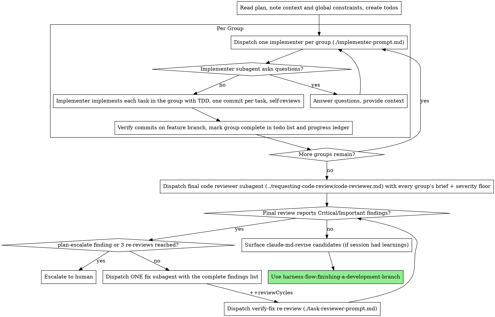

# Subagent-Driven Development

Execute a plan by dispatching one implementer per Task Group (or running inline for a ≤3-task plan) with no reviewer at group boundaries — one broad whole-branch review at the end nets every group, receiving each group's brief and a severity-floor instruction. The final review loop routes findings by class — plan-escalate goes to the human, impl-fix runs a fix loop capped at 3 re-reviews.

**Why subagents:** You delegate tasks to specialized agents with isolated context. By precisely crafting their instructions and context, you ensure they stay focused and succeed at their task. They should never inherit your session's context or history — you construct exactly what they need. This also preserves your own context for coordination work.

**Core principle:** One implementer per group (tiny plans inline) + implementer self-review + one severity-floored, brief-fed final review = high quality, minimal cold-starts

**Narration:** between tool calls, narrate at most one short line — the
ledger and the tool results carry the record.

**Continuous execution:** Do not pause to check in with your human partner between tasks. Execute all tasks from the plan without stopping. The only reasons to stop are: BLOCKED status you cannot resolve, ambiguity that genuinely prevents progress, or all tasks complete. "Should I continue?" prompts and progress summaries waste their time — they asked you to execute the plan, so execute it.

## When to Use



## Inline Path (plans with ≤3 tasks)

When the whole plan is ≤3 tasks, do NOT dispatch per-group implementers — the
cold-start of a fresh subagent costs more than the work. Instead:

1. Read `harness-flow:test-driven-development` into your current context (via
   the Skill tool) and implement each task inline, following Red→Green→Refactor.
2. Commit one task at a time (same discipline as a dispatched implementer).
3. After the last task, run the full suite + formatter/typecheck once.
4. **Still dispatch the final whole-branch review** — a fresh-context reviewer
   is the one isolation worth keeping. Then proceed to the finishing steps.

No group-boundary reviewers exist on any path; the single whole-branch
review covers the plan (see Final Review Nets Every Group).

## Headless Loop Path (external orchestrator)

For unattended runs, long plans, or when compaction risk is a concern, the
plan can be executed by `scripts/sdd-loop` instead of this session:

    skills/subagent-driven-development/scripts/sdd-loop PLAN_FILE \
      [--model sonnet] [--review-model opus] [--resume] [--dry-run]

What moves out of your hands: group ordering, fresh `claude -p` sessions
per group (cwd pinned to the repo root — the worktree gotcha cannot
occur), commit verification (DONE without a new commit is a failure),
retry caps, the final whole-branch review with the severity-floor and
finding-class blocks, the fix→verify-fix loop, and the 3-re-review cap —
all enforced in code. State lives in `.harness-flow/sdd/loop-state.json`;
per-session usage appends to `loop-metrics.jsonl`; the ledger still gets
its `progress.md` lines.

Exit codes: 0 complete (proceed to claude-md-revise and
finishing-a-development-branch in an interactive session), 1 error,
2 human intervention (blocked group, plan-escalate finding, or re-review
cap) — resolve, then re-run with `--resume`.

The loop reuses `task-brief`, `review-package`, and `sdd-workspace`
verbatim and mirrors this skill's review blocks; it adds no second
source of truth. In-session execution remains the default for
interactive work — the loop is opt-in for headless runs. All-cheap
plans: pass `--review-model sonnet` yourself (Model Selection's
exception is not auto-detected).

## The Process



## Pre-Flight Plan Review

Before dispatching the first group, scan the plan once for conflicts:

- tasks that contradict each other or the plan's Global Constraints
- anything the plan explicitly mandates that the review rubric treats as a
  defect (a test that asserts nothing, verbatim duplication of a logic block)

Present everything you find to your human partner as one batched question —
each finding beside the plan text that mandates it, asking which governs —
before execution begins, not one interrupt per discovery mid-plan. If the
scan is clean, proceed without comment. The review loop remains the net for
conflicts that only emerge from implementation.

## Model Selection

Use the least powerful model that can handle each role to conserve cost and increase speed.

**Mechanical implementation tasks** (isolated functions, clear specs, 1-2 files): use a fast, cheap model. Most implementation tasks are mechanical when the plan is well-specified.

**Integration and judgment tasks** (multi-file coordination, pattern matching, debugging): use a standard model.

**Architecture and design tasks**: use the most capable available model.
The final whole-branch review is one of these — dispatch it on the most
capable available model, not the session default.

**Exception — all-cheap plans:** when every group in the plan is cheap-tier,
dispatch the final whole-branch review on the standard tier instead. The
catch rate for cheap-tier defects is measured at 100% on the standard tier
even at 6.5× diff dilution (design/2026-07-14-execution-speedup-retrospective.md
§7). Count the tier labels in the plan: any standard or most-capable group
keeps the final review on the most capable model.

**Review tasks**: choose the model with the same judgment, scaled to the
diff's size, complexity, and risk. A small mechanical diff does not need the
most capable model; a subtle concurrency change does.

**Always specify the model explicitly when dispatching a subagent.** An
omitted model inherits your session's model — often the most capable and
most expensive — which silently defeats this section.

**Turn count beats token price.** Wall-clock and context cost scale with how
many turns a subagent takes, and the cheapest models routinely take 2-3× the
turns on multi-step work — costing more overall. Use a mid-tier model as the
floor for reviewers and for implementers working from prose descriptions.
When the task's plan text contains the complete code to write, the
implementation is transcription plus testing: use the cheapest tier for
that implementer. Single-file mechanical fixes also take the cheapest tier.

**Group complexity signals (implementation groups):** a group's tier is the
highest-complexity task it contains — one integration task pulls the whole
group up.
- Every task in the group touches 1-2 files with a complete spec → cheap model
- Any task touches multiple files with integration concerns → standard model
- Any task requires design judgment or broad codebase understanding → most capable model

**Tier → model alias (Claude Code).** The tiers above are harness-agnostic;
below is the mapping this repo dispatches with. Use the short aliases, not
versioned IDs (`claude-sonnet-5`, …): when a named model is unavailable or
unrecognized, Claude Code silently falls back to the inherited — often the
most expensive — model, which is the exact leak this section prevents. Aliases
dodge that and never go stale. On non-Claude harnesses, map the tier to your
own dispatch model:
- cheap → `haiku`
- standard → `sonnet`
- most capable → `opus`

## Handling Implementer Status

Implementer subagents report one of four statuses. Handle each appropriately:

**DONE:** (per group) Verify the commits landed on the feature branch (worktree gotcha — see CLAUDE.md), append `Group N: complete (commits <base7>..<head7>, no group review — final nets)` to the ledger, and dispatch the next group. No review package and no reviewer at group boundaries — the final whole-branch review nets every group.

**DONE_WITH_CONCERNS:** The implementer completed the work but flagged doubts. Read the concerns before proceeding. If the concerns are about correctness or scope, address them before review. If they're observations (e.g., "this file is getting large"), note them and proceed to review.

**NEEDS_CONTEXT:** The implementer needs information that wasn't provided. Provide the missing context and re-dispatch.

**BLOCKED:** The implementer cannot complete the task. Assess the blocker:
1. If it's a context problem, provide more context and re-dispatch with the same model
2. If the task requires more reasoning, re-dispatch with a more capable model
3. If the task is too large, break it into smaller pieces
4. If the plan itself is wrong, escalate to the human

**Never** ignore an escalation or force the same model to retry without changes. If the implementer said it's stuck, something needs to change.

## Handling Reviewer ⚠️ Items

The final review or a verify-fix re-review may report "⚠️ Cannot verify
from diff" items — requirements that live in unchanged code or span groups.
These do not block the rest of the review, but you must resolve each one
yourself before finishing: you hold the plan and cross-group context the
reviewer lacks. If you confirm an item is a real gap, treat it as an open
`impl-fix` finding — add it to the fix subagent's findings list and
re-review.

## Constructing Reviewer Prompts

The broad review happens once, at the final whole-branch review; verify-fix re-reviews are fix-scoped gates. When you fill a reviewer template:

- Do not add open-ended directives like "check all uses" or "run race tests
  if useful" without a concrete, task-specific reason
- Do not ask a reviewer to re-run tests the implementer already ran on the
  same code — the implementer's report carries the test evidence
- Do not pre-judge findings for the reviewer — never instruct a reviewer to
  ignore or not flag a specific issue. If you believe a finding would be a
  false positive, let the reviewer raise it and adjudicate it in the review
  loop. If the prompt you are writing contains "do not flag," "don't treat X
  as a defect," "at most Minor," or "the plan chose" — stop: you are
  pre-judging, usually to spare yourself a review loop.
- The global-constraints block you hand the reviewer is its attention
  lens. Copy the binding requirements verbatim from the plan's Global
  Constraints section or the spec: exact values, exact formats, and the
  stated relationships between components ("same layout as X", "matches
  Y"). The reviewer's template already carries the process rules (YAGNI,
  test hygiene, review method) — the constraints block is for what THIS
  project's spec demands.
- Hand the reviewer its diff as a file: run this skill's
  `scripts/review-package BASE HEAD` and pass the reviewer the file path
  it prints (or, without bash: `git log --oneline`, `git diff --stat`,
  and `git diff -U10` for the range, redirected to one uniquely named
  file). The output never enters your own context, and the reviewer sees
  the commit list, stat summary, and full diff with context in one Read
  call. For a verify-fix re-review use FIX_BASE (the HEAD recorded before the fixer); for the final review use MERGE_BASE — never `HEAD~1`, which silently truncates multi-commit ranges.
- A dispatch prompt describes one task, not the session's history. Do not
  paste accumulated prior-task summaries ("state after Tasks 1-3") into
  later dispatches — a real session's dispatch hit 42k chars of which 99%
  was pasted history. A fresh subagent needs its task, the interfaces it
  touches, and the global constraints. Nothing else.
- Dispatch a fix subagent for Critical and Important findings. Minor
  findings from the final review: triage which must be fixed before merge
  and record the rest in the progress ledger for the human to see at
  finishing — a roll-up nobody reads is a silent discard.
- A finding labeled plan-mandated — or any finding that conflicts with
  what the plan's text requires — is the human's decision, like any plan
  contradiction: present the finding and the plan text, ask which governs.
  Do not dismiss the finding because the plan mandates it, and do not
  dispatch a fix that contradicts the plan without asking.
- The final whole-branch review gets a package too: run
  `scripts/review-package MERGE_BASE HEAD` (MERGE_BASE = the commit the
  branch started from, e.g. `git merge-base main HEAD`) and include the
  printed path in the final review dispatch, so the final reviewer reads
  one file instead of re-deriving the branch diff with git commands.
- Every fix dispatch carries the implementer contract: the fix subagent
  re-runs the tests covering its change and reports the results. Name the
  covering test files in the dispatch — a one-line fix does not need the
  whole suite. Before re-dispatching the reviewer, confirm the fix report
  contains the covering tests, the command run, and the output; dispatch
  the re-review once all three are present (use the verify-fix variant —
  see "Final Review Loop" and task-reviewer-prompt.md).
- If the final whole-branch review returns findings, dispatch ONE fix
  subagent with the complete findings list — not one fixer per finding.
  Per-finding fixers each rebuild context and re-run suites; a real
  session's final-review fix wave cost more than all its tasks combined.

## Final Review Nets Every Group

No group earns a dedicated reviewer dispatch. The implementer's self-review
is the only group-boundary check; the final whole-branch review IS the
review. Its dispatch prompt carries three additions:

- **Every group's brief.** Hand the final reviewer each group's brief file
  path plus the global constraints that bound it ("No group had a dedicated
  review — cover spec compliance and quality for all of them; briefs:
  <paths>"). The final reviewer inherits the group reviewer's
  spec-compliance duty for the whole plan. Ask it to report requirements it
  cannot verify from the diff as ⚠️ items.
- **Severity floor.** Include this block verbatim — it counters the
  measured failure mode where a real mid-group defect is found but demoted
  to Minor (design/2026-07-16-review-gating-v2-retrospective.md §3):

  ```
  This branch was implemented without intermediate group reviews. Rate
  severity by consequence, not by surface form: a finding that violates a
  brief requirement, or propagates a wrong value/type/contract downstream,
  is Important or Critical even when it reads as a type-contract or style
  nit. A Minor rating on such a finding requires a one-line justification
  of why the consequence is harmless.
  ```

- **Finding class.** Include this block verbatim so the loop below can
  route findings:

  ```
  Tag each Critical/Important finding with exactly one `class`:
  - `impl-fix` — the implementation is wrong, incomplete, or low-quality
    against a correct spec; a fix subagent can resolve it. Default when
    unsure.
  - `plan-escalate` — the plan/brief/spec text itself is wrong or
    internally contradictory, so no implementation of it can be correct.
    State the plan text at fault. Every plan-mandated finding is
    `plan-escalate`.
  ```

These blocks are not pre-judging (see Constructing Reviewer Prompts): they
name no finding, suppress no flag, and pre-rate no specific issue — they
pin the severity scale and the routing vocabulary.

## Final Review Loop: Escalation and Retry Cap

Route the final review's result by finding class, and cap the loop so a
finding a fixer cannot resolve does not spin forever:

- **Any `plan-escalate` finding → stop, do not dispatch a fixer.** The plan
  or spec text itself is wrong, so no implementation fixes it. Present the
  finding beside the plan text it contradicts and ask the human which
  governs. Resume only after the human resolves it.
- **`impl-fix` findings only → dispatch ONE fix subagent with the complete
  findings list** (never one fixer per finding — per-finding fixers each
  rebuild context and re-run suites), then a verify-fix re-review
  (./task-reviewer-prompt.md): the open findings verbatim plus the fix-diff
  package (`scripts/review-package FIX_BASE HEAD`, FIX_BASE = the HEAD
  recorded before the fixer) — never the original branch package. Track the
  count in the progress ledger as `final: reviewCycles <n>`, incremented on
  every re-review dispatch, **capped at 3 re-reviews**. A verify-fix result
  exits the loop when every open finding is resolved, no new
  Critical/Important findings appear, and quality is Approved. At 3
  re-reviews with findings still open, stop and escalate to the human.
- The ledger counter is authoritative: after a compaction or resume, read
  `final: reviewCycles` from the ledger, not your recollection.

## File Handoffs

Everything you paste into a dispatch prompt — and everything a subagent
prints back — stays resident in your context for the rest of the session
and is re-read on every later turn. Hand artifacts over as files:

- **Group brief:** before dispatching an implementer, run this skill's
  `scripts/task-brief PLAN_FILE N` with the GROUP number — it extracts the
  whole group's text (all its tasks) to a uniquely named file and prints the
  path. Compose the dispatch so the
  brief stays the single source of requirements. Your dispatch should
  contain: (1) one line on where this task fits in the project; (2) the
  brief path, introduced as "read this first — it is your requirements,
  with the exact values to use verbatim"; (3) interfaces and decisions
  from earlier tasks that the brief cannot know; (4) your resolution of
  any ambiguity you noticed in the brief; (5) the report-file path and
  report contract. Exact values (numbers, magic strings, signatures, test
  cases) appear only in the brief.
- **Report file:** name the implementer's report file after the brief
  (brief `…/task-N-brief.md` → report `…/task-N-report.md`) and put it in
  the dispatch prompt. The implementer writes the full report there and
  returns only status, commits, a one-line test summary, and concerns.
- **Final reviewer inputs:** the branch review package
  (`scripts/review-package MERGE_BASE HEAD`), every group's brief path,
  and the global constraints (see Final Review Nets Every Group). A
  verify-fix re-review gets the open findings verbatim, the fix-diff
  package, and the brief paths for context.
- Fix dispatches append their fix report (with test results) to the same
  report file and return a short summary; re-reviews read the updated file.

## Durable Progress

Conversation memory does not survive compaction. In real sessions,
controllers that lost their place have re-dispatched entire completed task
sequences — the single most expensive failure observed. Track progress in
a ledger file, not only in todos.

- At skill start, check for a ledger:
  `cat "$(git rev-parse --show-toplevel)/.harness-flow/sdd/progress.md"`.
  Tasks listed there as complete are DONE — do not re-dispatch them; resume
  at the first task not marked complete.
- When a group's implementer reports DONE and its commits are verified on the feature branch, append one line to the ledger in the same message as your other bookkeeping: `Group N: complete (commits <base7>..<head7>, no group review — final nets)`.
- While the final review is in its fix loop, record the re-review count as
  `final: reviewCycles <n>` and update it on each verify-fix dispatch. This
  is the authoritative source for the 3-re-review cap (see "Final Review Loop:
  Escalation and Retry Cap") — after a resume, read it back instead of
  restarting the count from zero.
- The ledger is your recovery map: the commits it names exist in git even
  when your context no longer remembers creating them. After compaction,
  trust the ledger and `git log` over your own recollection.
- `git clean -fdx` will destroy the ledger (it's git-ignored scratch); if
  that happens, recover from `git log`.

## Prompt Templates

- [implementer-prompt.md](implementer-prompt.md) - Dispatch implementer subagent
- [task-reviewer-prompt.md](task-reviewer-prompt.md) - Verify-fix re-review after a final-review fix wave
- Final whole-branch review: use harness-flow:requesting-code-review's [code-reviewer.md](../requesting-code-review/code-reviewer.md)

## Example Workflow

See [references/example-workflow.md](references/example-workflow.md) for a
full worked example (dispatch, final whole-branch review, fix→verify-fix loop).

## When All Tasks Complete

After the final code reviewer subagent approves the entire implementation, surface session learnings before finishing:

Invoke the `harness-flow:claude-md-revise` skill to surface session-derived knowledge worth persisting (user corrections, "always/never" rules, project facts, anti-patterns, external-system references). Run it **now** — while the branch is still open — so any approved CLAUDE.md edits land in this branch before merge.

This is not optional cleanup. "finish", "we're done", or "proceed" is NOT a skip signal — it means run this step.

**Skip only if:**

- No commits were made this session
- Hotfix branch explicitly flagged as time-critical

`claude-md-revise` runs to completion (per-candidate approval), then proceed to `harness-flow:finishing-a-development-branch`.

## Red Flags

**Never:**
- Start implementation on main/master branch without explicit user consent
- Skip the final whole-branch review, or dispatch it without every group's brief and the severity-floor and class blocks
- Proceed with unfixed issues
- Dispatch multiple implementation subagents in parallel (conflicts)
- Make a subagent read the whole plan file (hand it its task brief —
  `scripts/task-brief` — instead)
- Skip scene-setting context (subagent needs to understand where task fits)
- Ignore subagent questions (answer before letting them proceed)
- Accept "close enough" on spec compliance (reviewer found spec issues = not done)
- Skip verify-fix re-reviews (final review found issues = fix = re-review)
- Let implementer self-review replace the final whole-branch review (both are needed)
- Tell a reviewer what not to flag, or pre-rate a finding's severity in the
  dispatch prompt ("treat it as Minor at most") — the plan's example code is
  a starting point, not evidence that its weaknesses were chosen
- Dispatch the final review or a verify-fix re-review without a package file — generate it first (`scripts/review-package`) and name the printed path in the prompt
- Finish while the final review has open Critical/Important issues
- Re-dispatch a task the progress ledger already marks complete — check
  the ledger (and `git log`) after any compaction or resume

**If subagent asks questions:**
- Answer clearly and completely
- Provide additional context if needed
- Don't rush them into implementation

**If the final review finds issues:**
- ONE fix subagent fixes the complete findings list
- Verify-fix re-review confirms (cap: 3 re-reviews)
- Repeat until approved or the cap escalates to the human
- Don't skip the re-review

**If subagent fails task:**
- Dispatch fix subagent with specific instructions
- Don't try to fix manually (context pollution)

## Integration

**Required workflow skills:**
- **harness-flow:using-git-worktrees** - Ensures isolated workspace (creates one or verifies existing)
- **harness-flow:writing-plans** - Creates the plan this skill executes
- **harness-flow:requesting-code-review** - Code review template for the final whole-branch review
- **harness-flow:claude-md-revise** - Surface session learnings to CLAUDE.md after the final review, before finishing
- **harness-flow:finishing-a-development-branch** - Complete development after all tasks

**Subagents should use:**
- **harness-flow:test-driven-development** - Subagents follow TDD for each task
