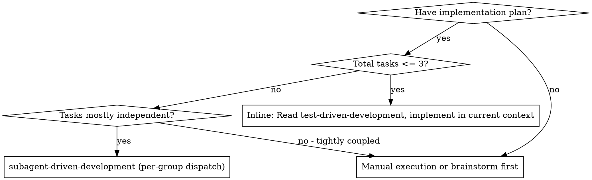
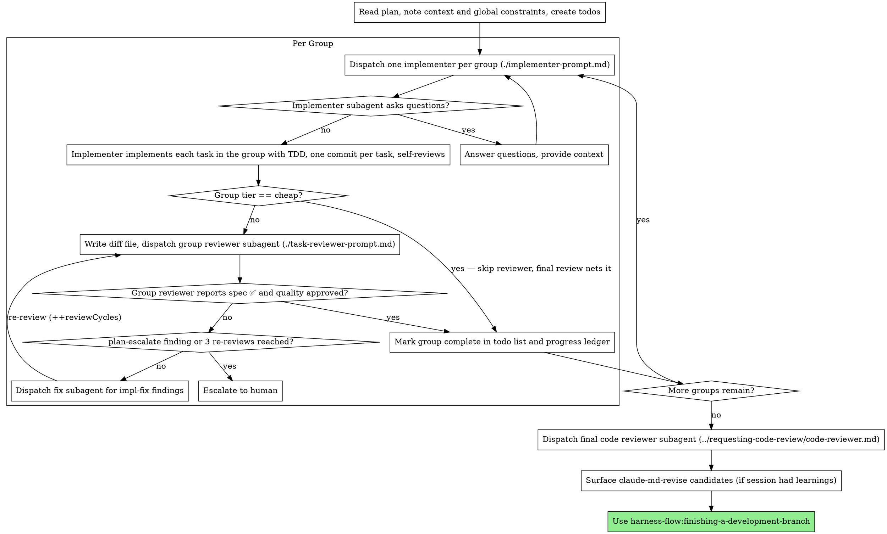

# Subagent-Driven Development

Execute a plan by dispatching one implementer per Task Group (or running inline for a ≤3-task plan), a group review (spec compliance + code quality) after each group except cheap-tier groups (which the final review nets), and a broad whole-branch review at the end. The review loop routes findings by class — plan-escalate goes to the human, impl-fix runs a fix loop capped at 3 re-reviews.

**Why subagents:** You delegate tasks to specialized agents with isolated context. By precisely crafting their instructions and context, you ensure they stay focused and succeed at their task. They should never inherit your session's context or history — you construct exactly what they need. This also preserves your own context for coordination work.

**Core principle:** One implementer per group (tiny plans inline) + group review (spec + quality) + broad final review = high quality, fewer cold-starts

**Narration:** between tool calls, narrate at most one short line — the
ledger and the tool results carry the record.

**Continuous execution:** Do not pause to check in with your human partner between tasks. Execute all tasks from the plan without stopping. The only reasons to stop are: BLOCKED status you cannot resolve, ambiguity that genuinely prevents progress, or all tasks complete. "Should I continue?" prompts and progress summaries waste their time — they asked you to execute the plan, so execute it.

## When to Use



## Inline Path (plans with ≤3 tasks)

When the whole plan is ≤3 tasks, do NOT dispatch per-group implementers — the
cold-start of a fresh subagent costs more than the work. Instead:

1. Read `harness-flow:test-driven-development` into your current context (via
   the Skill tool) and implement each task inline, following Red→Green→Refactor.
2. Commit one task at a time (same discipline as a dispatched implementer).
3. After the last task, run the full suite + formatter/typecheck once.
4. **Still dispatch the final whole-branch review** — a fresh-context reviewer
   is the one isolation worth keeping. Then proceed to the finishing steps.

Skip the per-task/per-group reviewer dispatches on this path; the single
whole-branch review covers a plan this small.

## The Process



## Pre-Flight Plan Review

Before dispatching the first group, scan the plan once for conflicts:

- tasks that contradict each other or the plan's Global Constraints
- anything the plan explicitly mandates that the review rubric treats as a
  defect (a test that asserts nothing, verbatim duplication of a logic block)

Present everything you find to your human partner as one batched question —
each finding beside the plan text that mandates it, asking which governs —
before execution begins, not one interrupt per discovery mid-plan. If the
scan is clean, proceed without comment. The review loop remains the net for
conflicts that only emerge from implementation.

## Model Selection

Use the least powerful model that can handle each role to conserve cost and increase speed.

**Mechanical implementation tasks** (isolated functions, clear specs, 1-2 files): use a fast, cheap model. Most implementation tasks are mechanical when the plan is well-specified.

**Integration and judgment tasks** (multi-file coordination, pattern matching, debugging): use a standard model.

**Architecture and design tasks**: use the most capable available model.
The final whole-branch review is one of these — dispatch it on the most
capable available model, not the session default.

**Review tasks**: choose the model with the same judgment, scaled to the
diff's size, complexity, and risk. A small mechanical diff does not need the
most capable model; a subtle concurrency change does.

**Always specify the model explicitly when dispatching a subagent.** An
omitted model inherits your session's model — often the most capable and
most expensive — which silently defeats this section.

**Turn count beats token price.** Wall-clock and context cost scale with how
many turns a subagent takes, and the cheapest models routinely take 2-3× the
turns on multi-step work — costing more overall. Use a mid-tier model as the
floor for reviewers and for implementers working from prose descriptions.
When the task's plan text contains the complete code to write, the
implementation is transcription plus testing: use the cheapest tier for
that implementer. Single-file mechanical fixes also take the cheapest tier.

**Group complexity signals (implementation groups):** a group's tier is the
highest-complexity task it contains — one integration task pulls the whole
group up.
- Every task in the group touches 1-2 files with a complete spec → cheap model
- Any task touches multiple files with integration concerns → standard model
- Any task requires design judgment or broad codebase understanding → most capable model

**Tier → model alias (Claude Code).** The tiers above are harness-agnostic;
below is the mapping this repo dispatches with. Use the short aliases, not
versioned IDs (`claude-sonnet-5`, …): when a named model is unavailable or
unrecognized, Claude Code silently falls back to the inherited — often the
most expensive — model, which is the exact leak this section prevents. Aliases
dodge that and never go stale. On non-Claude harnesses, map the tier to your
own dispatch model:
- cheap → `haiku`
- standard → `sonnet`
- most capable → `opus`

## Handling Implementer Status

Implementer subagents report one of four statuses. Handle each appropriately:

**DONE:** (per group) Generate the review package (`scripts/review-package BASE HEAD`, from this skill's directory — it prints the unique file path it wrote; BASE is the commit you recorded before dispatching the implementer — never `HEAD~1`, which silently drops all but the last commit of a multi-commit task), then dispatch the task reviewer with the printed path.

**DONE_WITH_CONCERNS:** The implementer completed the work but flagged doubts. Read the concerns before proceeding. If the concerns are about correctness or scope, address them before review. If they're observations (e.g., "this file is getting large"), note them and proceed to review.

**NEEDS_CONTEXT:** The implementer needs information that wasn't provided. Provide the missing context and re-dispatch.

**BLOCKED:** The implementer cannot complete the task. Assess the blocker:
1. If it's a context problem, provide more context and re-dispatch with the same model
2. If the task requires more reasoning, re-dispatch with a more capable model
3. If the task is too large, break it into smaller pieces
4. If the plan itself is wrong, escalate to the human

**Never** ignore an escalation or force the same model to retry without changes. If the implementer said it's stuck, something needs to change.

## Handling Reviewer ⚠️ Items

The task reviewer may report "⚠️ Cannot verify from diff" items — requirements
that live in unchanged code or span tasks. These do not block the rest of the
review, but you must resolve each one yourself before marking the task
complete: you hold the plan and cross-task context the reviewer
lacks. If you confirm an item is a real gap, treat it as a failed spec
review — send it back to the implementer and re-review.

## Constructing Reviewer Prompts

Per-task reviews are task-scoped gates. The broad review happens once, at the
final whole-branch review. When you fill a reviewer template:

- Do not add open-ended directives like "check all uses" or "run race tests
  if useful" without a concrete, task-specific reason
- Do not ask a reviewer to re-run tests the implementer already ran on the
  same code — the implementer's report carries the test evidence
- Do not pre-judge findings for the reviewer — never instruct a reviewer to
  ignore or not flag a specific issue. If you believe a finding would be a
  false positive, let the reviewer raise it and adjudicate it in the review
  loop. If the prompt you are writing contains "do not flag," "don't treat X
  as a defect," "at most Minor," or "the plan chose" — stop: you are
  pre-judging, usually to spare yourself a review loop.
- The global-constraints block you hand the reviewer is its attention
  lens. Copy the binding requirements verbatim from the plan's Global
  Constraints section or the spec: exact values, exact formats, and the
  stated relationships between components ("same layout as X", "matches
  Y"). The reviewer's template already carries the process rules (YAGNI,
  test hygiene, review method) — the constraints block is for what THIS
  project's spec demands.
- Hand the reviewer its diff as a file: run this skill's
  `scripts/review-package BASE HEAD` and pass the reviewer the file path
  it prints (or, without bash: `git log --oneline`, `git diff --stat`,
  and `git diff -U10` for the range, redirected to one uniquely named
  file). The output never enters your own context, and the reviewer sees
  the commit list, stat summary, and full diff with context in one Read
  call. Use the BASE you recorded before dispatching the implementer —
  never `HEAD~1`, which silently truncates multi-commit tasks.
- A dispatch prompt describes one task, not the session's history. Do not
  paste accumulated prior-task summaries ("state after Tasks 1-3") into
  later dispatches — a real session's dispatch hit 42k chars of which 99%
  was pasted history. A fresh subagent needs its task, the interfaces it
  touches, and the global constraints. Nothing else.
- Dispatch fix subagents for Critical and Important findings. Record Minor
  findings in the progress ledger as you go, and point the final
  whole-branch review at that list so it can triage which must be fixed
  before merge. A roll-up nobody reads is a silent discard.
- A finding labeled plan-mandated — or any finding that conflicts with
  what the plan's text requires — is the human's decision, like any plan
  contradiction: present the finding and the plan text, ask which governs.
  Do not dismiss the finding because the plan mandates it, and do not
  dispatch a fix that contradicts the plan without asking.
- The final whole-branch review gets a package too: run
  `scripts/review-package MERGE_BASE HEAD` (MERGE_BASE = the commit the
  branch started from, e.g. `git merge-base main HEAD`) and include the
  printed path in the final review dispatch, so the final reviewer reads
  one file instead of re-deriving the branch diff with git commands.
- Every fix dispatch carries the implementer contract: the fix subagent
  re-runs the tests covering its change and reports the results. Name the
  covering test files in the dispatch — a one-line fix does not need the
  whole suite. Before re-dispatching the reviewer, confirm the fix report
  contains the covering tests, the command run, and the output; dispatch
  the re-review once all three are present.
- If the final whole-branch review returns findings, dispatch ONE fix
  subagent with the complete findings list — not one fixer per finding.
  Per-finding fixers each rebuild context and re-run suites; a real
  session's final-review fix wave cost more than all its tasks combined.

## Review Gating: Skip the Reviewer for Cheap-Tier Groups

Reuse the group's implementation tier (see "Group complexity signals") to
decide whether the group earns a dedicated reviewer dispatch:

- **Group tier is `cheap`** (every task touches 1-2 files with a complete
  spec) → **do NOT dispatch the group reviewer.** Trust the implementer's
  self-review, record `Group N: review skipped (cheap)` in the ledger, and
  move to the next group. The final whole-branch review is the net.
- **Group tier is `standard` or `most capable`** → dispatch the group
  reviewer as usual and run the review loop below.

When you dispatch the final whole-branch review, list the groups you skipped
in its prompt ("Groups 3 and 5 had no dedicated review — cover them here")
so the one broad review deliberately covers the ungated code.

This is the same risk signal that already routes cheap groups to a cheap
implementer model: a low-risk, fully-specified, small-surface group is
exactly the one the final review can safely net, so a per-group reviewer
cold-start on it is pure overhead. It is not a license to widen what counts
as `cheap` — the tier definition is unchanged.

## Review Loop: Escalation and Retry Cap

The reviewer tags each Critical/Important finding with a `class` (see
`task-reviewer-prompt.md`). Route the review result by class, and cap the
loop so a finding a fixer cannot resolve does not spin forever:

- **Any `plan-escalate` finding → stop, do not dispatch a fixer.** The plan
  or spec text itself is wrong, so no implementation fixes it. Present the
  finding beside the plan text it contradicts and ask the human which
  governs — the same escalation any plan contradiction gets. Resume only
  after the human resolves it.
- **`impl-fix` findings only → run the fix → re-review loop, capped at 3
  re-reviews per group.** Track the count in the progress ledger as
  `reviewCycles: <n>` for the group and increment it on every re-review
  dispatch. When a group reaches 3 re-reviews with findings still open,
  **stop and escalate to the human** — three fixer rounds that did not
  converge signal the task, not the implementation, needs a decision.
- The ledger counter is authoritative: after a compaction or resume, read
  `reviewCycles` from the ledger, not your recollection, so the cap cannot
  be silently reset by re-entering the loop.

## File Handoffs

Everything you paste into a dispatch prompt — and everything a subagent
prints back — stays resident in your context for the rest of the session
and is re-read on every later turn. Hand artifacts over as files:

- **Group brief:** before dispatching an implementer, run this skill's
  `scripts/task-brief PLAN_FILE N` with the GROUP number — it extracts the
  whole group's text (all its tasks) to a uniquely named file and prints the
  path. (On a group-less plan it extracts a single task — same call.) Compose the dispatch so the
  brief stays the single source of requirements. Your dispatch should
  contain: (1) one line on where this task fits in the project; (2) the
  brief path, introduced as "read this first — it is your requirements,
  with the exact values to use verbatim"; (3) interfaces and decisions
  from earlier tasks that the brief cannot know; (4) your resolution of
  any ambiguity you noticed in the brief; (5) the report-file path and
  report contract. Exact values (numbers, magic strings, signatures, test
  cases) appear only in the brief.
- **Report file:** name the implementer's report file after the brief
  (brief `…/task-N-brief.md` → report `…/task-N-report.md`) and put it in
  the dispatch prompt. The implementer writes the full report there and
  returns only status, commits, a one-line test summary, and concerns.
- **Reviewer inputs:** the task reviewer gets three paths — the same brief
  file, the report file, and the review package — plus the global
  constraints that bind the task.
- Fix dispatches append their fix report (with test results) to the same
  report file and return a short summary; re-reviews read the updated file.

## Durable Progress

Conversation memory does not survive compaction. In real sessions,
controllers that lost their place have re-dispatched entire completed task
sequences — the single most expensive failure observed. Track progress in
a ledger file, not only in todos.

- At skill start, check for a ledger:
  `cat "$(git rev-parse --show-toplevel)/.harness-flow/sdd/progress.md"`.
  Tasks listed there as complete are DONE — do not re-dispatch them; resume
  at the first task not marked complete.
- When a task's review comes back clean, append one line to the ledger in
  the same message as your other bookkeeping:
  `Group N: complete (commits <base7>..<head7>, review clean)`.
- While a group is still in the review loop, record its re-review count as
  `Group N: reviewCycles <n>` and update it on each re-review dispatch. This
  is the authoritative source for the 3-re-review cap (see "Review Loop:
  Escalation and Retry Cap") — after a resume, read it back instead of
  restarting the count from zero. A group reviewed with no dispatched
  reviewer (the cheap-tier skip in "Review Gating") needs no counter.
- The ledger is your recovery map: the commits it names exist in git even
  when your context no longer remembers creating them. After compaction,
  trust the ledger and `git log` over your own recollection.
- `git clean -fdx` will destroy the ledger (it's git-ignored scratch); if
  that happens, recover from `git log`.

## Prompt Templates

- [implementer-prompt.md](implementer-prompt.md) - Dispatch implementer subagent
- [task-reviewer-prompt.md](task-reviewer-prompt.md) - Dispatch task reviewer subagent (spec compliance + code quality)
- Final whole-branch review: use harness-flow:requesting-code-review's [code-reviewer.md](../requesting-code-review/code-reviewer.md)

## Example Workflow

```
You: I'm using Subagent-Driven Development to execute this plan.

[Read plan file once: docs/harness-flow/plans/feature-plan.md]
[Create todos for all groups]

Group 1: Hook installation (Tasks 1.1, 1.2)

[Run task-brief for Group 1; dispatch implementer
 (model: haiku — cheap: both tasks touch 1-2 files, complete spec)
 with brief + report paths + context]

Implementer: "Before I begin - should the hook be installed at user or system level?"

You: "User level (~/.config/harness-flow/hooks/)"

Implementer: "Got it. Implementing now..."
[Later] Implementer:
  - Task 1.1: Implemented install-hook command, 5/5 tests passing, committed
    (self-review: found I missed --force flag, added it before committing)
  - Task 1.2: Added config validation for the hook manifest, 4/4 tests passing, committed
  - Group verification: ran the full suite once — 9/9 passing

[Run review-package, dispatch group reviewer
 (model: sonnet — standard: mid-tier reviewer floor)
 with the printed path]
Group reviewer: Spec ✅ - all requirements met across both tasks, nothing extra.
  Strengths: Good test coverage, clean commits. Issues: None. Group quality: Approved.

[Mark Group 1 complete: ledger line
 "Group 1: complete (commits a1b2c3d..e4f5a6b, review clean)"]

Group 2: Recovery modes (Tasks 2.1, 2.2, 2.3)

[Run task-brief for Group 2; dispatch implementer
 (model: sonnet — standard: Task 2.3's integration work pulls the group up)
 with brief + report paths + context]

Implementer: [No questions, proceeds]
Implementer:
  - Task 2.1: Added verify mode, 4/4 tests passing, committed
  - Task 2.2: Added repair mode, 5/5 tests passing, committed
  - Task 2.3: Wired progress reporting into both modes, 3/3 tests passing, committed
  - Group verification: ran the full suite once — 12/12 passing

[Run review-package, dispatch group reviewer
 (model: sonnet — standard: mid-tier reviewer floor)
 with the printed path]
Group reviewer: Spec ❌ (Task 2.3):
  - Missing: Progress cadence (spec says "report every 100 items")
  - Extra: Added --json flag (not requested)
  Issues (Important): Magic number (100)

[Dispatch fix subagent
 (model: haiku — cheap: mechanical fix, named findings)
 with all findings]
Fixer: Removed --json flag, fixed the progress interval, extracted
  PROGRESS_INTERVAL constant. Re-ran the 3 tests covering Task 2.3 — 3/3 passing.

[Group reviewer reviews again]
Group reviewer: Spec ✅. Group quality: Approved.

[Mark Group 2 complete: ledger line
 "Group 2: complete (commits e4f5a6b..c7d8e9f, review clean)"]

...

[After all groups]
[Dispatch final code-reviewer
 (model: opus — most capable: whole-branch review)]
Final reviewer: All requirements met, ready to merge

[Surface claude-md-revise candidates, then proceed to finishing]

Done!
```

## When All Tasks Complete

After the final code reviewer subagent approves the entire implementation, surface session learnings before finishing:

Invoke the `harness-flow:claude-md-revise` skill to surface session-derived knowledge worth persisting (user corrections, "always/never" rules, project facts, anti-patterns, external-system references). Run it **now** — while the branch is still open — so any approved CLAUDE.md edits land in this branch before merge.

This is not optional cleanup. "finish", "we're done", or "proceed" is NOT a skip signal — it means run this step.

**Skip only if:**

- No commits were made this session
- Hotfix branch explicitly flagged as time-critical

`claude-md-revise` runs to completion (per-candidate approval), then proceed to `harness-flow:finishing-a-development-branch`.

## Advantages

**vs. Manual execution:**
- Subagents follow TDD naturally
- Fresh context per task (no confusion)
- Parallel-safe (subagents don't interfere)
- Subagent can ask questions (before AND during work)

**vs. Executing Plans:**
- Same session (no handoff)
- Continuous progress (no waiting)
- Review checkpoints automatic

**Efficiency gains:**
- Controller curates exactly what context is needed; bulk artifacts move
  as files, not pasted text
- Subagent gets complete information upfront
- Questions surfaced before work begins (not after)

**Quality gates:**
- Self-review catches issues before handoff
- Task review carries two verdicts: spec compliance and code quality
- Review loops ensure fixes actually work
- Spec compliance prevents over/under-building
- Code quality ensures implementation is well-built

**Cost:**
- More subagent invocations (implementer + reviewer per task)
- Controller does more prep work (extracting all tasks upfront)
- Review loops add iterations
- But catches issues early (cheaper than debugging later)

## Red Flags

**Never:**
- Start implementation on main/master branch without explicit user consent
- Skip task review, or accept a report missing either verdict (spec compliance AND task quality are both required)
- Proceed with unfixed issues
- Dispatch multiple implementation subagents in parallel (conflicts)
- Make a subagent read the whole plan file (hand it its task brief —
  `scripts/task-brief` — instead)
- Skip scene-setting context (subagent needs to understand where task fits)
- Ignore subagent questions (answer before letting them proceed)
- Accept "close enough" on spec compliance (reviewer found spec issues = not done)
- Skip review loops (reviewer found issues = implementer fixes = review again)
- Let implementer self-review replace actual review (both are needed)
- Tell a reviewer what not to flag, or pre-rate a finding's severity in the
  dispatch prompt ("treat it as Minor at most") — the plan's example code is
  a starting point, not evidence that its weaknesses were chosen
- Dispatch a task reviewer without a diff file — generate it first
  (`scripts/review-package BASE HEAD`) and name the printed path in the
  prompt
- Move to next task while the review has open Critical/Important issues
- Re-dispatch a task the progress ledger already marks complete — check
  the ledger (and `git log`) after any compaction or resume

**If subagent asks questions:**
- Answer clearly and completely
- Provide additional context if needed
- Don't rush them into implementation

**If reviewer finds issues:**
- Implementer (same subagent) fixes them
- Reviewer reviews again
- Repeat until approved
- Don't skip the re-review

**If subagent fails task:**
- Dispatch fix subagent with specific instructions
- Don't try to fix manually (context pollution)

## Integration

**Required workflow skills:**
- **harness-flow:using-git-worktrees** - Ensures isolated workspace (creates one or verifies existing)
- **harness-flow:writing-plans** - Creates the plan this skill executes
- **harness-flow:requesting-code-review** - Code review template for the final whole-branch review
- **harness-flow:claude-md-revise** - Surface session learnings to CLAUDE.md after the final review, before finishing
- **harness-flow:finishing-a-development-branch** - Complete development after all tasks

**Subagents should use:**
- **harness-flow:test-driven-development** - Subagents follow TDD for each task
